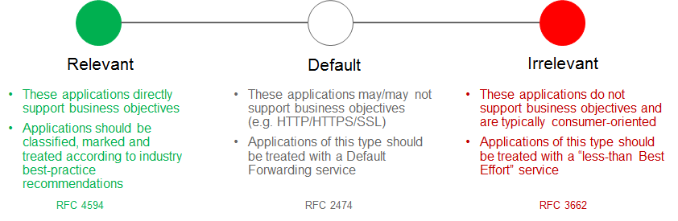
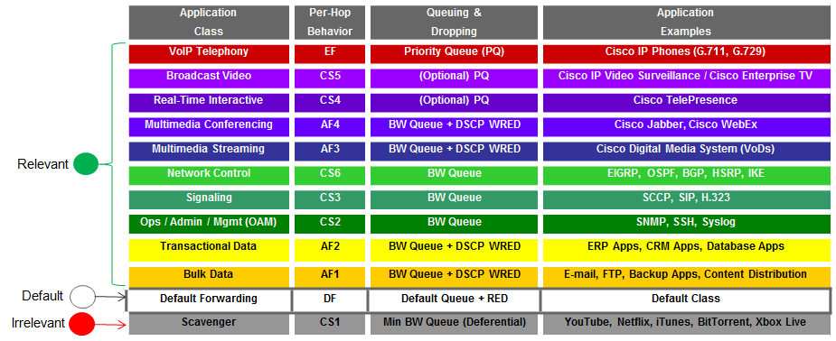
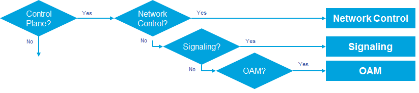
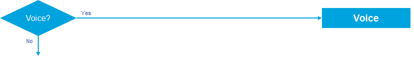
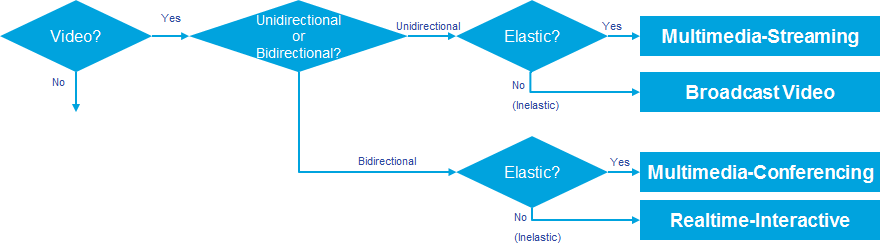
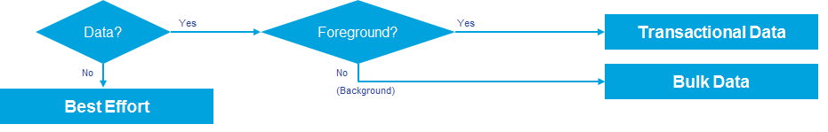

###############################
Chapter 2: Strategic QoS Policy
###############################

Over the past several years there has been an evolution in how Cisco
approaches the deployment of QoS within organizations—revolving around
the concept of policy abstraction. Traditionally when approaching QoS,
the discussion quickly turns toward the tools that are used to implement
QoS within the network infrastructure. The higher level conversation
regarding the overall purpose for implementing QoS—that is, what you
want to build with QoS—was often skipped. The challenge is to step back
and see the bigger picture of how QoS connects to the business
requirement first, before jumping in with the tools, as illustrated in
the figure below.

1. What Do You Consider First?

***************
Where to Start?
***************

The first step may seem obvious and superfluous, but in actuality it is
crucial: clearly define the business objectives that your QoS policies
are to enable. These may include any or all of the following:

-  Guaranteeing voice quality meets enterprise standards

-  Ensuring a high QoE for video

-  Increasing user productivity by increasing network responsiveness for
   interactive applications

-  Managing applications that are “bandwidth hogs”

-  Identifying and de-prioritizing consumer applications

-  Improving network availability

-  Hardening the network infrastructure

******************************************
Determining Application Business-Relevancy
******************************************
With these goals in mind, network architects can clearly identify which
applications are relevant to their business and which are not. There are
three main states of business-relevance:

-  Business-Relevant—these applications are known to contribute to
   business objectives of the organization and may include voice,
   multimedia applications, collaborative applications, database
   applications, email applications, file/content transfer applications,
   backup applications, etc., as well as control plane, signaling, and
   network management protocols.

-  Default—these applications may or may not contribute to business
   objectives. For example, HTTP/HTTPS at times may be used for work or
   for personal reasons. As such, it may not always be possible to
   assign a static business-relevant designation to such applications
   (especially not without deeper packet inspection capabilities, which
   are not always available on all platforms).

-  Business-Irrelevant—these applications are known to have no
   contribution to business-objectives and are often personal or
   entertainment-oriented in nature. Such applications may include
   video-on-demand (for example, Netflix, Hulu, YouTube, etc.), gaming
   traffic, peer-to-peer file-sharing applications, personal
   communication apps (for example, Skype, FaceTime, etc.) and other
   applications.

1. Determining Application Business Relevance

The 1300+ applications in Cisco’s Network Based Application Recognition
(NBAR) library have already been pre-programmed according to their most
commonly-deployed level of business-relevance. This saves an operator
from having to exhaustively go down a lengthy list and configure
business-relevance one application at a time. However, the operator can
override the default setting for business-relevance of any given
application.

********************************************
Mapping Business-Relevance to QoS Treatments
********************************************

Cisco’s RFC 4594-Based Strategic QoS Model
==========================================

After applications have been defined as business-relevant (or
otherwise), then the network architect must decide how to mark and treat
these applications over the IP infrastructure. To this end, Cisco
advocates following relevant industry guidelines, as this extends the
effectiveness of your QoS policies beyond your direct administrative
control. That being said, it may be helpful to overview a relevant RFC
for QoS marking and provisioning: RFC 4594, “Configuration Guidelines
for DiffServ Service Classes.”

These guidelines are to be viewed as industry best-practice
recommendations. As such, enterprises and service providers are
encouraged to adopt these marking and provisioning recommendations with
the aim of improving QoS consistency, compatibility, and
interoperability. However, it should be noted that these guidelines are
not standards; as such, modifications can be made to these
recommendations as specific needs or constraints require. Thus, to meet
specific business requirements, Cisco has made a minor modification to
its adoption of RFC 4594: specifically the swapping of Call-Signaling
and Broadcast Video markings (to CS3 and CS5, respectively). A summary
of Cisco’s implementation of RFC 4594 is presented in the following
figure.

1. Cisco (RFC 4594-Based) QoS Recommendations

RFC 4594 also provides some application classification rules to help
network architects to assign applications to the optimal
traffic-classes; these are summarized in the following sections.

QoS treatment for Business-Relevant Applications
================================================
Business relevant application can be grouped into one of four main
categories:

-  Control plane protocols

-  Voice applications

-  Video applications

-  Data applications

Beginning with the control plane protocols, these may be subdivided
further, as shown in the following figure.

1. Control Plane Traffic-classes

Network Control—This traffic class is intended for network control plane
traffic, which is required for reliable operation of the enterprise
network. Traffic in this class should be marked CS6 and provisioned with
a (moderate but dedicated) guaranteed bandwidth queue. Weighted Random
Early Detection (WRED) should not be enabled on this class, because
network control traffic should not be dropped. Example traffic includes
EIGRP, OSPF, BGP, HSRP, IKE, etc.

Signaling—This traffic class is intended for signaling traffic that
supports IP voice and video telephony. Traffic in this class should be
marked CS3 and provisioned with a (moderate but dedicated) guaranteed
bandwidth queue. WRED should not be enabled on this class, because
signaling traffic should not be dropped. Example traffic includes SCCP,
SIP, H.323, etc.

Operations/Administration/Management (OAM)—This traffic class is
intended for network operations, administration, and management traffic.
This class is critical to the ongoing maintenance and support of the
network. Traffic in this class should be marked CS2 and provisioned with
a (moderate but dedicated) guaranteed bandwidth queue. WRED should not
be enabled on this class, because OAM traffic should not be dropped.
Example traffic includes SSH, SNMP, Syslog, etc.

Provisioning for voice is relatively straightforward, as shown in the
following figure.

1. Voice Traffic Class

Voice—This traffic class is intended for voice/audio traffic (VoIP
signaling traffic is assigned to the Call-Signaling class). Traffic
assigned to this class should be marked EF. This class is provisioned
with an Expedited Forwarding (EF) Per-Hop Behavior (PHB). The EF PHB
defined in RFC 3246-is a strict-priority queuing service and, as such,
admission to this class should be controlled. Example traffic includes
G.711 and G.729a, as well as the audio components of multimedia
conferencing applications, such as Cisco Jabber, WebEx, and Spark.

Video—This traffic class may have unique QoS requirements depending on
the type of video, as illustrated in the following figure.

1. Video Traffic-classes

To determine the optimal traffic classification for a video application,
two key questions need to be answered:

-  Is the video unidirectional or bidirectional?

-  Is the video elastic or inelastic?

*Elastic* flows are able to adapt to network congestion and/or drops (by
reducing frame rates, bit rates, compression rates, etc.). *Inelastic*
flows either do not have such capabilities or—in order to meet specific
business requirements—are configured not to use these.

With these two questions answered, video applications may be assigned to
their respective traffic-classes, including the following.

Broadcast Video—This traffic class is intended for broadcast TV, live
events, video surveillance flows, and similar inelastic streaming video
flows. Traffic in this class should be marked CS5 and may be provisioned
with an EF PHB; as such, admission to this class should be controlled.
Example traffic includes live Cisco Enterprise TV streams, and Cisco IP
Video Surveillance.

Real-Time Interactive—This traffic class is intended for inelastic
interactive video applications. Whenever possible, signaling and data
sub-components of this class should be separated out and assigned to
their respective traffic-classes. Traffic in this class should be marked
CS4 and may be provisioned with an EF PHB; as such, admission to this
class should be controlled. An example application is Cisco
TelePresence.

Multimedia Conferencing—This traffic class is intended for elastic
interactive multimedia collaboration applications. Whenever possible,
signaling and data subcomponents of this class should be separated out
and assigned to their respective traffic-classes. Traffic in this class
should be marked Assured Forwarding (AF) Class 4 (AF41) and should be
provisioned with a guaranteed bandwidth queue with Differentiated
Services Code Point-based Weighted-Random Early Detect (DSCP-WRED)
enabled. Traffic in this class may be subject to policing and
re-marking. Example applications include Cisco Jabber, WebEx, and Spark.

Multimedia Streaming—This traffic class is intended for elastic
streaming video applications, such as Video-on-Demand (VoD). Traffic in
this class should be marked AF Class 3 (AF31) and should be provisioned
with a guaranteed bandwidth queue with DSCP-based WRED enabled. Example
applications include Cisco Digital Media System VoD streams, ELearning
videos, etc.

1. Data Traffic-classes

When it comes to data applications, there is really only one key
question to answer (as illustrated in the figure above): is the data
application foreground or background?

*Foreground* refers to applications from which users expect a
response—via the network—in order to continue with their tasks.
Excessive latency to such applications directly impact user
productivity. Conversely, *background* applications—while business
relevant—do not directly impact user productivity and typically consist
of machine-to-machine flows.

Transactional Data—This traffic class is intended for interactive,
foreground data applications. Traffic in this class should be marked AF
Class 2 (AF21) and should be provisioned with a dedicated bandwidth
queue with DSCP-based WRED enabled. This traffic class may be subject to
policing and re-marking. Example applications include data components of
multimedia collaboration applications, Enterprise Resource Planning
applications, Customer Relationship Management applications, database
applications, etc.

Bulk Data—This traffic class is intended for non-interactive background
data applications. Traffic in this class should be marked AF Class 1
(AF11) and should be provisioned with a dedicated bandwidth queue with
DSCP-based WRED enabled. This traffic class may be subject to policing
and re-marking. Example applications include: email, backup operations,
FTP/SFTP transfers, video and content distribution, etc.

With all business-relevant applications assigned to their respective
traffic-classes, only two types of traffic-classes are left to be
provisioned—Default and Scavenger traffic-classes.

QoS Treatment for Default-Business Relevance Applications
=========================================================

Best Effort—This traffic class is the default class. The vast majority
of applications will continue to default to this Best-Effort service
class. As such, the default class should be adequately provisioned.
Traffic in this class is marked Default Forwarding (DF or DSCP 0) and
should be provisioned with a dedicated queue. It is recommended that you
enable WRED on this class.

QoS Treatment for Business-Irrelevant Applications
==================================================

Scavenger—This traffic class is intended for all applications that have
been previously identified as business-irrelevant. These may include
video applications that are consumer and/or entertainment-oriented. The
approach of a “less-than Best-Effort” service class for non-business
applications (as opposed to shutting these down entirely) has proven to
be a popular political compromise.

Applications within the Scavenger traffic class are permitted on
business networks when bandwidth is available. However, as soon as the
network experiences congestion, this class is the most aggressively
dropped. Traffic in this class should be marked CS1 and should be
provisioned with a minimal bandwidth queue, which is the first to starve
should network congestion occur. Example traffic includes Netflix,
YouTube, Xbox Live/360 Movies, iTunes, BitTorrent, etc.
