##################
Chapter 4: APIC-EM and the EasyQoS Application
##################

The Application Policy Infrastructure Controller—Enterprise Module
(APIC-EM) is Cisco’s enterprise SDN controller. EasyQoS is one of
several applications which run on APIC-EM. The following sections
discuss how to access APIC-EM, declaratively express QoS policies within
the EasyQoS application, and then deploy those QoS policies to groups of
network infrastructure devices.

**********
Logging Into APIC-EM
**********
APIC-EM provides a web-based GUI for configuring and monitoring the base
APIC-EM functionality as well as the applications that reside upon it.

-  Note: APIC-EM also includes an extensive set of northbound REST-based
   APIs for configuring and monitoring APIC-EM functionality and the
   applications that reside upon it. This version of the APIC-EM EasyQoS
   Design Guide does not cover the northbound REST-based APIs. Future
   versions may include a discussion of the northbound APIs.

In order to access the APIC-EM login page, the network operator must
launch a web browser and open an HTTPS connection to the IP address or
fully qualified domain name of the APIC-EM server. An example of the
login page is shown in the figure below.

1. APIC-EM Login Screen

.. image:: media/image13.png

Upon entering the proper login credentials (username and password) and
clicking the Log In button, the network operator will be taken to the
APIC-EM Home page, as shown below.

1. APIC-EM Home Page

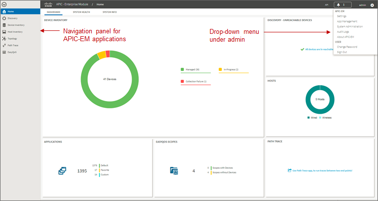

APIC-EM supports both integration with an external AAA server via the
RADIUS protocol, as well as an Internal Users database locally
administered on the APIC-EM server. Both are accessed from Settings
within the drop-down menu that appears when clicking “admin” in the
upper right-hand corner of any APIC-EM page, as shown in the figure
above.

The expandable navigation panel on the left-side of any APIC-EM page
displays the various applications (or functions) available within
APIC-EM. The following four applications (or functions) provided by the
APIC-EM controller are not part of the EasyQoS application itself but
are discussed within this document, because they provide necessary
functionality for the EasyQoS application to operate.

-  Network Device Discovery

-  Device Inventory

-  Host Inventory

-  Topology

This document does not discuss the IWAN, Network Plug and Play,
Integrity Verification, Remote Troubleshooter, Cisco Active Advisor, or
Cisco Wide Area Bonjour applications, because they do not directly
provide functionality that is required for the EasyQoS application. The
Path Trace application is briefly mentioned at the end of the ***APIC-EM
and the EasyQoS Application*** chapter.

**********
Network Device Discovery
**********
In order to apply QoS Policies to network devices within the EasyQoS
application, network devices must first be discovered, added the APIC-EM
device inventory, and managed by APIC-EM. Hence, the network operator
must first perform a Discovery in order to discover network devices and
place them into the Device Inventory database. Clicking the Discovery
icon with the expandable panel on left-side of any APIC-EM page takes
the network operator to the Discovery page. An example is shown in the
following figure.

1. APIC-EM Discovery Page

.. image:: media/image15.png

The Discovery page allows the network operator to create Discovery jobs
based on either a Cisco Discovery Protocol (CDP) seed device or an IP
address range. The Discovery process requires SNMP credentials (v2c, or
v3) and CLI credentials (SSH or Telnet) to be entered. The network
operator must ensure that CLI credentials—including an enable
password—have been previously configured on the network device and that
the device is network reachable from APIC-EM.

SNMP and CLI credentials for devices can be created and stored via
Settings within the drop-down menu that appears when clicking “admin” in
the upper right-hand corner of any APIC-EM page. The following screen
shot shows an example of where the CLI credentials are configured within
APIC-EM.

1. Adding CLI Credentials to APIC-EM

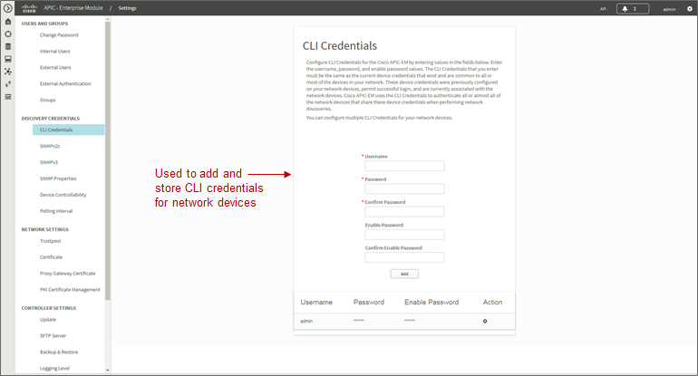

SNMP credentials can be added similarly. The saved credentials can then
be referenced within the Discovery process.

APIC-EM release 1.3 added a Device Controllability feature. This feature
allowed APIC-EM to configure the SNMP credentials onto network
infrastructure devices—via the CLI interface. APIC-EM release 1.4
extended the Device Controllability feature by allowing APIC-EM to
selectively configure both SNMP credentials and/or IP Device Tracking
(IPDT) onto network infrastructure devices—via the CLI interface. Both
of these functions can save time by not requiring the network operator
to manually access each network infrastructure device and configure the
SNMP credentials or IPDT. The following figure shows the screen that
appears when selecting Device Controllability.

1. Device Controllability Feature

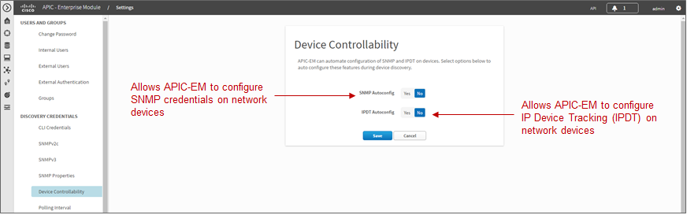

If the SNMP Autoconfig functionality within the Device Controllability
feature is disabled (which is the default setting), the network operator
must ensure that SNMP access is configured on each network device and
that each device is SNMP reachable from APIC-EM.

The SNMP Properties page can be used to modify the number of SNMP
retries and the timeout between each attempt. The network operator may
find it useful to modify the default settings if some network devices
occasionally experience SNMP timeouts when APIC-EM attempts to
synchronize its Device Inventory database with those devices. An example
of the SNMP Properties page is shown below.

1. SNMP Properties

.. image:: media/image18.png

APIC-EM release 1.4 and higher allows the polling interval by which
APIC-EM synchronizes the Device Inventory database with each network
device to be configurable via the Polling Interval Settings page. An
example is shown in the figure below.

1. Polling Interval

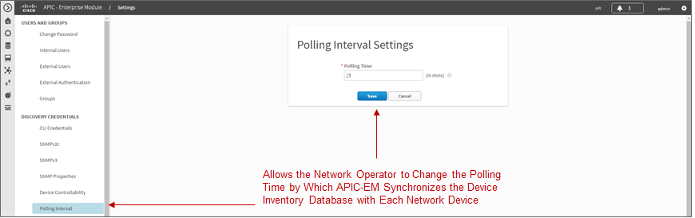

The default setting of 25 minutes is also the minimum polling interval.
The polling interval can be extended up once every 24 hours if desired.

**********
Device Inventory
**********
Only after network devices have been discovered will those devices be
added the APIC-EM Device Inventory database and managed by APIC-EM.
Clicking the Device Inventory icon within the expandable panel on
left-side of any APIC-EM page takes the network operator to the Device
Inventory page. An example is shown in the following figure.

1. APIC-EM Device Inventory Page

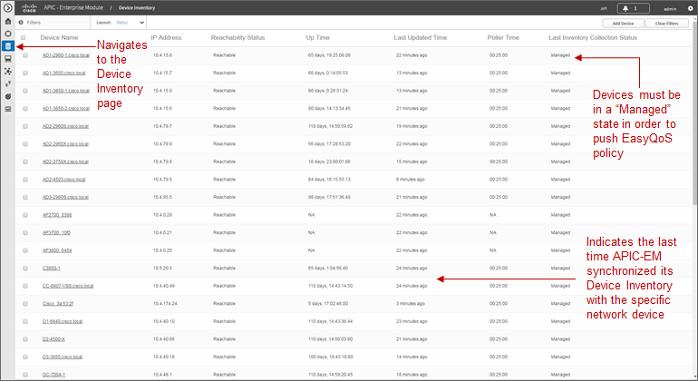

As mentioned previously, devices must be in a Managed state in order to
provision EasyQoS policy. APIC-EM periodically (approximately every 25
minutes by default) synchronizes the Device Inventory database with each
network device. However, the polling interval can be modified, as
discussed in the ***Network Device Discovery*** section. If changes to
the configuration of a particular network device have been made either
via CLI or via management platforms such as Prime Infrastructure, it is
recommended that you wait until APIC-EM has re-synchronized with the
device, in order to ensure the configuration changes have been
identified by APIC-EM, before applying any changes to QoS policy through
EasyQoS. Alternatively, you can manually synchronize an individual
device by selecting it within the device inventory and clicking the
Resync button within the menu that appears. An example is shown in the
figure below.

1. Manual Resync of a Network Device

.. image:: media/image21.png

The manual resync feature, which is available as of APIC-EM release 1.4
and higher, allows the network operator to set a longer polling interval
if desired – yet still re-sync individual devices when necessary. A
longer polling interval may ease the amount of processing and therefore
lower CPU utilization of APIC-EM for larger deployments, especially when
changes to network infrastructure devices occur infrequently.

An example of why a device would need to be resynchronized would be
adding or changing a WAN service provider profile (SPP) tag manually via
the CLI to a Cisco ISR or ASR WAN interface. APIC-EM would have to
resync with the ISR or ASR in order to be aware of the updated WAN SPP
tag first, in order to apply the appropriate QoS policy to the WAN
interface.

The location feature allows the network operator to assign a geographic
location to a device or set of devices. This affects how the network is
viewed within the Topology page. For small networks, displaying all
devices in the network within a single Topology page may be acceptable.
However, as the number of devices grows, the network operator may wish
to view devices based upon their geographic location——such as all
devices per branch location, per campus location, per campus building,
etc.

The network operator can assign a location to a device or group of
devices by selecting the device or devices within the Device Inventory
page and then clicking the Set Location button, shown in the figure
above. This brings up a popup screen, as shown in the figure below.

1. Location Popup Screen

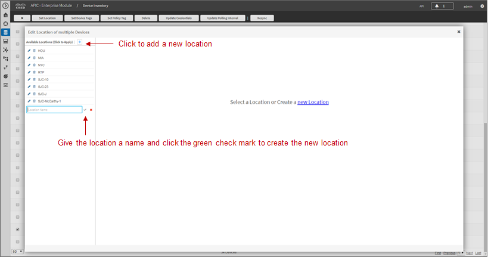

In order to create a new location, click the blue + adjacent to
Available Locations. This will bring up a new blank box field below the
existing locations. The network operator must give the new location a
name and click the green checkmark to create the location. Location
names should not contain blank spaces. When the new location is created,
a new screen will appear, prompting the network operator to either type
in an address corresponding to the new location or click a geographic
location within the displayed map. The network operator can zoom in to a
specific geographic location within the map if necessary. An example is
shown in the following figure.

1. Setting the Address of the New Location

.. image:: media/image23.png

**********
Host Inventory
**********

Cisco Device Endpoints
=========

APIC-EM also discovers certain Cisco hardware device endpoints which are
then included within Static and Dynamic QoS policies provisioned to
network infrastructure devices. These hardware endpoints include the
following:

-  Cisco IP phones

-  Cisco TelePresence devices

-  Cisco video conferencing endpoints

-  Cisco video surveillance cameras

APIC-EM makes use of CDP running on Catalyst switches in order to
discover these hardware endpoints. EasyQoS uses the IP addresses of the
hardware endpoints collected through CDP information, along with the
knowledge of which Catalyst switch and switch port the endpoint is
connected to—in order to pre-populate access control entries (ACEs)
within classification & marking access control lists (ACLs) for Static
and Dynamic QoS on switching devices. In order for this functionality to
operate, CDP must be enabled on the Catalyst switch ports that connect
to hardware endpoint devices. By default CDP is enabled on Cisco
Catalyst switch ports.

The Cisco hardware endpoint devices themselves must also support CDP.
The CDP information provided by the hardware endpoint must also include
its IP address. If the IP address is not included, APIC-EM will not know
which switch port to populate with ACE entries.

-  Note: Older versions of Cisco TelePresence code may not support the
   sending of IP addresses within CDP when in a VLAN configuration—such
   as when a Voice VLAN is configured. Such systems may require an
   upgrade to TC7.3.6, CE8.0.2, or CE8.1.1 or higher in order for these
   devices to be statically populated within the correct ingress
   classification & marking ACLs when deploying EasyQoS. Please refer to
   Cisco defect CSCuy71139 for details.

Discovered Cisco endpoint devices are populated within the Host
Inventory database within APIC-EM. These can be displayed by clicking
the Host Inventory icon with the expandable panel on left-side of any
APIC-EM page. An example of the Host Inventory page is shown in the
following figure.

1. APIC-EM Host Inventory Page

.. image:: media/image24.png

For wired Cisco device endpoints, after the endpoint information is
collected, APIC-EM provisions ACE entries into the ACLs configured for
Static QoS corresponding to the ingress classification & marking policy
deployed across all access-edge ports on the switch to which the device
is connected. This is discussed in detail in the ***Cisco Device
Endpoints*** section of the ***Campus LAN Static QoS Design*** chapter.
If Dynamic QoS is enabled, EasyQoS will also push ACE entries into the
Dynamic ACL policy shells corresponding to the dynamic ingress
classification & marking policy for the specific switch port as well.
Dynamic QoS is discussed in detail within the ***Dynamic QoS Design***
chapter.

There are no equivalent ACE entries generated for wireless devices with
the current EasyQoS solution. This is because the AireOS wireless LAN
controller (WLC) EasyQoS ingress classification & marking policy uses
Cisco Application Visibility and Control (AVC) profiles, rather than
Layer 2-4 ACLs.

**********
Topology
**********
After network infrastructure devices have been discovered, the network
operator can view the network via the Topology page. The Topology page
is accessed by clicking the Topology icon within the expandable panel on
left-side of any APIC-EM page. If devices have been assigned locations,
the initial view of the Topology page will be a map, as shown in the
following figure.

1. APIC-EM Top-Level Map

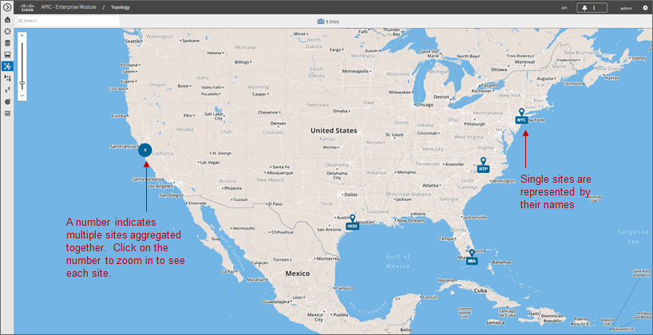

Individual sites are identified by their location names. Locations that
are geographically close are aggregated together and represented by a
number. Clicking the number will zoom the map in closer to reveal each
site, as shown in the following figure.

1. Zooming in to Reveal Aggregated Sites

.. image:: media/image26.png

Finally, by clicking the name of an individual location, the network
operator can display the topology of the devices within the site. An
example is shown in the following figure.

1. Displaying the Topology of Devices within a Location

.. image:: media/image27.png

APIC-EM automatically discovers the relationship between devices and
connects them together within the Topology page. Individual devices or
groups of devices can be re-positioned by dragging them around within
the page and by zooming-in and zooming-out as needed. When the network
operator has arranged the devices as desired, he/she can save the layout
via the Save or Load Topology icon in the upper right corner of the
Topology page. This can be loaded in the future when visiting the
Topology page, so that the network operator doesn’t have to re-arrange
the devices upon every visit to the Topology page.

Clicking a device will bring up a side window with additional detail on
the device—including the role of the device within the network—as shown
in the figure below.

1. Selecting the Role of a Device from Within the Topology Page

.. image:: media/image28.png

Each discovered network infrastructure device is automatically
categorized into one of the following roles:

-  Core

-  Distribution

-  Access

-  Border Router

-  Unknown

The Core, Distribution, and Access roles apply to Catalyst switches. The
Access role also applies to WLC platforms. The Border Router role
applies only to Cisco ISRs and ASRs. The network operator should verify
that the particular device selected has been characterized with the
correct role, in order to ensure the correct QoS policy is applied to
the device by the EasyQoS application. This applies primarily to
Catalyst switches. If necessary, the network operator can change the
role within the side window. The policy applied to Catalyst switches
based upon their role is discussed in the ***Campus LAN Static QoS
Design*** chapter.

**********
EasyQoS Application
**********

The Discovery, Device Inventory, Host Inventory, and Topology functions
discussed in the previous sections are not part of the EasyQoS
application. However, they were discussed because the functionality they
provide is necessary for the EasyQoS application to operate. This
section shifts the discussion to the specific functionality within the
EasyQoS application itself.

The EasyQoS application is accessed by clicking the EasyQoS icon within
the expandable panel on left-side of any APIC-EM page. An example is
shown in the following figure.

1. APIC-EM EasyQoS

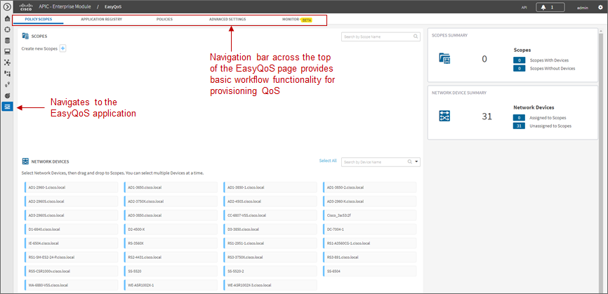

As shown in the figure above, the EasyQoS application has several tabs
that appear as a bar across the top of the page.

-  Policy Scopes

-  Application Registry

-  Policies

-  Advanced Settings

-  Monitoring (Beta)

The tabs are intended to roughly guide the network operator through
something similar to a basic workflow for deploying QoS policy.
Therefore, it is recommended that you access the tabs in order (from
left to right) when deploying QoS policy, although the network operator
is free to access the tabs in any order. Each of these tabs will be
discussed in separate sections.

Policy Scopes
=========
The network operator is by default automatically taken to the first
tab—Policy Scopes—when clicking the EasyQoS application icon within the
expandable panel on left-side of any APIC-EM page.

The first step to deploying QoS policy through EasyQoS is to create one
or more policy scopes. Policy scopes are simply a way of grouping one or
more network devices together in order to apply QoS policy to the group
all at once, rather than having to individually apply QoS policy to one
network device at a time.

The network operator can define a single policy scope for all of the
network devices under his/her administrative control. Alternatively, the
network operator is free to define multiple policy scopes—each of which
contains one or more network devices. Either way, EasyQoS will deploy
the appropriate QoS policy to each device, based upon the network
topology, the role of the device within the network, and the
application-level business intent expressed by the network operator. Up
to 2,000 devices can be configured in a single policy scope as of
APIC-EM version 1.3 and higher.

In order to create a new policy scope, the network operator can click
the + next to Create New Scopes on the upper left side of the Policy
Scopes tab. An empty box representing the new policy scope name will
appear. The network operator will be prompted to give the new policy
scope a name and click the green check mark in order to create it. An
example is shown in the following figure.

1. Creating a New Policy Scope

.. image:: media/image30.png

-  Note: The Policy Scope name cannot include any blank spaces. Use
   either an underscore, dash, or single word for the Policy Scope name.

When a new policy scope is created, it contains no network devices. In
order to add network devices to a policy scope, the network operator
must drag-and-drop one of the available devices within the Network
Devices panel into the policy scope. A network device can be a member of
only one policy scope at a given time. Only network devices that have
been Discovered and added to the Device Inventory of APIC-EM will appear
within the Network Devices panel, as shown in the figure above.

After a device has been dragged-and-dropped into a policy scope, it will
no longer appear within the Network Devices panel. Instead, it will
appear within the right-hand panel within the display when the network
operator clicks on the policy scope. An example is shown in the figure
below.

1. Displaying Network Devices within a Policy Scope

.. image:: media/image31.png

Individual network devices can be deleted from the policy scope by
clicking the “x” next to the network device name. The Save button must
be clicked in order to save the changes. Devices removed from a policy
scope automatically appear again within the Network Devices panel
underneath the Scopes panel. The network operator can also delete the
entire policy scope by clicking the Delete button.

After the desired number of policy scope(s) are created and the desired
network devices have been moved into the policy scope(s), the network
operator can click the Application Registry tab.

Application Registry
=========
The second step in deploying QoS policy through EasyQoS is to access the
Application Registry in order to select Favorite applications and to
create Custom applications. The Application Registry serves as a common
repository of applications known to APIC-EM via the NBAR taxonomy,
Favorite applications, and Custom applications. It can be leveraged by
various APIC-EM applications such as EasyQoS and IWAN. An example of the
Application Registry is shown in the figure below:

1. Application Registry

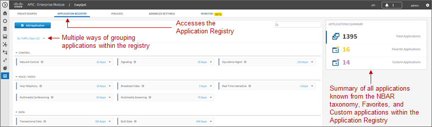

Applications can be grouped in multiple ways when viewing them within
the left-panel of the Application Registry as follows:

-  Applications—This lists all applications (both from the NBAR taxonomy
   and Custom applications) alphabetically.

-  Application Groups—This lists all applications based on the NBAR
   application category attribute to which the applications belong.

-  Traffic Class—This lists all applications based on the NBAR
   traffic-class attribute to which the applications belong.

The panel on the right provides a summary of all the 1300+ applications
known via the NBAR taxonomy as of NBAR2 Protocol Pack 27.0.0, all
Favorite applications, and all Custom applications currently known
and/or configured within APIC-EM.

Favorite Applications

The concept of Favorite Applications has been added to EasyQoS to
address the issue that some platforms have limited ability to support
applications. For instance, Cisco AireOS WLCs currently can support only
32 applications per AVC profile. Likewise, some older Catalyst switch
platforms have limited TCAM space, hence can only support a limited
number of ACE entries within the ingress classification & marking ACLs
deployed to these devices by EasyQoS.

By selecting an application as a Favorite, the network operator declares
a preference for including that application within QoS policies
provisioned by EasyQoS, over other applications. When EasyQoS creates
QoS policies, it will select applications that have been marked as
Favorites for inclusion within the policies before the remainder of the
applications within the NBAR taxonomy. Note that by default Custom
applications are automatically marked as Favorite applications when they
are created.

Applications are selected as Favorites by clicking the star next to the
name of the application. Clicking the star causes it to turn yellow,
indicating application has been selected as a favorite. An example is
shown in the figure below.

1. Selecting Favorite Applications

.. image:: media/image33.png

The list of Favorite applications is global to the APIC-EM EasyQoS
deployment—meaning that Favorites are the same across all Policy Scopes.
The list of Favorite applications can be displayed by clicking Favorite
Applications in the panel on the right side of the Application Registry.

Changing the Traffic-Class of an Application

EasyQoS within APIC-EM release 1.5 and higher allows the network
operator to change the traffic-class to which an application belongs. By
default, all 1300+ applications known to the NBAR2 taxonomy are assigned
a traffic-class, based on IETF RFC 4594 guidelines. However, the network
operator may sometimes wish to change this. For example it may be
desired to put both the audio and video components of a collaboration
session into the same traffic-class, rather than have the audio media in
the VoIP Telephony traffic-class and the video media in the Multimedia
Conferencing traffic class. The network operator can change this by
selecting the application within the Application Registry. This will
bring up a panel on the right-hand side of screen as shown in the figure
below.

1. Selecting an Application within the Application Registry

.. image:: media/image34.png

Clicking the Edit button will change the right-hand panel, allowing the
network operator to select the desired traffic-class of the application
from the drop-down menu. When the network operator is satisfied with the
new traffic-class, he/she can click the Save button in the upper right
corner of the panel in order to save the changes to the application.

1. Changing the Traffic-Class of an Application Example

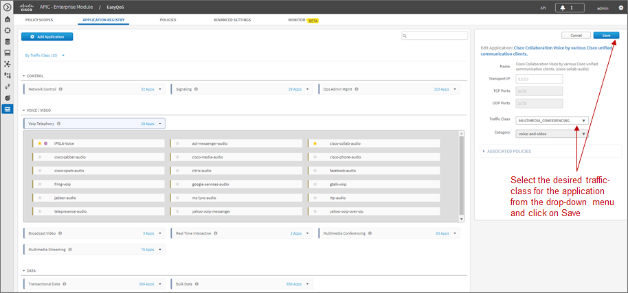

Changing the traffic-class of an application will modify the EasyQoS
ingress classification & marking policy for that particular application.
The effects on ASR and ISR router configuration of changing the
traffic-class of an application are discussed in the ***Changing the
Traffic-Class of Applications on ASR and ISR Platforms*** section of the
***WAN and Branch Static QoS Design*** chapter. The effects on Catalyst
switch configuration are discussed in the ***Ingress Classification &
Marking Policies*** section of the ***Campus LAN Static QoS Design***
chapter.

Custom Applications

The Application Registry is also where the network operator can create
Custom applications. Although AVC/NBAR currently identifies
approximately 1300+ applications, organizations sometimes develop their
own internal applications, which may not be recognized by AVC/NBAR. In
order to identify and provide the proper QoS treatment for these
applications across the network infrastructure, the network operator can
create a Custom application for each of them.

Custom applications are added by clicking the Add Application button
within the Application Registry page. The right-hand panel of the page
will change, allowing the network operator to add the application based
upon a URL or a Server IP/Port range. An example is shown in the
following figure.

1. Custom Application Based on a URL

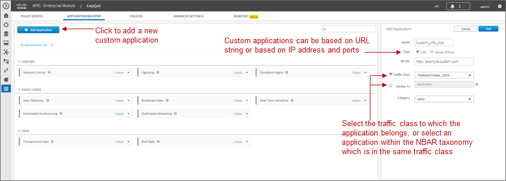

In the example above, the Custom application is based on a URL. For an
EasyQoS Custom application based on a URL, the network operator must
provide the following information:

-  A name by which APIC-EM will know the application

-  The URL string to which the application is matched against within
   AVC/NBAR policies

-  The traffic class to which the application belongs

-  Note: EasyQoS within APIC-EM release 1.5 and higher does not do
   verification of the URL string to ensure it is properly formatted.

If the network operator does not know to which traffic class the Custom
application should belong, he/she can simply select the Similar To check
box and use the drop-down menu to select one of the applications known
to EasyQoS via the NBAR taxonomy that has similar characteristics. By
*similar characteristics*, we mean that the NBAR traffic-class and
category attributes assigned to that similar application will also be
assigned to the Custom application.

Custom applications that are based on URLs are not capable of being
deployed on Catalyst switch platforms. They are only deployed onto ISR
and ASR platforms that implement policy-maps that contain “match
protocol attribute” statements. This is because the traffic-class
attribute must be programmed into the Custom application, and the
traffic-class attribute requires a “match protocol attribute
traffic-class” statement to be configured within the policy-map. An
example of the policy configuration for a Custom application that is
based on a URL is shown in the ***Custom Applications on ASR and ISR
Platforms*** section in the ***WAN and Branch Static QoS Design***
chapter.

Alternatively, a Custom application can be based upon one or more IP
addresses (or address ranges) and one or more IP, TCP, and/or UDP ports
(or port ranges). An example using multiple IP addresses and port ranges
is shown in the following figure.

1. Custom Application Based on Server IP Address and Ports

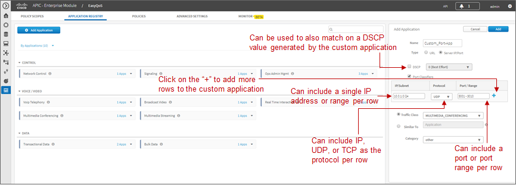

For an EasyQoS Custom application based on a server IP addresses and
ports, the network operator needs to provide the following information:

-  A name by which APIC-EM will know the application

-  A DSCP value (optional). This field is used to match on a DSCP value
   generated by the Custom application within the QoS policy generated
   by EasyQoS.

-  Port Classifiers (optional), which include one or more IP addresses
   or IP address ranges, along with one or more protocols (IP, TCP, UDP,
   or TCP/UDP), and one or more ports or port ranges.

-  The traffic class to which the application belongs

The example in the figure above demonstrates the use of the subnet mask
field—set to 24 bits (10.0.1.0/24) in the first row of the Port
Classifiers—to include a full subnet as a destination IP address range.
Likewise, the range (3000-3010) in the first row of the Port Classifiers
shows how to include a range of ports (UDP ports in this example—based
on the Protocol setting for the particular row). This IP address or
address range as well as port or port range refers to a destination—also
referred to as the producer. Additional rows can be added to include
more individual IP addresses or IP address ranges, as well as more ports
or port ranges to the Custom application.

As with URL-based Custom applications, if the network operator does not
know to which traffic class the Custom application should belong, he/she
can simply select the Similar To check box and use the drop-down menu to
select one of the applications known to EasyQoS via the NBAR taxonomy
that has similar characteristics. By *similar characteristics*, we mean
that the NBAR traffic-class and category attributes assigned to that
similar application will also be assigned to the Custom application.

Custom applications that are based on server (destination) IP addresses
and ports are capable of being deployed on both Catalyst switch
platforms and ASR or ISR platforms. For Catalyst switch platforms, the
server (destination) IP address or address range, ports, and/or DSCP
fields are translated into one or more ACEs that are populated within
the ACL corresponding to the traffic-class to which the Custom
application belongs. An example of this is shown in the
***Access-Control Lists*** section in the ***Campus LAN Static QoS
Design*** chapter.

For more complex applications, a source IP address or address range as
well as a source port or port range can be added to the Custom
Application. This is referred to as adding a Consumer to the
application. Adding a Consumer is discussed in the ***Policies***
section below.

Advanced Settings
=========
With APIC-EM release 1.4, configuration of SP Profiles and Dynamic QoS
was moved under the Advanced Settings tab. Additionally, a new feature,
Bandwidth (BW) Profiles, was added. APIC-EM release 1.5 renamed
Bandwidth Profiles to Queuing Profiles and extended this by allowing the
network operator to change the default DSCP marking of traffic-classes.
The following sections discuss Queuing Profiles and SP Profiles. Dynamic
QoS is discussed in a separate ***Dynamic QoS*** section.

Queuing Profiles

Queuing Profiles provide a means for the network operator to customize
the following:

-  The amount of bandwidth allocated for each of the 12 traffic-classes
   provisioned by EasyQoS

-  The DSCP marking to be applied to traffic associated with each of the
   12 traffic-classes

EasyQoS includes a default Queuing Profile named CVD\_Queuing\_Profile.
Allocation of the bandwidth across the traffic-classes and the DSCP
marking associated with each traffic-class within the default Queuing
Profile is fixed, as shown in the following figure.

1. Default Queuing Profile

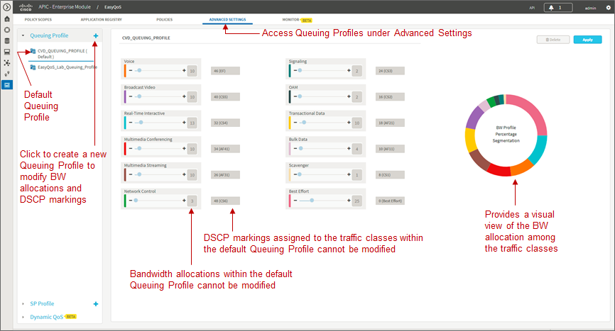

In order to modify the bandwidth allocations or DSCP markings, the
network operator must create a new custom Queuing Profile by clicking
the blue “+” next to Queuing Profile on the left panel of the Advanced
Settings screen, as shown in the figure above. This will bring up a new
Queuing Profile screen similar to the one in the following figure.

1. Creating a Custom Queuing Profile – BW Allocation Example

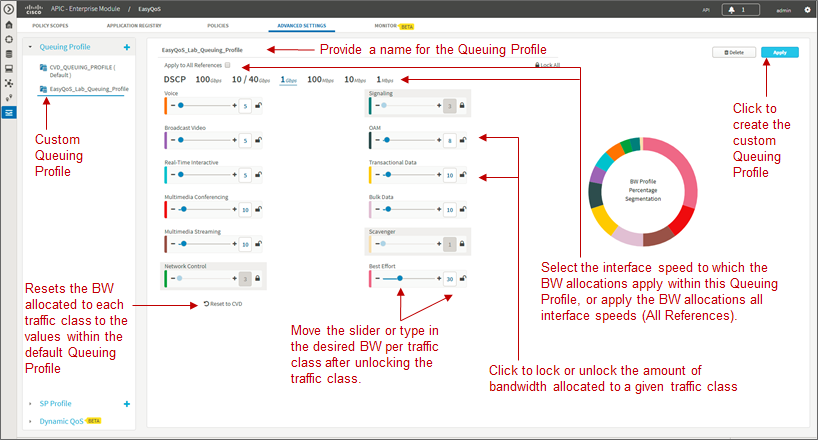

The network operator must first provide a unique name for the custom
Queuing Profile.

**Bandwidth Allocations**

Bandwidth allocations for each of the traffic-classes can be set
independently for each of the interface speeds shown in the figure
above. This is accomplished by highlighting the link speed (100 Gbps,
10/40 Gbps, 1 Gbps, 100 Mbps, 10 Mbps, or 1 Mbps) and adjusting the
bandwidth allocations for each traffic-class. For example, the network
operator can set bandwidth allocations for 1 Gbps access ports (ports
connected to end-user devices) differently from 10 Gbps uplink ports
(ports connected to other network infrastructure devices) within the
same custom Queuing Profile. For link speeds that are between the values
listed, the bandwidth allocations for the next lower link speed apply.
Alternatively, the network operator can choose to apply the same
bandwidth allocations for each traffic-class to all link speeds by
selecting the Apply to all References checkbox.

Each of the 12 traffic-classes in the figure above have a slider that
can be used to adjust the bandwidth allocated for the traffic-class.
Alternatively, the network operator can simply type in the desired
bandwidth in the box adjacent to the slider. The bandwidth allocated for
each traffic-class represents the percentage of the total bandwidth. The
sum of the bandwidth allocations for all of the traffic-classes must
always equal 100 percent.

-  Note: As of APIC-EM release 1.6.0, the network operator can change
   the default 1% bandwidth allocation of the Scavenger traffic-class
   within a custom Queuing Profile within the EasyQoS GUI. However,
   changing the bandwidth allocation of the Scavenger traffic-class will
   have no effect on the actual bandwidth allocation provisioned by
   EasyQoS to network devices for the Scavenger traffic-class. Further,
   since the bandwidth allocations within the custom Queuing Profile of
   the EasyQoS GUI must total 100%, the percentage bandwidth allocations
   actually provisioned by EasyQoS for the remaining traffic-classes
   will not match what is shown within the custom Queuing Profile. For
   further details, refer to Cisco defect CSCvg74117.

In order to adjust the bandwidth allocated to a given traffic-class, the
network operator must first ensure the traffic-class is unlocked. The
lock icon in each traffic-class locks and unlocks the bandwidth
allocation for the traffic-class. Adjusting the bandwidth allocation for
one of the unlocked traffic-classes automatically causes the bandwidth
in the remaining unlocked traffic-classes to be re-distributed such that
the sum of the bandwidth allocation for all traffic-classes is always
100 percent.

One method of specifically setting the bandwidth allocation for all of
the traffic-classes would be as follows:

-  Unlock all of the traffic-classes

-  Select the first traffic-class, set the bandwidth allocation
   percentage for that traffic class, and lock the traffic-class

-  Repeat for the remaining traffic-classes

-  The final traffic-class will have the remaining bandwidth percentage
   not allocated to the other traffic-classes

-  Note: The Voice, Broadcast Video, and Real-Time Interactive
   traffic-classes are considered to be priority traffic within Queuing
   Profiles. These traffic-classes may be mapped to priority queues on
   platforms. If the amount of bandwidth allocated to these three
   traffic-classes exceeds 33%, the network operator will receive a
   warning indicating that this is not recommended because it could
   cause bandwidth starvation of non-priority queues.

At any point, the network operator can click the Reset to CVD icon
within the screen to reset the bandwidth allocations for the
traffic-classes back to their default values.

Bandwidth settings within Queuing Profiles are used to calculate the
bandwidth rates used in the commands which configure the various
hardware queues in the queuing policies provisioned to each of the
supported Catalyst and Nexus switching platforms. Switch platforms
typically have only 4 or 8 hardware queues. Bandwidth allocation
percentages from the Queuing Profile traffic-classes that are mapped
into a specific hardware queue, are summed to obtain the rate configured
within the queuing policy. The actual configuration is also dependent
upon the specific platform and/or line card. More specifically, the
configuration depends upon the number of hardware queues supported by
the platform or line card, the number of priority queues supported by
the platform or line card, and whether the priority queues are bounded
or unbounded. Bounded priority queues have a maximum configured traffic
rate (often implemented through a policer), and unbounded priority
queues can use as much bandwidth as needed. When priority queues are
supported, the bandwidth percentages from the Queuing Profile are
adjusted from “bandwidth percentages” to “bandwidth remaining
percentages” when configured into policy maps on MQC or C3PL platforms
or egress queuing commands on MQC platforms. “Bandwidth remaining
percentage” is the amount of bandwidth remaining after accounting for
the bandwidth used in priority queues.

Bandwidth allocation settings within Queuing Profiles are also used to
calculate the bandwidth rates used in the commands that configure the
various software queues in the egress queuing policy provisioned to ASR
and ISR router platforms. Bandwidth allocation settings within Queuing
Profiles apply only to ISR and ASR interfaces that are not part of a WAN
SP Profile. In other words, they apply only to interfaces which
implement the WAN edge queuing policy discussed in the ***WAN Edge
Egress Queuing Policy*** section in the ***WAN and Branch Static QoS
Design*** chapter. Because router platforms only implement egress
queuing policies, and because these policies are implemented in
software, each of the 12 traffic-classes within the Queuing Profile maps
to an egress queue (a class-map entry within a policy-map). Because the
WAN edge queuing policy implements three low-latency queues (three
priority queues), the remaining bandwidth percentages from the bandwidth
allocation settings within the Queuing Profile are adjusted from
“bandwidth percentages” to “bandwidth remaining percentages” when
configured into the policy maps.

**DSCP Markings**

-  Note: Caution should be used when changing the default DSCP marking
   of traffic-classes from the Cisco recommended 12-class QoS model.
   Such changes could result in a less than optimal QoS implementation
   unless the network operator is highly knowledgeable in QoS design and
   implementation. This feature is only for customers with advanced
   knowledge of QoS.

DSCP markings for each traffic-class can be modified by highlighting
DSCP instead of one of the link speeds (100 Gbps, 10/40 Gbps, 1 Gbps,
100 Mbps, 10 Mbps, or 1 Mbps), as shown in the figure below.

1. Creating a Custom Queuing Profile – DSCP Markings Example

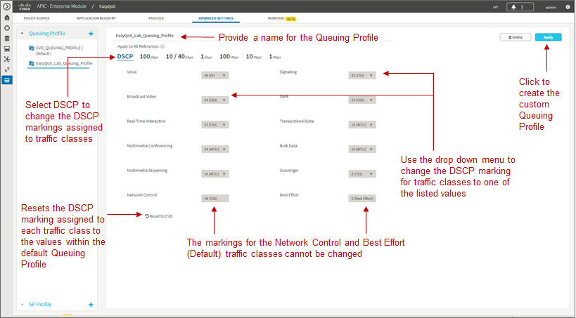

DSCP markings for the Best Effort (Default) and Network Control
traffic-classes cannot be modified. EasyQoS does not provision a
class-map entry for Network Control traffic within the ingress
classification & marking policy applied to access-layer switches.
Network Control traffic is not expected to be seen inbound on a switch
port connected to an end-user device. Because no class-map entry exists
for Network Control traffic within the ingress classification & marking
policy, no policy action, such as setting the DSCP marking of the
traffic can be taken. Therefore EasyQoS does not allow modification of
the DSCP marking of Network Control traffic. By default, Network Control
traffic is considered to be marked with DSCP 48 (CS6).

For the remaining 10 traffic-classes, the network operator can modify
the DSCP marking applied to traffic matching the particular
traffic-class. This is accomplished through the drop-down menu adjacent
to the traffic-class, as shown in the figure above. The drop-down menu
will only display DSCP marking values which have not been assigned to
another traffic-class already. This is because EasyQoS always deploys a
12-class QoS model. Each of the traffic-classes within the 12-class
model must have a policy-action which sets the DSCP value of the
matching traffic to a unique value. In other words, EasyQoS will not
allow two different traffic-classes within the ingress classification &
marking policy-map to have policy-actions which map to the same DSCP
value. If the DSCP marking which you wish to assign a traffic-class is
already being used by another traffic-class, you must first change the
other traffic-class to mark to a different DSCP value. Selectable DCSP
values range from 0 to 63, excluding DSCP 0 (Best Effort) and DSCP 48
(CS6).

In the figure above, Broadcast Video traffic has been marked to CS3 and
Signaling traffic has been marked to CS5, as specified in IETF RFC 4594,
purely as an example of changing traffic-classes, not as a
best-practice. Cisco recommends a modification to RFC 4594 in that
Signaling traffic is marked to CS3 and Broadcast Video is marked to CS5.
The default setting for call signaling within Cisco Unified
Communications Manager is set to CS3.

The DSCP markings for each traffic-class are independent of the BW
allocations applied to interface speeds. In other words, the DSCP
markings are applied to all interface speeds for supported devices
within the policy scope. At any point, the network operator can click
the Reset to CVD icon within the screen to reset the DSCP markings for
the traffic-classes back to their default values, which are the
recommended settings for the Cisco RFC 4594-based 12-class QoS model.

When the network operator is satisfied with the bandwidth allocations
for each of the interface speeds and the DSCP markings within the custom
Queuing Profile, he/she can click the Create button in the upper right
side of the screen to create and save the custom Queuing Profile.

Queuing Profile Support by Platform

Bandwidth allocation selections and DSCP markings within custom Queuing
Profiles are not supported by all interfaces and all platforms. The
following table summarizes the platform support as of APIC-EM release
1.6.

1. Platform Support for BW Allocation and DSCP Marking Within Custom
   Queuing Profiles

+--------------------------------------------------------------------------------------------------------------------------------------------------+---------------------------------------------------------------------------------------------------------------------------------------------------------------------------------------------------------------------------------------------------------------------------------------------------------------------------------------------------------------------------+-----------------------------------------------------------------------------------------------------------------------------------------------------------------------------------------------------------------------------------------------------------------------------------------------------------------------------------------------------------------------------------------------------------------------------------------------------------------------------------------------------------------------------------------------------------------------------------------------------------------------------------------------------------------------------------------------------------------------------------------------+
| Platform                                                                                                                                         | BW Allocation                                                                                                                                                                                                                                                                                                                                                             | DSCP Marking                                                                                                                                                                                                                                                                                                                                                                                                                                                                                                                                                                                                                                                                                                                                  |
+==================================================================================================================================================+===========================================================================================================================================================================================================================================================================================================================================================================+===============================================================================================================================================================================================================================================================================================================================================================================================================================================================================================================================================================================================================================================================================================================================================+
| Catalyst 6K Series with Sup2T and Catalyst 6880 & 6840 Series                                                                                    | Ingress and Egress queues on line cards/supervisors with a 2P6Q4T queuing structure are supported (BW allocations are modified) by custom BW allocations. All other line cards are not supported by custom BW allocations within Queuing Profiles. Non-supported line cards/supervisors implement EasyQoS default BW allocations within queuing structures.               | Custom DSCP markings for traffic-classes are supported (DSCP markings are modified) for line cards/supervisors which support DSCP to queue mapping. These include the following:                                                                                                                                                                                                                                                                                                                                                                                                                                                                                                                                                              |
|                                                                                                                                                  |                                                                                                                                                                                                                                                                                                                                                                           |                                                                                                                                                                                                                                                                                                                                                                                                                                                                                                                                                                                                                                                                                                                                               |
|                                                                                                                                                  |                                                                                                                                                                                                                                                                                                                                                                           | 2P6Q4T ingress and egress queuing is supported by the following line cards:                                                                                                                                                                                                                                                                                                                                                                                                                                                                                                                                                                                                                                                                   |
|                                                                                                                                                  |                                                                                                                                                                                                                                                                                                                                                                           |                                                                                                                                                                                                                                                                                                                                                                                                                                                                                                                                                                                                                                                                                                                                               |
|                                                                                                                                                  |                                                                                                                                                                                                                                                                                                                                                                           | C6800-8P10G, C6800-8P10G-XL                                                                                                                                                                                                                                                                                                                                                                                                                                                                                                                                                                                                                                                                                                                   |
|                                                                                                                                                  |                                                                                                                                                                                                                                                                                                                                                                           |                                                                                                                                                                                                                                                                                                                                                                                                                                                                                                                                                                                                                                                                                                                                               |
|                                                                                                                                                  |                                                                                                                                                                                                                                                                                                                                                                           | C6800-16P10G, C6800-16P10G-XL                                                                                                                                                                                                                                                                                                                                                                                                                                                                                                                                                                                                                                                                                                                 |
|                                                                                                                                                  |                                                                                                                                                                                                                                                                                                                                                                           |                                                                                                                                                                                                                                                                                                                                                                                                                                                                                                                                                                                                                                                                                                                                               |
|                                                                                                                                                  |                                                                                                                                                                                                                                                                                                                                                                           | C6800-32P10G, C6800-32P10G-XL                                                                                                                                                                                                                                                                                                                                                                                                                                                                                                                                                                                                                                                                                                                 |
|                                                                                                                                                  |                                                                                                                                                                                                                                                                                                                                                                           |                                                                                                                                                                                                                                                                                                                                                                                                                                                                                                                                                                                                                                                                                                                                               |
|                                                                                                                                                  |                                                                                                                                                                                                                                                                                                                                                                           | 8Q4T ingress queuing is supported by the following line cards:                                                                                                                                                                                                                                                                                                                                                                                                                                                                                                                                                                                                                                                                                |
|                                                                                                                                                  |                                                                                                                                                                                                                                                                                                                                                                           |                                                                                                                                                                                                                                                                                                                                                                                                                                                                                                                                                                                                                                                                                                                                               |
|                                                                                                                                                  |                                                                                                                                                                                                                                                                                                                                                                           | VS-S2T-10G, VS-S2T-10G-XL with Gigabit Ethernet ports disabled                                                                                                                                                                                                                                                                                                                                                                                                                                                                                                                                                                                                                                                                                |
|                                                                                                                                                  |                                                                                                                                                                                                                                                                                                                                                                           |                                                                                                                                                                                                                                                                                                                                                                                                                                                                                                                                                                                                                                                                                                                                               |
|                                                                                                                                                  |                                                                                                                                                                                                                                                                                                                                                                           | WS-X6908-10G-2T, WS-X6908-10G-2TXL                                                                                                                                                                                                                                                                                                                                                                                                                                                                                                                                                                                                                                                                                                            |
|                                                                                                                                                  |                                                                                                                                                                                                                                                                                                                                                                           |                                                                                                                                                                                                                                                                                                                                                                                                                                                                                                                                                                                                                                                                                                                                               |
|                                                                                                                                                  |                                                                                                                                                                                                                                                                                                                                                                           | 1P7Q4T egress queuing is supported by the following line cards:                                                                                                                                                                                                                                                                                                                                                                                                                                                                                                                                                                                                                                                                               |
|                                                                                                                                                  |                                                                                                                                                                                                                                                                                                                                                                           |                                                                                                                                                                                                                                                                                                                                                                                                                                                                                                                                                                                                                                                                                                                                               |
|                                                                                                                                                  |                                                                                                                                                                                                                                                                                                                                                                           | WS-X6908-10G-2T and WS-X6908-10G-2TXL                                                                                                                                                                                                                                                                                                                                                                                                                                                                                                                                                                                                                                                                                                         |
|                                                                                                                                                  |                                                                                                                                                                                                                                                                                                                                                                           |                                                                                                                                                                                                                                                                                                                                                                                                                                                                                                                                                                                                                                                                                                                                               |
|                                                                                                                                                  |                                                                                                                                                                                                                                                                                                                                                                           | VS-S2T-10G and VS-S2T-10G-XL with Gigabit Ethernet ports disabled                                                                                                                                                                                                                                                                                                                                                                                                                                                                                                                                                                                                                                                                             |
|                                                                                                                                                  |                                                                                                                                                                                                                                                                                                                                                                           |                                                                                                                                                                                                                                                                                                                                                                                                                                                                                                                                                                                                                                                                                                                                               |
|                                                                                                                                                  |                                                                                                                                                                                                                                                                                                                                                                           | For all other line cards and queuing structures the EasyQoS default DSCP markings are implemented for traffic-classes.                                                                                                                                                                                                                                                                                                                                                                                                                                                                                                                                                                                                                        |
+--------------------------------------------------------------------------------------------------------------------------------------------------+---------------------------------------------------------------------------------------------------------------------------------------------------------------------------------------------------------------------------------------------------------------------------------------------------------------------------------------------------------------------------+-----------------------------------------------------------------------------------------------------------------------------------------------------------------------------------------------------------------------------------------------------------------------------------------------------------------------------------------------------------------------------------------------------------------------------------------------------------------------------------------------------------------------------------------------------------------------------------------------------------------------------------------------------------------------------------------------------------------------------------------------+
| Catalyst 6K Series with Sup-720                                                                                                                  | Custom BW allocations are not supported (BW allocations are not modified). Line cards implement EasyQoS default BW allocations within queuing structures.                                                                                                                                                                                                                 | Custom DSCP markings for traffic-classes are not supported (DSCP markings are not modified) for any line cards/supervisors. EasyQoS default DSCP markings are implemented for traffic-classes.                                                                                                                                                                                                                                                                                                                                                                                                                                                                                                                                                |
+--------------------------------------------------------------------------------------------------------------------------------------------------+---------------------------------------------------------------------------------------------------------------------------------------------------------------------------------------------------------------------------------------------------------------------------------------------------------------------------------------------------------------------------+-----------------------------------------------------------------------------------------------------------------------------------------------------------------------------------------------------------------------------------------------------------------------------------------------------------------------------------------------------------------------------------------------------------------------------------------------------------------------------------------------------------------------------------------------------------------------------------------------------------------------------------------------------------------------------------------------------------------------------------------------+
| Catalyst 3850 and 3650 Series                                                                                                                    | Custom BW allocations are supported (BW allocations are modified) on the 2P6Q3T egress queuing structures.                                                                                                                                                                                                                                                                | Custom DSCP markings for traffic-classes are supported (DSCP markings are modified) for these platforms.                                                                                                                                                                                                                                                                                                                                                                                                                                                                                                                                                                                                                                      |
+--------------------------------------------------------------------------------------------------------------------------------------------------+---------------------------------------------------------------------------------------------------------------------------------------------------------------------------------------------------------------------------------------------------------------------------------------------------------------------------------------------------------------------------+-----------------------------------------------------------------------------------------------------------------------------------------------------------------------------------------------------------------------------------------------------------------------------------------------------------------------------------------------------------------------------------------------------------------------------------------------------------------------------------------------------------------------------------------------------------------------------------------------------------------------------------------------------------------------------------------------------------------------------------------------+
| Catalyst 4K Series with Sup-7E, 7LE, 8E, and 8LE and Catalyst 4500-X Series                                                                      | Custom BW allocations are supported (BW allocations are modified) on the 1P7Q1T egress queuing structures.                                                                                                                                                                                                                                                                | Custom DSCP markings for traffic-classes are supported (DSCP markings are modified) for these platforms.                                                                                                                                                                                                                                                                                                                                                                                                                                                                                                                                                                                                                                      |
+--------------------------------------------------------------------------------------------------------------------------------------------------+---------------------------------------------------------------------------------------------------------------------------------------------------------------------------------------------------------------------------------------------------------------------------------------------------------------------------------------------------------------------------+-----------------------------------------------------------------------------------------------------------------------------------------------------------------------------------------------------------------------------------------------------------------------------------------------------------------------------------------------------------------------------------------------------------------------------------------------------------------------------------------------------------------------------------------------------------------------------------------------------------------------------------------------------------------------------------------------------------------------------------------------+
| Catalyst 2960-C, 2960-CX, 2960-S, 2960-X, 2060-XR, 3560-C, 3560-CX, 3560-X, and 3750-X Series, as well as the SM-ES2 Series EtherSwitch module   | Custom BW allocations are supported (BW allocations are modified) on the 1P3Q3T egress queuing structures. Custom BW allocations are not supported (BW allocations are not modified) on the ingress queuing structures of those platforms which support ingress queuing.                                                                                                  | Custom DSCP markings for traffic-classes are not supported (DSCP markings are not modified) for these platforms. EasyQoS default DSCP markings are implemented for traffic-classes.                                                                                                                                                                                                                                                                                                                                                                                                                                                                                                                                                           |
+--------------------------------------------------------------------------------------------------------------------------------------------------+---------------------------------------------------------------------------------------------------------------------------------------------------------------------------------------------------------------------------------------------------------------------------------------------------------------------------------------------------------------------------+-----------------------------------------------------------------------------------------------------------------------------------------------------------------------------------------------------------------------------------------------------------------------------------------------------------------------------------------------------------------------------------------------------------------------------------------------------------------------------------------------------------------------------------------------------------------------------------------------------------------------------------------------------------------------------------------------------------------------------------------------+
| Nexus 7K Series                                                                                                                                  | Custom BW allocations are not supported (BW allocations are not modified). Modules/supervisors implement EasyQoS default BW allocations within queuing structures.                                                                                                                                                                                                        | Custom DSCP markings for traffic-classes are not supported (DSCP markings are not modified) for any modules/supervisors. EasyQoS default DSCP markings are implemented for traffic-classes.                                                                                                                                                                                                                                                                                                                                                                                                                                                                                                                                                   |
+--------------------------------------------------------------------------------------------------------------------------------------------------+---------------------------------------------------------------------------------------------------------------------------------------------------------------------------------------------------------------------------------------------------------------------------------------------------------------------------------------------------------------------------+-----------------------------------------------------------------------------------------------------------------------------------------------------------------------------------------------------------------------------------------------------------------------------------------------------------------------------------------------------------------------------------------------------------------------------------------------------------------------------------------------------------------------------------------------------------------------------------------------------------------------------------------------------------------------------------------------------------------------------------------------+
| ISR 800, ISR G2, ISR 4K, ASR 1K, and CSR 1000v Routers                                                                                           | Custom BW allocations are supported (BW allocations are modified) only on interfaces which implement the LAN Edge egress queuing policy. BW allocations within custom Queuing Profiles do not apply (BW allocations are not modified) on interfaces that implement a WAN SP Profile. Custom BW allocations for WAN SP Profiles are configured under Custom SP Profiles.   | Custom DSCP markings are supported (DSCP markings are modified) on interfaces which implement the LAN Edge egress queuing policy. Changing the DSCP marking of a traffic-class will not alter the re-marking of the traffic-class as it enters a service-provider WAN when implementing a WAN SP Profile. Custom DSCP markings for WAN SP Profiles are configured under Custom SP Profiles. However, changing the DSCP marking of a traffic-class will alter the re-marking of the traffic-class as it exits a service-provider WAN and re-enters the network, when implementing a WAN SP Profile. This is because the ingress classification & marking policy is applied to traffic re-entering the network from the service provider WAN.   |
+--------------------------------------------------------------------------------------------------------------------------------------------------+---------------------------------------------------------------------------------------------------------------------------------------------------------------------------------------------------------------------------------------------------------------------------------------------------------------------------------------------------------------------------+-----------------------------------------------------------------------------------------------------------------------------------------------------------------------------------------------------------------------------------------------------------------------------------------------------------------------------------------------------------------------------------------------------------------------------------------------------------------------------------------------------------------------------------------------------------------------------------------------------------------------------------------------------------------------------------------------------------------------------------------------+
| AireOS WLC Platforms                                                                                                                             | Custom BW allocations do not apply to AireOS WLC platforms.                                                                                                                                                                                                                                                                                                               | Custom DSCP markings are supported (DSCP markings are modified) by changing the DSCP marking of applications belonging to the respective traffic-class. This is done within the AVC Profile.                                                                                                                                                                                                                                                                                                                                                                                                                                                                                                                                                  |
+--------------------------------------------------------------------------------------------------------------------------------------------------+---------------------------------------------------------------------------------------------------------------------------------------------------------------------------------------------------------------------------------------------------------------------------------------------------------------------------------------------------------------------------+-----------------------------------------------------------------------------------------------------------------------------------------------------------------------------------------------------------------------------------------------------------------------------------------------------------------------------------------------------------------------------------------------------------------------------------------------------------------------------------------------------------------------------------------------------------------------------------------------------------------------------------------------------------------------------------------------------------------------------------------------+

Changing the DSCP marking of a traffic-class will modify the EasyQoS
egress queuing policy for that particular traffic-class. The effects on
ASR and ISR routers of changing the DSCP marking of a traffic-class are
discussed in the ***Changing the DSCP Markings of Traffic-Classes on ASR
and ISR Platforms through Custom Queuing Profiles*** section in the
***WAN and Branch Static QoS Design*** chapter. The effects on Catalyst
switches are discussed in the ***Ingress Classification & Marking
Policies*** section of the ***Campus LAN Static QoS Design*** chapter.
Finally, the effects on wireless LAN controller platforms are discussed
in the ***QoS Trust Boundaries and Policy Enforcement Points*** section
of the ***WLAN QoS Design*** chapter.

SP Profile

The configuration of custom SPPs is an optional step that is dependent
upon the following two questions:

-  Is a managed-service WAN implemented on any interface of any ISR or
   ASR router within the scope of the policy to be deployed?

-  If there is a managed-service WAN, does the service match one of the
   four default SP profiles provided by EasyQoS?

The four default SP profiles provided by EasyQoS can be viewed by
clicking SP Profile within the Advanced Settings tab and then
highlighting one of the four default profiles as shown in the following
figure:

1. Default SP Profiles Provided by EasyQoS

.. image:: media/image41.png

The network operator can view the bandwidth allocations and the admitted
DSCP markings for each of the service provider traffic-classes for each
of the profiles by simply clicking one of the four default SP profiles.

-  Note: If the QoS policy has previously been deployed, and if the
   selected default SP Profile has been deployed to devices within the
   policy scope, the devices and interfaces will be displayed within a
   panel at the bottom of the screen.

If the network operator determines that none of the four default SP
profiles matches a managed-service WAN deployed on an interface on any
of the devices within the policy scope, he/she can create a custom SP
profile by clicking the blue + next to SP Profile in the upper left
corner of the page. This will bring up a page similar to the following:

1. Creating a Custom SP Profile

.. image:: media/image42.png

Custom service provider profiles are based on the four default SP
profile templates—meaning that custom SP profiles can only have 4, 5, 6,
or 8 traffic-classes. The network operator must first select the number
of classes in the custom SP profile through the drop-down menu next to
Class Model. This will change the Details panel below it to reflect the
number of traffic-classes in the model. The network operator can change
the admitted DSCP marking to the service provider traffic-class or
accept the default value. Likewise, the network operator can change the
amount of bandwidth allocation to the particular service provider
traffic-class, or accept the default value.

The Voice traffic-class is the only traffic-class that is mapped to a
low-latency queue (LLQ), otherwise known as a priority queue. Because
the Voice traffic-class is a priority queue, the remaining bandwidth
allocations are technically bandwidth remaining allocations—which must
total to 100%—regardless of the amount of bandwidth allocation
provisioned to the Voice traffic-class.

When the network operator is satisfied with the admitted DSCP markings
and bandwidth allocations for the service provider traffic-classes,
he/she can click the Create SP Profile button in the upper right corner
of the page in order to create the custom SP Profile.

The application of service provider profiles—regardless of whether they
are one of the four default SP profiles, or a custom SP profile—to WAN
interfaces is done automatically by APIC-EM. It is based on the network
operator having previously configured a specific tag within the
description of the WAN interface connected to a managed service WAN.
This is discussed in detail within the ***Service Provider
Managed-Service WAN QoS Design*** chapter.

Policies
=========
The next step to deploying QoS policy through EasyQoS is to access the
Policies tab in order to create a policy under a scope.

Excluding Interfaces

Before creating a policy, the network operator may wish to exclude
certain interfaces on switch and router platforms from the policy. This
may be done in situations where different QoS policies or configurations
are required on the same router or switch platform. Because a router or
switch platform can only be part of a single EasyQoS scope at any given
time—and therefore have only one EasyQoS policy applied to it at a
time—excluding interfaces provides additional functionality for the
network operator to manually configure the desired QoS policy on those
interfaces. Alternatively, interfaces may be excluded when the QoS
policy provisioned by EasyQoS doesn’t specifically meet the requirements
of certain interfaces.

APIC-EM release 1.5 and higher provides the ability to exclude
interfaces from the QoS policy provisioned by EasyQoS. Interfaces can be
excluded by clicking the gear symbol to the right of the name of each
switch or router platform within a policy scope, as shown in the figure
below.

1. Excluding One or More Interfaces from EasyQoS Policy

.. image:: media/image43.png

This will bring up a drop-down menu listing the interfaces on the
particular switch or router platform. The network operator can exclude
interfaces simply by checking the Excluded box next to the name of each
interface listed within the drop-down menu.

-  Note: If a policy has already been applied to one or more devices,
   the network operator can still go into those devices and exclude
   interfaces. However, the policy has to be re-applied in order for the
   changes to take effect.

For port-channel configurations, if one physical interface which is a
member of the port-channel is excluded, then all other physical
interfaces that are members of the same port-channel should be excluded
as well. QoS policy across the physical interfaces that are members of a
port-channel configuration should be consistent.

Creating Policies

When the network operator is done excluding interfaces on router and
switch platforms within the policy scope, he/she can then begin creating
the policy itself. An example is shown in the figure below.

1. Creating a Policy Within a Policy Scope

.. image:: media/image44.png

Policies are created and applied per policy scope. Therefore policies
only affect those devices that are part of the particular scope to which
the policy is applied.

Clicking the Create Policy button brings up the screen used to create,
configure, view, and apply the policy. An example is shown in the figure
below.

1. Configuring EasyQoS Policy

.. image:: media/image45.png

It is mandatory to name each QoS policy. The purpose of the policy is as
follows:

-  To capture the application-level business intent of the network
   operator

-  To apply a Queuing Profile to the policy

-  To transform the business intent and Queuing Profile into network
   device QoS configuration for each device within the policy scope

-  To apply the configuration to the devices within the policy scope

-  Finally, to inform the network operator of the status of applying the
   policy to each device within the policy scope

The application-level business intent of the network operator is
captured by dragging-and-dropping individual applications known via the
Application Registry between the three business-relevance attribute
values of Business Relevant, Default, and Business Irrelevant. All 1300+
applications known within the NBAR taxonomy have default settings for
the business-relevance attribute. The network operator can simply choose
to accept these default values, or customize as many applications as
needed to meet the business requirements of the organization.

The network operator must also select the business-relevance attribute
of Custom applications—either Business Relevant, Default, or Business
Irrelevant, by dragging-and-dropping Custom applications into the
appropriate grouping. By default, custom applications are Unassigned
when they are created.

Changing the business-relevance of an application changes its QoS
treatment across the network, as discussed in the ***Mapping
Business-Relevance to QoS Treatments*** section of the ***Strategic QoS
Policy*** chapter.

-  Note: If a policy is applied before changing the business-relevance
   of the Custom application, the Custom application will not be
   included within the policy. However, because applications with a
   business-relevance of Default do not have any actual configuration
   generated on network devices for those applications, the Custom
   applications will in effect be treated with a business-relevance of
   Default across the network infrastructure.

As of APIC-EM 1.5 and higher, the network operator can choose to apply a
custom Queuing Profile to a policy. The creation of Queuing Profiles was
discussed in the **Queuing Profiles** section above. The network
operator can choose to accept the default CVD\_Queuing\_Profile, or
choose a custom Queuing Profile from the drop-down menu.

The application-level business intent and Queuing Profile is then
transformed by APIC-EM EasyQoS into QoS configuration for each network
device within the policy scope covered by the policy. The configurations
are based upon best practice recommendations for QoS configuration,
compiled through years of CVD guidance.

Consumers, Producers, and Bi-Directionality

The Policies page is where the network operator can choose to make the
application bi-directional, as well as add a Consumer (a source IP
address or IP address range, and/or source port or port range). This is
done by clicking the icon next to the name of the application, which
brings up a pop-up screen to edit the details of the application. An
example using the Custom application discussed earlier is shown below.

1. Adding Bi-Directionality and a Consumer to an Application

.. image:: media/image46.png

All Ingress classification & marking policies implemented on Catalyst
switches use ACE entries within ACLs. Ingress classification & marking
policies for Custom applications implemented on ISR and ASR platforms
also use ACE entries within ACLs. These ACE entries are, by default,
unidirectional. The bi-directional feature is intended to ensure that
return traffic from an application is classified and marked correctly
when the destination (the Producer) is not within a data center or on a
server where the switch port to which the server is connected can be
configured to trust the DSCP markings of traffic from the server.

-  Note: On ISR and ASR platforms, ingress classification and marking
   policies involving any of the 1300+ applications known to the NBAR
   taxonomy are handled by the AVC/NBAR engine and are bi-directional.

As mentioned in the previous paragraph, ingress classification and
marking policies implemented on Catalyst switches, as well as custom
applications implemented on ISR and ASR platforms use ACE entries within
ACLs. These ACE entries by default only specify a destination IP address
or range of IP addresses, as well as a destination port or port range.
The source is by default “any” device. In order to specify a source IP
address or IP address range as well as a source port or port range, a
Consumer is created and added to the application. This can be for a
Custom application or for any of the 1300+ applications know to the NBAR
taxonomy. The network operator accomplishes this by simply giving the
Consumer a name, specifying a source IP address or IP address range,
specifying whether the transport layer protocol is UDP or TCP,
specifying a port or port range, and clicking the Create Consumer
button. This, along with the choice for bi-directionality must be saved
before closing the Edit Application Details pop-up screen.

The effects on ASR and ISR router configuration of adding
bi-directionality and a Consumer are discussed in the ***Custom
Applications on ASR and ISR Platforms*** section of the ***Branch and
WAN Static QoS Design*** chapter. The effects on Catalyst switch
platforms is discussed in the ***Access-Control Lists*** section of the
***Campus LAN Static QoS Design*** chapter.

Reset to CVD

As applications are dragged-and-dropped between the Business Relevant,
Default, and Business Irrelevant groupings within a given policy, the
network operator may lose track of their original default settings.
Likewise as bi-directionality and consumers are added to individual
applications within a policy, the network operator may lose track of
which applications have been set for bi-directionality and/or have
consumers added. The network operator has the ability to reset the
applications back to their original business-relevance attribute
setting, and to remove bi-directionality and consumers within a given
policy, by clicking the Reset to CVD button. Note that the selection of
Favorites is system-wide (that is, across policies and policy scopes)
and therefore unaffected by the Reset to CVD button.

Policy Preview

Before applying the configuration, the network operator can optionally
choose to preview the policy. This option is enabled by selecting the
Preview Policy button within a policy. When Preview Policy is selected,
an additional panel will appear as shown in the following figure.

1. Generating a Policy Preview for a Device

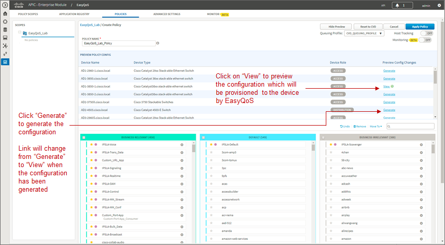

The Preview Policy Config panel allows the network operator to generate
the actual commands that will be provisioned to each device by EasyQoS.
This is done by clicking the Generate link adjacent to the specific
device. The Generate link will change to View when the configuration has
been generated. Clicking the View link will bring up a pop-up window in
which the configuration commands will appear. The configuration commands
can then be viewed by scrolling up and down within the panel. An example
is shown in the figure below.

1. Displaying the Preview Configuration

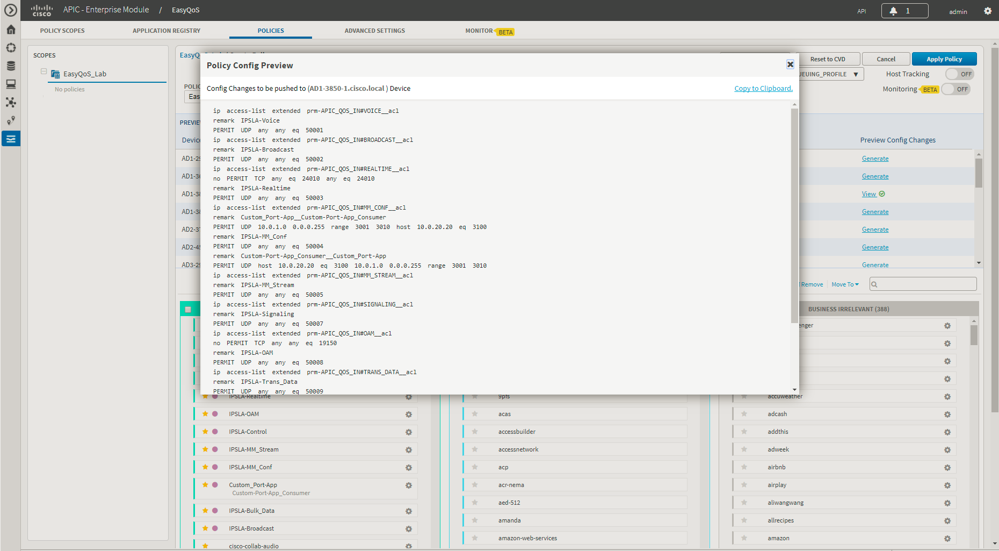

The preview policy option can be useful in uncovering potential errors
in applying policy—such as an unsupported line card within a Catalyst
6500 Series switch for instance—before the policy is applied. The
network operator can then take remedial actions, such as removing the
device from the policy scope, or removing the line card from the
switch—before applying the policy. Because the actual configurations
that are provisioned by EasyQoS to each device are generated, this may
also improve the time taken to deploy the policy to all of the devices
within the scope, as well.

Scheduling a Policy

When the network operator is satisfied with the policy, he/she can click
the Apply Policy button in the upper right corner of the policy screen.
This will bring up a pop-up window in which the network operator can
immediately apply the policy, or schedule the policy to be applied at a
future date and time. An example is shown in the following figure.

1. Scheduling a Policy

.. image:: media/image49.png

APIC-EM release 1.4 and higher supports the ability to schedule a policy
at a future time and date. Scheduled policies are applied only
once—meaning that a policy cannot be scheduled to reoccur every day,
hour, etc.

When a policy is scheduled to be run at a future date and/or time, the
policy screen will appear similar to the example in the figure below.

1. Policy Scheduled for a Future Date and/or Time

.. image:: media/image50.png

The policy scope to which the policy will be applied is locked when a
policy is scheduled to be applied at a future date and/or time. This
means the policy scope cannot be modified. The scheduled date and/or
time cannot be modified once the policy has been scheduled. The network
operator can only cancel the policy by clicking the Cancel button at the
top of the policy screen, as shown in the figure above. Cancelling a
scheduled policy will result in the policy being deleted if this is a
new policy. If the policy is an update to an existing policy, then the
updates will be lost if the scheduled policy is cancelled. EasyQoS
provides a pop-up screen warning of the potential loss of the policy
data and prompting for a confirmation before cancelling a scheduled
policy.

Policy Status

When a policy is applied, EasyQoS provides the status of the policy on
each device—as the policy is being applied. Initially each device will
appear with a gray bar next to it—indicating that no policy is applied
(if this is a new device to EasyQoS with no policy). A yellow bar next
to a device indicates that policy is currently being configured onto the
device. Finally, a green bar next to the device indicates that the
policy has successfully been provisioned onto the device. An example of
the policy being applied to devices within the scope is shown in the
following figure.

1. Policy Status

.. image:: media/image51.png

Clicking the information button next to each network device brings up a
popup window with Device Details. The Device Details window serves two
purposes—depending upon whether the policy was successfully applied to
the device or not. If the policy was successfully applied to the device,
clicking the information button next to the device will display the
applications which were deployed in the policy provisioned to the
device—based upon the business relevance of each application. An example
is shown in the figure below.

1. Device Details when Policy is Successfully Applied to a Device

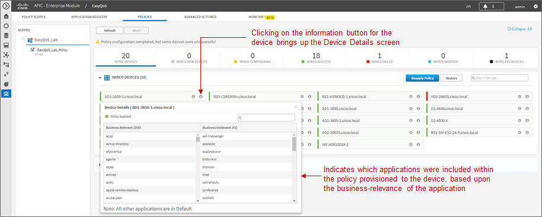

Only applications which are business-relevant or business-irrelevant are
configured into policies on switch, router, and AireOS WLC platforms.
Applications with default business relevance receive best effort
treatment, and therefore do not show up within the policy provisioned to
network devices.

If the policy failed to be applied to the device, clicking the
information button next to the device may display a reason why the
policy failed. An example is shown in the figure below.

1. Device Details when Policy Fails to be Applied to a Device

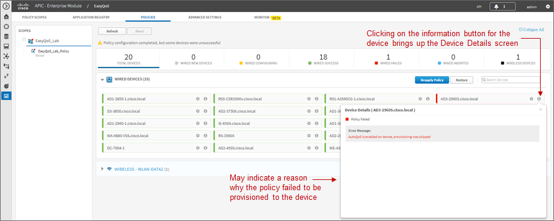

In the example above, the information within the Device Details screen
indicates that policy was skipped because AutoQoS is currently enabled
on the switch platform. EasyQoS currently does not support provisioning
QoS policy to devices with AutoQoS enabled. In this case, the network
operator can manually remove AutoQoS configuration and resync the device
before attempting to re-apply policy. Alternatively, the network
operator can simply remove the device from the policy scope.

After a policy has finished being applied to devices within the policy
scope, clicking the name of the policy within the left-hand panel
displays the policy, as shown in the following figure.

1. Displaying a Policy

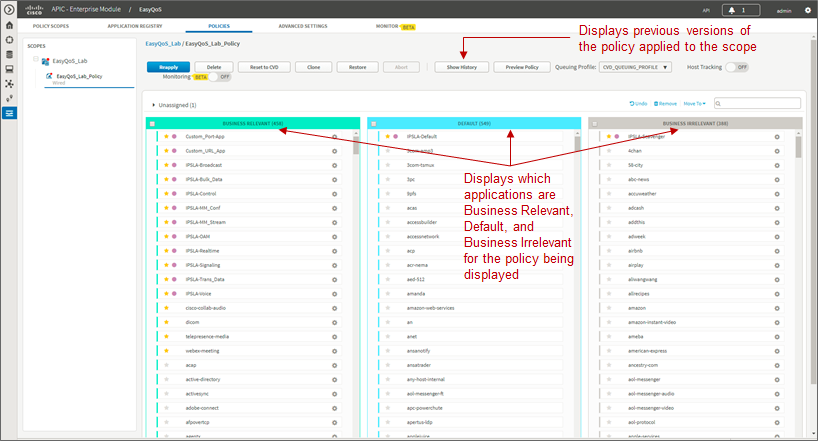

The network operator’s business intent—in terms of the
business-relevance of applications—is applied per policy. This means
that applications can be assigned different business-relevance
attributes in different policies. Here the network operator can view
which applications are Business Relevant, Default, and Business
Irrelevant for the policy being displayed.

Abort

The network operator can abort the provisioning of the policy to network
devices after the policy provisioning has begun, but before the policy
provisioning process has completed, by clicking the Abort button.
EasyQoS provisions multiple (up to 40) devices at a time. Hence, the
abort option is only useful when there are a large number of devices
(more than 40) within a policy. Rather than waiting for the entire
policy to be provisioned to each device, and then either rolling back
the policy or restoring the configuration, the network operator can
instead terminate the provisioning of the policy with the Abort button.
For policies with a small number of devices, it may be more effective to
allow the policy to complete and then either Rollback the policy or
Restore the devices to their configuration before EasyQoS policy was
applied.

When the Abort button is pressed, EasyQoS cancels the provisioning
process only on network devices that have not yet been started to be
configured. A light blue bar next to these devices will indicate a
status of Policy Aborted for these devices. For devices that have
started to be configured, EasyQoS will complete the provisioning of the
policy. For devices for which the provisioning of the policy has been
completed before the Abort button was pressed, EasyQoS will leave the
policy on the device and will update the status of each of these
devices—a green bar for Success or a red bar for Failed—based on the
outcome of the provisioning of the policy to the device. The network
operator can then either Rollback the policy or Restore these devices to
their original configuration before EasyQoS policy was applied.

History, Rollback, and Clone

Clicking the Show History button within a policy opens a new Policy
History panel in the center of the page, as shown in the following
figure.

1. Show History

.. image:: media/image55.png

The Policy History panel displays previous versions of the policy
selected. The network operator can view the changes in the policy that
have been made in the various versions by selecting the Difference
feature under a particular prior version. This will display the
difference in the policy between the prior version selected and the
policy that is currently deployed (it does not display the difference in
policy between the prior version selected and the next lower prior
version).

The difference in policy is represented in terms of applications—meaning
certain applications may have been moved between business relevance,
certain applications may have been added or deleted from the Favorites,
or custom applications may have been added or deleted. The Difference
feature does not display the difference in the actual configuration
applied to each network device.

The Rollback feature under a particular prior version can be used to
roll back the policy from that which is currently deployed, to the
particular prior version selected. This feature is useful in change
management scenarios, where a particular change is found to be
undesirable and the network infrastructure needs to be rolled-back to
the state it was in prior to the change being implemented.

Finally, the Clone button can be used to copy the entire policy. Upon
clicking the Clone button, the network operator will be asked to enter a
new policy name for the cloned policy and to select a policy scope to
which the new cloned policy will be applied. With complex policies, the
network operator can save administrative time by not having to duplicate
the same policy across multiple policy scopes. After the policy is
cloned, the network operator is free to modify it as needed for the
particular policy scope.

Restore and Delete

The Restore button deletes an EasyQoS policy and attempts to restore the
QoS configuration on all devices covered by the EasyQoS policy back to
the original configurations before any EasyQoS policy was applied.
Because the EasyQoS policy is deleted when the network operator selects
the Restore button, there is no ability to retry the Restore function if
it does not succeed in restoring the configuration of all devices to
their original (pre-EasyQoS) configuration. This behavior is similar to
when the network operator selects the Delete button, in that the EasyQoS
policy is deleted. There is no ability to retry the delete function,
either.

-  Note: If the first attempt to provision an EasyQoS policy to a device
   (meaning the device initially has no EasyQoS policy) fails, EasyQoS
   will also automatically attempt to restore the QoS configuration on
   that device to its original (pre-EasyQoS) configuration.

The network operator should be aware that if a device is removed from an
EasyQoS policy after the policy has been applied to the device, the
EasyQoS policy will remain on that device. In other words, EasyQoS will
not automatically attempt to delete the QoS policy provisioned to the
device, nor will EasyQoS attempt to restore the QoS configuration on
that device to the original (pre-EasyQoS) configurations.

The Restore button will also not restore the QoS configuration on that
device to the original configuration if the original configuration was
already an EasyQoS configuration. This situation may occur when
upgrading from APIC-EM 1.2 to APIC-EM 1.3 or higher. APIC-EM did not
collect the information required to restore the original configuration
before provisioning policy in APIC-EM version 1.2.

Finally, there are some parts of the EasyQoS policy that may not be
restored, depending upon particular network device platform. The
***Pre-Existing QoS Configuration on ISR and ASR Router Platforms***
section of the ***Branch and WAN Static QoS Design*** chapter details
what is restored and not restored on router platforms when clicking the
Restore button. Likewise, the ***Pre-Existing QoS Configuration on
Switch Platforms*** section of the ***Campus LAN Static QoS Design***
chapter details what is restored and not restored on switch platforms
when clicking the Restore button.

-  Note: When an EasyQoS policy is deleted for MLS QoS based switches,
   the network operator should resynchronize any devices which were part
   of the policy before applying any new QoS policies. This can be
   accomplished either by waiting until the polling interval has been
   exceeded before applying the new policy, or by performing a manual
   resync of the devices. This will ensure that APIC-EM has the current
   configuration state of the devices within its database before
   provisioning EasyQoS policy.

Host Tracking

The Host Tracking feature allows EasyQoS to track Cisco device endpoints
discussed within the ***Host Inventory*** section above, and dynamically
apply access-control list entries (ACEs) to the switches to which the
devices are connected, as the devices are moved. The ACEs match the
voice and video traffic generated by the devices. The Host Tracking
feature is enabled per EasyQoS policy through the toggle button shown in
the following figure.

1. Enabling Host Tracking

.. image:: media/image56.png

The Host Tracking feature can be enabled as the EasyQoS policy is being
created, or after the EasyQoS policy has been created. However, the
policy will need to be reapplied to the policy scope if the Host
Tracking feature is enabled after the policy has been created. The
specific policy configuration created and provisioned to Cisco Catalyst
switches, for each device endpoint, is discussed in the ***Cisco Device
Endpoints*** section of the ***Campus LAN Static QoS Design*** chapter.

Wireless Policies

Cisco AireOS WLCs can also be added to policy scopes by
dragging-and-dropping the device into a particular policy scope.
Optionally, a separate policy scope can be created for wireless devices.
Wireless policies are deployed per WLAN/SSID. If there are multiple
WLANs/SSIDs to which EasyQoS policies need to be applied, then the
network operator must create a policy for each WLAN/SSID.

A wireless policy (separate from the policy applied for wired devices)
must be created under the policy scope. This is done by clicking the
blue Create Policy button adjacent to the name of the WLAN/SSID within
the Wireless section of the page. As with wired policies, the wireless
policy must be given a name; individual applications can be moved
between Business-Relevant, Default, and Business-Irrelevant groupings;
bi-directionality can be selected for individual applications; and the
policy can be previewed before being deployed.

An example of a wireless policy created within an existing policy scope
is shown in the figure below.

1. Adding a Wireless Policy to a Policy Scope

.. image:: media/image57.png

Clicking the wireless policy displays the policy, as shown in the figure
below.

1. Displaying a Wireless Policy

|image56|

APIC-EM release 1.6 provides the ability for the network operator to
specify whether or not he/she wants to enable the FastLane feature on
the WLAN / SSID. The default setting is for the FastLane feature to be
disabled. The WLC to which the WLAN / SSID belongs must be running
AireOS release 8.3.112 or higher code on order to support the Fastlane
feature. Previously with APIC-EM release 1.5, if the WLAN / SSID
belonged to a WLC which could support the FastLane feature, the FastLane
feature was automatically enabled when EasyQoS policy was provisioned.
The FastLane feature is discussed further in ***Chapter 10: WLAN QoS
Design.***

Applications known via the AVC/NBAR engine within the AireOS WLC are
displayed in groupings of Business Relevant, Default, and Business
Irrelevant. The network operator can drag-and-drop the applications
between the three groupings in order to match the business intent of the
organization.

The AVC/NBAR based classification & marking policy deployed to AireOS
WLCs specifies an action of mark, rather than drop. For Business
Relevant applications, the DSCP marking is by default based on the value
of the traffic-class attribute assigned within the NBAR taxonomy. For
Business Irrelevant applications, the DSCP marking is by default set to
CS1 (DSCP 8). However, DSCP markings for individual applications can be
changed within the application registry. DSCP markings for entire
traffic-classes can be changed through a custom Queuing Profile applied
to the wireless policy. Applications with a business-relevance attribute
of Default are not programmed into the AVC/NBAR policy. The AVC/NBAR
policy overrides the QoS Profile applied to the WLAN/SSID. Because
EasyQoS sets the Maximum Priority field within the QoS Profile to a
setting of Voice, for wireless devices which support QoS, applications
with a business-relevance attribute of Default are not reset to a DSCP
value of Best Effort (DSCP 0). Instead, the WLC allows such applications
to pass through with their DSCP values unaltered.

AireOS WLCs support up to 32 applications per QoS Policy. This is a
current limitation of the AVC/NBAR engine within AireOS WLCs. By
default, EasyQoS will select the 32 applications that get programmed
into the wireless policy based upon which applications are selected as
Favorites and then based upon the popularity attribute pre-configured
for all of the 1300+ applications within the NBAR taxonomy.

Because the network operator has no view of the popularity attribute for
any given application within the NBAR taxonomy, there are two methods by
which the network operator can guarantee which 32 applications are
provisioned into the AireOS AVC/NBAR-based classification & marking
policy. Note that the AVC/NBAR-based policy can have less than 32
applications as well, if desired by the network operator.

-  In the first method, the network operator can select up to 32
   applications as Favorites. APIC-EM will provision applications marked
   as Favorites before provisioning other applications within the NBAR
   taxonomy. However, because the choice of Favorites is a global
   setting—meaning the selection of Favorite applications is the same
   across all policies in all policy scopes—this may not be an ideal
   solution.

-  In the second method, the network operator can highlight all
   applications within each of the three groupings—Business Relevant,
   Default, and Business Irrelevant—via the checkbox at the top of each
   group. The network operator can then remove all of the applications.
   This will place all applications for the wireless policy in the
   Unassigned group. The network operator can then use the search field
   in the upper right corner of the page to search for each application
   he/she wants to add back into the policy. Upon locating the
   application, the network operator must drag-and-drop that application
   from the Unassigned group into either the Business Relevant or
   Business Irrelevant grouping. In this manner, the network operator
   can add up to 32 applications into the wireless policy and ensure
   they will be provisioned to the AireOS WLC.

As of APIC-EM version 1.3 and higher, the default behavior of the
AVC/NBAR-based classification & marking policy is to mark in the
upstream direction only. In order to implement bi-directional policies,
the network operator must configure bi-directionality for the
application. This is done the same way as discussed for Custom
applications in the ***Policies*** section above.

Finally, the network operator should note that Custom
applications—regardless of whether they are URL-based or port-based—are
not provisioned into the AVC/NBAR-based classification & marking policy
of WLC platforms. This is a current limitation of AireOS WLC platforms,
in that they do not support the ability to define custom applications
within the AVC/NBAR policy.

Upgrading from APIC-EM Release 1.3 to APIC-EM Release 1.4 and Higher

The NBAR protocol pack has been upgraded from version 14.0.0 in APIC-EM
release 1.3 to version 27.0.0 in APIC-EM release 1.4 and higher. NBAR
protocol pack version 27.0.0 includes additional applications not found
in protocol pack 14.0.0. Additionally, some attributes, such as the
traffic-class to which an application belongs, may change between
protocol pack revisions. This may be the result of better knowledge of
how a particular application is used within customer networks over time
or the result of changes in how the application itself is used within
customer networks over time. Application changes appear as stale
applications upon upgrading from APIC-EM release 1.3 to release 1.4 or
higher. The network operator should re-apply policies to policy scopes
in order to update these stale applications.

Dynamic QoS
=========
For the APIC-EM 1.6 release, Dynamic QoS is still a Beta application
within EasyQoS. In order to enable Dynamic QoS, the network operator
must access the Advanced Settings tab and then click Dynamic QoS to
bring up the screen shown in the figure below.

1. Enabling Dynamic QoS

.. image:: media/image59.png

For APIC-EM 1.6 Dynamic QoS is a feature that is enabled
globally—meaning across all policy scopes—through the sliding button
shown in the figure above. Upon re-applying static QoS policy to a given
policy scope, EasyQoS will then provision Dynamic policy-map shells to
access-layer switches within that policy scope. The Dynamic policy-map
shells are discussed within the ***Dynamic QoS Design*** chapter of this
document.

The Dynamic QoS screen displays the status of Dynamic QoS flows when
they are active. Dynamic QoS flows are initiated when call signaling
systems, such as CUCM, use the northbound REST-based API to signal to
APIC-EM that a call has been established. An example of an active
Dynamic QoS session—representing a voice call between two endpoints—is
shown in the figure below.

1. Example of an Active Dynamic Voice Call

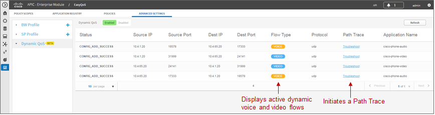

The Path Trace tool can be used to troubleshoot active Dynamic QoS flows
by displaying the path of the traffic through the network infrastructure
between the endpoints. An example of the Path Trace tool is shown in the
figure below.

1. Example of the Output of the Path Trace Tool for a Dynamic Flow

.. image:: media/image61.png

The Path Trace tool displays the path of the traffic associated with the
Dynamic QoS flow through the network infrastructure within the top panel
of the display. The lower panel provides more detail regarding each of
the network devices through which the Dynamic QoS flow passes.

APIC-EM release 1.4 and higher enhanced the REST-based API for Dynamic
QoS flows. The API call can now include an Application Name. The
Application Name can be used to match one of the existing applications
within the NBAR taxonomy or a Custom application. The traffic-class
attribute for the Custom application or the application within the NBAR
taxonomy must be VoIP Telephony, Multimedia Conferencing, or Real-Time
Interactive. EasyQoS will generate an error when an API call attempts to
set up a Dynamic QoS flow that includes the Application Name, if the
application does not have a traffic-class attribute which matches one of
these three traffic-classes.

When call signaling systems, such as CUCM, use the northbound REST-based
API to signal to APIC-EM that a call has been terminated, APIC-EM will
remove the entry for the Dynamic QoS flow. The ***Dynamic QoS Design***
chapter of this document has further details regarding the operation of
Dynamic QoS.
