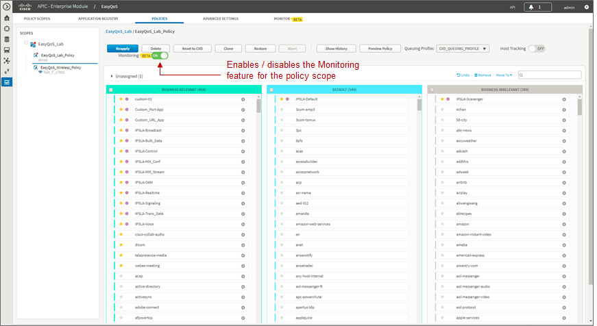
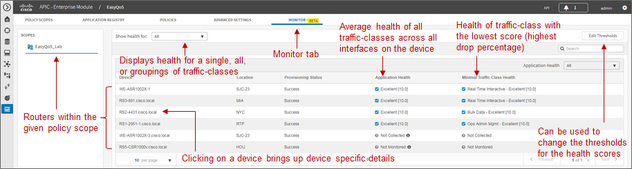
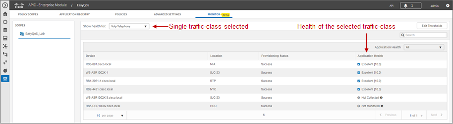
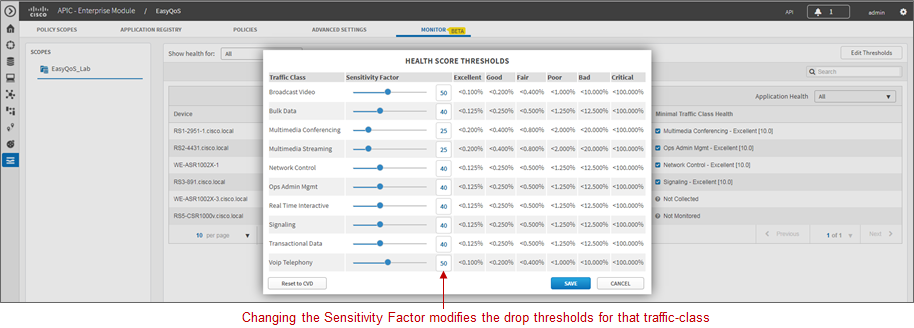
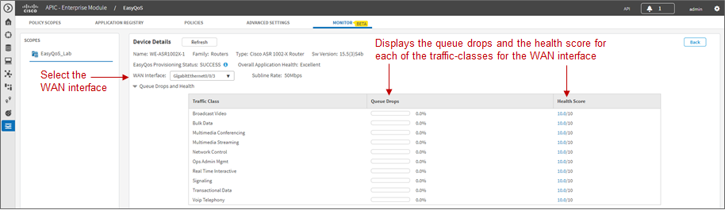

##################
Chapter 5: EasyQoS Monitoring (Beta)
##################

For APIC-EM release 1.6, EasyQoS Monitoring is a Beta feature. The
Monitoring feature provides the ability for the network operator to
monitoring the health of WAN-connected interfaces on routers to which
EasyQoS policy has been applied. Health scores are based solely on
packet loss for this release. Future versions of EasyQoS Monitoring may
extend the functionality to include additional parameters such as
end-to-end latency, jitter, application latency, etc. into the overall
health score.

Enabling the Monitoring Feature

The Monitor feature is enabled per policy scope via the sliding button
adjacent to Monitoring within the EasyQoS policy screen, as shown in the
following figure.

1. Enabling EasyQoS Monitoring

The EasyQoS policy should be re-applied to the policy scope after
enabling the Monitoring feature. The Monitoring feature will add the
following interface-level configuration command to all WAN-facing
interfaces on ASR 1K, ISR 4K, ISR G2, and ISR 800 Series routers which
support an Active NBAR2 license.

ip nbar protocol discovery

This command is necessary in order to display per-application statistics
on ISR and ASR router platforms when drilling down into an interface.
This feature will be available in future releases.

Device-Level Statistics

Device-level statistics may take approximately 20 minutes to appear
after enabling the Monitoring feature. This is because EasyQoS polls
statistics collected on the WAN interfaces periodically (by default
every 10 minutes). Information is not displayed within the GUI until at
least two polling cycles have passed.

After the Monitoring feature has been enabled, the network operator can
click the Monitor tab in order to bring up a device-level view, as shown
in the figure below.

1. Device Level Statistics with All Traffic-Classes Selected

The device-level view displays the router platforms within the selected
policy scope, and the status of the Monitoring feature on those devices.
Application health can be displayed for all traffic-classes, a single
traffic class, or groups of traffic-classes (Data, Video, or Control).
The network operator can select this through the drop-down menu next to
the **Show health for:** field, shown in the figure above.

If all traffic-classes have been selected, the Application Health column
in the figure above represents the arithmetic mean (average) of the
health scores across all traffic-classes and WAN interfaces for the
given router. The Minimal Traffic Class Health column displays the
traffic-class with the minimal application health score on the given
router. Status for these columns can be one of the following:

-  An application health score is being generated for the router
   platform. This indicates that monitoring statistics are being
   collected on one or more interfaces on the router.

-  Not Monitored. This status indicates the router is not being
   monitored. This status can occur if the router does not support
   NBAR—meaning it does not have an Active NBAR license—or does not have
   any WAN-connected interfaces.

-  Collection Failure. This status indicates there was an error in
   collecting statistics from the device for the previous cycle.
   Therefore the health score could not be calculated.

-  Not Collected. This status indicates that no monitoring statistics
   are being collected for the router. In this situation, the router is
   capable of being monitored. However, monitoring statistics are not
   available because either the first health data sample was not
   collected or the number of monitored interfaces exceeds the supported
   number of 1,000 interfaces.

-  Note: Application health scores are calculated based upon the
   percentage of drops within each traffic-class over the previous
   collection interval. By default, the collection interval is 10
   minutes. Therefore, the application health score shows the health
   over the past collection interval only. There is currently no
   history, regarding application health scores, maintained within
   APIC-EM. Future versions of the Monitoring feature may extend this
   functionality to provide the network operator the ability to view
   historical health scores over selected time periods.

The application health score consists of both a ‘grade’—Excellent, Good,
Fair, Poor, Bad, or Critical—which is based upon configurable drop
thresholds, and a value from 0.0—10.0. The application health score is
based upon the percentage of packet drops seen within each of the
traffic-classes configured on the WAN interfaces of the router.

If a single traffic-class is selected, then only a single health score
column appears in the device-level view, as shown in the figure below.

1. Device-Level Statistics with Single Traffic-Class Selected

The drop-down menu adjacent to Application Health allows the network
operator to filter the output based on the status for the router. For
larger deployments this may assist in identifying areas of trouble more
quickly. For example, it may be desirable to display only those routers
that have a status of collection failure. This would indicate some
problem with the collection of health scores on the devices displayed.
Alternatively, the network operator may wish to display routers with a
health score of critical, in order to allocate resources toward
troubleshooting the routers with the most immediate issues first.

Sensitivity Factor and Health Score Thresholds

The network operator can view and modify the thresholds for each
traffic-class used to calculate the application health score by clicking
the Edit Thresholds button shown in the figure above. This brings up the
Health Score Thresholds popup window shown in the figure below.

1. Modifying Health Score Thresholds

For each traffic-class, the network operator can modify the Sensitivity
Factor—either via the slider, or by typing in a value in the box
adjacent to each traffic-class. The Sensitivity Factor is used to set
the maximum drop percentages acceptable for each of the thresholds
(Excellent, Good, Fair, Poor, Bad, and Critical). It has a range from 0
to 100.

The default values for the Sensitivity Factor for each traffic-class are
derived from industry standards. In particular, IETF RFC 4594 specifies
the expected tolerances to packet loss for each of the 12
traffic-classes—as shown in the following table.

1. Service Class Characteristics from IETF RFC 4594

+-----------------------------------------+---------------------+
| Service Class Name                      | Tolerance to Loss   |
+=========================================+=====================+
| Network Control                         | Low                 |
+-----------------------------------------+---------------------+
| Telephony                               | Very Low            |
+-----------------------------------------+---------------------+
| Signaling                               | Low                 |
+-----------------------------------------+---------------------+
| Multimedia Conferencing                 | Low-Medium          |
+-----------------------------------------+---------------------+
| Real-Time Interactive                   | Low                 |
+-----------------------------------------+---------------------+
| Multimedia Streaming                    | Low—Medium          |
+-----------------------------------------+---------------------+
| Broadcast Video                         | Very Low            |
+-----------------------------------------+---------------------+
| Low-Latency Data (Transactional Data)   | Low                 |
+-----------------------------------------+---------------------+
| OAM                                     | Low                 |
+-----------------------------------------+---------------------+
| High-Throughput Data (Bulk Data)        | Low                 |
+-----------------------------------------+---------------------+
| Standard (Best Effort/Default)          | Not Specified       |
+-----------------------------------------+---------------------+
| Low Priority Data (Scavenger)           | High                |
+-----------------------------------------+---------------------+

-  Note: Based upon IETF RFC 4594, the tolerance to packet loss for the
   Default (Best Effort) traffic-class is not specified. Additionally,
   the tolerance to packet loss for the Scavenger traffic-classes is
   high. Application health scores for these two traffic-classes are
   therefore not collected, and there is no Sensitivity Factor setting
   for these two traffic-classes.

The baseline for traffic-classes with Very Low tolerance to packet loss
(Telephony and Broadcast Video) is aligned with the ITU-T Y.1451
specification at less than 1 in 1,000 packets (<0.100%) for Excellent
quality.

The Sensitivity Factor for the VoIP Telephony and Broadcast Video
traffic-classes is set to a value of 50 by default. This is the middle
of the range of values from 0 to 100. All of the default values for the
Sensitivity Factor for the other eight traffic-classes listed in the
Health Score Thresholds popup window are derived from this—based upon
the tolerance to packet loss (Low, Low-Medium, or High) of the specific
traffic-class. The application health thresholds shown in the Health
Score Thresholds window in the figure above are then derived based upon
this.

Tuning of the Sensitivity Factor of individual traffic-classes within
the Health Score Thresholds popup window allows the network operator to
tune the output of the Monitoring feature in situations where the
industry standard values do not specifically fit his/her environment.
The higher the value of the Sensitivity Factor, the less tolerance to
queue drops for the given traffic-class. If at any point, the network
operator wants to revert to the default settings of the Sensitivity
Factor for each traffic-class, he/she can simply click the Reset to CVD
button in the lower left corner of the popup window. When the network
operator is satisfied with the tuning, he/she can click the Save button
to save the changes and close the popup window.

Device Details

Clicking a specific router shown in the Monitoring tab screen will bring
up details for that particular device. An example is shown in the figure
below.

1. Monitoring Device Details

The Device Details screen displays the queue drops per traffic-class for
the selected WAN interface on the router. It also displays the health
score per traffic-class, based upon the percentage packet loss and
Sensitivity Factor for a given traffic-class.

Per traffic-class queue drops for WAN interfaces are collected via the
“show policy-map interface <interface> out” command, which is issued by
EasyQoS to each WAN interface of monitored routers. An example partial
output from the command is shown below.

.. code-block:: python

WE-ASR1002X-1#show policy-map interface GigabitEthernet0/0/3 out

GigabitEthernet0/0/3

Service-policy output: prm-dscp#EQ\_SPP1-4Class#shape#50.0

Class-map: class-default (match-any)

48605130 packets, 5809744482 bytes

30 second offered rate 7000 bps, drop rate 0000 bps

Match: any

Queueing

queue limit 208 packets

(queue depth/total drops/no-buffer drops) 0/0/0

(pkts output/bytes output) 48523512/5803867986

shape (average) cir 50000000, bc 200000, be 200000

target shape rate 50000000

Service-policy : prm-dscp#EQ\_SPP1-4Class

queue stats for all priority classes:

Queueing

queue limit 512 packets

(queue depth/total drops/no-buffer drops) 0/0/0

(pkts output/bytes output) 730622/54226668

Class-map: prm-EZQOS\_12C#VOICE (match-any)

730622 packets, 54226668 bytes

30 second offered rate 0000 bps, drop rate 0000 bps

Match: dscp ef (46)

**police:**

rate 10 %

rate 5000000 bps, burst 156250 bytes

**conformed 730622 packets**, 54226668 bytes; actions:

transmit

**exceeded 0 packets**, 0 bytes; actions:

drop

conformed 0000 bps, exceeded 0000 bps

Priority: Strict, b/w exceed drops: 0

QoS Set

dscp ef

Marker statistics: Disabled

Class-map: prm-EZQOS\_12C#BROADCAST (match-any)

730592 packets, 54224448 bytes

30 second offered rate 0000 bps, drop rate 0000 bps

Match: dscp cs5 (40)

Queueing

queue limit 208 packets

(queue depth/\ **total drops**/no-buffer drops) 0/\ **0**/0

(**pkts output**/bytes output) **730592**/54224448

bandwidth remaining 8%

QoS Set

dscp af31

Marker statistics: Disabled

…

For traffic-classes which implement priority queuing, the policer
configuration is used to determine conformed packets and exceeded
packets for each collection interval. Packets which exceed the policer
are configured to be dropped by EasyQoS. The queue drops per collection
interval are calculated as follows:

Total Packets = Conformed Packets + Exceeded Packets

Δ Total Packets = Total Packets This Collection Interval – Total Packets
Last Collection Interval

Δ Exceeded Packets = Exceeded Packets This Collection Interval –
Exceeded Packets Last Collection Interval

Percentage Queue Drops = Δ Exceeded Packets / Δ Total Packets

The Exceeded Packets and Conformed Packets counters are highlighted in
bold for the VOICE traffic-class in the sample output from the “show
policy-map interface <interface> out” command above.

For traffic-classes which do not implement priority queuing, the queue
drops per collection interval are calculated based upon Packets Output
(Pkts Output) and Total Drops as follows:

Δ Pkts Output = Pkts Output This Collection Interval – Pkts Output Last
Collection Interval

Δ Total Drops = Total Drops This Collection Interval – Total Drops Last
Collection Interval

Percentage Queue Drops = Δ Total Drops / Δ Pkts Output

The Pkts Output and Total Drops counters are highlighted in bold for the
BROADCAST traffic-class in the sample output from the “show policy-map
interface <interface> out” command above.
