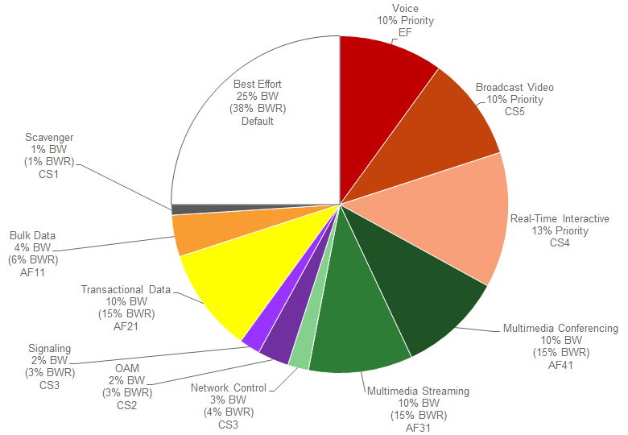

##################
Chapter 6: WAN and Branch Static QoS Design
##################

Within the EasyQoS solution, different network devices implement the
ingress classification & marking QoS policies to the best of their
abilities. Cisco ISR G2 Series, ISR 4400 Series, and ASR 1000 Series
router platforms implement the following QoS policies:

-  Ingress classification & marking policies based on AVC/NBAR2
   policy-maps that contain either “match protocol attribute” or “match
   protocol” statements.

-  Egress queuing policies

-  Note: As of APIC-EM release 1.3 and higher, port-based Custom
   applications included within ingress classification & marking
   policies on ISR and ASR router platforms are implemented through
   class-maps which match based upon ACL entries.

EasyQoS Policy Based on Platform, NBAR2 Protocol Pack, and Licensing

The following table summarizes the ingress classification & marking
policy provisioned by EasyQoS to Cisco IOS and IOS XE platforms based
upon software release, NBAR protocol pack version, and protocol pack
license (Standard versus Advanced). Platforms that run IOS software
releases include Cisco ISR G2 (3900 Series, 2900 Series, and 800 Series)
platforms. Platforms that run IOS XE software releases include Cisco ISR
4400 Series and Cisco ASR 1000 Series platforms.

1. Ingress Classification & Marking Policy for ISR and ASR Platforms

+-----------------+--------------------------------------------------------+----------------------------------------------------+------------------------------------------------------------------------------------------------------------------------------------------+
| Platform Type   | IOS Release                                            | Protocol Pack Version                              | Ingress Classification & Marking Policy                                                                                                  |
+=================+========================================================+====================================================+==========================================================================================================================================+
| IOS XE or IOS   | Any IOS XE or IOS release                              | Standard Protocol Pack                             | No ingress classification & marking policy                                                                                               |
|                 |                                                        |                                                    |                                                                                                                                          |
|                 |                                                        |                                                    | Ingress classification & marking policies are not supported on devices running Standard Protocol Pack on both IOS and IOS-XE platforms   |
+-----------------+--------------------------------------------------------+----------------------------------------------------+------------------------------------------------------------------------------------------------------------------------------------------+
| IOS XE or IOS   | IOS XE 3.12 or below                                   | Any Advanced Protocol Pack                         | Ingress classification & marking policy using “match protocol” statements                                                                |
|                 |                                                        |                                                    |                                                                                                                                          |
|                 | Or IOS XE versions 3.13.6 to IOS XE 3.14 (excluding)   |                                                    | Custom applications that include a hyphen will not be programmed                                                                         |
|                 |                                                        |                                                    |                                                                                                                                          |
|                 | Or IOS versons below 15.5(1)T                          |                                                    |                                                                                                                                          |
+-----------------+--------------------------------------------------------+----------------------------------------------------+------------------------------------------------------------------------------------------------------------------------------------------+
| IOS XE          | IOS XE versions 3.13.1 to 3.13.5 and 3.14 to 3.16      | Any Protocol Pack                                  | No ingress classification & marking policy (Cisco software defects—see note below)                                                       |
|                 |                                                        |                                                    |                                                                                                                                          |
|                 | Or IOS 15.5(1)T and 15.5(2)T                           |                                                    |                                                                                                                                          |
+-----------------+--------------------------------------------------------+----------------------------------------------------+------------------------------------------------------------------------------------------------------------------------------------------+
| IOS XE          | IOS XE versions 3.16.1 to 3.16.3                       | Advanced Protocol Pack versions below 22.0.0       | No ingress classification & marking policy (Cisco software defects—see note below)                                                       |
|                 |                                                        |                                                    |                                                                                                                                          |
|                 | Or IOS versions 15.5(3)M to 15.5(3)M3                  |                                                    |                                                                                                                                          |
+-----------------+--------------------------------------------------------+----------------------------------------------------+------------------------------------------------------------------------------------------------------------------------------------------+
| IOS XE          | IOS XE versions 3.16.1 to 3.16.3                       | Advanced Protocol Pack versions 22.0.0 or higher   | Ingress classification & marking policy using “match protocol attribute” statements                                                      |
|                 |                                                        |                                                    |                                                                                                                                          |
|                 | Or IOS versions 15.5(3)M to 15.5(3)M3                  |                                                    |                                                                                                                                          |
+-----------------+--------------------------------------------------------+----------------------------------------------------+------------------------------------------------------------------------------------------------------------------------------------------+
| IOS XE          | IOS XE versions 3.16.4 or later                        | Advanced Protocol Pack versions 14.0.0 or higher   | Ingress classification & marking policy using “match protocol attribute” statements                                                      |
|                 |                                                        |                                                    |                                                                                                                                          |
|                 | OR IOS 15.5(3)M4 or later                              |                                                    |                                                                                                                                          |
+-----------------+--------------------------------------------------------+----------------------------------------------------+------------------------------------------------------------------------------------------------------------------------------------------+

-  Note: EasyQoS does not support ISR or ASR routers in port-channel
   configurations. EasyQoS provisions AVC / NBAR-based ingress
   classification & marking policies that require individual application
   flows to be seen bi-directionally on a given interface. With
   port-channel configurations, this requires the ingress classification
   & marking policy to be applied on the logical port-channel interface
   or logical port-channel sub-interface, rather than the physical
   port-channel member interfaces. As of APIC-EM release 1.6 EasyQoS
   only applies ingress classification & marking policies to physical
   interfaces or sub-interfaces.

ISR G2 Series platforms require a Data license for NBAR2 Advanced
Protocol Pack. ISR 4000 Series platforms require an Application
Experience license for NBAR2 Advanced Protocol Pack. ASR 1000 Series
platforms require an Advanced Enterprise Services or Advanced IP
Services license for NBAR2 Advanced Protocol Pack. EasyQoS will always
push an egress queuing policy to a supported ISR or ASR router platform,
regardless of the IOS XE or IOS software version, NBAR protocol pack
version, and protocol pack license (Standard or Advanced).

-  Note: Although the business-relevance and traffic-class attributes
   are supported with IOS XE software versions that support Advanced
   Protocol Pack 14.0.0 and higher, due to Cisco software defect
   CSCva30089, ingress classification & marking policies are not
   provisioned to Cisco ISR 4400 and ASR 1000 Series routers by EasyQoS
   unless the IOS XE software version is upgraded as shown in the table
   above.

NBAR2 QoS Attributes

Cisco NBAR Protocol Pack 14.0.0 introduced two new
attributes—“traffic-class” and “business-relevance.” All 1300+
applications known to NBAR have been given a default value for each of
these attributes.

Traffic-Class Attribute

Every application within the NBAR taxonomy for Protocol Pack14.0.0 and
higher has also been assigned to one of the following 10
traffic-classes:

-  VoIP Telephony

-  Broadcast Video

-  Real Time Interactive

-  Multimedia Conferencing

-  Multimedia Streaming

-  Network Control

-  Ops Admin Mgmt

-  Signaling

-  Transactional Data

-  Bulk Data

These 10 traffic-classes are part of the 12-class QoS model recommended
in IETF RFC 4594 with minor modifications (Signaling traffic marked CS3
and Broadcast Video traffic marked CS5 with the Cisco model). An example
of the Cisco RFC 4594-Based 12-Class QoS model was shown in Figure 5
earlier in this document. The remaining two traffic-classes—Scavenger,
and Default—are based on the business-relevance attribute, discussed in
the next section.

Business-Relevance Attribute

Every application within the NBAR taxonomy for NBAR Protocol Pack 14.0.0
and higher has one of the following three settings for the
business-relevance attribute:

-  Business relevant—these applications directly support business
   objectives.

-  Business irrelevant—these applications do not support business
   objectives and are typically consumer-oriented.

-  Default—these applications may/may not support business objectives
   (e.g. HTTP/HTTPS/SSL).

Business-relevant applications are intended to be serviced within their
respective RFC 4594 traffic-class. Business-irrelevant applications are
intended for a RFC 3662 lower than best effort or Scavenger
traffic-class treatment. Applications with business-relevancy settings
of default are intended for a RFC 2474 Default Forwarding treatment.

Ingress Classification & Marking Policies

As discussed in the ***EasyQoS Policy Based on Platform, NBAR2 Protocol
Pack, and Licensing*** section above, the ingress classification &
marking policy pushed by EasyQoS to ISR and ASR router platforms is
dependent upon the IOS or IOS XE software version, the NBAR protocol
pack version, and the NBAR protocol pack licensing of the platform. The
following sections provide details regarding the policy.

Class-Map Definitions with “Match Protocol Attribute” Statements

The following is an example of the class-map definitions for the ingress
classification & marking policy deployed by EasyQoS to ISR and ASR
Series routers—based upon the use of “match protocol attribute”
statements.

!

class-map match-all prm-MARKING\_IN#TUNNELED-NBAR

match protocol capwap-data

!

class-map match-any prm-MARKING\_IN#VOICE\_CUSTOM

match access-group name prm-MARKING\_IN#VOICE\_\_acl

!

class-map match-any prm-MARKING\_IN#BROADCAST\_CUSTOM

match access-group name prm-MARKING\_IN#BROADCAST\_\_acl

!

class-map match-any prm-MARKING\_IN#REALTIME\_CUSTOM

match access-group name prm-MARKING\_IN#REALTIME\_\_acl

!

class-map match-any prm-MARKING\_IN#MM\_CONF\_CUSTOM

match access-group name prm-MARKING\_IN#MM\_CONF\_\_acl

!

class-map match-any prm-MARKING\_IN#MM\_STREAM\_CUSTOM

match access-group name prm-MARKING\_IN#MM\_STREAM\_\_acl

!

class-map match-any prm-MARKING\_IN#CONTROL\_CUSTOM

match access-group name prm-MARKING\_IN#CONTROL\_\_acl

!

class-map match-any prm-MARKING\_IN#SIGNALING\_CUSTOM

match access-group name prm-MARKING\_IN#SIGNALING\_\_acl

!

class-map match-any prm-MARKING\_IN#OAM\_CUSTOM

match access-group name prm-MARKING\_IN#OAM\_\_acl

!

class-map match-any prm-MARKING\_IN#TRANS\_DATA\_CUSTOM

match access-group name prm-MARKING\_IN#TRANS\_DATA\_\_acl

!

class-map match-any prm-MARKING\_IN#BULK\_DATA\_CUSTOM

match access-group name prm-MARKING\_IN#BULK\_DATA\_\_acl

!

class-map match-any prm-MARKING\_IN#SCAVENGER\_CUSTOM

match access-group name prm-MARKING\_IN#SCAVENGER\_\_acl

!

class-map match-all prm-MARKING\_IN#VOICE

match protocol attribute traffic-class voip-telephony

match protocol attribute business-relevance business-relevant

!

class-map match-all prm-MARKING\_IN#BROADCAST

match protocol attribute traffic-class broadcast-video

match protocol attribute business-relevance business-relevant

!

class-map match-all prm-MARKING\_IN#REALTIME

match protocol attribute traffic-class real-time-interactive

match protocol attribute business-relevance business-relevant

!

class-map match-all prm-MARKING\_IN#MM\_CONF

match protocol attribute traffic-class multimedia-conferencing

match protocol attribute business-relevance business-relevant

!

class-map match-all prm-MARKING\_IN#MM\_STREAM

match protocol attribute traffic-class multimedia-streaming

match protocol attribute business-relevance business-relevant

!

class-map match-all prm-MARKING\_IN#CONTROL

match protocol attribute traffic-class network-control

match protocol attribute business-relevance business-relevant

!

class-map match-all prm-MARKING\_IN#SIGNALING

match protocol attribute traffic-class signaling

match protocol attribute business-relevance business-relevant

!

class-map match-all prm-MARKING\_IN#OAM

match protocol attribute traffic-class ops-admin-mgmt

match protocol attribute business-relevance business-relevant

!

class-map match-all prm-MARKING\_IN#TRANS\_DATA

match protocol attribute traffic-class transactional-data

match protocol attribute business-relevance business-relevant

!

class-map match-all prm-MARKING\_IN#BULK\_DATA

match protocol attribute traffic-class bulk-data

match protocol attribute business-relevance business-relevant

!

class-map match-all prm-MARKING\_IN#SCAVENGER

match protocol attribute business-relevance business-irrelevant

!

APIC-EM/EasyQoS release 1.4 and higher added 11 new class-map entries
into the ingress classification & marking policy. These new class-map
entries are indicated by the word “CUSTOM” for port-based Custom
applications. These class-map entries are for port-based Custom
applications. Within APIC-EM/EasyQoS release 1.3, port-based Custom
applications were provisioned under the prm-MARKING\_IN#TUNNELED-NBAR
class-map entry. Prior to APIC-EM/EasyQoS release 1.3, port-based custom
applications were provisioned as NBAR applications. This is discussed
further in the ***Custom Applications on the ASR and ISR Platforms***
section below. “CUSTOM” class-map entries will only have a “match
access-group” statement and an associated ACL if the network operator
has configured a port-based Custom application within EasyQoS that
belongs to the traffic-class for the “CUSTOM” class-map entry.

The meaning of the “match-all” expression within class-map definitions
that contain two “match” statements is that both lines must be true in
order for traffic to be classified into the traffic class. For example,
for the prm-MARKING\_IN#SIGNALING class-map definition, matching traffic
has to have both an NBAR traffic-class attribute of “signaling” and an
NBAR business-relevance attribute of “business-relevant.”

The prm-MARKING\_IN#SCAVENGER class-map definition, is the only
class-map definition that matches on an NBAR business-relevance
attribute of “business-irrelevant.” In other words, all applications
marked as “business-irrelevant” within the APIC-EM EasyQoS GUI will
match the prm-MARKING\_IN#SCAVENGER class-map definition.

For APIC-EM/EasyQoS release 1.4 and higher, the addition of the
prm-MARKING\_IN#TUNNELED-NBAR class-map definition serves only one
purpose for router platforms. It preserves the DSCP marking of Control
and Provisioning of Wireless Access Points (CAPWAP) encapsulated data
traffic. The DSCP marking of CAPWAP data traffic is based upon DSCP
marking of the IP packet sent by the wireless client, in the upstream
direction, hence should be preserved.

Class-map Definitions with “Match Protocol” Statements

The following is an example of the class-map definitions for the ingress
classification & marking policy deployed by EasyQoS to ISR and ASR
Series routers—based upon the use of “match protocol” statements.

!

class-map match-any prm-MARKING\_IN#TUNNELED-NBAR

match protocol capwap-data

!

class-map match-any prm-MARKING\_IN#VOICE\_CUSTOM

match access-group name prm-MARKING\_IN#VOICE\_\_acl

!

class-map match-any prm-MARKING\_IN#BROADCAST\_CUSTOM

match access-group name prm-MARKING\_IN#BROADCAST\_\_acl

!

class-map match-any prm-MARKING\_IN#REALTIME\_CUSTOM

match access-group name prm-MARKING\_IN#REALTIME\_\_acl

!

class-map match-any prm-MARKING\_IN#MM\_CONF\_CUSTOM

match access-group name prm-MARKING\_IN#MM\_CONF\_\_acl

!

class-map match-any prm-MARKING\_IN#MM\_STREAM\_CUSTOM

match access-group name prm-MARKING\_IN#MM\_STREAM\_\_acl

!

class-map match-any prm-MARKING\_IN#CONTROL\_CUSTOM

match access-group name prm-MARKING\_IN#CONTROL\_\_acl

!

class-map match-any prm-MARKING\_IN#SIGNALING\_CUSTOM

match access-group name prm-MARKING\_IN#SIGNALING\_\_acl

!

class-map match-any prm-MARKING\_IN#OAM\_CUSTOM

match access-group name prm-MARKING\_IN#OAM\_\_acl

!

class-map match-any prm-MARKING\_IN#TRANS\_DATA\_CUSTOM

match access-group name prm-MARKING\_IN#TRANS\_DATA\_\_acl

!

class-map match-any prm-MARKING\_IN#BULK\_DATA\_CUSTOM

match access-group name prm-MARKING\_IN#BULK\_DATA\_\_acl

!

class-map match-any prm-MARKING\_IN#SCAVENGER\_CUSTOM

match access-group name prm-MARKING\_IN#SCAVENGER\_\_acl

!

class-map match-any prm-MARKING\_IN#VOICE

match protocol cisco-jabber-audio

match protocol cisco-phone

match protocol cisco-phone-audio

match protocol citrix-audio

…

!

class-map match-any prm-MARKING\_IN#BROADCAST

match protocol cisco-ip-camera

match protocol dmp

…

!

class-map match-any prm-MARKING\_IN#REALTIME

match protocol telepresence-media

…

!

class-map match-any prm-MARKING\_IN#MM\_CONF

match protocol webex-meeting

match protocol rtp

match protocol adobe-connect

match protocol cisco-phone

match protocol adobe-connect

…

!

class-map match-any prm-MARKING\_IN#MM\_STREAM

match protocol vnc

match protocol radmin-port

match protocol citrix-static

match protocol citrix

match protocol xwindows

…

!

class-map match-any prm-MARKING\_IN#CONTROL

match protocol aodv

match protocol aurp

match protocol bgmp

match protocol bgp

match protocol capwap-control

…

!

class-map match-any prm-MARKING\_IN#SIGNALING

match protocol cisco-jabber-control

match protocol rtsp

match protocol sip

match protocol sip-tls

match protocol skinny

…

!

class-map match-any prm-MARKING\_IN#TRANS\_DATA

match protocol activesync

match protocol banyan-rpc

match protocol clearcase

match protocol coauthor

match protocol corba-iiop

…

!

class-map match-any prm-MARKING\_IN#BULK\_DATA

match protocol afpovertcp

match protocol bmpp

match protocol cifs

match protocol corba-iiop-ssl

match protocol dicom

…

!

class-map match-any prm-MARKING\_IN#SCAVENGER

match protocol 4chan

match protocol 58-city

match protocol abc-news

match protocol accuweather

match protocol adcash

match protocol addthis

…

!

As with the previous class-map definitions, APIC-EM/EasyQoS release 1.4
and higher added 11 new class-map entries into the ingress
classification & marking policy. These new class-map entries are
indicated by the word “CUSTOM” for port-based Custom applications.
Within APIC-EM/EasyQoS release 1.3, port-based Custom applications were
provisioned under the prm-MARKING\_IN#TUNNELED-NBAR class-map entry.
Prior to APIC-EM/EasyQoS release 1.3, port-based custom applications
were provisioned as NBAR applications. This is discussed further in the
***Custom Applications on the ASR and ISR Platforms*** section below.
“CUSTOM” class-map entries will only have a “match access-group”
statement and an associated ACL if the network operator has configured a
port-based Custom application within EasyQoS that belongs to the
traffic-class for the “CUSTOM” class-map entry.

The specific protocols that appear within the “match protocol”
statements within the class-map definitions will vary, depending upon
the deployment. This is based upon whether the network operator has
selected the particular protocol as having a business relevance of
“business-relevant,” “business-irrelevant,” or “default” within the
EasyQoS application for the particular scope to which the router
belongs.

For ISR 4400 Series, ISR G2 Series, and ASR 1000 Series routers, a
maximum of 32 “match protocol” statements are supported per non-custom
class-map entry. Only NBAR2 taxonomy applications and/or URL-based
Custom applications are mapped to the non-custom class. Therefore, only
the top 32 applications from the NBAR2 taxonomy or URL-based Custom
applications per traffic-class are mapped to each non-custom class-map
entry.

Modifying the Business Relevance of an Application

Network operators have the ability to modify the business-relevance of
applications within the EasyQoS graphical user interface and include
these changes within policies pushed by APIC-EM to router and switch
platforms. The ***APIC-EM and the EasyQoS Application*** chapter shows
how to modify the business relevance of applications within EasyQoS.

Modifying Business Relevance—Policy-maps with “Match Protocol Attribute”
Statements

When the business-relevance of an application is modified and pushed to
an ASR or ISR router platform that implements a policy-map containing
class-map definitions that include “match protocol attribute
business-relevance” or “match protocol attribute traffic-class”
statements, EasyQoS will generate additional configuration within ISR
and ASR router platforms.

First, EasyQoS creates one or all of the following attribute-map
definitions shown below. The names of attribute-map definitions match
the three values of the business-relevance
attribute—APIC-A\_M\_RELEVANT, APIC-A\_M-DEFAULT, and
APIC-A\_M-SCAVANGER.

!

ip nbar attribute-map APIC-A\_M-RELEVANT

attribute business-relevance business-relevant

ip nbar attribute-map APIC-A\_M-DEFAULT

attribute business-relevance default

ip nbar attribute-map APIC-A\_M-SCAVENGER

attribute business-relevance business-irrelevant

!

Under each of these attribute-map definitions, EasyQoS sets the
business-relevance attribute.

-  For the APIC-A\_M-Relevant attribute-map definition, the
   business-relevance attribute is set to business-relevant.

-  For the APIC-A\_M-Default attribute-map definition, the
   business-relevance attribute is set to default.

-  For the APIC-A\_M-SCAVENGER attribute-map definition, the
   business-relevance attribute is set to business-irrelevant.

EasyQoS then maps each application that has been modified from whatever
its default setting is within the NBAR2 taxonomy to one of the three
attribute-map definitions above. This is accomplished via the “ip nbar
attribute-set” command. In the example below, the application
“ms-lync-video” has been mapped to a business-relevance of
“business-irrelevant.”

!

ip nbar attribute-set ms-lync-video APIC-A\_M-SCAVENGER

!

Modifying Business Relevance—Policy-maps with “Match Protocol”
Statements

When the business-relevance of an application is modified and pushed to
an ISR or ASR router platform that implements a policy-map containing
class-map definitions that include “match protocol” statements, the
“match protocol” statement for the application will be modified as
follows:

-  If an application is moved from ”business-relevant” or “default” to
   “business-irrelevant,” the “match-protocol” statement for the
   application will appear under the prm-MARKING\_IN#SCAVENGER
   traffic-class.

-  By default, no applications within the NBAR taxonomy are classified
   with the traffic-class attribute of “scavenger”. Therefore, if an
   application is moved from either “business-irrelevant” or “default”
   to “business-relevant”, the “match-protocol” statement for the
   application will appear under one of the following ten class-map
   definitions—depending upon the traffic-class attribute of the
   particular application.

-  prm-MARKING\_IN#VOICE

-  prm-MARKING\_IN#BROADCAST

-  prm-MARKING\_IN#REALTIME

-  prm-MARKING\_IN#CONTROL

-  prm-MARKING\_IN#SIGNALING

-  prm-MARKING\_IN#OAM

-  prm-MARKING\_IN#MM\_CONF

-  prm-MARKING\_IN#MM\_STREAM

-  prm-MARKING\_IN#TRANS\_DATA

-  prm-MARKING\_IN#BULK\_DATA

-  If the application is moved from either “business-relevant” or
   “business-irrelevant” to “default,” no “match-protocol” statement for
   the application will appear under any of the class-map definitions.
   This is because “match protocol” statements are not programmed for
   applications with a business-relevance of “default.”

Custom Applications on ASR and ISR Platforms

Network operators have the ability to add Custom applications within the
EasyQoS graphical user interface and to include these Custom
applications within policies pushed by APIC-EM to router and switch
platforms. The ***APIC-EM and the EasyQoS Application*** chapter shows
how Custom applications are created and added to policy scopes within
EasyQoS. Custom applications can either be specified by a URL string or
by one or more server IP addresses and UDP/TCP ports.

URL-Based Applications—Policy-maps with “Match Protocol Attribute”
Statements

For Custom applications that are specified based on a URL string,
EasyQoS will generate additional configuration within ISR and ASR router
platforms similar to the following example:

!

ip nbar attribute-map Custom\_URL-App

attribute traffic-class transactional-data

attribute business-relevance business-relevant

attribute category other

attribute sub-category other

!

~

!

ip nbar custom Custom\_URL\_App http url "http://example.custom.com" id
16299

!

~

!

ip nbar attribute-set Custom\_URL\_App Custom\_URL\_App

!

This first block of configuration creates an attribute profile (named
Custom\_URL\_App in the example above). The name of the attribute
profile corresponds to the name of the Custom application specified by
the network operator when creating the Custom application definition
within the EasyQoS web-based GUI. The configuration then assigns the
attribute profile several attributes, including a traffic-class
attribute and a business-relevance attribute. In the example Custom
application, a traffic-class attribute of “transactional-data” and a
business-relevance attribute of “business-relevant” have been assigned
to the attribute profile.

The second block (single line) of configuration above defines a
web-based custom protocol match, specifying the URL string that is used
to match on the name of the custom protocol (also named Custom\_URL\_App
in the example above).

Finally, the third block (single line) of configuration maps the
attribute profile to the web-based custom protocol match—both defined in
the previous two blocks of configuration. In other words, the custom
protocol is assigned the attributes specified within the attribute
profile.

The effect of this configuration example is that the custom protocol
defined by the URL string “http://example.custom.com” will match the
prm-MARKING\_IN#TRANS\_DATA class-map definition and be treated as
Transactional Data traffic. Additional URL-based Custom applications
will generate additional configuration blocks similar to those shown in
the example above.

URL-Based Applications—Policy-maps with “Match Protocol” Statements

URL-based applications are not programmed into ISR and ASR router
platforms that implement a policy-map containing class-map definitions
that include “match protocol” statements.

Server IP/Port Based Applications

In APIC-EM/EasyQoS release 1.3, port-based Custom applications were
moved outside of the AVC/NBAR engine, in order to support new
functionality that is not supported by NBAR-based applications on ISR
and ASR router platforms. This includes included bi-directionality and
consumers (source IP addresses and ports) as well as producers
(destination IP addresses and ports). APIC-EM/EasyQoS release 1.4
further changed the way port-based Custom applications are handled on
ASR and ISR router platforms.

In APIC-EM/EasyQoS release 1.3, Custom applications were handled through
the creation of a single ACL with ACEs. Specifically, an ACL for the
prm-MARKING\_IN#TUNNELED-NBAR traffic-class, called
prm-MARKING\_IN#TUNNELED-NBAR\_\_acl, was generated and populated with
ACE entries for all port-based Custom applications. As of
APIC-EM/EasyQoS release 1.4 and higher, ACE entries are created under
one of the 11 new class-map entries that include the word “CUSTOM”—based
on the traffic-class to which the port-based Custom application belongs.

An example is shown below for a port-based Custom application created
within the Multimedia Conferencing traffic-class.

!

ip access-list extended prm-MARKING\_IN# MM\_CONF\_CUSTOM\_\_acl

remark Custom\_Port-App

permit udp any 10.0.10.0 0.0.0.255 range 3001 3010

permit udp 10.0.10.0 0.0.0.255 range 3001 3010 any

!

In the example above, the Custom application—based on a destination
server IP address range and port range (also referred to as the
producer)—has been specified to be bi-directional by the network
operator through the EasyQoS web-based GUI. Hence, the reverse of the
ACE entry is also generated to allow traffic from the server IP address
and port range to also be treated the same.

In the example above, a server IP address range (10.0.10.0-10.0.10.255)
and port range (UDP 3001-3010) is configured. Custom applications also
support single IP addresses and ports, or the use of “any” specified as
the destination IP address. Although a single UDP port range is
specified in the example above, multiple UDP and/or TCP ports can be
configured as well—each of which would appear as a separate “permit”
statement.

Additional IP Address/Port-based Custom applications will generate
additional ACE entries within the
prm-MARKING\_IN#MM\_CONF\_CUSTOM\_\_acl, similar to those shown in the
example above.

A more sophisticated example shown below, adds a source IP address or
range (referred to as the consumer) as well as the destination IP
address or range (referred to as the producer) to the Custom
application. Again, this is configured bi-directionally via the APIC-EM
EasyQoS web-based GUI by the network operator. An example of the same
application—but with a consumer—is shown below.

!

ip access-list extended prm-MARKING\_IN#MM\_CONF\_CUSTOM\_\_acl

remark Custom\_Port-App\_\_Custom-Port-App\_Consumer

permit udp 10.0.1.0 0.0.0.255 range 3001 3010 host 10.0.20.20 eq 3100

remark Custom-Port-App\_Consumer\_\_Custom\_Port-App

permit udp host 10.0.20.20 eq 3100 10.0.1.0 0.0.0.255 range 3001 3010

!

The combination of the producer and consumer, along with the ability to
apply the policy bi-directionally, essentially gives the network
operator the ability to use nearly the full CLI functionality in terms
of being able to configure QoS ACE entries.

After the ACL and ACE entries have been generated, EasyQoS adds the ACL
entry to the class-map definition corresponding to the traffic-class to
which the Custom application belongs, via a “match access-group”
statement. This is regardless of whether the class-map definitions
within the ingress classification & marking policy-map uses “match
protocol attribute” or “match protocol” statements. For the example
discussed above, the ACL entry is added to the
prm-MARKING\_IN#MM\_CONF\_CUSTOM class-map, as shown below.

!

class-map match-all prm-MARKING\_IN#MM\_CONF\_CUSTOM

match access-group name prm-MARKING\_IN#MM\_CONF\_CUSTOM\_\_acl

!

The 11 new class map entries that include the word “CUSTOM” are used for
Custom applications because they allow the traffic from port-based
Custom applications to be to be identified and marked correctly within
the ingress classification and marking policy-map of ISR and ASR router
platforms. This is particularly important for inbound traffic from a
Service Provider WAN. This will be discussed more in the ***Server
IP/Port-Based Custom Applications and Managed Service WANs*** section of
this document.

Changing the Traffic-Class of Applications on ASR and ISR Platforms

APIC-EM release 1.5 introduces the ability to change the traffic-class
of an application within the NBAR2 taxonomy. An example of this was
shown in Figure 33 within the ***APIC-EM and the EasyQoS Application***
chapter.

For policy-maps with “match protocol attribute” statements, changing the
traffic-class of an application will result in configuration similar to
the following being provisioned on the ASR or ISR router platform.

ip nbar attribute-map cisco-collab-audio

attribute business-relevance business-relevant

attribute traffic-class multimedia-conferencing

In the configuration example above, the traffic-class attribute of the
cisco-collab-audio application has been changed from the default value
of voip-telephony to a new value of multimedia-conferencing. As
mentioned previously, for this particular example, network operator may
find it desirable to mark both the voice and video components of a
collaboration session the same. Hence, providing the ability to set the
traffic-class attribute of individual applications is a useful feature.

For policy-maps with “match protocol” statements, changing the
traffic-class of an application will result in the “match protocol”
statement for the particular application to be defined under the desired
class-map entry for the traffic-class. Note, however, that the NBAR
protocol pack version must be high enough, such that the particular
application is supported. Further, the application may have to be
selected as a Favorite, because a maximum of 32 “match protocol”
statements are supported per non-custom class-map entry.

NBAR2 Application Changes between Protocol Pack Revisions

As of APIC-EM release 1.4 and higher, EasyQoS utilizes NBAR2 protocol
pack 27.0.0 when implementing policy to network devices. The protocol
pack revision running on the actual router to which policy is deployed
may not necessarily match with the version used by EasyQoS.
Occasionally, there are changes to the traffic-class and/or business
relevance of an application within the NBAR taxonomy, between protocol
pack revisions. This is due to better knowledge of how the application
is utilized on customer networks or due to changes in how applications
are actually used on customer networks. For example, applications which
begin as being consumer oriented—and hence may initially be viewed as
business-irrelevant—sometimes become adopted in business organizations
over time. In such cases, the application may be viewed as
business-relevant within newer versions of the NBAR protocol pack.

In order to accommodate these changes, for policy-maps with “match
protocol attribute” statements EasyQoS will automatically configure
modifications to the application, such that the traffic-class and
business-relevance of the given application matches the protocol pack
version used by EasyQoS. This guarantees that the business intent
displayed within the EasyQoS GUI is enforced on the given ASR or ISR
router device. An example of such changes is shown below for two
applications.

ip nbar attribute-map netflow

attribute business-relevance business-relevant

attribute traffic-class ops-admin-mgmt

ip nbar attribute-map ipfix

attribute traffic-class ops-admin-mgmt

attribute business-relevance business-relevant

For policy-maps with “match protocol” statements, EasyQoS will simply
provision the “match protocol” statement for the particular application
under the class-map entry for the traffic-class which matches the
protocol pack definition running on APIC-EM (protocol pack 27.0.0). Note
however, that the NBAR protocol pack version running on the ASR or ISR
router platform must be high enough, such that the particular
application is supported. Further, the application may have to be
selected as a Favorite, because a maximum of 32 “match protocol”
statements are supported per non-custom class-map entry.

Policy-map Definition

The following is an example of the default policy-map definition for the
ingress classification & marking policy deployed by EasyQoS to ISR and
ASR routers—regardless of whether the class-map definitions within the
ingress classification & marking policy-map uses “match protocol
attribute” or “match protocol” statements.

!

policy-map prm-MARKING\_IN

class prm-MARKING\_IN#TUNNELED-NBAR

class prm-MARKING\_IN#VOICE\_CUSTOM

set dscp ef

class prm-MARKING\_IN#BROADCAST\_CUSTOM

set dscp cs5

class prm-MARKING\_IN#REALTIME\_CUSTOM

set dscp cs4

class prm-MARKING\_IN#MM\_CONF\_CUSTOM

set dscp af41

class prm-MARKING\_IN#MM\_STREAM\_CUSTOM

set dscp af31

class prm-MARKING\_IN#CONTROL\_CUSTOM

set dscp cs6

class prm-MARKING\_IN#SIGNALING\_CUSTOM

set dscp cs3

class prm-MARKING\_IN#OAM\_CUSTOM

set dscp cs2

class prm-MARKING\_IN#TRANS\_DATA\_CUSTOM

set dscp af21

class prm-MARKING\_IN#BULK\_DATA\_CUSTOM

set dscp af11

class prm-MARKING\_IN#SCAVENGER\_CUSTOM

set dscp cs1

class prm-MARKING\_IN#VOICE

set dscp ef

class prm-MARKING\_IN#BROADCAST

set dscp cs5

class prm-MARKING\_IN#REALTIME

set dscp cs4

class prm-MARKING\_IN#MM\_CONF

set dscp af41

class prm-MARKING\_IN#MM\_STREAM

set dscp af31

class prm-MARKING\_IN#CONTROL

set dscp cs6

class prm-MARKING\_IN#SIGNALING

set dscp cs3

class prm-MARKING\_IN#OAM

set dscp cs2

class prm-MARKING\_IN#TRANS\_DATA

set dscp af21

class prm-MARKING\_IN#BULK\_DATA

set dscp af11

class prm-MARKING\_IN#SCAVENGER

set dscp cs1

class class-default

set dscp default

!

The default policy-map sets the DSCP marking, hence the per-hop
behavior, for traffic matching the particular traffic class to meet
Cisco’s RFC-4594 based recommendations for a 12-class QoS model, shown
in Figure 5 earlier in this document.

The 11 traffic-classes to which port-based Custom applications are
provisioned appear first within the ingress classification & marking
policy-map. This is to ensure that any UDP/TCP ports specified within
the Custom application are not accidently mapped to an existing
application within the NBAR taxonomy.

The prm-MARKING\_IN#TUNNELED-NBAR traffic-class is the only class-map
definition within the policy-map that specifies no action. Therefore,
any DSCP markings for the CAPWAP data specified at the Access Point
connected to the ingress access-edge switch are maintained, as the
traffic passes through an ISR or ASR router platform.

Application of the Ingress Classification & Marking Policy to Interfaces

The ingress classification & marking policy is applied to all Ethernet
interfaces on the ISR or ASR router platform, with the following
exceptions:

-  Interfaces which have been excluded from the QoS policy by the
   network operator, through the EasyQoS web-based GUI. This was
   discussed in the ***Policies*** section of the ***APIC-EM and the
   EasyQoS Application*** chapter.

-  WAN interfaces which are not configured to be part of an SPP. Such
   interfaces are configured with a #WAN# tag in the interface
   description but do not have the additional #SPP…# tag. For these
   interfaces, no re-marking is done as the traffic enters the WAN.
   Therefore, the AVC/NBAR-based ingress classification & marking policy
   does not need to be applied inbound on the WAN-facing interfaces. SP
   Profiles and associated tagging of interfaces is discussed in the
   ***Service Provider Managed-Service WAN QoS Design*** chapter of this
   document.

An example of the application of the ingress classification & marking
policy is as follows:

!

interface GigabitEthernet0/1

service-policy input prm-MARKING\_IN

!

For brownfield deployments, EasyQoS will remove any existing ingress
classification & marking service-policy statements that appear on the
interface, before applying the prm-MARKING\_IN service-policy. However,
policy-map and class-map definitions for the existing policy will remain
within the configuration of the ASR or ISR router platform.

WAN-Edge Egress Queuing Policy

The WAN-edge egress queuing policy is deployed to the following
interfaces:

-  WAN links that are not connected to service provider managed-service
   offerings requiring the support of sub-line rate speeds and the
   re-marking of traffic to meet the traffic-classes provided by the
   service provider.

-  LAN links between the ISR or ASR router and the Catalyst switch

APIC-EM/EasyQoS release 1.5 and higher provides the ability for the
network operator to specify the bandwidth allocation and DSCP marking
for each of the traffic-classes within the QoS policy applied to a given
policy scope. This is accomplished through the application of a Queuing
Profile to a policy. As was discussed in the ***Queuing Profiles***
section of the ***APIC-EM and the EasyQoS Application*** chapter of this
document, a network operator can either apply the default Queuing
Profile—CVD\_Queuing\_Profile (Default)—to the devices within the policy
scope or can create a custom Queuing Profile to apply to the devices
within the policy scope.

Default Queuing Profile (CVD\_Queuing\_Profile)

The following figure shows the WAN bandwidth allocation model for the
WAN-edge egress queuing policy with the default Queuing profile applied.

1. Bandwidth Allocation Model for the WAN-Edge Egress Queuing Policy
   with Default Queuing Profile

-  Note: The bandwidth allocations per traffic-class for the default
   CVD\_Queuing\_Profile within APIC-EM 1.5 and higher are the same as
   in the default CVD\_BW\_Profile within APIC-EM 1.4. However, the
   bandwidth allocations are slightly different for some traffic-classes
   from the bandwidth allocations for the WAN-edge Queuing Policy within
   APIC-EM 1.3 and below.

When using the default Queuing Profile (CVD\_Queuing\_Profile),
bandwidth allocations for the WAN edge queuing policy are fixed and
cannot be modified. Because queuing is done in software on ISR and ASR
router platforms, the WAN-edge egress queuing policy implements a 12
queue model—meaning a queue for each of the traffic-classes within the
RFC 4594-based 12-class QoS model shown in Figure 5 earlier in this
document.

The following table shows the mapping of the traffic-classes and
bandwidth allocations from the default EasyQoS CVD\_Queuing\_Profile to
the WAN-Edge egress queuing policy structure.

1. Default Queuing Profile Mapping to WAN-Edge Egress Queuing Policy

+---------------------------+----------------+---------------------------------------+-----------------------------------------------------+---------------------------------+------------------------------------------------------+
| Traffic Class             | DSCP Marking   | BW % in the Default Queuing Profile   | BWR % Calculated from the Default Queuing Profile   | WAN-Edge Egress Queue Mapping   | BW Allocation in the WAN-Edge Egress Queue           |
+===========================+================+=======================================+=====================================================+=================================+======================================================+
| Voice                     | EF             | 10%                                   | N/A                                                 | VOICE                           | VOICE bandwidth is priority and policed to 10%       |
+---------------------------+----------------+---------------------------------------+-----------------------------------------------------+---------------------------------+------------------------------------------------------+
| Broadcast Video           | CS5            | 10%                                   | N/A                                                 | BROADCAST                       | BROADCAST bandwidth is priority and policed to 10%   |
+---------------------------+----------------+---------------------------------------+-----------------------------------------------------+---------------------------------+------------------------------------------------------+
| Real-Time Interactive     | CS4            | 13%                                   | N/A                                                 | REALTIME                        | REALTIME bandwidth is priority and policed to 13%    |
+---------------------------+----------------+---------------------------------------+-----------------------------------------------------+---------------------------------+------------------------------------------------------+
| Multimedia Conferencing   | AF41           | 10%                                   | 15%                                                 | MM\_CONF                        | BWR for MM\_CONF = 15%                               |
+---------------------------+----------------+---------------------------------------+-----------------------------------------------------+---------------------------------+------------------------------------------------------+
| Multimedia Streaming      | AF31           | 10%                                   | 15%                                                 | MM\_STREAM                      | BWR MM\_STREAM = 15%                                 |
+---------------------------+----------------+---------------------------------------+-----------------------------------------------------+---------------------------------+------------------------------------------------------+
| Network Control           | CS6            | 3%                                    | 4%                                                  | CONTROL                         | BWR for CONTROL = 4%                                 |
+---------------------------+----------------+---------------------------------------+-----------------------------------------------------+---------------------------------+------------------------------------------------------+
| Signaling                 | CS3            | 2%                                    | 3%                                                  | SIGNALING                       | BWR for SIGNALING = 3%                               |
+---------------------------+----------------+---------------------------------------+-----------------------------------------------------+---------------------------------+------------------------------------------------------+
| OAM                       | CS2            | 2%                                    | 3%                                                  | OAM                             | BWR for OAM = 3%                                     |
+---------------------------+----------------+---------------------------------------+-----------------------------------------------------+---------------------------------+------------------------------------------------------+
| Transactional Data        | AF21           | 10%                                   | 15%                                                 | TRANS\_DATA                     | BWR for TRANS\_DATA = 15%                            |
+---------------------------+----------------+---------------------------------------+-----------------------------------------------------+---------------------------------+------------------------------------------------------+
| Bulk Data                 | AF11           | 4%                                    | 6%                                                  | BULK\_DATA                      | BWR for BULK\_DATA = 6%                              |
+---------------------------+----------------+---------------------------------------+-----------------------------------------------------+---------------------------------+------------------------------------------------------+
| Scavenger                 | CS1            | 1%                                    | 1%                                                  | SCAVENGER                       | BWR for SCAVENGER = 1%                               |
+---------------------------+----------------+---------------------------------------+-----------------------------------------------------+---------------------------------+------------------------------------------------------+
| Best Effort               | Default        | 25%                                   | 38%                                                 | Default Queue                   | BWR for Default Queue = 38%                          |
+---------------------------+----------------+---------------------------------------+-----------------------------------------------------+---------------------------------+------------------------------------------------------+

Column 3 of the table above shows the percentage bandwidth allocation
for each of the traffic-classes as it appears within the EasyQoS GUI for
the default CVD\_Queuing\_Profile.

The WAN-Edge Queuing policy implements three low-latency queues via the
“police rate percent” commands for the VOICE, BROADCAST, and REALTIME
traffic-classes within the policy-map definition. The bandwidth
allocated within the EasyQoS GUI for the default Queuing Profile
directly maps to the bandwidth within “police rate percent” statements
for these three traffic-classes.

The sum of the bandwidth allocated to these three traffic-classes can be
considered as the total priority queue bandwidth (Total\_PQ\_BW), as
shown in the following formula.

Total\_PQ\_BW = Voice BW + Broadcast Video BW + Real-Time Interactive BW

Based on the bandwidth allocations in column 3 in the table above
Total\_PQ\_BW can be calculated as follows:

Total\_PQ\_BW = 10% (Voice) + 10% (Broadcast Video) + 13% (Real-Time
Interactive) = 33%

For the remaining nine traffic-classes the BWR percentages shown in
column 4 of the table above can be calculated based on the amount of
bandwidth allocated to each traffic-class through the EasyQoS GUI, and
the amount of Total\_PQ\_BW calculated above. This can be done through
the following formula.

Traffic\_Class\_BWR = (Traffic\_Class\_BW / (100% – Total\_PQ\_BW)) \*
100

For example, BWR percentage for the Multimedia Streaming traffic class
can be calculated as follows.

Multimedia\_Conferencing\_BWR = (10% / (100% – 33%)) \* 100 = 15% when
rounded

Because each traffic-class is mapped to a separate queue, determining
the bandwidth ratio allocated to each of the non-priority queues within
the WAN-Edge egress queuing model is simply a matter of copying the
Traffic\_Class\_BWR numbers to the each of the queues shown in column 6
in the table above.

Class-map Definitions

The following are the class-map definitions for each of the 12 queues
provisioned by EasyQoS.

!

class-map match-any prm-EZQOS\_12C#VOICE

match dscp ef

class-map match-any prm-EZQOS\_12C#BROADCAST

match dscp cs5

class-map match-any prm-EZQOS\_12C#REALTIME

match dscp cs4

class-map match-any prm-EZQOS\_12C#CONTROL

match dscp cs6

class-map match-any prm-EZQOS\_12C#SIGNALING

match dscp cs3

class-map match-any prm-EZQOS\_12C#OAM

match dscp cs2

class-map match-any prm-EZQOS\_12C#MM\_CONF

match dscp af41

match dscp af42

match dscp af43

class-map match-any prm-EZQOS\_12C#MM\_STREAM

match dscp af31

match dscp af32

match dscp af33

class-map match-any prm-EZQOS\_12C#TRANS\_DATA

match dscp af21

match dscp af22

match dscp af23

class-map match-any prm-EZQOS\_12C#BULK\_DATA

match dscp af11

match dscp af12

match dscp af13

class-map match-any prm-EZQOS\_12C#SCAVENGER

match dscp cs1

!

Policy-map Definition

The following is an example of the policy-map definition for the
WAN-edge egress queuing policy for an ISR or ASR router when using the
default Queuing Profile (CVD\_Queuing\_Profile), provisioned by EasyQoS.

!

policy-map prm-dscp#QUEUING\_OUT

class prm-EZQOS\_12C#VOICE

police rate percent 10

priority

class prm-EZQOS\_12C#BROADCAST

police rate percent 10

priority

class prm-EZQOS\_12C#REALTIME

police rate percent 13

priority

class prm-EZQOS\_12C#MM\_CONF

bandwidth remaining percent 15

fair-queue

random-detect dscp-based

class prm-EZQOS\_12C#MM\_STREAM

bandwidth remaining percent 15

fair-queue

random-detect dscp-based

class prm-EZQOS\_12C#CONTROL

bandwidth remaining percent 4

class prm-EZQOS\_12C#SIGNALING

bandwidth remaining percent 3

class prm-EZQOS\_12C#OAM

bandwidth remaining percent 3

class prm-EZQOS\_12C#TRANS\_DATA

bandwidth remaining percent 15

fair-queue

random-detect dscp-based

class prm-EZQOS\_12C#BULK\_DATA

bandwidth remaining percent 6

fair-queue

random-detect dscp-based

class prm-EZQOS\_12C#SCAVENGER

bandwidth remaining percent 1

class class-default

bandwidth remaining percent 38

fair-queue

random-detect dscp-based

random-detect dscp 0 50 64 ! ISR G2 and 800 Series platforms only.

!

The Voice queue supports traffic with an EF per hop behavior. The
Broadcast-Video queue supports traffic with a Class Selector 5 (CS5) per
hop behavior. The Realtime-Interactive traffic class supports traffic
with a CS4 per hop behavior. Broadcast-Video and Realtime-Interactive
traffic-classes are meant to support traffic flows that are
inelastic—meaning the endpoints generating the flows do not down-speed
their transmission rate when packet loss occurs. Because of the
inelastic nature of these flows, they are eligible for LLQ treatment on
the ISR or ASR router platforms, along with Voice traffic. Explicit
policers (10%, 10%, and 13% respectively) ensure that each of the LLQs
can use no more than the percentage of the bandwidth of the WAN link
allocated to the traffic class, regardless of whether there is available
bandwidth.

The remaining nine queues share the remaining bandwidth based on a
percentage allocation of bandwidth. This is accomplished via the
“bandwidth remaining percent” command. Each of these queues can use more
than its percentage allocation, if more bandwidth is available—meaning
if the one or more of the other queues is not using its full allocation
of remaining bandwidth percentage.

The Multimedia-Conferencing, Multimedia-Streaming, Transactional Data,
and Bulk Data queues support traffic with Assured Forwarding (AF)
per-hop behaviors (AF4x, AF3x, AF2x, and AF1x respectively).
Fair-queuing, along with DSCP-based WRED is implemented for these
traffic-classes. The minimum and maximum WRED thresholds for these
queues is left at their default values.

For ISR G2 and 800 Series platforms, the default queue limit size is 64
packets per queue. The minimum and maximum WRED thresholds are expressed
in terms of the number of packets. The default WRED thresholds for the
AF per-hop behaviors, and the drop probability is shown in the following
table.

1. ISR G2 WRED Minimum & Maximum Threshold and Drop Probability Default
   Values

+-----------------------------------+-------------------------------+-------------------------------+--------------------+
| Per-Hop Behavior and DSCP Value   | Minimum Threshold (Packets)   | Maximum Threshold (Packets)   | Drop Probability   |
+===================================+===============================+===============================+====================+
| AF11 (DSCP 10)                    | 32                            | 40                            | 1/10               |
+-----------------------------------+-------------------------------+-------------------------------+--------------------+
| AF12 (DSCP 12)                    | 28                            | 40                            | 1/10               |
+-----------------------------------+-------------------------------+-------------------------------+--------------------+
| AF13 (DSCP 14)                    | 24                            | 40                            | 1/10               |
+-----------------------------------+-------------------------------+-------------------------------+--------------------+
| AF21 (DSCP 18)                    | 32                            | 40                            | 1/10               |
+-----------------------------------+-------------------------------+-------------------------------+--------------------+
| AF22 (DSCP 20)                    | 28                            | 40                            | 1/10               |
+-----------------------------------+-------------------------------+-------------------------------+--------------------+
| AF23 (DSCP 22)                    | 24                            | 40                            | 1/10               |
+-----------------------------------+-------------------------------+-------------------------------+--------------------+
| AF31 (DSCP 26)                    | 32                            | 40                            | 1/10               |
+-----------------------------------+-------------------------------+-------------------------------+--------------------+
| AF32 (DSCP 28)                    | 28                            | 40                            | 1/10               |
+-----------------------------------+-------------------------------+-------------------------------+--------------------+
| AF33 (DSCP 30)                    | 24                            | 40                            | 1/10               |
+-----------------------------------+-------------------------------+-------------------------------+--------------------+
| AF41 (DSCP 34)                    | 32                            | 40                            | 1/10               |
+-----------------------------------+-------------------------------+-------------------------------+--------------------+
| AF42 (DSCP 36)                    | 28                            | 40                            | 1/10               |
+-----------------------------------+-------------------------------+-------------------------------+--------------------+
| AF43 (DSCP 38)                    | 24                            | 40                            | 1/10               |
+-----------------------------------+-------------------------------+-------------------------------+--------------------+
| Default (DSCP 0)                  | 20                            | 40                            | 1/10               |
+-----------------------------------+-------------------------------+-------------------------------+--------------------+

The Default queue also implements fair-queuing, along with DSCP-based
WRED. WRED is effective here at preventing TCP synchronization of flows,
which can result in overall lower throughput and bandwidth utilization.
For the ISR G2 and 800 Series platforms, the default WRED thresholds for
the Default queue are considered to be too aggressive—meaning the
minimum drop threshold is set lower than desired. Hence, the minimum
drop threshold has been adjusted to 50 packets, and the maximum drop
threshold adjusted to the depth of the queue—64 packets. For the ISR
4400 and ASR 1000 Series platforms, the default WRED thresholds for the
Default queue are left at their default values.

The Control, Signaling, OAM, and Scavenger queues each support a single
Class Selector (CS) per hop behavior (CS6, CS3, CS2, and CS2,
respectively). For the Control, Signaling, and OAM traffic-classes, WRED
is not implemented. Randomly discarding network control, signaling, or
operational traffic when a minimum queue depth threshold is exceeded,
may simply result in degraded network performance. Hence these queues
implement tail-drop at the back of the queue, because the objective is
to not drop traffic in these queues by provisioning sufficient remaining
bandwidth percentage allocation to these queues.

The Scavenger queue is considered to be a bandwidth-constrained queue
for less-than-best-effort treatment. WRED is not implemented for this
queue, because the consideration is not to optimize the use of this
queue but simply to provision some minimal amount of bandwidth for
support of traffic within this queue.

Application of the Egress Queuing Policy to Interfaces

The egress queuing policy is applied to all Ethernet interfaces on the
ISR or ASR router platform, with the following exception:

-  Interfaces which have been excluded from the QoS policy by the
   network operator, through the EasyQoS web-based GUI. This was
   discussed in the ***Policies*** section of the ***APIC-EM and the
   EasyQoS Application*** chapter.

When using custom Queuing Profiles (discussed in the next section) with
different bandwidth allocations for different interface speeds, the
service-policy name will match the name of the policy-map generated for
the particular interface speed.

An example of the application of the egress queuing policy is as
follows:

!

interface GigabitEthernet0/1

service-policy output prm-DSCP#QUEUING\_OUT

!

For brownfield deployments, EasyQoS will remove any existing egress
queuing service-policy statements that appear on the interface, before
applying the prm-DSCP#QUEUING\_OUT service-policy. However, policy-map
and class-map definitions for the existing policy will remain within the
configuration of the ASR or ISR router platform. This provides the
network operator the option to restore the configuration of the ISR or
ASR router platform to its original non-EasyQoS policy, should that be
necessary.

Custom Queuing Profiles

APIC-EM/EasyQoS release 1.5 and higher provides the network operator the
ability to change the both the DSCP marking and the bandwidth allocation
of traffic-classes through custom Queuing Profiles, within the web-based
GUI. This feature was discussed in the ***Advanced Settings*** section
of the ***APIC-EM and the EasyQoS Application*** chapter. Specifically,
Figures 36 and 37 showed an example custom Queuing Profile named
EasyQoS\_Lab\_Queuing\_Profile. The bandwidth allocations for the 12
traffic-classes for this example Queuing Profile (for 1 Gbps interfaces)
are shown in column 3 of the following table. Likewise, the DSCP
markings for the 12 traffic-classes are shown in column 2.

1. EasyQoS\_Lab\_Queuing Profile Mapping to WAN-Edge Egress Queuing
   Policy

+---------------------------+----------------+-------------------------------------------+---------------------------------------------------------+---------------------------------+------------------------------------------------------+
| Traffic Class             | DSCP Marking   | BW % in the EasyQoS Lab Queuing Profile   | BWR % Calculated from the EasyQoS Lab Queuing Profile   | WAN-Edge Egress Queue Mapping   | BW Allocation in the WAN-Edge Egress Queue           |
+===========================+================+===========================================+=========================================================+=================================+======================================================+
| Voice                     | EF             | 5%                                        | N/A                                                     | VOICE                           | VOICE bandwidth is priority and policed to 10%       |
+---------------------------+----------------+-------------------------------------------+---------------------------------------------------------+---------------------------------+------------------------------------------------------+
| Broadcast Video           | CS3            | 5%                                        | N/A                                                     | BROADCAST                       | BROADCAST bandwidth is priority and policed to 10%   |
+---------------------------+----------------+-------------------------------------------+---------------------------------------------------------+---------------------------------+------------------------------------------------------+
| Real-Time Interactive     | CS4            | 5%                                        | N/A                                                     | REALTIME                        | REALTIME bandwidth is priority and policed to 13%    |
+---------------------------+----------------+-------------------------------------------+---------------------------------------------------------+---------------------------------+------------------------------------------------------+
| Multimedia Conferencing   | AF41           | 10%                                       | 15%                                                     | MM\_CONF                        | BWR for MM\_CONF = 15%                               |
+---------------------------+----------------+-------------------------------------------+---------------------------------------------------------+---------------------------------+------------------------------------------------------+
| Multimedia Streaming      | AF31           | 10%                                       | 15%                                                     | MM\_STREAM                      | BWR MM\_STREAM = 15%                                 |
+---------------------------+----------------+-------------------------------------------+---------------------------------------------------------+---------------------------------+------------------------------------------------------+
| Network Control           | CS6            | 3%                                        | 4%                                                      | CONTROL                         | BWR for CONTROL = 4%                                 |
+---------------------------+----------------+-------------------------------------------+---------------------------------------------------------+---------------------------------+------------------------------------------------------+
| Signaling                 | CS5            | 3%                                        | 3%                                                      | SIGNALING                       | BWR for SIGNALING = 3%                               |
+---------------------------+----------------+-------------------------------------------+---------------------------------------------------------+---------------------------------+------------------------------------------------------+
| OAM                       | CS2            | 8%                                        | 3%                                                      | OAM                             | BWR for OAM = 3%                                     |
+---------------------------+----------------+-------------------------------------------+---------------------------------------------------------+---------------------------------+------------------------------------------------------+
| Transactional Data        | AF21           | 10%                                       | 15%                                                     | TRANS\_DATA                     | BWR for TRANS\_DATA = 15%                            |
+---------------------------+----------------+-------------------------------------------+---------------------------------------------------------+---------------------------------+------------------------------------------------------+
| Bulk Data                 | AF11           | 10%                                       | 6%                                                      | BULK\_DATA                      | BWR for BULK\_DATA = 6%                              |
+---------------------------+----------------+-------------------------------------------+---------------------------------------------------------+---------------------------------+------------------------------------------------------+
| Scavenger                 | CS1            | 1%                                        | 1%                                                      | SCAVENGER                       | BWR for SCAVENGER = 1%                               |
+---------------------------+----------------+-------------------------------------------+---------------------------------------------------------+---------------------------------+------------------------------------------------------+
| Best Effort               | Default        | 30%                                       | 38%                                                     | Default Queue                   | BWR for Default Queue = 38%                          |
+---------------------------+----------------+-------------------------------------------+---------------------------------------------------------+---------------------------------+------------------------------------------------------+

The effects of the changes in DSCP marking and bandwidth allocation on
the ingress classification & marking policy and the egress queuing
policy provisioned to ASR and ISR router platforms are discussed in the
sections below.

Changing the DSCP Markings of Traffic-Classes through Custom Queuing
Profiles

Changing the DSCP marking of a traffic-class will modify the
policy-action of the ingress classification & marking policy class-map
definitions that reference the traffic-class.

-  Note: Caution should be used when changing the default DSCP marking
   of traffic-classes from the Cisco recommended 12-class QoS model.
   Such changes could result in a less than optimal QoS implementation
   unless the network operator is highly knowledgeable in QoS design and
   implementation. This feature is only for customers with advanced
   knowledge of QoS.

The following output provides an example of the ingress classification &
marking policy where Broadcast Video traffic has been marked to CS3 and
Signaling traffic has been marked to CS5 (as specified in IETF RFC
4594). The affected class-map definitions in the policy-map are
highlighted in bold.

!

policy-map prm-MARKING\_IN

class prm-MARKING\_IN#TUNNELED-NBAR

class prm-MARKING\_IN#VOICE\_CUSTOM

set dscp ef

**class prm-MARKING\_IN#BROADCAST\_CUSTOM**

**set dscp cs3**

class prm-MARKING\_IN#REALTIME\_CUSTOM

set dscp cs4

class prm-MARKING\_IN#MM\_CONF\_CUSTOM

set dscp af41

class prm-MARKING\_IN#MM\_STREAM\_CUSTOM

set dscp af31

class prm-MARKING\_IN#CONTROL\_CUSTOM

set dscp cs6

**class prm-MARKING\_IN#SIGNALING\_CUSTOM**

**set dscp cs5**

class prm-MARKING\_IN#OAM\_CUSTOM

set dscp cs2

class prm-MARKING\_IN#TRANS\_DATA\_CUSTOM

set dscp af21

class prm-MARKING\_IN#BULK\_DATA\_CUSTOM

set dscp af11

class prm-MARKING\_IN#SCAVENGER\_CUSTOM

set dscp cs1

class prm-MARKING\_IN#VOICE

set dscp ef

**class prm-MARKING\_IN#BROADCAST**

**set dscp cs3**

class prm-MARKING\_IN#REALTIME

set dscp cs4

class prm-MARKING\_IN#MM\_CONF

set dscp af41

class prm-MARKING\_IN#MM\_STREAM

set dscp af31

class prm-MARKING\_IN#CONTROL

set dscp cs6

**class prm-MARKING\_IN#SIGNALING**

**set dscp cs5**

class prm-MARKING\_IN#OAM

set dscp cs2

class prm-MARKING\_IN#TRANS\_DATA

set dscp af21

class prm-MARKING\_IN#BULK\_DATA

set dscp af11

class prm-MARKING\_IN#SCAVENGER

set dscp cs1

class class-default

set dscp default

!

As can be seen in the example output above, the “set dscp” policy-action
commands are modified to the desired DSCP markings for the
traffic-classes.

-  Note: Cisco recommends a modified version of RFC 4594 where Signaling
   traffic is marked to CS3 and Broadcast Video is marked to CS5. The
   default setting for call signaling within Cisco Unified
   Communications Manager is set to CS3.

Changing the DSCP markings of traffic-classes within the EasyQoS
web-based GUI also affects the “match dscp” statements of class-map
definitions within the egress queuing policy of ISR and ASR router
platforms. This applies only to the WAN-Edge Egress Queuing Policy
discussed previously and not to the egress queuing policies provisioned
when WAN SPPs, which are discussed in the next chapter, are used.

The following output is an example of the modification of the class-map
definitions provisioned by EasyQoS, based upon the DSCP markings from
the EasyQoS\_Lab\_Queuing Profile, shown in the table above. The
affected class-map definitions in the policy-map are highlighted in
bold.

!

class-map match-any prm-EZQOS\_12C#VOICE

match dscp ef

**class-map match-any prm-EZQOS\_12C#BROADCAST**

**match dscp cs3 **

class-map match-any prm-EZQOS\_12C#REALTIME

match dscp cs4

class-map match-any prm-EZQOS\_12C#CONTROL

match dscp cs6

**class-map match-any prm-EZQOS\_12C#SIGNALING**

**match dscp cs5 **

class-map match-any prm-EZQOS\_12C#OAM

match dscp cs2

class-map match-any prm-EZQOS\_12C#MM\_CONF

match dscp af41

match dscp af42

match dscp af43

class-map match-any prm-EZQOS\_12C#MM\_STREAM

match dscp af31

match dscp af32

match dscp af33

class-map match-any prm-EZQOS\_12C#TRANS\_DATA

match dscp af21

match dscp af22

match dscp af23

class-map match-any prm-EZQOS\_12C#BULK\_DATA

match dscp af11

match dscp af12

match dscp af13

class-map match-any prm-EZQOS\_12C#SCAVENGER

match dscp cs1

!

As can be seen by comparing the class-map definitions between the
default Queuing Profile (CVD\_Queuing\_Profile) and the
EasyQoS\_Lab\_Queuing Profile, the Broadcast traffic-class matches on
CS3 instead of CS5, and the Signaling traffic-class matches on CS5.

Changing the Bandwidth Allocation of Traffic-Classes through Custom
Queuing Profiles

Bandwidth allocations done through custom Queuing Profiles modify the
amount bandwidth allocated through the “police rate percent” and
“bandwidth remaining percent” commands within the egress queuing
policy-map definition. Again, this applies only to the WAN-Edge Egress
Queuing Policy discussed previously, and not to the egress queuing
policies provisioned when WAN SPPs, which are discussed in the next
chapter, are used.

Table 6 above shows how changing the amount of bandwidth allocated to
each traffic class modifies the bandwidth allocated to the three
low-latency and nine non-priority queues within the WAN-Edge Egress
Queuing Policy model.

Based on the formula discussed previously, the new total priority queue
bandwidth (Total\_PQ\_BW) is calculated as follows:

Total\_PQ\_BW = 5% (Voice BW) + 5% (Broadcast Video BW) + 5% (Real-Time
Interactive BW) = 15%

For the remaining nine traffic-classes the BWR percentages shown in
column 4 of the table above can be calculated based on the amount of
bandwidth allocated to each traffic class through the EasyQoS GUI, and
the amount of Total\_PQ\_BW, through the following formula.

Traffic\_Class\_BWR = (Traffic\_Class\_BW / (100% – Total\_PQ\_BW)) \*
100

For example, the new BWR percentage for the Multimedia Streaming traffic
class can be calculated as follows:

Multimedia\_Conferencing\_BWR = (10% / (100% – 15%)) \* 100 = 12% when
rounded

Because each traffic-class is mapped to a separate queue, determining
the bandwidth ratio allocated to each of the non-priority queues within
the WAN-Edge Egress Queuing Policy model is simply a matter of copying
the Traffic\_Class\_BWR numbers to the each of the queues shown in
column 6 in the Table 6 above.

Note that some rounding error may be introduced in order to ensure the
“bandwidth remaining percentage” statements within the WAN-Edge Queuing
policy-map definition total to 100%.

This results in the following egress queuing policy-map definition when
deployed on an ASR or ISR router platform.

!

policy-map prm-dscp#QUEUING\_OUT#1G

class prm-EZQOS\_12C#VOICE

police rate percent 5

priority

class prm-EZQOS\_12C#BROADCAST

police rate percent 5

priority

class prm-EZQOS\_12C#REALTIME

police rate percent 5

priority

class prm-EZQOS\_12C#MM\_CONF

bandwidth remaining percent 12

fair-queue

random-detect dscp-based

class prm-EZQOS\_12C#MM\_STREAM

bandwidth remaining percent 12

fair-queue

random-detect dscp-based

class prm-EZQOS\_12C#CONTROL

bandwidth remaining percent 4

class prm-EZQOS\_12C#SIGNALING

bandwidth remaining percent 4

class prm-EZQOS\_12C#OAM

bandwidth remaining percent 9

class prm-EZQOS\_12C#TRANS\_DATA

bandwidth remaining percent 12

fair-queue

random-detect dscp-based

class prm-EZQOS\_12C#BULK\_DATA

bandwidth remaining percent 12

fair-queue

random-detect dscp-based

class prm-EZQOS\_12C#SCAVENGER

bandwidth remaining percent 1

class class-default

bandwidth remaining percent 34

fair-queue

random-detect dscp-based

random-detect dscp 0 50 64 ! ISR G2 and 800 Series platforms only.

!

The network operator should also note that the bandwidth allocations for
each of the traffic-classes within custom Queuing Profiles configured
within the EasyQoS GUI can be applied to all interface speeds—referred
to as All References within the EasyQoS GUI. Alternatively different
bandwidth allocations can be configured for each of the traffic-classes
based on the interface speed—1 Mbps, 10 Mbps, 100 Mbps, 1 Gbps, 10 Gbps,
and 100 Gbps.

In the configuration example above, the bandwidth allocations have been
modified from the CVD\_Queuing\_Profile for 1 Gbps interface speeds.
When different bandwidth allocations are assigned to each of the
interface speeds within the EasyQoS GUI for custom Queuing Profiles,
EasyQoS will append the interface speed to the name of the policy-map
generated, in order to differentiate the policy-map for that particular
interface speed. For example, the policy-map name in the configuration
above has been changed from “policy-map prm-dscp#QUEUING\_OUT” to
“policy-map prm-dscp#QUEUING\_OUT#1G” indicating this policy-map is to
be applied to 1 Gbps interfaces. In this manner, different policy-maps
with different bandwidth allocations for the traffic-classes can be
generated by EasyQoS for the various interface speeds supported by the
platform—all within a single custom Queuing Profile. The network
operator can use this flexibility in order to assign different bandwidth
allocations for uplink ports vs. access-edge ports within a single
custom Queuing Profile, if desired.

If the bandwidth allocations for each of the traffic-classes within a
custom Queuing Profile is the same across all interface speeds (referred
to as All References wihtin the EasyQoS GUI), EasyQoS will optimize the
configuration, and create a single policy-map with the name “policy-map
prm-dscp#QUEUING\_OUT” with the bandwidth allocations specified within
the custom Queuing Profile.

ASR-1000 Series Specific Interface-Level Commands

For the ASR-1000 Series platforms, additional interface-level
configuration commands are provisioned by APIC-EM EasyQoS. Network
input/output on the ASR-1000 Series platforms consists of shared port
adapters (SPAs) controlled by one or more SPA interface processors
(SIPs). Ethernet and ATM SPAs perform Layer 2 and Layer 3 packet
classification, and they also decide on the internal priority of the
packet—high priority or low priority. High-priority packets are sent on
separate channels to the embedded services processor (ESP) than
low-priority packets. QoS is then performed within the ESP. The SPA
queues packets on high channels to high-priority buffers, and packets on
low channels to low-priority buffers. Internal classification of packets
can be based on DSCP, IPv6 traffic class, MPLS EXP or 802.1Q/P class of
service (CoS) values.

APIC-EM EasyQoS enables SPA-based internal scheduling and classification
by provisioning the following commands on ASR 1000 Series platforms:

!

plim qos input map ip DSCP-based

plim qos input map ip DSCP 32 40 46 queue strict-priority

!

The first command enables DSCP-based classification within the SPA. By
default, EF (voice) traffic is mapped to the strict-priority internal
queue, and all other DSCP values are mapped to the low-priority internal
queue. The second command modifies this by mapping CS4 (real-time
interactive) and CS5 (broadcast video) traffic to the strict-priority
internal queue.

-  Note: When restoring the configuration on an ASR 1000 Series platform
   to a pre-EasyQoS policy, APIC-EM will not remove any of the “plim
   qos” commands configured on the platform. This must be manually
   removed by the network operator if desired.

Pre-Existing QoS Configurations on ISR and ASR Router Platforms

This section discusses how EasyQoS handles prior QoS configurations on
ISR and ASR router platforms when deploying a QoS policy. IOS (ISR G2
and 800 Series routers) and IOS XE (ISR 4400 and ASR 1000 Series
routers) platforms implement both ingress classification & marking
policies and queuing policies by applying a service-policy definition
across interfaces. The service-policy definition references an existing
policy-map definition. For both ingress classification & marking
policies and queuing policies, EasyQoS will remove any existing
service-policy definition from the interface and replace it with its
service-policy definitions. The previous class-map and policy-map
definitions will not be deleted by EasyQoS. This is necessary for
restoring the original pre-EasyQoS (before any EasyQoS configuration was
applied) configuration back to the switch platform. Clicking the Restore
button within an EasyQoS policy will cause the pre-EasyQoS
classification & marking and queuing service-policy statements to be
re-applied to the interfaces.

-  Note: If the network operator as manually deleted the original QoS
   configuration (that is, the Pre-EasyQoS configuration)—meaning the
   policy-map and class-map definitions—the Restore feature will not be
   able to restore the QoS configuration on the device to its original
   configuration.

The Restore feature will not remove any “plim qos” commands on the ASR
1000 Series platforms discussed in the ***ASR-1000 Series Specific
Interface-Level Commands*** section above.
