##################
Chapter 9: Catalyst and Nexus Switch Platform Queuing Design
##################

The following sections discuss the ingress and/or egress queuing
structures provisioned by EasyQoS to the various supported Catalyst and
Nexus Series switch platforms.

EasyQoS within the APIC-EM release 1.4 added the ability for the network
operator to specify the bandwidth allocation for each of the
traffic-classes within the QoS policy applied to a given policy scope.
APIC-EM release 1.5 and higher extends this, by allowing the network
operator to specify the DSCP marking per traffic-class. This is
accomplished through the application of a custom Queuing Profile to a
policy.

Table 1 in the ***Advanced Settings*** section of the ***APIC-EM and the
EasyQoS Application*** chapter summarizes the custom Queuing Profile
support (both BW allocation and DSCP markings) for various switch and
router platforms. As was discussed within that chapter, the network
operator can either apply the default Queuing
Profile—CVD\_Queuing\_Profile (Default)—or create a custom Queuing
Profile to apply to the devices within the policy scope.

The bandwidth allocations for each of the traffic-classes within a
custom Queuing Profile can be applied to all interface speeds—referred
to as All References within the EasyQoS GUI. Alternatively, different
bandwidth allocations can be configured for each of the traffic-classes
based on the interface speed—1 Mbps, 10 Mbps, 100 Mbps, 1 Gbps, 10/40
Gbps, and 100 Gbps.

Catalyst 2K / 3K Series Switches and SM-ES2 EtherSwitch Module Queuing
Design

This section applies to the following switch platforms:

-  Catalyst 2960-C Series

-  Catalyst 2960-CX Series

-  Catalyst 2960-S Series

-  Catalyst 2960-X Series

-  Catalyst 2960-XR Series

-  Catalyst 3560-C Series

-  Catalyst 3560-CX Series

-  Catalyst 3560-X Series

-  Catalyst 3750-X Series

-  SM-ES2 Series EtherSwitch Module

Platform Specific Requirements

Catalyst 2960-S and 2960-X Series platforms must be running a LAN Base
image in order to support the following QoS features:

-  Policy maps

-  Policing & marking

-  Mapping Tables

-  Weighted Tail Drop (WTD)

Because these features are used by EasyQoS, only Catalyst 2960-S and
2960-X Series platforms that run a LAN Base image are supported by
EasyQoS.

Catalyst 2960-C and 2960-CX Series platforms only run a LAN Base image.

The SM-ES2 Series EtherSwitch module only runs a LAN Base image.

Catalyst 2960-S and 2960-X Series switches, as well as the SM-ES2 Series
EtherSwitch module, only support Layer 2 switching.

Catalyst 2960-XR Series platforms run an IP Lite image, which includes
Layer 3 switching support.

Catalyst 3750-X and 3560-X Series platforms run one of the following
three feature sets, all of which support QoS:

-  IP Services Feature Set

-  IP Base Feature Set (IP Base or Universal on the Catalyst 3560-X
   Series)

-  LAN Base Feature Set

Catalyst 3750-X and 3560-X Series platforms support Layer 2 and Layer 3
switching, as well as ingress queuing.

Globally Enabling QoS

Catalyst 2K and 3K Series platforms, as well as the SM-ES2 Series
EtherSwitch module, are MLS QoS–based platforms. MLS QoS based platforms
require QoS to be enabled globally first before configuring any other
QoS commands. The following global-level commands provisioned by EasyQoS
enable QoS and set the internal COS-to-DSCP mapping table within the
platform.

!

mls qos

! Globally Enables QoS

mls qos map cos-DSCP 0 8 16 24 32 46 48 56

! Maps CoS 5 to 46 (rest are default)

!

-  Note: The configurations shown for the Catalyst 2K and 3K Series
   switches include comments, either before or after the actual
   commands. Comments are not part of the configuration provisioned by
   EasyQoS. They are included only to provide additional detail to the
   reader regarding the meaning of the command. Comment lines begin with
   a “!” within the configuration examples.

Default 1P3Q3T Egress Queuing Design

Catalyst 2K and 3K Series switches, as well as the SM-ES2 Series
EtherSwitch module, support a 1P3Q3T egress queuing structure. APIC-EM
release 1.4 changed the default bandwidth allocations for the 1P3Q3T
egress queuing design. With APIC-EM release 1.4 and higher, the default
bandwidth allocations are part of the CVD\_Queuing\_Profile which is
applied by default, unless the network operator applies a custom Queuing
Profile to the policy scope containing these switches.

The 1P3Q3T egress queuing structure for these platforms implements
DSCP-to-queue mapping with WTD for congestion avoidance. Although there
are three WTD thresholds, only two are configurable. The third threshold
is by default set to the depth of the queue (that is, 100% queue depth).

The following figure shows the 1P3Q3T egress queuing model deployed by
EasyQoS within the default CVD\_Queuing\_Profile.

1. Default 1P3Q3T Egress Queuing for Catalyst 2K / 3K and SM-ES2
   EtherSwitch Module

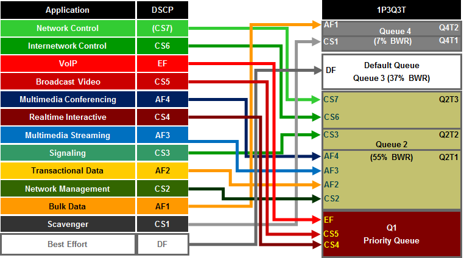

The following configuration provisioned by EasyQoS implements the 1P3Q3T
egress queuing structure. Comments have been added to the configuration
in order to explain each of the commands.

!

! Tunes Egress Queuing Buffers and Thresholds

mls qos queue-set output 1 buffers 15 30 35 20

! Allocates 15% for Q1-PQ; 30% for Q2; 35% for Q3-Default Queue; 20% for
Q4

mls qos queue-set output 1 threshold 1 100 100 100 100

! No WTD thresholds for PQ; reserve full 100% of buffers; no need to
borrow more

mls qos queue-set output 1 threshold 2 80 90 100 400

! Tunes Q2T1 for Call Signaling (CS); Tunes Q2T2 for Network Control
(NC);

! reserve full 100% of buffers; borrow up to 400% as needed

mls qos queue-set output 1 threshold 3 100 100 100 3200

! No WTD thresholds in BE queue (all packets have same CoS/DSCP weight
of 0);

! reserve full 100%; borrow max as needed

mls qos queue-set output 1 threshold 4 60 80 100 400

! Tunes Q4T1 for Scavenger (SCV); Tunes Q4T2 for Bulk Data (BD)

! Maps CoS to Egress Queues (although we're not trusting CoS with
APIC-EM;

! but for the sake of a comprehensive policy, this is included)

mls qos srr-queue output cos-map queue 1 threshold 3 4 5

! Maps Real-Time Interactive (RTI) and MM\_CONF (MMC) and

! Broadcast Video (BVI) and Voice (VO)to PQ

mls qos srr-queue output cos-map queue 2 threshold 1 2

! Maps Operations-Administration-Management (OAM) and Transactional Data
(TD) to Q2T1

mls qos srr-queue output cos-map queue 2 threshold 2 3

! Maps Call Signaling (CS) + Multimedia Streaming (MMS) to Q2T2

mls qos srr-queue output cos-map queue 2 threshold 3 6 7

! Maps Network Control (NC) to Q2T3

mls qos srr-queue output cos-map queue 4 threshold 3 1

! Maps BD + SCV to Q4 (tail)

! Maps DSCP to Egress Queues

mls qos srr-queue output DSCP-map queue 1 threshold 3 32 40 46

! Maps RTI + BV + VO (DSCP EF)

mls qos srr-queue output DSCP-map queue 2 threshold 1 16 18 20 22

mls qos srr-queue output DSCP-map queue 2 threshold 1 26 28 30 34 36 38

! Maps MMS + TD + MMC to Q2T1

mls qos srr-queue output DSCP-map queue 2 threshold 2 24

! Maps CS to Q2T2

mls qos srr-queue output DSCP-map queue 2 threshold 3 48 56

! Maps NC to Q2T3 (Per RFC 4594 NC = DSCP CS6/48; but this class also
includes

! CS7/56, which Cisco uses for internal DSCP of spanning tree & other
protocols)

mls qos srr-queue output DSCP-map queue 3 threshold 3 0 1 2 3 4 5 6 7

! Maps BE + non-standard DSCPs to Q3 (tail)

mls qos srr-queue output DSCP-map queue 3 threshold 3 9 11 13 15

mls qos srr-queue output DSCP-map queue 3 threshold 3 17 19 21 23

mls qos srr-queue output DSCP-map queue 3 threshold 3 25 27 29 31

mls qos srr-queue output DSCP-map queue 3 threshold 3 33 35 37 39

mls qos srr-queue output DSCP-map queue 3 threshold 3 41 42 43 44 45 47

mls qos srr-queue output DSCP-map queue 3 threshold 3 49 50 51 52 53 54
55

mls qos srr-queue output DSCP-map queue 3 threshold 3 57 58 59 60 61 62
63

! Maps non-standard DSCPs to Q3 (tail)

mls qos srr-queue output DSCP-map queue 4 threshold 1 8 14

! Maps SCV + BD (AF13) to Q4T1

mls qos srr-queue output DSCP-map queue 4 threshold 2 12

! Maps Bulk (AF12) to Q4T2

mls qos srr-queue output DSCP-map queue 4 threshold 3 10

! Maps Bulk (AF11) to Q4 (tail)

!

-  Note: APIC-EM release 1.5 and higher modifies the maximum buffers
   that the default queue (Q3) can borrow, if buffer space is available.
   Previously the maximum was set for 400%. With APIC-EM release 1.5 and
   higher, this has been increased to 3200%.

The above configuration maps CoS 4 and 5, as well as DSCP values 46
(EF), 40 (CS5), and 32 (CS4) to queue 1, threshold 3 (Q1T3). By default,
drop threshold 3 is set for 100% of the queue depth. Queue 1 is
configured as a strict priority queue within the interface configuration
show below. Queue 1 is allocated approximately 15% of the buffers.

CoS 7 and 6, as well as DSCP values 48 (CS6) and 56 (CS7) are mapped to
queue 2, threshold 3 (Q2T3), because these are considered to be control
traffic. Again, by default, drop threshold 3 is set for 100% of the
queue depth. CoS 3, as well as DSCP value 24 (CS3) is mapped to queue 2,
threshold 2 (Q2T2) with a drop threshold of 90% of the queue depth. CoS
2, as well as DSCP values 34 (AF41), 36 (AF42), 38 (AF43), 26 (AF31), 28
(AF32), 30 (AF30), 18 (AF21), 20 (AF22), 22 (AF23), and 16 (CS2) are
mapped to queue 2 threshold 1 (Q2T1) with a drop threshold of 80% of the
queue depth. Queue 2 is allocated approximately 30% of the buffers.

DSCP values 8 (CS1) and 14 (AF13) are mapped to queue 4 threshold 1
(Q4T1) with a drop threshold of 60%. DSCP value 12 (AF12) is mapped to
queue 4 threshold 2 (Q4T2) with a drop threshold of 80%. CoS 1, as well
as DSCP value 10 (AF11) is mapped to queue 4 threshold 3 (Q4T3) with a
default drop threshold of 100%. Queue 4 is allocated approximately 20%
of the buffers.

Finally all other CoS and DSCP values are mapped to queue 3, threshold 3
(Q3T3) with a default drop threshold of 100% of the queue depth. Queue 1
is configured for approximately 35% of the buffers.

In the configuration above, WTD is only applied to queues 2 and 4. Queue
1 is a priority queue, for real-time multimedia traffic, hence WTD is
not necessary. Queue 4 is the queue with default traffic, hence WTD is
not necessary there either.

The 1P3Q3T egress queuing structure is applied by EasyQoS to all
FastEthernet, GigabitEthernet, and TenGigabitEthernet interfaces, with
the following exception:

-  Interfaces which have been excluded from the QoS policy by the
   network operator, through the EasyQoS web-based GUI. This was
   discussed in the ***Policies*** section of the ***APIC-EM and the
   EasyQoS Application*** chapter.

An example of the provisioning to a single GigabitEthernet and single
TenGigabitEthernet interface is shown below.

!

interface GigabitEthernetx/x/x

no mls qos trust

! Default setting for access port interfaces (not explicitely
provisioned by EasyQoS)

queue-set 1

! Default queue set for access port interfaces (not explicitely
provisioned by EasyQoS)

srr-queue bandwidth share 1 55 37 7

! Sets the remaining queues to share the remaining bandwidth in a ratio
of

! 55, 37, and 7

! Queue 1 bandwidth ratio is ignored when priority queueing is enabled

priority-queue out

! Implements egress priority queuing for queue 1

interface TenGigabitEthernetx/x/x

mls qos trust DSCP

! Explicitly sets access interface to trust DSCP markings

queue-set 1

! Default queue set for access port interfaces (not explicitely
provisioned by EasyQoS)

srr-queue bandwidth share 1 55 37 7

! Sets the remaining queues to share the remaining bandwidth in a ratio
of

! 55, 37, and 7

! Queue 1 bandwidth ratio is ignored when priority queueing is enabled

priority-queue out

! Implements egress priority queuing for queue 1

!

Interfaces that connect to end-devices (access-edge ports) are set to
not trust DSCP or CoS markings (unless a Cisco Access Point is
connected). Interfaces that connect to distribution-layer switches
(uplink ports) are explicitly set to trust DSCP.

The bandwidth allocations within the EasyQoS GUI for Queuing Profiles
require the sum of the bandwidth percentages to total 100%. These
bandwidth allocations are absolute bandwidth percentages. Because the
1P3Q3T egress queuing policy implements a four-queue model in hardware
on these switch platforms, multiple traffic-classes are mapped to each
queue. The 1P3Q3T egress policy implements a low-latency queue via the
interface-level “priority-queue out” command. The Voice, Broadcast
Video, and Real-Time Interactive traffic-classes are mapped to the
priority queue within “mls qos srr-queue output dscp-map” definitions.
The priority queue on these platforms is unconstrained in terms of the
amount of bandwidth it can consume. Therefore, the bandwidth allocated
in the EasyQoS GUI within Queuing Profiles (default or custom) for these
three traffic-classes is not enforced on these platforms.

The remaining nine traffic-classes within the 1P3Q3T egress queuing
policy are mapped to the remaining three egress hardware queues.
Bandwidth allocation for these three queues is implemented as bandwidth
remaining ratios through the “srr-queue bandwidth share” interface-level
command. Bandwidth remaining refers to bandwidth remaining after
servicing the low-latency queue. Bandwidth ratio refers to the bandwidth
being allocated in a ratio of the numbers configured within the
“srr-queue bandwidth share” command. For example, the BW allocation
within the default CVD\_Queuing\_Profile is specified as follows:

srr-queue bandwidth share 1 55 37 7

The four numbers (1, 55, 37, and 7) refer to the amount of bandwidth
allocated to the PQ, Q2, Q3 (which is also the default queue) and Q4,
respectively. The first number is not used in the bandwidth allocation
if the “priority-queue out” command is configured on the interface and
can therefore be set to anything. Bandwidth is allocated to the
remaining three queues in a ratio of 55:37:7 in the example above. The
bandwidth allocation is shared—meaning that any given queue can use more
than its allocated share if one or more of the other queues is not
currently using their share and bandwidth is available.

The following table shows the mapping of the traffic-classes and
bandwidth allocations from the default EasyQoS CVD\_Queuing\_Profile to
the 1P3Q3T egress queuing structure.

1. Default Queuing Profile Mapping to 1P3Q3T Egress Queuing Policy

+---------------------------+----------------+---------------------------------------+-----------------------------------------------------+-------------------------------+------------------------------------------------------------------------------------------------------------------------------------------------------------------------------------------------+
| Traffic Class             | DSCP Marking   | BW % in the Default Queuing Profile   | BWR % Calculated from the Default Queuing Profile   | 1P3Q3T Egress Queue Mapping   | BWR % Allocation in 1P3Q3T Egress Queue                                                                                                                                                        |
+===========================+================+=======================================+=====================================================+===============================+================================================================================================================================================================================================+
| Voice                     | EF             | 10%                                   | N/A                                                 | Q1 (PQ)                       | PQ bandwidth is unconstrained and consists of traffic from the Voice, Broadcast Video, and Real-Time Interactive traffic-classes                                                               |
+---------------------------+----------------+---------------------------------------+-----------------------------------------------------+-------------------------------+------------------------------------------------------------------------------------------------------------------------------------------------------------------------------------------------+
| Broadcast Video           | CS5            | 10%                                   | N/A                                                 | Q1 (PQ)                       |                                                                                                                                                                                                |
+---------------------------+----------------+---------------------------------------+-----------------------------------------------------+-------------------------------+------------------------------------------------------------------------------------------------------------------------------------------------------------------------------------------------+
| Real-Time Interactive     | CS4            | 13%                                   | N/A                                                 | Q1 (PQ)                       |                                                                                                                                                                                                |
+---------------------------+----------------+---------------------------------------+-----------------------------------------------------+-------------------------------+------------------------------------------------------------------------------------------------------------------------------------------------------------------------------------------------+
| Multimedia Conferencing   | AF41           | 10%                                   | 15%                                                 | Q2                            | Sum of BWR for traffic-classes mapped to Q2 = 15% (Multimedia Conferencing) + 15% (Multimedia Streaming) + 4% (Network Control) + 3% (Signaling) + 3% (OAM) + 15% (Transactional Data) = 55%   |
+---------------------------+----------------+---------------------------------------+-----------------------------------------------------+-------------------------------+------------------------------------------------------------------------------------------------------------------------------------------------------------------------------------------------+
| Multimedia Streaming      | AF31           | 10%                                   | 15%                                                 | Q2                            |                                                                                                                                                                                                |
+---------------------------+----------------+---------------------------------------+-----------------------------------------------------+-------------------------------+------------------------------------------------------------------------------------------------------------------------------------------------------------------------------------------------+
| Network Control           | CS6            | 3%                                    | 4%                                                  | Q2                            |                                                                                                                                                                                                |
+---------------------------+----------------+---------------------------------------+-----------------------------------------------------+-------------------------------+------------------------------------------------------------------------------------------------------------------------------------------------------------------------------------------------+
| Signaling                 | CS3            | 2%                                    | 3%                                                  | Q2                            |                                                                                                                                                                                                |
+---------------------------+----------------+---------------------------------------+-----------------------------------------------------+-------------------------------+------------------------------------------------------------------------------------------------------------------------------------------------------------------------------------------------+
| OAM                       | CS2            | 2%                                    | 3%                                                  | Q2                            |                                                                                                                                                                                                |
+---------------------------+----------------+---------------------------------------+-----------------------------------------------------+-------------------------------+------------------------------------------------------------------------------------------------------------------------------------------------------------------------------------------------+
| Transactional Data        | AF21           | 10%                                   | 15%                                                 | Q2                            |                                                                                                                                                                                                |
+---------------------------+----------------+---------------------------------------+-----------------------------------------------------+-------------------------------+------------------------------------------------------------------------------------------------------------------------------------------------------------------------------------------------+
| Bulk Data                 | AF11           | 4%                                    | 6%                                                  | Q4                            | Sum of BWR for traffic-classes mapped to Q4 = 6% (Bulk Data) + 1% (Scavenger) = 7%                                                                                                             |
+---------------------------+----------------+---------------------------------------+-----------------------------------------------------+-------------------------------+------------------------------------------------------------------------------------------------------------------------------------------------------------------------------------------------+
| Scavenger                 | CS1            | 1%                                    | 1%                                                  | Q4                            |                                                                                                                                                                                                |
+---------------------------+----------------+---------------------------------------+-----------------------------------------------------+-------------------------------+------------------------------------------------------------------------------------------------------------------------------------------------------------------------------------------------+
| Best Effort               | Default        | 25%                                   | 37%                                                 | Q3                            | BWR for Best Effort traffic-class mapped to Q3 = 37%                                                                                                                                           |
+---------------------------+----------------+---------------------------------------+-----------------------------------------------------+-------------------------------+------------------------------------------------------------------------------------------------------------------------------------------------------------------------------------------------+

Column 3 of the table above shows the percentage bandwidth allocation
for each of the traffic-classes as it appears within the EasyQoS GUI for
the default CVD\_Queuing\_Profile. In the 1P3Q3T egress queuing policy,
the Voice, Broadcast Video, and Real-Time Interactive traffic-classes
are mapped to the PQ, as shown in column 5. The sum of the bandwidth
allocated to these three traffic-classes can be considered as the total
priority queue bandwidth (Total\_PQ\_BW), as shown in the following
formula.

Total\_PQ\_BW = Voice BW + Broadcast Video BW + Real-Time Interactive BW

Based on the bandwidth allocations in column 3 in the table above
Total\_PQ\_BW can be calculated as follows:

Total\_PQ\_BW = 10% (Voice BW) + 10% (Broadcast Video BW) + 13%
(Real-Time Interactive BW) = 33%

For the remaining nine traffic-classes the BWR percentages shown in
column 4 of the table above can be calculated based on the amount of
bandwidth allocated to each traffic class through the EasyQoS GUI, and
the amount of Total\_PQ\_BW calculated above. This can be done through
the following formula.

Traffic\_Class\_BWR = (Traffic\_Class\_BW / (100% – Total\_PQ\_BW)) \*
100

For example, BWR percentage for the Multimedia Conferencing traffic
class can be calculated as follows:

Multimedia\_Conferencing\_BWR = (10% / (100% – 33%)) \* 100 = 15% when
rounded

Finally, determining the bandwidth ratio allocated to each of the
non-priority queues within the 1P3Q3T egress queuing model is simply a
matter of summing the Traffic\_Class\_BWR numbers for the
traffic-classes that are mapped into a given queue. This is shown in
column 6 in the table above.

EtherChannel Configuration

When implementing an EtherChannel configuration on Catalyst 2K and 3K
Series switches, queuing policies are applied to the physical
interfaces. However, classification & marking policies are applied to
the logical port-channel associated with the physical interfaces that
make up the EtherChannel group. Because these switches are only
supported in the role of an access-layer switch for the EasyQoS
solution, no distribution-layer ingress classification & marking
policies are ever applied to the logical port-channel associated with
the physical interfaces that make up the EtherChannel group.

An example of the configuration pushed by EasyQoS to a Catalyst 2K and
3K Series switch when operating as an access-layer switch with
EtherChannel connectivity to the distribution-layer switch is shown
below.

!

interface Port-channelx

!

interface TenGigabitEthernety/y/y

srr-queue bandwidth share 1 55 37 7

priority-queue out

mls qos trust DSCP

channel-group x mode auto

!

Note that this configuration is no different than the configuration
shown earlier, when EtherChannel is not implemented. EtherChannel
interfaces could be GigabitEthernet interfaces or FastEthernet
interfaces as well, depending upon the type of interface supported by
the switch platform. A TenGigabitEthernet interface was shown only as an
example in the configuration above.

Custom Queuing Profiles with 1P3Q3T Egress Queuing

DSCP markings within custom Queuing Profiles are ignored for Catalyst 2K
and 3K series switches, as well as the SM-ES2 Series EtherSwitch module.
Instead, the DSCP markings per traffic-class from the default
CVD\_Queuing\_Profile are always used. The EasyQoS web-based GUI
provides a warning indicator of this to the network operator when
changing DSCP markings of traffic-classes within a custom Queuing
Profile.

Bandwidth allocations within custom Queuing Profiles do modify the
amount bandwidth allocated through the “srr-queue bandwidth share”
command applied to the physical interface of Catalyst 2K and 3K Series
switches, as well as the SM-ES2 Series EtherSwitch module.

Figure 37 in the ***Advanced Settings*** section of the ***APIC-EM and
the EasyQoS Application*** chapter showed an example custom Queuing
Profile named EasyQoS\_Lab\_Queuing\_Profile. The bandwidth allocations
for the 12 traffic-classes within the EasyQoS GUI for this Queuing
Profile (for 1 Gbps interfaces) are shown in column 3 of the following
table.

1. Example Custom Queuing Profile Mapping to 1P3Q3T Egress Queuing
   Policy

+---------------------------+----------------+---------------------------------------------------+---------------------------------------------------------+-------------------------------+--------------------------------------------------------------------------------------------------------------------------------------------------------------------------------------------------------------------------------------------------------------------------------------------+
| Traffic Class             | DSCP Marking   | BW % in the example EasyQoS Lab Queuing Profile   | BWR % Calculated from the EasyQoS Lab Queuing Profile   | 1P3Q3T Egress Queue Mapping   | BWR Allocation in 1P3Q3T Egress Queue                                                                                                                                                                                                                                                      |
+===========================+================+===================================================+=========================================================+===============================+============================================================================================================================================================================================================================================================================================+
| Voice                     | EF             | 5%                                                | N/A                                                     | Q1 (PQ)                       | PQ bandwidth is unconstrained and consists of traffic from the Voice, Broadcast Video, and Real-Time Interactive traffic-classes                                                                                                                                                           |
+---------------------------+----------------+---------------------------------------------------+---------------------------------------------------------+-------------------------------+--------------------------------------------------------------------------------------------------------------------------------------------------------------------------------------------------------------------------------------------------------------------------------------------+
| Broadcast Video           | CS5            | 5%                                                | N/A                                                     | Q1 (PQ)                       |                                                                                                                                                                                                                                                                                            |
+---------------------------+----------------+---------------------------------------------------+---------------------------------------------------------+-------------------------------+--------------------------------------------------------------------------------------------------------------------------------------------------------------------------------------------------------------------------------------------------------------------------------------------+
| Real-Time Interactive     | CS4            | 5%                                                | N/A                                                     | Q1 (PQ)                       |                                                                                                                                                                                                                                                                                            |
+---------------------------+----------------+---------------------------------------------------+---------------------------------------------------------+-------------------------------+--------------------------------------------------------------------------------------------------------------------------------------------------------------------------------------------------------------------------------------------------------------------------------------------+
| Multimedia Conferencing   | AF41           | 10%                                               | 12%                                                     | Q2                            | Sum of BWR for traffic-classes mapped to Q2 = 12% (Multimedia Conferencing) + 12% (Multimedia Streaming) + 4% (Network Control) + 4% (Signaling) + 9% (OAM) + 12% (Transactional Data) = 53% (Actual value configured within switch platforms is rounded down to 52% to reach 100% BWR.)   |
+---------------------------+----------------+---------------------------------------------------+---------------------------------------------------------+-------------------------------+--------------------------------------------------------------------------------------------------------------------------------------------------------------------------------------------------------------------------------------------------------------------------------------------+
| Multimedia Streaming      | AF31           | 10%                                               | 12%                                                     | Q2                            |                                                                                                                                                                                                                                                                                            |
+---------------------------+----------------+---------------------------------------------------+---------------------------------------------------------+-------------------------------+--------------------------------------------------------------------------------------------------------------------------------------------------------------------------------------------------------------------------------------------------------------------------------------------+
| Network Control           | CS6            | 3%                                                | 4%                                                      | Q2                            |                                                                                                                                                                                                                                                                                            |
+---------------------------+----------------+---------------------------------------------------+---------------------------------------------------------+-------------------------------+--------------------------------------------------------------------------------------------------------------------------------------------------------------------------------------------------------------------------------------------------------------------------------------------+
| Signaling                 | CS3            | 3%                                                | 4%                                                      | Q2                            |                                                                                                                                                                                                                                                                                            |
+---------------------------+----------------+---------------------------------------------------+---------------------------------------------------------+-------------------------------+--------------------------------------------------------------------------------------------------------------------------------------------------------------------------------------------------------------------------------------------------------------------------------------------+
| OAM                       | CS2            | 8%                                                | 9%                                                      | Q2                            |                                                                                                                                                                                                                                                                                            |
+---------------------------+----------------+---------------------------------------------------+---------------------------------------------------------+-------------------------------+--------------------------------------------------------------------------------------------------------------------------------------------------------------------------------------------------------------------------------------------------------------------------------------------+
| Transactional Data        | AF21           | 10%                                               | 12%                                                     | Q2                            |                                                                                                                                                                                                                                                                                            |
+---------------------------+----------------+---------------------------------------------------+---------------------------------------------------------+-------------------------------+--------------------------------------------------------------------------------------------------------------------------------------------------------------------------------------------------------------------------------------------------------------------------------------------+
| Bulk Data                 | AF11           | 10%                                               | 12%                                                     | Q4                            | Sum of BWR for traffic-classes mapped to Q4 = 12% (Bulk Data) + 1% (Scavenger) = 13%                                                                                                                                                                                                       |
+---------------------------+----------------+---------------------------------------------------+---------------------------------------------------------+-------------------------------+--------------------------------------------------------------------------------------------------------------------------------------------------------------------------------------------------------------------------------------------------------------------------------------------+
| Scavenger                 | CS1            | 1%                                                | 1%                                                      | Q4                            |                                                                                                                                                                                                                                                                                            |
+---------------------------+----------------+---------------------------------------------------+---------------------------------------------------------+-------------------------------+--------------------------------------------------------------------------------------------------------------------------------------------------------------------------------------------------------------------------------------------------------------------------------------------+
| Best Effort               | Default        | 30%                                               | 35%                                                     | Q3                            | BWR for Best Effort traffic-class mapped to Q3 = 35%                                                                                                                                                                                                                                       |
+---------------------------+----------------+---------------------------------------------------+---------------------------------------------------------+-------------------------------+--------------------------------------------------------------------------------------------------------------------------------------------------------------------------------------------------------------------------------------------------------------------------------------------+

The table above shows how changing the amount of bandwidth allocated to
each traffic class modifies the bandwidth ratios for the three
non-priority queues within the 1P3Q3T egress queuing model.

Based on the formula discussed previously, the new total priority queue
bandwidth (Total\_PQ\_BW) is calculated as follows:

Total\_PQ\_BW = 5% (Voice BW) + 5% (Broadcast Video BW) + 5% (Real-Time
Interactive BW) = 15%

For the remaining nine traffic-classes the BWR percentages shown in
column 4 of the table above can be calculated based on the amount of
bandwidth allocated to each traffic class through the EasyQoS GUI, and
the amount of Total\_PQ\_BW, through the following formula.

Traffic\_Class\_BWR = (Traffic\_Class\_BW / (100% – Total\_PQ\_BW)) \*
100

For example, the new BWR percentage for the Multimedia Conferencing
traffic class can be calculated as follows:

Multimedia\_Conferencing\_BWR = (10% / (100% – 15%)) \* 100 = 12% when
rounded

Finally, determining the new bandwidth ratio allocated to each of the
non-priority queues within the 1P3Q3T egress queuing model is simply a
matter of summing the Traffic\_Class\_BWR numbers for the
traffic-classes that are mapped into a given queue. This is shown in
column 6 in the table above.

-  Note: Some rounding may occur in calculating the bandwidth remaining
   ratios for the non-priority queues in the egress policies, based on
   the mapping of the bandwidth allocated to each traffic-class via the
   EasyQoS GUI within a custom Queuing Profile, and in achieving 100%
   BWR. These rounding discrepancies may result in the actual ratio
   configured within the switch being higher or lower by a percent or so
   from the output from the formulas presented in this section.

This results in the following bandwidth allocation ratio configured on
GigabitEthernet switch ports.

srr-queue bandwidth share 1 52 35 13

In the configuration example above, the bandwidth allocations have been
modified from the CVD\_Queuing\_Profile for 1 Gbps interface speeds.
When different bandwidth allocations are assigned to each of the
interface speeds within the EasyQoS GUI for custom Queuing Profiles,
EasyQoS will automatically calculate the appropriate bandwidth ratios
for the non-priority egress queues and apply them to the interface via
an “srr-queue bandwidth share” command, based on the interface speed. In
this manner, different bandwidth allocations for the traffic-classes can
be generated by EasyQoS for the various interface speeds supported by
the platform—all within a single custom Queuing Profile. The network
operator can use this flexibility in order to assign different bandwidth
allocations for uplink ports vs. access-edge ports within a single
custom Queuing Profile, if desired.

EasyQoS determines the interface speed based on the ifSpeed Object
Identifier (OID) within the SNMP Interfaces MIB (IF-MIB). This value can
also be displayed via a “show interface” exec-level command on the
Catalyst switch. An example is shown below.

AD1-2960-1#show int gig 2/0/1

GigabitEthernet2/0/1 is up, line protocol is up (connected)

Hardware is Gigabit Ethernet, address is f84f.57ee.9d01 (bia
f84f.57ee.9d01)

MTU 1500 bytes, **BW 1000000 Kbit/sec**, DLY 10 usec,

reliability 255/255, txload 1/255, rxload 1/255

Encapsulation ARPA, loopback not set

Keepalive set (10 sec)

Full-duplex, 1000Mb/s, media type is 10/100/1000BaseTX

input flow-control is off, output flow-control is unsupported

ARP type: ARPA, ARP Timeout 04:00:00

Last input 00:00:05, output 00:00:01, output hang never

Last clearing of "show interface" counters never

Input queue: 0/75/0/0 (size/max/drops/flushes); Total output drops: 0

Queueing strategy: fifo

Output queue: 0/40 (size/max)

30 second input rate 6000 bits/sec, 6 packets/sec

30 second output rate 17000 bits/sec, 4 packets/sec

29098826 packets input, 2364414813 bytes, 0 no buffer

Received 12316466 broadcasts (12316463 multicasts)

0 runts, 0 giants, 0 throttles

0 input errors, 0 CRC, 0 frame, 0 overrun, 0 ignored

0 watchdog, 12316463 multicast, 0 pause input

0 input packets with dribble condition detected

52964503 packets output, 20038284115 bytes, 0 underruns

0 output errors, 0 collisions, 2 interface resets

0 unknown protocol drops

0 babbles, 0 late collision, 0 deferred

0 lost carrier, 0 no carrier, 0 pause output

0 output buffer failures, 0 output buffers swapped out

For Catalyst 2K and 3K Series platforms and the SM-ES2 Series
EtherSwitch module, when a GigabitEthernet or FastEthernet interface is
administratively down or in a line-protocol down state, the default
bandwidth of the interface (interface speed) is 10 Mbps. This is
highlighted in the example output below.

AD1-2960-1#show int gig1/0/1

**GigabitEthernet1/0/1 is down, line protocol is down (notconnect)**

Hardware is Gigabit Ethernet, address is f84f.57ee.ab81 (bia
f84f.57ee.ab81)

Description: EtherChannel link to AD1-2960-1

MTU 1500 bytes, **BW 10000 Kbit/sec**, DLY 1000 usec,

reliability 255/255, txload 1/255, rxload 1/255

Encapsulation ARPA, loopback not set

Keepalive set (10 sec)

Auto-duplex, Auto-speed, media type is 10/100/1000BaseTX

input flow-control is off, output flow-control is unsupported

ARP type: ARPA, ARP Timeout 04:00:00

Last input 00:16:24, output 00:17:12, output hang never

Last clearing of "show interface" counters never

Input queue: 0/75/0/0 (size/max/drops/flushes); Total output drops: 0

Queueing strategy: fifo

Output queue: 0/40 (size/max)

30 second input rate 0 bits/sec, 0 packets/sec

30 second output rate 0 bits/sec, 0 packets/sec

28129991 packets input, 5130118196 bytes, 0 no buffer

Received 669103 broadcasts (669099 multicasts)

0 runts, 0 giants, 0 throttles

0 input errors, 0 CRC, 0 frame, 0 overrun, 0 ignored

0 watchdog, 669099 multicast, 0 pause input

0 input packets with dribble condition detected

If an EasyQoS policy is provisioned to a Catalyst 2K or 3K or SM-ES2
EtherSwitch Module that has FastEthernet or GigabitEthernet interfaces
in an administratively down or line-protocol down state, these
interfaces will receive the bandwidth allocations for the 10 Mbps
interface speed within the custom Queuing Profile.

Because changes to the network are often performed after hours in
specified “change windows,” and end-users often power down laptop and/or
desktop computers after hours, this could result in some access-edge
ports receiving the incorrect bandwidth allocations. A workaround for
this is to ensure that the bandwidth allocations for the 10 Mbps speed
within the custom Queuing Profile are the same as the 1 Gbps
(GigabitEthernet) and/or 100 Mbps (FastEthernet) speed within the custom
Queuing Profile. This will ensure that the access-edge switch ports
receive the same bandwidth allocations regardless of whether they are up
or down.

On some platforms, such as the Catalyst 3560-X Series,
TenGigabitEthernet interfaces may show an interface speed of 10 Mbps
when in an administratively down or line protocol down state as well.
Other platforms, such as the Catalyst 3750-X and 2960-XR,
TenGigabitEthernet interfaces may show an interface speed of 10 Gbps
when in an administratrively down or line protocol down state. Because
TenGigabitEthernet ports are typically used for uplink ports, and such
ports are always enabled, EasyQoS should provision the correct bandwidth
allocations based on the 10 Gbps speed within the custom Queuing Profile
for active uplink ports. If a new TenGigabitEthernet uplink port is
being provisioned on one of these platforms, perhaps as part of an
EtherChannel group, the EasyQoS policy may need to be re-applied after
bringing the new uplink port—in order to ensure the correct bandwidth
allocations are applied based on the interface speed and the custom
Queuing Profile.

If the bandwidth allocations for each of the traffic-classes within a
custom Queuing Profile is the same across all interface speeds (referred
to as All References within the EasyQoS GUI), EasyQoS will apply the
same bandwidth ratios for the non-priority egress queues to all of the
interfaces, regardless of whether they are up or down.

Ingress Queuing Design

Catalyst 3750-X, 3560-X, and Catalyst 2960-C Series switches also
support ingress queuing. Ingress queuing is a 1P1Q3T queuing structure.
The ingress queuing structure implements DSCP-to-queue mapping and WTD
for congestion avoidance. Although there are three WTD thresholds, only
two are configurable. The third threshold is by default set to the depth
of the queue (that is, 100% queue depth).

-  Note: Ingress queuing was not implemented by EasyQoS for the Catalyst
   3560-X Series platform in APIC-EM versions 1.3 and 1.4. However,
   Ingress queuing is implemented by EasyQoS for the Catalyst 3560-X
   series platform in APIC-EM version 1.5 and higher.

The following figure shows the 1P1Q3T ingress queuing model deployed by
EasyQoS.

1. 1P1Q3T Ingress Queuing for the Catalyst 3K / 2K Series Platforms

.. image:: media/image79.png

The following configuration implements the 1P1Q3T ingress queuing
structure deployed by EasyQoS.

!

! This section configures the ingress queues and thresholds

mls qos srr-queue input priority-queue 2 bandwidth 30

! Q2 is enabled as a strict-priority ingress queue with 30% BW

mls qos srr-queue input bandwidth 70 30

! Q1 is assigned 70% BW via SRR shared weights—Q2 SRR shared weight

! is ignored (as it has been configured as a PQ)

mls qos srr-queue input buffers 90 10

! Q1 is assigned 90% of queuing buffers and Q2 (PQ) is assigned 10%

mls qos srr-queue input threshold 1 80 90

! Q1 thresholds are configured at 80% (Q1T1) and 90% (Q1T2)

! This section configures the ingress CoS-to-Queue mappings

mls qos srr-queue input cos-map queue 1 threshold 1 0 1 2

! CoS values 0, 1 and 2 are mapped to Q1T1

mls qos srr-queue input cos-map queue 1 threshold 2 3

! CoS value 3 is mapped to ingress Q1T2

mls qos srr-queue input cos-map queue 1 threshold 3 6 7

! CoS values 6 and 7 are mapped to ingress Q1T3

mls qos srr-queue input cos-map queue 2 threshold 1 4 5

! CoS values 4 and 5 are mapped to ingress Q2 (the PQ)

! This section configures ingress DSCP-to-Queue Mappings

mls qos srr-queue input DSCP-map queue 1 threshold 1 0 8 10 12 14

mls qos srr-queue input DSCP-map queue 1 threshold 1 16 18 20 22

mls qos srr-queue input DSCP-map queue 1 threshold 1 26 28 30 34 36 38

! DSCP CS2 and AF2 are mapped to ingress Q1T1

mls qos srr-queue input DSCP-map queue 1 threshold 2 24

! DSCP CS3 is mapped to ingress Q1T2

mls qos srr-queue input DSCP-map queue 1 threshold 3 48 56

! DSCP CS6 and CS7 are mapped to ingress Q1T3 (the tail of Q1)

mls qos srr-queue input DSCP-map queue 2 threshold 3 32 40 46

! DSCP CS4, CS5 and EF are mapped to ingress Q2T3 (the tail of the PQ)

!

Custom Queuing Profiles do not apply to ingress queuing on the Catalyst
2K and 3K Series platforms. Bandwidth allocation for the ingress queues
is fixed.

The above configuration maps CoS 4 and 5, as well as DSCP values 46
(EF), 40 (CS5), and 32 (CS4) to queue 2, threshold 3 (Q2T3). By default,
drop threshold 3 is set for 100% of the queue depth. Queue 2 is
configured as a strict priority queue but is limited to 30% of the
bandwidth and 10% of the buffers.

CoS 7 and 6, as well as DSCP values 48 (CS6) and 56 (CS7) are mapped to
queue 1, threshold 3 (Q1T3), because these are considered to be control
traffic. Again, by default, drop threshold 3 is set for 100% of the
queue depth. CoS 3, as well as DSCP value 24 (CS3) is mapped to queue 1,
threshold 2 (Q1T2) with a drop threshold of 90% of the queue depth.
Finally, all other CoS and DSCP values are mapped to queue 1, threshold
1 (Q1T1) with a drop threshold of 80% of the queue depth. Queue 1 is
configured for approximately 70% of the bandwidth (because queue 2 is
limited to 30% of the bandwidth) and 90% of the buffers, because Q2 is a
strict priority queue and will be serviced first.

Catalyst 3650/3850 Queuing Design

This section discusses the egress queuing structure provisioned by
EasyQoS to the switch ports of Catalyst 3850 and 3650 Series switches.

Default 2P6Q3T Egress Queuing

Catalyst 3850 and 3650 Series switches support only egress queuing.
Within EasyQoS policies, a 2P6Q3T egress queuing structure is
implemented, with DSCP-to-queue mapping and WTD for congestion
avoidance. APIC-EM release 1.4 changed the default bandwidth allocations
for the 2P6Q3T egress queuing design. With APIC-EM release 1.5 and
higher, the bandwidth allocations are part of the CVD\_Queuing\_Profile
that is applied by default, unless the network operator applies a custom
Queuing Profile to the policy scope containing these switches.

The following figure shows the 2P6Q3T egress queuing model.

1. Default 2P6Q3T Egress Queuing for the Catalyst 3650 and 3850 Series
   Switches

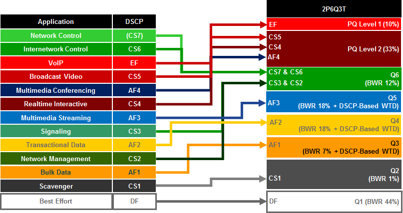

The following configuration, provisioned by EasyQoS, implements the
class-maps for the 2P6Q3T egress queuing structure.

!

class-map match-any prm-EZQOS\_2P6Q3T#VOICE-PQ1

match dscp ef

class-map match-any prm-EZQOS\_2P6Q3T#VIDEO-PQ2

match dscp cs4

match dscp af41

match dscp af42

match dscp af43

match dscp cs5

class-map match-any prm-EZQOS\_2P6Q3T#CONTROL-PLANE

match dscp cs2

match dscp cs3

match dscp cs6

match dscp cs7

class-map match-any prm-EZQOS\_2P6Q3T#MULTIMEDIA-STREAMING

match dscp af31

match dscp af32

match dscp af33

class-map match-any prm-EZQOS\_2P6Q3T#TRANSACTIONAL-DATA

match dscp af21

match dscp af22

match dscp af23

class-map match-any prm-EZQOS\_2P6Q3T#BULK-DATA

match dscp af11

match dscp af12

match dscp af13

class-map match-any prm-EZQOS\_2P6Q3T#SCAVENGER

match dscp cs1

!

The following configuration, provisioned by EasyQoS, implements the
default policy-map for the 2P6Q3T egress queuing structure.

!

policy-map prm-dscp#APIC\_QOS\_Q\_OUT

class prm-EZQOS\_2P6Q3T#VOICE-PQ1

priority level 1 percent 10

queue-buffers ratio 5

class prm-EZQOS\_2P6Q3T#VIDEO-PQ2

priority level 2 percent 33

queue-buffers ratio 5

class prm-EZQOS\_2P6Q3T#CONTROL-PLANE

bandwidth remaining percent 12

queue-buffers ratio 5

class prm-EZQOS\_2P6Q3T#MULTIMEDIA-STREAMING

bandwidth remaining percent 18

queue-buffers ratio 10

queue-limit dscp af31 percent 100

queue-limit dscp af32 percent 90

queue-limit dscp af33 percent 80

class prm-EZQOS\_2P6Q3T#TRANSACTIONAL-DATA

bandwidth remaining percent 18

queue-buffers ratio 10

queue-limit dscp af21 percent 100

queue-limit dscp af22 percent 90

queue-limit dscp af23 percent 80

class prm-EZQOS\_2P6Q3T#BULK-DATA

bandwidth remaining percent 7

queue-buffers ratio 20

queue-limit dscp af11 percent 100

queue-limit dscp af12 percent 90

queue-limit dscp af13 percent 80

class prm-EZQOS\_2P6Q3T#SCAVENGER

bandwidth remaining percent 1

queue-buffers ratio 5

class class-default

bandwidth remaining percent 44

queue-buffers ratio 40

!

APIC-EM release 1.6 makes a change to the buffer allocation for the
egress queuing policy. The following global configuration command is
also provisioned by EasyQoS as part of the QoS policy on Catalyst 3850
and 3650 Series switches.

qos queue-softmax-multiplier 1200

The “\ *qos queue-softmax-multiplier*\ ” command has a range from 100 to
1200, with the default setting being 100.

Catalyst 3850 and 3650 Series switches have a flexible, automatic buffer
allocation scheme consisting of hard buffers and soft buffers, referred
to as Dynamic Thresholding & Scaling (DTS). Hard buffers are dedicated
to priority queues. Soft buffers are not dedicated. They are allocated
as needed from a shared pool of buffers per ASIC across switch ports and
queues – with a minimum (softmin) and a maximum (softmax) value per
queue. With the default setting of the “qos queue-softmax-multiplier”,
each queue can use up to 400% of the default allocated buffers from a
shared common pool, if buffers are available. With the
softmax-multiplier set for 1200, each queue (with the exception of the
priority-level 1 queue) can use up to 400% x 1200% of the default
allocated buffers from the shared common pool, if buffers are available.
The overall effect of the change is to allow DTS to more efficiently
control the allocation of buffer space on the Catalyst 3850 or 3650
Series switch, by allowing the queues to use more buffer space if needed
and if the buffer space within the shared pool is available.

Note however that within APIC-EM release 1.6 the third drop-threshold
for the multimedia-streaming, transactional-data, and bulk-data
traffic-classes is specified at 100% of the queue-depth by the following
command:

queue-limit dscp afx1 percent 100

where “x” refer-streaming traffic-class, “2” (af21) for the
transactional-data traffic-class, or “1” (af11) for the bulk-data s to
the values “3” (af31) for the multimedia traffic class.

When the third drop-threshold is not specified on Catalyst 3850 or 3650
series switches, it defaults to 400%. This value corresponds to the
maximum soft queues (softmax) which can be allocated per queue. When the
third drop-threshold is explicitly set for 100%, it limits the maximum
amount of buffer space which DTS can allocate to the
multimedia-streaming, transactional-data, and bulk-data queues to 100% x
1200% of the default allocated buffers from the shared common pool, if
buffers are available. The softmax-multiplier command also does not
apply to the priority-level 1 queue.

The 2P6Q3T egress queuing structure is applied by EasyQoS to all
GigabitEthernet and TenGigabitEthernet interfaces, with the following
exceptions:

-  Interfaces which have been excluded from the QoS policy by the
   network operator, through the EasyQoS web-based GUI. This was
   discussed in the ***Policies*** section of the ***APIC-EM and the
   EasyQoS Application*** chapter.

-  Note: Interfaces configured as StackWise Virtual links (SVL) or
   Dual-Active-Detection links on Catalyst 3850 or Catalyst 3650 Series
   platforms do not support Qos. As of APIC-EM release 1.6, the network
   operator must exclude these interfaces from EasyQoS policy in order
   to prevent EasyQoS from attempting to provision QoS policy to these
   interfaces.

An example of the provisioning to a single GigabitEthernet and single
TenGigabitEthernet interface is shown below.

!

interface GigabitEthernetx/x/x

service-policy output prm-DSCP#APIC\_QOS\_Q\_OUT

!

interface TenGigabitEthernetx/x/x

service-policy output prm-DSCP#APIC\_QOS\_Q\_OUT

!

The Catalyst 3850 and 3650 Series platforms support two strict priority
queues. DSCP value EF (voice traffic) is assigned to the first priority
queue (prm-EZQOS\_2P6Q3T#VOICE-PQ1) which is allocated 10% of the
bandwidth. DSCP values CS5, CS4, AF41, AF42, and AF43 (broadcast video,
real-time interactive video, and multimedia conferencing traffic) are
assigned to the second priority queue (prm-EZQOS\_2P6Q3T#VIDEO-PQ2),
which is allocated 33% of the bandwidth. Both of these queues are
allocated only approximately 5% of the buffers because they are priority
queues. PQ1 is serviced first. If there are no packets in PQ1, then PQ2
is serviced. All other queues are serviced after the priority queues are
serviced.

-  Note: Due to Dynamic Thresholding & Scaling (DTS), buffer allocation
   is dynamic on the Catalyst 3850 / 3650 Series platforms – meaning
   that buffer allocation per queue can grow and shrink to meet demand,
   as long as the buffer space is available. Hence, buffer allocation
   more specifically sets the minimum soft (softmin) and hard (hardmin)
   buffers per queue.

DSCP values CS6, CS7, CS3, and CS2 are mapped to the
prm-EZQOS\_2P6Q3T#CONTROL-PLANE queue, which is allocated 12% of the
remaining bandwidth, after the priority queues are serviced. Because
this queue holds control traffic (CS6 and CS7), signaling traffic (CS3),
and OAM traffic (CS2), which is not expected to be a lot of traffic,
approximately 5% of the buffers are allocated to the queue. WTD
thresholds are not implemented for this queue because the objective is
not to drop any of this traffic.

DSCP values AF31, AF32, and AF33 are mapped to the
prm-EZQOS\_2P6Q3T#MULTIMEDIA-STREAMING queue, which is allocated
approximately 18% of the remaining bandwidth, after the priority queues
are serviced. Because AF classes are specifically intended for marking
down traffic, WTD is implemented within this traffic class. AF33 traffic
is set with a drop threshold of 80% of the buffer depth, AF32 traffic is
set with a drop threshold of 90% of the buffer depth, and AF31 traffic
implicitly has a drop threshold of 400% of the buffer depth.
Approximately 10% of the buffers are allocated to the queue.

DSCP values AF21, AF22, and AF23 are mapped to the
prm-EZQOS\_2P6Q3T#TRANSACTIONAL-DATA queue, which is allocated
approximately 18% of the remaining bandwidth, after the priority queues
are serviced. Because AF classes are specifically intended for marking
down traffic, WTD is implemented within this traffic class. AF23 traffic
is set with a drop threshold of 80% of the buffer depth, AF22 traffic is
set with a drop threshold of 90% of the buffer depth, and AF21 traffic
implicitly has a drop threshold of 400% of the buffer depth.
Approximately 10% of the buffers are allocated to the queue.

DSCP values AF11, AF12, and AF13 are mapped to the
prm-EZQOS\_2P6Q3T#BULK-DATA queue, which is allocated approximately 7%
of the remaining bandwidth, after the priority queues are serviced.
Because AF classes are specifically intended for marking down traffic,
WTD is implemented within this traffic class. AF13 traffic is set with a
drop threshold of 80% of the buffer depth, AF12 traffic is set with a
drop threshold of 90% of the buffer depth, and AF11 traffic implicitly
has a drop threshold of 400% of the buffer depth. Approximately 20% of
the buffers are allocated to the queue.

DSCP value CS1 is mapped to the prm-EZQOS\_2P6Q3T#SCAVENGER queue, which
is allocated approximately 1% of the remaining bandwidth, after the
priority queues are serviced. This is a scavenger class, specifically
intended for traffic that has a business relevancy of
business-irrelevant. WTD is not implemented within this tra\ **f**\ fic
class and approximately 5% of the buffers are allocated to the queue.

All other DSCP values are by default mapped to the class-default queue,
which is allocated approximately 44% of the remaining bandwidth, after
the priority queues are serviced. The default class is specifically
intended for traffic that has a business relevancy of default. WTD is
not implemented within this traffic class, and approximately 40% of the
buffers are allocated to the queue.

There are no mappings of CoS values to queues with the Catalyst 3850 and
3650 Series platforms. These platforms only fall back to the use of CoS
values for non-IP packets.

The bandwidth allocations within the EasyQoS GUI for Queuing Profiles
require the sum of the bandwidth percentages to total 100%. These
bandwidth allocations are absolute bandwidth percentages. Because the
2P6Q3T egress queuing policy implements an eight queue model in hardware
on these switch platforms, multiple traffic-classes may be mapped to a
single queue.

The following table shows the mapping of the traffic-classes and
bandwidth allocations from the default EasyQoS CVD\_Queuing\_Profile to
the 2P6Q3T egress queuing structure.

1. Default Queuing Profile Mapping to 2P6Q3T Egress Queuing Policy

+---------------------------+----------------+---------------------------------------+-----------------------------------------------------+-------------------------------+--------------------------------------------------------------------------------------------------------------------------------------------------------------------------------------------------------------------+
| Traffic Class             | DSCP Marking   | BW % in the Default Queuing Profile   | BWR % Calculated from the Default Queuing Profile   | 2P6Q3T Egress Queue Mapping   | BWR % Allocation in 2P6Q3T Egress Queue                                                                                                                                                                            |
+===========================+================+=======================================+=====================================================+===============================+====================================================================================================================================================================================================================+
| Voice                     | EF             | 10%                                   | N/A                                                 | Voice-PQ1                     | Voice-PQ1 bandwidth is constrained to 10%, and consists of traffic from the Voice traffic-class.                                                                                                                   |
+---------------------------+----------------+---------------------------------------+-----------------------------------------------------+-------------------------------+--------------------------------------------------------------------------------------------------------------------------------------------------------------------------------------------------------------------+
| Broadcast Video           | CS5            | 10%                                   | N/A                                                 | Video-PQ2                     | Video-PQ2 bandwidth is constrained to 33% and consists of traffic from the Broadcast Video, Real-Time Interactive, and Multimedia Conferencing traffic-classes.                                                    |
+---------------------------+----------------+---------------------------------------+-----------------------------------------------------+-------------------------------+--------------------------------------------------------------------------------------------------------------------------------------------------------------------------------------------------------------------+
| Real-Time Interactive     | CS4            | 13%                                   | N/A                                                 | Video-PQ2                     |                                                                                                                                                                                                                    |
+---------------------------+----------------+---------------------------------------+-----------------------------------------------------+-------------------------------+--------------------------------------------------------------------------------------------------------------------------------------------------------------------------------------------------------------------+
| Multimedia Conferencing   | AF41           | 10%                                   | N/A                                                 | Video-PQ2                     |                                                                                                                                                                                                                    |
+---------------------------+----------------+---------------------------------------+-----------------------------------------------------+-------------------------------+--------------------------------------------------------------------------------------------------------------------------------------------------------------------------------------------------------------------+
| Multimedia Streaming      | AF31           | 10%                                   | 18%                                                 | Multimedia-Streaming Queue    | BWR for traffic-class mapped to Multimedia-Streaming Queue = 18%                                                                                                                                                   |
+---------------------------+----------------+---------------------------------------+-----------------------------------------------------+-------------------------------+--------------------------------------------------------------------------------------------------------------------------------------------------------------------------------------------------------------------+
| Network Control           | CS6            | 3%                                    | 5%                                                  | Control-Plane Queue           | BWR for traffic-classes mapped to Control-Plane Queue = 5% (Network Control) + 4% (Signaling) + 4% (OAM) = 13%. (Actual value configured within switch platforms is rounded down to 12% to reach 100% BWR.)        |
+---------------------------+----------------+---------------------------------------+-----------------------------------------------------+-------------------------------+--------------------------------------------------------------------------------------------------------------------------------------------------------------------------------------------------------------------+
| Signaling                 | CS3            | 2%                                    | 4%                                                  | Control-Plane Queue           |                                                                                                                                                                                                                    |
+---------------------------+----------------+---------------------------------------+-----------------------------------------------------+-------------------------------+--------------------------------------------------------------------------------------------------------------------------------------------------------------------------------------------------------------------+
| OAM                       | CS2            | 2%                                    | 4%                                                  | Control-Plane Queue           |                                                                                                                                                                                                                    |
+---------------------------+----------------+---------------------------------------+-----------------------------------------------------+-------------------------------+--------------------------------------------------------------------------------------------------------------------------------------------------------------------------------------------------------------------+
| Transactional Data        | AF21           | 10%                                   | 18%                                                 | Transactional-Data Queue      | BWR for traffic-class mapped to Transactional-Data Queue = 18%                                                                                                                                                     |
+---------------------------+----------------+---------------------------------------+-----------------------------------------------------+-------------------------------+--------------------------------------------------------------------------------------------------------------------------------------------------------------------------------------------------------------------+
| Bulk Data                 | AF11           | 4%                                    | 7%                                                  | Bulk-Data Queue               | BWR for traffic-class mapped to Bulk-Data Queue = 7%                                                                                                                                                               |
+---------------------------+----------------+---------------------------------------+-----------------------------------------------------+-------------------------------+--------------------------------------------------------------------------------------------------------------------------------------------------------------------------------------------------------------------+
| Scavenger                 | CS1            | 1%                                    | 2%                                                  | Scavenger Queue               | BWR for traffic-class mapped to Scavenger Queue = 2% due to rounding to whole numbers in the formulas presented here. (Actual value configured within switch platforms is rounded down to 1% to reach 100% BWR.)   |
+---------------------------+----------------+---------------------------------------+-----------------------------------------------------+-------------------------------+--------------------------------------------------------------------------------------------------------------------------------------------------------------------------------------------------------------------+
| Best Effort               | Default        | 25%                                   | 44%                                                 | Default Queue                 | BWR for Best Effort traffic-class mapped to Default Queue = 44%                                                                                                                                                    |
+---------------------------+----------------+---------------------------------------+-----------------------------------------------------+-------------------------------+--------------------------------------------------------------------------------------------------------------------------------------------------------------------------------------------------------------------+

Column 3 of the table above shows the percentage bandwidth allocation
for each of the traffic-classes as it appears within the EasyQoS GUI for
the default CVD\_Queuing\_Profile. In the 2P6Q3T egress queuing policy,
the Voice traffic-class is mapped to PQ1-Voice, and the Broadcast Video,
Real-Time Interactive, and Multimedia-Conferencing traffic-classes are
mapped to the PQ2-Video, as shown in column 5. The sum of the bandwidth
allocated to these three traffic-classes can be considered as the total
priority queue bandwidth (Total\_PQ\_BW), as shown in the following
formula.

Total\_PQ\_BW = Voice BW + Broadcast Video BW + Real-Time Interactive BW
+ Multimedia Conferencing BW

Based on the bandwidth allocations in column 3 in the table above
Total\_PQ\_BW can be calculated as follows:

Total\_PQ\_BW = 10% (Voice) + 10% (Broadcast Video) + 13% (Real-Time
Interactive) + 10% (Multimedia Conferencing) = 43%

For the remaining eight traffic-classes the BWR percentages shown in
column 4 of the table above can be calculated based on the amount of
bandwidth allocated to each traffic class through the EasyQoS GUI and
the amount of Total\_PQ\_BW calculated above. This can be done through
the following formula.

Traffic\_Class\_BWR = (Traffic\_Class\_BW / (100% – Total\_PQ\_BW)) \*
100

For example, BWR percentage for the Multimedia Streaming traffic class
can be calculated as follows:

Multimedia\_Streaming\_BWR = (10% / (100% – 43%)) \* 100 = 18% when
rounded

Finally, determining the bandwidth ratio allocated to each of the
non-priority queues within the 2P6Q3T egress queuing model is simply a
matter of summing the Traffic\_Class\_BWR numbers for the
traffic-classes that are mapped into a given queue. This is shown in
column 6 in the table above.

EtherChannel Configuration

When implementing an EtherChannel connection on Catalyst 3850 and 3650
Series platforms, both queuing policies and classification & marking
policies are applied to the physical interfaces that make up the
EtherChannel group. An example of the configuration pushed by EasyQoS to
a Catalyst 3850 or 3650 Series switch when operating as a
distribution-layer switch with EtherChannel connectivity to the
access-layer switch is shown below.

!

interface Port-channelx

!

interface TenGigabitEthernety/y/y

channel-group x mode auto

service-policy input APIC\_EM-MARKING-DIST-IN

service-policy output prm-DSCP#APIC\_QOS\_Q\_OUT

!

Custom Queuing Profiles

EasyQoS within APIC-EM release 1.5 and higher provides the network
operator the ability to change the both the DSCP marking and the
bandwidth allocation of traffic-classes through custom Queuing Profiles
in the web-based GUI. This feature was discussed in the ***Advanced
Settings*** section of the ***APIC-EM and the EasyQoS Application***
chapter. Figures 36 and 37 showed an example custom Queuing Profile
named EasyQoS\_Lab\_Queuing\_Profile. The bandwidth allocations for the
12 traffic-classes for this example Queuing Profile (for 1 Gbps
interfaces) are shown in column 3 of the following table. Likewise, the
DSCP markings for the 12 traffic-classes are shown in column 2.

1. Example Custom Queuing Profile Mapping to 2P6Q3T Egress Queuing
   Policy

+---------------------------+----------------+---------------------------------------------------+---------------------------------------------------------+-------------------------------+-------------------------------------------------------------------------------------------------------------------------------------------------------------------+
| Traffic Class             | DSCP Marking   | BW % in the example EasyQoS Lab Queuing Profile   | BWR % Calculated from the EasyQoS Lab Queuing Profile   | 2P6Q3T Egress Queue Mapping   | BWR % Allocation in 2P6Q3T Egress Queue                                                                                                                           |
+===========================+================+===================================================+=========================================================+===============================+===================================================================================================================================================================+
| Voice                     | EF             | 5%                                                | N/A                                                     | Voice-PQ1                     | Voice-PQ1 bandwidth is constrained to 5% and consists of traffic from the Voice traffic-class.                                                                    |
+---------------------------+----------------+---------------------------------------------------+---------------------------------------------------------+-------------------------------+-------------------------------------------------------------------------------------------------------------------------------------------------------------------+
| Broadcast Video           | CS3            | 5%                                                | N/A                                                     | Video-PQ2                     | Video-PQ2 bandwidth is constrained to 20% and consists of traffic from the Broadcast Video, Real-Time Interactive, and Multimedia Conferencing traffic-classes.   |
+---------------------------+----------------+---------------------------------------------------+---------------------------------------------------------+-------------------------------+-------------------------------------------------------------------------------------------------------------------------------------------------------------------+
| Real-Time Interactive     | CS4            | 5%                                                | N/A                                                     | Video-PQ2                     |                                                                                                                                                                   |
+---------------------------+----------------+---------------------------------------------------+---------------------------------------------------------+-------------------------------+-------------------------------------------------------------------------------------------------------------------------------------------------------------------+
| Multimedia Conferencing   | AF41           | 10%                                               | N/A                                                     | Video-PQ2                     |                                                                                                                                                                   |
+---------------------------+----------------+---------------------------------------------------+---------------------------------------------------------+-------------------------------+-------------------------------------------------------------------------------------------------------------------------------------------------------------------+
| Multimedia Streaming      | AF31           | 10%                                               | 13%                                                     | Multimedia-Streaming Queue    | BWR for traffic-class mapped to Multimedia-Streaming Queue = 13%                                                                                                  |
+---------------------------+----------------+---------------------------------------------------+---------------------------------------------------------+-------------------------------+-------------------------------------------------------------------------------------------------------------------------------------------------------------------+
| Network Control           | CS6            | 3%                                                | 4%                                                      | Control-Plane Queue           | BWR for traffic-classes mapped to Control-Plane Queue = 4% (Network Control) + 4% (Signaling) + 11% (OAM) = 19%                                                   |
+---------------------------+----------------+---------------------------------------------------+---------------------------------------------------------+-------------------------------+-------------------------------------------------------------------------------------------------------------------------------------------------------------------+
| Signaling                 | CS5            | 3%                                                | 4%                                                      | Control-Plane Queue           |                                                                                                                                                                   |
+---------------------------+----------------+---------------------------------------------------+---------------------------------------------------------+-------------------------------+-------------------------------------------------------------------------------------------------------------------------------------------------------------------+
| OAM                       | CS2            | 8%                                                | 11%                                                     | Control-Plane Queue           |                                                                                                                                                                   |
+---------------------------+----------------+---------------------------------------------------+---------------------------------------------------------+-------------------------------+-------------------------------------------------------------------------------------------------------------------------------------------------------------------+
| Transactional Data        | AF21           | 10%                                               | 13%                                                     | Transactional-Data Queue      | BWR for traffic-class mapped to Transactional-Data Queue = 13%                                                                                                    |
+---------------------------+----------------+---------------------------------------------------+---------------------------------------------------------+-------------------------------+-------------------------------------------------------------------------------------------------------------------------------------------------------------------+
| Bulk Data                 | AF11           | 10%                                               | 13%                                                     | Bulk-Data Queue               | BWR for traffic-class mapped to Bulk-Data Queue = 13%                                                                                                             |
+---------------------------+----------------+---------------------------------------------------+---------------------------------------------------------+-------------------------------+-------------------------------------------------------------------------------------------------------------------------------------------------------------------+
| Scavenger                 | CS1            | 1%                                                | 1%                                                      | Scavenger Queue               | BWR for traffic-class mapped to Scavenger Queue = 1%                                                                                                              |
+---------------------------+----------------+---------------------------------------------------+---------------------------------------------------------+-------------------------------+-------------------------------------------------------------------------------------------------------------------------------------------------------------------+
| Best Effort               | Default        | 30%                                               | 40%                                                     | Default Queue                 | BWR for Best Effort traffic-class mapped to Default Queue = 40% (Actual value configured within switch platforms is rounded up to 41% to reach 100% BWR.)         |
+---------------------------+----------------+---------------------------------------------------+---------------------------------------------------------+-------------------------------+-------------------------------------------------------------------------------------------------------------------------------------------------------------------+

Changing the DSCP markings of traffic-classes within the EasyQoS
web-based GUI affects the “match dscp” statements of class-map
definitions within the egress queuing policy of Catalyst 3850 and 3650
Series switches. The following output is an example of the modification
of the class-map definitions provisioned by EasyQoS, based upon the DSCP
markings from the EasyQoS\_Lab\_Queuing Profile, shown in the table
above. The affected class-map definitions are highlighted in bold.

!

class-map match-any prm-EZQOS\_2P6Q3T#VOICE-PQ1

match dscp ef

**class-map match-any prm-EZQOS\_2P6Q3T#VIDEO-PQ2**

match dscp cs4

match dscp af41

match dscp af42

match dscp af43

**match dscp cs3**

**class-map match-any prm-EZQOS\_2P6Q3T#CONTROL-PLANE**

match dscp cs2

**match dscp cs5**

match dscp cs6

match dscp cs7

class-map match-any prm-EZQOS\_2P6Q3T#MULTIMEDIA-STREAMING

match dscp af31

match dscp af32

match dscp af33

class-map match-any prm-EZQOS\_2P6Q3T#TRANSACTIONAL-DATA

match dscp af21

match dscp af22

match dscp af23

class-map match-any prm-EZQOS\_2P6Q3T#BULK-DATA

match dscp af11

match dscp af12

match dscp af13

class-map match-any prm-EZQOS\_2P6Q3T#SCAVENGER

match dscp cs1

!

As can be seen by comparing the class-map definitions between the
default Queuing Profile (CVD\_Queuing\_Profile) and the
EasyQoS\_Lab\_Queuing Profile, the Video-PQ2 queue which services the
Broadcast Video traffic-class matches on CS3 instead of CS5, and the
Control-Plane queue which services the Signaling traffic-class matches
on CS5 instead of CS3.

Bandwidth allocations within custom Queuing Profiles modify the amount
bandwidth allocated through the “priority level x percent” or “bandwidth
remaining percent” commands within the egress queuing policy-map applied
to physical interfaces of Catalyst 3850 and 3650 Series switches.

The table above shows how changing the amount of bandwidth allocated to
each traffic class modifies the bandwidth allocated to the two priority
queues and six non-priority queues within the 2P6Q3T egress queuing
model.

Based on the formula discussed previously, the new total priority queue
bandwidth (Total\_PQ\_BW) is calculated as follows:

Total\_PQ\_BW = 5% (Voice BW) + 5% (Broadcast Video BW) + 5% (Real-Time
Interactive BW) + 10% (Multimedia Conferencing BW) = 25%

For the remaining nine traffic-classes the BWR percentages shown in
column 4 of the table above can be calculated based on the amount of
bandwidth allocated to each traffic class through the EasyQoS GUI, and
the amount of Total\_PQ\_BW, through the following formula.

Traffic\_Class\_BWR = (Traffic\_Class\_BW / (100% – Total\_PQ\_BW)) \*
100

For example, the new BWR percentage for the Multimedia Streaming traffic
class can be calculated as follows:

Multimedia\_Streaming\_BWR = (10% / (100% – 25%)) \* 100 = 13% when
rounded

Finally, determining the new bandwidth ratio allocated to each of the
non-priority queues within the 2P6Q3T egress queuing model is simply a
matter of summing the Traffic\_Class\_BWR numbers for the
traffic-classes that are mapped into a given queue. This is shown in
column 6 in the table above.

This results in the following policy-map definition when deployed on a
Catalyst 3850 or 3650 Series platform.

!

policy-map prm-dscp#APIC\_QOS\_Q\_OUT#1G

class prm-EZQOS\_2P6Q3T#VOICE-PQ1

priority level 1 percent 5

queue-buffers ratio 5

class prm-EZQOS\_2P6Q3T#VIDEO-PQ2

priority level 2 percent 20

queue-buffers ratio 5

class prm-EZQOS\_2P6Q3T#CONTROL-PLANE

bandwidth remaining percent 19

queue-buffers ratio 5

class prm-EZQOS\_2P6Q3T#MULTIMEDIA-STREAMING

bandwidth remaining percent 13

queue-buffers ratio 10

queue-limit dscp af31 percent 100

queue-limit dscp af32 percent 90

queue-limit dscp af33 percent 80

class prm-EZQOS\_2P6Q3T#TRANSACTIONAL-DATA

bandwidth remaining percent 13

queue-buffers ratio 10

queue-limit dscp af21 percent 100

queue-limit dscp af22 percent 90

queue-limit dscp af23 percent 80

class prm-EZQOS\_2P6Q3T#BULK-DATA

bandwidth remaining percent 13

queue-buffers ratio 20

queue-limit dscp af11 percent 100

queue-limit dscp af12 percent 90

queue-limit dscp af13 percent 80

class prm-EZQOS\_2P6Q3T#SCAVENGER

bandwidth remaining percent 1

queue-buffers ratio 5

class class-default

bandwidth remaining percent 41

queue-buffers ratio 40

!

In the configuration example above, the bandwidth allocations have been
modified from the CVD\_Queuing\_Profile for 1 Gbps interface speeds.
When different bandwidth allocations are assigned to each of the
interface speeds within the EasyQoS GUI for custom Queuing Profiles,
EasyQoS will append the interface speed to the name of the policy-map
generated. This differentiates the policy-map for that particular
interface speed. For example, the policy-map name in the configuration
above has been changed from “policy-map prm-DSCP#APIC\_QOS\_Q\_OUT” to
“policy-map prm-dscp#APIC\_QOS\_Q\_OUT#1G” indicating this policy-map is
to be applied to 1 Gbps interfaces. In this manner, different
policy-maps with different bandwidth allocations for the traffic-classes
can be generated by EasyQoS for the various interface speeds supported
by the platform—all within a single custom Queuing Profile. The network
operator can use this flexibility in order to assign different bandwidth
allocations for uplink ports vs. access-edge ports within a single
custom Queuing Profile, if desired.

If the bandwidth allocations for each of the traffic-classes within a
custom Queuing Profile is the same across all interface speeds (referred
to as All References within the EasyQoS GUI), EasyQoS will optimize the
configuration, and create a single policy-map with the name “policy-map
prm-DSCP#APIC\_QOS\_Q\_OUT” with the bandwidth allocations specified
within the custom Queuing Profile.

EasyQoS determines the interface speed based on the OID within the SNMP
IF-MIB. This value can also be displayed via a “show interface”
exec-level command on the Catalyst switch. An example is shown below.

AD1-3850-1#show interfaces GigabitEthernet 1/0/10

GigabitEthernet1/0/10 is down, line protocol is down (notconnect)

Hardware is Gigabit Ethernet, address is 1ce8.5d17.e78a (bia
1ce8.5d17.e78a)

MTU 1500 bytes, **BW 1000000** Kbit/sec, DLY 10 usec,

reliability 255/255, txload 1/255, rxload 1/255

Encapsulation ARPA, loopback not set

Keepalive set (10 sec)

Auto-duplex, Auto-speed, media type is 10/100/1000BaseTX

input flow-control is off, output flow-control is unsupported

ARP type: ARPA, ARP Timeout 04:00:00

Last input never, output never, output hang never

Last clearing of "show interface" counters never

Input queue: 0/2000/0/0 (size/max/drops/flushes); Total output drops: 0

Queueing strategy: Class-based queueing

Output queue: 0/40 (size/max)

30 second input rate 0 bits/sec, 0 packets/sec

30 second output rate 0 bits/sec, 0 packets/sec

0 packets input, 0 bytes, 0 no buffer

Received 0 broadcasts (0 multicasts)

0 runts, 0 giants, 0 throttles

0 input errors, 0 CRC, 0 frame, 0 overrun, 0 ignored

0 watchdog, 0 multicast, 0 pause input

0 input packets with dribble condition detected

0 packets output, 0 bytes, 0 underruns

0 output errors, 0 collisions, 1 interface resets

0 unknown protocol drops

0 babbles, 0 late collision, 0 deferred

0 lost carrier, 0 no carrier, 0 pause output

0 output buffer failures, 0 output buffers swapped out

For Catalyst 3850 and 3650 Series platforms when a GigabitEthernet
interface is administratively down or in a line-protocol down state, the
default bandwidth of the interface (interface speed) is 1 Gbps.
Likewise, when a TenGigabitEthernet interface is administratively down
or in a line-down protocol state, the default bandwidth of the interface
(interface speed) is 10 Gbps. Therefore, if an EasyQoS policy is
provisioned to a Catalyst 3850 or 3650 Series switch which has
GigabitEthernet or TenGigabitEthernet interfaces in an administratively
down or line-protocol down state, all interfaces should still receive
the bandwidth allocations for their respective speeds within the custom
Queuing Profile, regardless of whether they are up or down.

Catalyst 4500 Queuing Design

This section discusses the egress queuing structure provisioned by
APIC-EM to the ports of each of the line cards and supervisors supported
by EasyQoS for the Catalyst 4500-E Series and Catalyst 4500-X Series
switches.

Default 1P7Q1T Egress Queuing

Catalyst 4500-E Series switches with Supervisor 7-E, 7-LE, 8-E, and
8-LE; and Catalyst 4500-X Series switches support only egress queuing.
The 1P7Q1T egress queuing structure for the Catalyst 4500-E and Catalyst
4500-X Series implements DSCP-to-queue mapping and Dynamic Buffer
Limiting (DBL) for congestion avoidance instead of DSCP-based WRED or
WTD. APIC-EM release 1.4 changed the default bandwidth allocations for
the 1P7Q1T egress queuing design. With APIC-EM release 1.5 and higher,
the default bandwidth allocations are part of the CVD\_QUEUING\_PROFILE
that is applied by default, unless the network operator applies a custom
Queuing Profile to the policy scope containing these switches.

The following figure shows the default 1P7Q1T egress queueing model.

1. Default 1P7Q1T+DBL Egress Queuing for the Catalyst 4500 Series

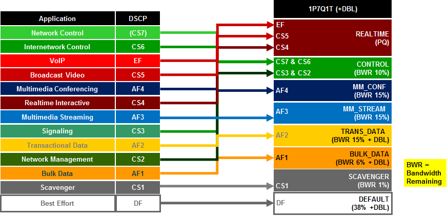

The following configuration, provisioned by EasyQoS, implements the
default class-maps for the 1P7Q1T egress queuing structure.

!

class-map match-any prm-EZQOS\_1P7Q1T#REALTIME

match dscp cs4

match dscp cs5

match dscp ef

class-map match-any prm-EZQOS\_1P7Q1T#CONTROL

match dscp cs2

match dscp cs3

match dscp cs6

match dscp cs7

class-map match-any prm-EZQOS\_1P7Q1T#MM\_CONF

match dscp af41

match dscp af42

match dscp af43

class-map match-any prm-EZQOS\_1P7Q1T#MM\_STREAM

match dscp af31

match dscp af32

match dscp af33

class-map match-any prm-EZQOS\_1P7Q1T#TRANS\_DATA

match dscp af21

match dscp af22

match dscp af23

class-map match-any prm-EZQOS\_1P7Q1T#BULK\_DATA

match dscp af11

match dscp af12

match dscp af13

class-map match-any prm-EZQOS\_1P7Q1T#SCAVENGER

match dscp cs1

!

The following configuration, provisioned by EasyQoS, implements the
default policy-map for the 1P7Q1T egress queuing structure.

!

policy-map prm-DSCP#APIC\_QOS\_Q\_OUT

class prm-EZQOS\_1P7Q1T#REALTIME

priority

class prm-EZQOS\_1P7Q1T#CONTROL

bandwidth remaining percent 10

class prm-EZQOS\_1P7Q1T#MM\_CONF

bandwidth remaining percent 15

class prm-EZQOS\_1P7Q1T#MM\_STREAM

bandwidth remaining percent 15

class prm-EZQOS\_1P7Q1T#TRANS\_DATA

bandwidth remaining percent 15

dbl

class prm-EZQOS\_1P7Q1T#BULK\_DATA

bandwidth remaining percent 6

dbl

class prm-EZQOS\_1P7Q1T#SCAVENGER

bandwidth remaining percent 1

class class-default

bandwidth remaining percent 38

dbl

!

The 1P7Q1T egress queuing structure is applied by EasyQoS to all
GigabitEthernet and TenGigabitEthernet interfaces, with the following
exception:

-  Interfaces which have been excluded from the QoS policy by the
   network operator, through the EasyQoS web-based GUI. This was
   discussed in the ***Policies*** section of the ***APIC-EM and the
   EasyQoS Application*** chapter.

An example of the provisioning to a single GigabitEthernet and single
TenGigabitEthernet interface is shown below.

!

interface GigabitEthernetx/x/x

service-policy output prm-DSCP#APIC\_QOS\_Q\_OUT

!

interface TenGigabitEthernetx/x/x

service-policy output prm-DSCP#APIC\_QOS\_Q\_OUT

!

In the configuration above, DBL is only applied to the transactional
data, bulk data, and default queues. DBL has a congestion-avoidance
function, similar to WRED in that it can help prevent synchronization of
TCP flows that result in under-utilization of the available bandwidth.
DBL is not recommended to be deployed on real-time multimedia and
control queues. DBL is not deployed on the scavenger queue, simply
because the traffic is already considered to be scavenger traffic using
whatever bandwidth is available.

The bandwidth allocations within the EasyQoS GUI for Queuing Profiles
require the sum of the bandwidth percentages to total 100%. These
bandwidth allocations are absolute bandwidth percentages. The EasyQoS
egress queuing policy on the Catalyst 4500 Series platforms implements a
single priority queue. The priority queue is unconstrained in terms of
the amount of bandwidth it can consume. Because the 1P7Q1T egress
queuing policy implements an eight-queue model in hardware on these
switch platforms, multiple traffic-classes may be mapped to a single
queue.

The following table shows the mapping of the traffic-classes and
bandwidth allocations from the default EasyQoS CVD\_Queuing\_Profile to
the 1P7Q1T egress queuing structure.

1. Default Queuing Profile Mapping to 1P7Q1T Egress Queuing Policy

+---------------------------+----------------+---------------------------------------+-----------------------------------------------------+-------------------------------+--------------------------------------------------------------------------------------------------------------------------------------------------------------+
| Traffic Class             | DSCP Marking   | BW % in the Default Queuing Profile   | BWR % Calculated from the Default Queuing Profile   | 1P7Q1T Egress Queue Mapping   | BWR % Allocation in 1P7Q1T Egress Queue                                                                                                                      |
+===========================+================+=======================================+=====================================================+===============================+==============================================================================================================================================================+
| Voice                     | EF             | 10%                                   | N/A                                                 | REALTIME                      | REALTIME priority queue bandwidth is unconstrained and consists of traffic from the Voice, Broadcast Video, and Real-Time Interactive traffic-classes.       |
+---------------------------+----------------+---------------------------------------+-----------------------------------------------------+-------------------------------+--------------------------------------------------------------------------------------------------------------------------------------------------------------+
| Broadcast Video           | CS5            | 10%                                   | N/A                                                 | REALTIME                      |                                                                                                                                                              |
+---------------------------+----------------+---------------------------------------+-----------------------------------------------------+-------------------------------+--------------------------------------------------------------------------------------------------------------------------------------------------------------+
| Real-Time Interactive     | CS4            | 13%                                   | N/A                                                 | REALTIME                      |                                                                                                                                                              |
+---------------------------+----------------+---------------------------------------+-----------------------------------------------------+-------------------------------+--------------------------------------------------------------------------------------------------------------------------------------------------------------+
| Multimedia Conferencing   | AF41           | 10%                                   | 15%                                                 | MM\_CONF                      | BWR for traffic-class mapped to Multimedia-Conferencing Queue = 15%                                                                                          |
+---------------------------+----------------+---------------------------------------+-----------------------------------------------------+-------------------------------+--------------------------------------------------------------------------------------------------------------------------------------------------------------+
| Multimedia Streaming      | AF31           | 10%                                   | 15%                                                 | MM\_STREAM                    | BWR for traffic-class mapped to Multimedia-Streaming Queue = 15%                                                                                             |
+---------------------------+----------------+---------------------------------------+-----------------------------------------------------+-------------------------------+--------------------------------------------------------------------------------------------------------------------------------------------------------------+
| Network Control           | CS6            | 3%                                    | 4%                                                  | CONTROL                       | BWR for traffic-classes mapped to Control-Plane Queue = 4% (Network Control) + 3% (Signaling) + 3% (OAM) = 10%.                                              |
+---------------------------+----------------+---------------------------------------+-----------------------------------------------------+-------------------------------+--------------------------------------------------------------------------------------------------------------------------------------------------------------+
| Signaling                 | CS3            | 2%                                    | 3%                                                  | CONTROL                       |                                                                                                                                                              |
+---------------------------+----------------+---------------------------------------+-----------------------------------------------------+-------------------------------+--------------------------------------------------------------------------------------------------------------------------------------------------------------+
| OAM                       | CS2            | 2%                                    | 3%                                                  | CONTROL                       |                                                                                                                                                              |
+---------------------------+----------------+---------------------------------------+-----------------------------------------------------+-------------------------------+--------------------------------------------------------------------------------------------------------------------------------------------------------------+
| Transactional Data        | AF21           | 10%                                   | 15%                                                 | TRANS\_DATA                   | BWR for traffic-class mapped to Transactional-Data Queue = 15%                                                                                               |
+---------------------------+----------------+---------------------------------------+-----------------------------------------------------+-------------------------------+--------------------------------------------------------------------------------------------------------------------------------------------------------------+
| Bulk Data                 | AF11           | 4%                                    | 6%                                                  | BULK\_DATA                    | BWR for traffic-class mapped to Bulk-Data Queue = 6%.                                                                                                        |
+---------------------------+----------------+---------------------------------------+-----------------------------------------------------+-------------------------------+--------------------------------------------------------------------------------------------------------------------------------------------------------------+
| Scavenger                 | CS1            | 1%                                    | 1%                                                  | SCAVENGER                     | BWR for traffic-class mapped to Scavenger Queue = 1%                                                                                                         |
+---------------------------+----------------+---------------------------------------+-----------------------------------------------------+-------------------------------+--------------------------------------------------------------------------------------------------------------------------------------------------------------+
| Best Effort               | Default        | 25%                                   | 37%                                                 | Default Queue                 | BWR for Best Effort traffic-class mapped to Default Queue = 37%. (Actual value configured within switch platforms is rounded up to 38% to reach 100% BWR.)   |
+---------------------------+----------------+---------------------------------------+-----------------------------------------------------+-------------------------------+--------------------------------------------------------------------------------------------------------------------------------------------------------------+

Column 3 of the table above shows the percentage bandwidth allocation
for each of the traffic-classes as it appears within the EasyQoS GUI for
the default CVD\_Queuing\_Profile. In the 1P7Q1T egress queuing policy,
the Voice, Broadcast Video, and Real-Time Interactive traffic-classes
are mapped to the single REALTIME priority queue, as shown in column 5.
The sum of the bandwidth allocated to these three traffic-classes can be
considered as the total priority queue bandwidth (Total\_PQ\_BW), as
shown in the following formula.

Total\_PQ\_BW = Voice BW + Broadcast Video BW + Real-Time Interactive BW

Based on the bandwidth allocations in column 3 in the table above
Total\_PQ\_BW can be calculated as follows:

Total\_PQ\_BW = 10% (Voice) + 10% (Broadcast Video) + 13% (Real-Time
Interactive) = 33%

For the remaining nine traffic-classes the BWR percentages shown in
column 4 of the table above can be calculated based on the amount of
bandwidth allocated to each traffic class through the EasyQoS GUI and
the amount of Total\_PQ\_BW calculated above. This can be done through
the following formula.

Traffic\_Class\_BWR = (Traffic\_Class\_BW / (100% – Total\_PQ\_BW)) \*
100

For example, BWR percentage for the Multimedia Streaming traffic class
can be calculated as follows:

Multimedia\_Conferencing\_BWR = (10% / (100% – 33%)) \* 100 = 15% when
rounded

Finally, determining the bandwidth ratio allocated to each of the
non-priority queues within the 1P7Q1T egress queuing model is simply a
matter of summing the Traffic\_Class\_BWR numbers for the
traffic-classes that are mapped into a given queue. This is shown in
column 6 in the table above.

EtherChannel Configuration

When implementing an EtherChannel connection on Catalyst 4500-E and
Catalyst 4500-X Series platforms, queuing policies are applied to the
physical interfaces. However, classification & marking policies are
applied to the logical port-channel associated with the physical
interfaces that make up the EtherChannel group. An example of the
configuration pushed by EasyQoS to a Catalyst 4500-E or Catalyst 4500-X
series switch when operating as a distribution-layer switch with
EtherChannel connectivity to the access-layer switch is shown below.

!

interface Port-channelx

service-policy input prm-APIC\_QOS\_IN

!

interface range TenGigabitEthernetx/x/x—xx

channel-group x mode auto

service-policy output prm-DSCP#APIC\_QOS\_Q\_OUT

!

Custom Queuing Profiles

EasyQoS within APIC-EM release 1.5 and higher provides the network
operator the ability to change the both the DSCP marking and the
bandwidth allocation of traffic-classes through custom Queuing Profiles
in the web-based GUI. This feature was discussed in the ***Advanced
Settings*** section of the ***APIC-EM and the EasyQoS Application***
chapter. Figures 36 and 37 showed an example custom Queuing Profile
named EasyQoS\_Lab\_Queuing\_Profile. The bandwidth allocations for the
12 traffic-classes for this example Queuing Profile (for 1 Gbps
interfaces) are shown in column 3 of the following table. Likewise, the
DSCP markings for the 12 traffic-classes are shown in column 2.

1. Example Custom Queuing Profile Mapping to 1P7Q1T Egress Queuing
   Policy

+---------------------------+----------------+---------------------------------------------------+---------------------------------------------------------+-------------------------------+--------------------------------------------------------------------------------------------------------------------------------------------------------------------------------------------------------------+
| Traffic Class             | DSCP Marking   | BW % in the example EasyQoS Lab Queuing Profile   | BWR % Calculated from the EasyQoS Lab Queuing Profile   | 1P7Q1T Egress Queue Mapping   | BWR % Allocation in 1P7Q1T Egress Queue                                                                                                                                                                      |
+===========================+================+===================================================+=========================================================+===============================+==============================================================================================================================================================================================================+
| Voice                     | EF             | 5%                                                | N/A                                                     | REALTIME                      | REALTIME priority queue bandwidth is unconstrained and consists of traffic from the Voice, Broadcast Video, and Real-Time Interactive traffic-classes.                                                       |
+---------------------------+----------------+---------------------------------------------------+---------------------------------------------------------+-------------------------------+--------------------------------------------------------------------------------------------------------------------------------------------------------------------------------------------------------------+
| Broadcast Video           | CS3            | 5%                                                | N/A                                                     | REALTIME                      |                                                                                                                                                                                                              |
+---------------------------+----------------+---------------------------------------------------+---------------------------------------------------------+-------------------------------+--------------------------------------------------------------------------------------------------------------------------------------------------------------------------------------------------------------+
| Real-Time Interactive     | CS4            | 5%                                                | N/A                                                     | REALTIME                      |                                                                                                                                                                                                              |
+---------------------------+----------------+---------------------------------------------------+---------------------------------------------------------+-------------------------------+--------------------------------------------------------------------------------------------------------------------------------------------------------------------------------------------------------------+
| Multimedia Conferencing   | AF41           | 10%                                               | 12%                                                     | MM\_CONF                      | BWR for traffic-class mapped to Multimedia-Conferencing Queue = 12%                                                                                                                                          |
+---------------------------+----------------+---------------------------------------------------+---------------------------------------------------------+-------------------------------+--------------------------------------------------------------------------------------------------------------------------------------------------------------------------------------------------------------+
| Multimedia Streaming      | AF31           | 10%                                               | 12%                                                     | MM\_STREAM                    | BWR for traffic-class mapped to Multimedia-Streaming Queue = 12%                                                                                                                                             |
+---------------------------+----------------+---------------------------------------------------+---------------------------------------------------------+-------------------------------+--------------------------------------------------------------------------------------------------------------------------------------------------------------------------------------------------------------+
| Network Control           | CS6            | 3%                                                | 4%                                                      | CONTROL                       | BWR for traffic-classes mapped to Control-Plane Queue = 4% (Network Control) + 4% (Signaling) + 9% (OAM) = 17% (Actual value configured within switch platforms is rounded down to 16% to reach 100% BWR.)   |
+---------------------------+----------------+---------------------------------------------------+---------------------------------------------------------+-------------------------------+--------------------------------------------------------------------------------------------------------------------------------------------------------------------------------------------------------------+
| Signaling                 | CS5            | 3%                                                | 4%                                                      | CONTROL                       |                                                                                                                                                                                                              |
+---------------------------+----------------+---------------------------------------------------+---------------------------------------------------------+-------------------------------+--------------------------------------------------------------------------------------------------------------------------------------------------------------------------------------------------------------+
| OAM                       | CS2            | 8%                                                | 9%                                                      | CONTROL                       |                                                                                                                                                                                                              |
+---------------------------+----------------+---------------------------------------------------+---------------------------------------------------------+-------------------------------+--------------------------------------------------------------------------------------------------------------------------------------------------------------------------------------------------------------+
| Transactional Data        | AF21           | 10%                                               | 12%                                                     | TRANS\_DATA                   | BWR for traffic-class mapped to Transactional-Data Queue = 12%                                                                                                                                               |
+---------------------------+----------------+---------------------------------------------------+---------------------------------------------------------+-------------------------------+--------------------------------------------------------------------------------------------------------------------------------------------------------------------------------------------------------------+
| Bulk Data                 | AF11           | 10%                                               | 12%                                                     | BULK\_DATA                    | BWR for traffic-class mapped to Bulk-Data Queue = 12%                                                                                                                                                        |
+---------------------------+----------------+---------------------------------------------------+---------------------------------------------------------+-------------------------------+--------------------------------------------------------------------------------------------------------------------------------------------------------------------------------------------------------------+
| Scavenger                 | CS1            | 1%                                                | 1%                                                      | SCAVENGER                     | BWR for traffic-class mapped to Scavenger Queue = 1%                                                                                                                                                         |
+---------------------------+----------------+---------------------------------------------------+---------------------------------------------------------+-------------------------------+--------------------------------------------------------------------------------------------------------------------------------------------------------------------------------------------------------------+
| Best Effort               | Default        | 30%                                               | 35%                                                     | Default Queue                 | BWR for Best Effort traffic-class mapped to Default Queue = 35%                                                                                                                                              |
+---------------------------+----------------+---------------------------------------------------+---------------------------------------------------------+-------------------------------+--------------------------------------------------------------------------------------------------------------------------------------------------------------------------------------------------------------+

Changing the DSCP markings of traffic-classes within the EasyQoS
web-based GUI affects the “match dscp” statements of class-map
definitions within the egress queuing policy of Catalyst 4500-E and
Catalyst 4500-X Series platforms. The following output is an example of
the modification of the class-map definitions provisioned by EasyQoS,
based upon the DSCP markings from the EasyQoS\_Lab\_Queuing Profile,
shown in the table above. The affected class-map definitions are
highlighted in bold.

!

**class-map match-any prm-EZQOS\_1P7Q1T#REALTIME**

match dscp cs4

**match dscp cs3 **

match dscp ef

**class-map match-any prm-EZQOS\_1P7Q1T#CONTROL**

match dscp cs2

**match dscp cs5 **

match dscp cs6

match dscp cs7

class-map match-any prm-EZQOS\_1P7Q1T#MM\_CONF

match dscp af41

match dscp af42

match dscp af43

class-map match-any prm-EZQOS\_1P7Q1T#MM\_STREAM

match dscp af31

match dscp af32

match dscp af33

class-map match-any prm-EZQOS\_1P7Q1T#TRANS\_DATA

match dscp af21

match dscp af22

match dscp af23

class-map match-any prm-EZQOS\_1P7Q1T#BULK\_DATA

match dscp af11

match dscp af12

match dscp af13

class-map match-any prm-EZQOS\_1P7Q1T#SCAVENGER

match dscp cs1

!

As can be seen by comparing the class-map definitions between the
default Queuing Profile (CVD\_Queuing\_Profile) and the
EasyQoS\_Lab\_Queuing Profile, the Realtime queue which services the
Broadcast Video traffic-class matches on CS3 instead of CS5, and the
Control queue which services the Signaling traffic-class matches on CS5
instead of CS3.

Custom Queuing Profiles modify the amount bandwidth allocated through
the “bandwidth remaining percent” commands within the egress queuing
policy-map applied to physical interfaces of Catalyst 4500-E and
Catalyst 4500-X Series switches. The table above shows how changing the
amount of bandwidth allocated to each traffic class modifies the
bandwidth allocated to the seven non-priority queues within the 1P7Q1T
egress queuing model.

Based on the formula discussed previously, the new total priority queue
bandwidth (Total\_PQ\_BW) is calculated as follows:

Total\_PQ\_BW = 5% (Voice BW) + 5% (Broadcast Video BW) + 5% (Real-Time
Interactive BW) = 15%

For the remaining nine traffic-classes the BWR percentages shown in
column 4 of the table above can be calculated based on the amount of
bandwidth allocated to each traffic class through the EasyQoS GUI, and
the amount of Total\_PQ\_BW, through the following formula.

Traffic\_Class\_BWR = (Traffic\_Class\_BW / (100% – Total\_PQ\_BW)) \*
100

For example, the new BWR percentage for the Multimedia Conferencing
traffic class can be calculated as follows:

Multimedia\_Conferencing\_BWR = (10% / (100% – 15%)) \* 100 = 12% when
rounded

Finally, determining the new bandwidth ratio allocated to each of the
non-priority queues within the 1P7Q1T egress queuing model is simply a
matter of summing the Traffic\_Class\_BWR numbers for the
traffic-classes that are mapped into a given queue. This is shown in
column 6 in the table above.

This results in the following policy-map definition when deployed on a
Catalyst 4500-E and Catalyst 4500-X Series platform.

!

policy-map prm-dscp#APIC\_QOS\_Q\_OUT#1G

class prm-EZQOS\_1P7Q1T#REALTIME

priority

class prm-EZQOS\_1P7Q1T#CONTROL

bandwidth remaining percent 16

class prm-EZQOS\_1P7Q1T#MM\_CONF

bandwidth remaining percent 12

class prm-EZQOS\_1P7Q1T#MM\_STREAM

bandwidth remaining percent 12

class prm-EZQOS\_1P7Q1T#TRANS\_DATA

bandwidth remaining percent 12

dbl

class prm-EZQOS\_1P7Q1T#BULK\_DATA

bandwidth remaining percent 12

dbl

class prm-EZQOS\_1P7Q1T#SCAVENGER

bandwidth remaining percent 1

class class-default

bandwidth remaining percent 35

dbl

!

In the configuration example above, the bandwidth allocations have been
modified from the CVD\_Queuing\_Profile for 1 Gbps interface speeds.
When different bandwidth allocations are assigned to each of the
interface speeds within the EasyQoS GUI for custom Queuing Profiles,
EasyQoS will append the interface speed to the name of the policy-map
generated. This is in order to differentiate the policy-map for that
particular interface speed. For example, the policy-map name in the
configuration above has been changed from “policy-map
prm-DSCP#APIC\_QOS\_Q\_OUT” to “policy-map
prm-dscp#APIC\_QOS\_Q\_OUT#1G,” indicating this policy-map is to be
applied to 1 Gbps interfaces. In this manner, different policy-maps with
different bandwidth allocations for the traffic-classes can be generated
by EasyQoS for the various interface speeds supported by the
platform—all within a single custom Queuing Profile. The network
operator can use this flexibility in order to assign different bandwidth
allocations for uplink ports vs. access-edge ports within a single
custom Queuing Profile, if desired.

If the bandwidth allocations for each of the traffic-classes within a
custom Queuing Profile is the same across all interface speeds (referred
to as All References within the EasyQoS GUI), EasyQoS will optimize the
configuration and create a single policy-map with the name “policy-map
prm-DSCP#APIC\_QOS\_Q\_OUT” with the bandwidth allocations specified
within the custom Queuing Profile.

EasyQoS determines the interface speed based on the ifSpeed OID within
the SNMP IF-MIB. This value can also be displayed via a “show interface”
exec-level command on the Catalyst switch. An example is shown below.

AD2-4503#show interfaces GigabitEthernet 2/1

GigabitEthernet2/1 is down, line protocol is down (notconnect)

Hardware is Gigabit Ethernet Port, address is c89c.1de3.f950 (bia
c89c.1de3.f950)

MTU 1500 bytes, **BW 1000000 Kbit/sec**, DLY 10 usec,

reliability 255/255, txload 1/255, rxload 1/255

Encapsulation ARPA, loopback not set

Keepalive set (10 sec)

Auto-duplex, Auto-speed, link type is auto, media type is 10/100/1000-TX

input flow-control is off, output flow-control is off

Auto-MDIX on (operational: on)

ARP type: ARPA, ARP Timeout 04:00:00

Last input 12w3d, output never, output hang never

Last clearing of "show interface" counters never

Input queue: 0/2000/0/0 (size/max/drops/flushes); Total output drops: 0

Queueing strategy: Class-based queueing

Output queue: 0/40 (size/max)

5 minute input rate 0 bits/sec, 0 packets/sec

5 minute output rate 0 bits/sec, 0 packets/sec

1262032 packets input, 110647886 bytes, 0 no buffer

Received 12041 broadcasts (9823 multicasts)

0 runts, 0 giants, 0 throttles

0 input errors, 0 CRC, 0 frame, 0 overrun, 0 ignored

0 input packets with dribble condition detected

5195136 packets output, 6514113799 bytes, 0 underruns

0 output errors, 0 collisions, 3 interface resets

0 unknown protocol drops

0 babbles, 0 late collision, 0 deferred

0 lost carrier, 0 no carrier

0 output buffer failures, 0 output buffers swapped out

For Catalyst 4500-E and Catalyst 4500-X Series platforms when a
GigabitEthernet interface is administratively down or in a line-protocol
down state, the default bandwidth of the interface (interface speed) is
1 Gbps. Likewise, when a TenGigabitEthernet interface is
administratively down or in a line-down protocol state, the default
bandwidth of the interface (interface speed) is 10 Gbps. Therefore, if
an EasyQoS policy is provisioned to a Catalyst 4500-E and Catalyst
4500-X Series switch that has GigabitEthernet or TenGigabitEthernet
interfaces in an administratively down or line-protocol down state, all
interfaces should still receive the bandwidth allocations for their
respective speeds within the custom Queuing Profile, regardless of
whether they are up or down.

Catalyst 6500 Sup2T Queuing Design

The following sections discussing the ingress and egress queuing
structures provisioned by APIC-EM EasyQoS to the ports of each of the
line cards and supervisors supported by EasyQoS for the Catalyst 6500
Series platform with a Sup2T supervisor.

Ingress & egress queuing structures are dependent upon the following:

-  The model of the line card

-  Whether the line card supports a Centralized Forwarding Card (CFC) or
   Distributed Forwarding Card (DFC). This applies to WS-X6704,
   WS-X6724, and WS-X6748 series line cards.

-  Whether the Sup2T supervisor (VS-2T-10G or VS-2T-10G-XL) Gigabit
   Ethernet ports are enabled or disabled

For the Catalyst 6500 Series and Catalyst 6807-XL switch with Supervisor
2T (Sup2T), if an unsupported line card is detected within the chassis,
the behavior of APIC-EM EasyQoS is to skip over the line card—meaning
not provision an QoS configuration for the unsupported line card—and
attempt to continue provisioning the rest of the platform. The network
operator will also be notified via the EasyQoS web-based GUI that an
unsupported line card was detected within the chassis.

VSS and Dual-Active Fast-Hello Configurations

Catalyst 6K and 4K switches are supported in VSS and non-VSS
configurations. When operating in a VSS configuration, switch ports that
belong to a port-group, which in turn are part of the VSL between the
individual switches in the VSS configuration, cannot be configured with
any QoS policy. APIC-EM EasyQoS has the ability to identify ports that
are part of a VSL and not apply QoS policy.

-  Note: On line cards which share ASICs between switch ports,
   configuring one switch port to be part of a VSL may also prevent
   other switch ports which share the same ASIC from supporting any QoS
   policy.

Dual-active fast-hello is a special configuration. When Catalyst 6K
switches are in a VSS configuration, the Virtual Switch Link (VSL) is
used send control and data between the two chassis. The VSL can have 10
GigabitEthernet or 40 GigabitEthernet ports, and is typically configured
redundantly with up to eight links. Typically the two 10 GigabitEthernet
ports on the Sup2T are used. However, ports on other 10 GigabitEthernet
or 40 GigabitEthernet line cards can also be used for VSL links. Because
the VSL is an EtherChannel configuration (physical ports assigned to a
port-channel and the port-channel configured as a VSL) it has
high-availability built in. If one link fails, traffic is moved to the
remaining links. There is, however, a corner case of what happens if the
entire VSL fails. In that scenario, both switches in the VSS could
consider themselves the active supervisor. This is an undesirable
situation, because both supervisors share IP addresses, MAC addresses,
etc.

In order to get around this possible scenario, there are two mechanisms
available on the Catalyst 6K for dual-active detection. The first
mechanism involves using existing Multi-Chassis EtherChannel (MEC)
configurations with enhanced Port Aggregation Protocol (PAgP). Special
PAgP messages are sent across the MEC which allows the two supervisors
in the two switches to realize they are both alive when the VSL goes
down. However, this requires that the VSS pair is connected to an
access, distribution, or core-layer switch via MEC.

The second method involves special dedicated Ethernet connections (at
least two ports per switch) between the two switches in the VSS pair.
These dedicated Ethernet connections are configured with the
interface-level command “dual-active fast-hello”.

One of the restrictions for dual-active detection is that ASIC-specific
QoS commands are not configurable on dual-active detection fast hello
ports directly but are allowed to remain on the fast hello port if the
commands were configured on another non-fast hello port in that same
ASIC group. Because of this restriction, EasyQoS cannot configure QoS
policy on the interfaces configured with “dual-active fast-hello”. The
network operator must manually exclude these interfaces from QoS policy.

1Q8T Ingress Queuing

1Q8T ingress queuing is supported by the following line cards:

-  WS-X6704-10GE with CFC

-  WS-X6724-SFP with CFC

-  WS-X6748-SFP and WS-X6748-GE-TX with CFC

The WS-X6724-SFP, WS-X6748-SFP, WS-X6748-GE-TX, and WS-X6704-10GE line
cards are supported in the Catalyst 6500 Series or 6807-XL with Sup-2T
with either a CFC or DFC version 4 or 4-XL upgrade. The DFC is daughter
card that sits on the line card itself.

Individual line card models can be identified within Catalyst 6500
Series or Catalyst 6807-XL switches via the “show module” exec-level
command. An example of the output of the “show module” command is shown
below, with a WS-X6748-GE-TX line card with a CFC in slot 1 highlighted.

o23-6500-1#show module

Mod Ports Card Type Model Serial No.

**1 48 CEF720 48 port 10/100/1000mb Ethernet WS-X6748-GE-TX
SAL10478SWP**

2 8 DCEF2T 8 port 10GE WS-X6908-10G SAL172682AK

3 5 Supervisor Engine 2T 10GE w/ CTS (Acti VS-SUP2T-10G SAL1702WNR0

5 16 CEF720 16 port 10GE WS-X6716-10GE SAL1228WYB7

6 4 CEF720 4 port 10-Gigabit Ethernet WS-X6704-10GE SAL15013XBH

…

Mod Sub-Module Model Serial Hw Status

**1 Centralized Forwarding Card WS-F6700-CFC SAD074308C9 1.1 Ok**

2 Distributed Forwarding Card WS-F6K-DFC4-E SAL17152T2R 1.2 Ok

3 Policy Feature Card 4 VS-F6K-PFC4 SAL1638N3R3 1.2 Ok

3 CPU Daughterboard VS-F6K-MSFC5 SAL1702WNG1 1.5 Ok

5 Distributed Forwarding Card WS-F6K-DFC4-E SAL1541SQHX 1.1 Ok

6 Centralized Forwarding Card WS-F6700-CFC SAL1518CRZ3 4.1 PwrDown

-  Note: For Catalyst 6500 or 6800 Series switches in a VSS
   configuration, the exec-level command “show module switch all” can be
   used to display modules in both switches.

1Q8T ingress queuing for these line cards implements CoS-to-queue
mapping, with CoS-based tail-drop for congestion avoidance. The
following figure shows the 1Q8T ingress queuing model.

1. 1Q8T Ingress Queuing Models—CoS-to-Queue Mapping with CoS-Based
   Tail-Drop

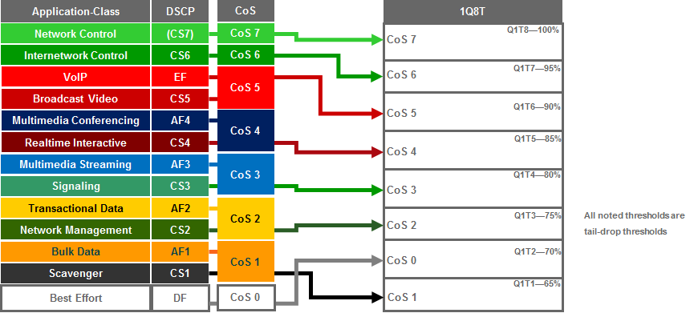

Because the 1Q8T ingress queuing structure only supports one queue,
there are no class-map definitions. All traffic is mapped to
class-default, corresponding to the default queue. The following
configuration, provisioned by APIC-EM EasyQoS, implements the policy-map
for the 1Q8T ingress queuing structure.

!

policy-map type lan-queuing prm-dscp#EZQOS\_1Q8T-IN

class class-default

queue-limit cos 0 percent 70

queue-limit cos 1 percent 65

queue-limit cos 2 percent 75

queue-limit cos 3 percent 80

queue-limit cos 4 percent 85

queue-limit cos 5 percent 90

queue-limit cos 6 percent 95

queue-limit cos 7 percent 100

!

The 1Q8T ingress queuing structure is applied by EasyQoS to all
GigabitEthernet and TenGigabitEthernet interfaces on the line card that
support this queuing structure, with the following exceptions:

-  Interfaces which have been excluded from the QoS policy by the
   network operator, through the EasyQoS web-based GUI. This was
   discussed in the ***Policies*** section of the ***APIC-EM and the
   EasyQoS Application*** chapter.

-  Interfaces which are configured for dual-active fast-hello. This was
   discussed in the ***VSS and Dual-Active Fast Hello Configurations***
   section above.

An example of the provisioning to a single Gigabit Ethernet interface is
shown below.

!

interface GigabitEthernetx/x

service-policy type lan-queuing input prm-dscp#EZQOS\_1Q8T-IN

!

For the WS-X6724-SFP, WS-X6748-SFP, and WS-X6748-GE-TX line cards with
CFCs, the ports are meant to be connected to end-user devices. Because
line cards that support the 1Q8T queuing structure support only
CoS-to-queue mapping, if the end-device does not send traffic with an
802.1p header, all traffic is treated with the default CoS mapping for
the port (CoS 0) and mapped to Q1T2 with a tail-drop threshold of 70%.

Note, however, that interfaces may be configured with separate VLANs for
voice, video, etc. by the network operator. If the end-device does send
traffic with an 802.1p header—such as a Cisco IP phone that sends
traffic marked as CoS 5—then ingress traffic from the IP phone will be
mapped to Q1T6 with a tail-drop threshold of 90%, while a device
chained-off the IP phone may have its traffic remarked to CoS 0 by the
IP phone and mapped to Q1T2 with a tail-drop threshold of 70%.

Ports on the WS-X6704-10GE with CFC, are assumed to be uplink ports. If
the Catalyst 6500 Series or Catalyst 6807-XL with Sup-2T is deployed as
a distribution or core switch, and the link connecting the WS-X6704-10GE
switch port is not a trunk port, then all ingress traffic will not have
an 802.1p header. Hence all ingress traffic will be treated with the
default CoS mapping for the port (CoS 0) and mapped to Q1T2 with a
tail-drop threshold of 70%.

Due to the internal ASIC structure of the ports on the WS-X6748-SFP and
WS-X6748-GE-TX line cards, the ingress and egress queuing structures of
the ports cannot be configured independently. Instead, the queuing
policy is applied to groups of ports on the line card by APIC-EM
EasyQoS.

2Q4T Ingress Queuing

2Q4T ingress queuing is supported by the following line cards:

-  All ports on the VS-S2T-10G and VS-S2T-10G-XL (Supervisor 2T) when
   the Gigabit Ethernet ports are enabled.

The Gigabit Ethernet ports on the Sup-2T are enabled with the following
global configuration command.

!

no platform qos 10g-only

!

APIC-EM EasyQoS does not set this command but will look to see if this
command has been set by the network operator, in order to determine the
correct queuing structure to apply to ports on the Sup2T supervisor. The
default setting is for the Gigabit Ethernet ports on the Sup-2T to be
enabled, so this command will not appear in the configuration.

The status of whether the Gigabit Ethernet ports are enabled or disabled
can be displayed by the network operator via the exec-level “show
platform qos module x” command, where “x” refers to the slot with the
Sup-2T. An example of the output from the command is shown below:

o23-6500-1#show platform qos module 3

QoS is enabled globally

Port QoS is enabled globally

QoS serial policing mode enabled globally

Distributed Policing is Disabled

Secondary PUPs are enabled

QoS Trust state is DSCP on the following interface:

EO0/2 Gi1/1 Gi1/2 Gi1/3 Gi1/4 Gi1/5 Gi1/6 Gi1/7 Gi1/8 Gi1/9

Gi1/10 Gi1/11 Gi1/12 Gi1/13 Gi1/14 Gi1/15 Gi1/16 Gi1/17 Gi1/18 Gi1/19

Gi1/20 Gi1/21 Gi1/22 Gi1/23 Gi1/24 Gi1/25 Gi1/26 Gi1/27 Gi1/28 Gi1/29

Gi1/30 Gi1/31 Gi1/32 Gi1/33 Gi1/34 Gi1/35 Gi1/36 Gi1/37 Gi1/38 Gi1/39

Gi1/40 Gi1/41 Gi1/42 Gi1/43 Gi1/44 Gi1/45 Gi1/46 Gi1/47 Gi1/48 Te2/1

Te2/2 Te2/3 Te2/4 Te2/5 Te2/6 Te2/7 Te2/8 Gi3/1 Gi3/2 Gi3/3

Te3/4 Te3/5 Te5/1 Te5/2 Te5/3 Te5/4 Te5/5 Te5/6 Te5/7 Te5/8

Te5/9 Te5/10 Te5/11 Te5/12 Te5/13 Te5/14 Te5/15 Te5/16 Te6/1 Te6/2

Te6/3 Te6/4 CPP CPP.1 Vl1

QoS 10g-only mode supported: Yes [Current mode: Off]

Global Policy-map: ingress[]

A setting of “Current mode: off” means that the Gigabit Ethernet ports
are enabled.

2Q4T ingress queuing for the Sup-2T implements CoS-to-queue mapping,
with CoS-based tail-drop for congestion avoidance. The following figure
shows the 2Q4T ingress queuing model.

1. 2Q4T Ingress Queuing Models—CoS-to-Queue Mapping with CoS-Based
   Tail-Drop

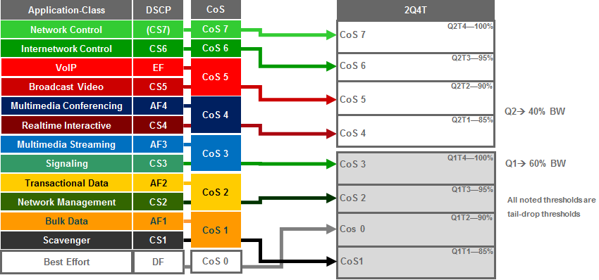

The following configuration, provisioned by APIC-EM EasyQoS, implements
the class-map for the 2Q4T ingress queuing structure.

!

class-map type lan-queuing match-any prm-EZQOS\_2Q4T#Q2

match cos 7

match cos 6

match cos 5

match cos 4

!

The following configuration, provisioned by APIC-EM EasyQoS, implements
the policy-map for the 2Q4T ingress queuing structure.

!

policy-map type lan-queuing prm-dscp#EZQOS\_2Q4T-IN

class type lan-queuing prm-EZQOS\_2Q4T#Q2

bandwidth percent 40

queue-limit cos 4 percent 85

queue-limit cos 5 percent 90

queue-limit cos 6 percent 95

queue-limit cos 7 percent 100

class class-default

queue-limit cos 0 percent 90

queue-limit cos 1 percent 85

queue-limit cos 2 percent 95

queue-limit cos 3 percent 100

!

The 2Q4T ingress queuing policy-map is provisioned by EasyQoS to all
Gigabit Ethernet and TenGigabitEthernet interfaces on the Sup2T, when
the Sup2T is configured for this queuing structure, with the following
exceptions:

-  Interfaces which have been excluded from the QoS policy by the
   network operator, through the EasyQoS web-based GUI. This was
   discussed in the ***Policies*** section of the ***APIC-EM and the
   EasyQoS Application*** chapter.

-  Interfaces which are part of a VSL configuration or share an ASIC
   with other interfaces which are part of a VSL configuration, or
   interfaces which are configured for dual-active fast-hello. This was
   discussed in the ***VSS and Dual-Active Fast Hello Configurations***
   section above.

An example of the provisioning to a single Gigabit Ethernet interface is
shown below.

!

interface GigabitEthernetx/x/x

service-policy type lan-queuing input prm-dscp#EZQOS\_2Q4T-IN

!

interface TenGigabitEthernetx/x/x

service-policy type lan-queuing input prm-dscp#EZQOS\_2Q4T-IN

!

Cisco does not recommend connecting end-user devices to any ports on the
Sup-2T. Hence, all ports on the Sup-2T are assumed to be uplink ports by
EasyQoS. The Sup-2T ports with 2Q4T queuing structure only support
CoS-to-queue mapping. If the Catalyst 6500 Series or Catalyst 6807-XL
with Sup-2T is deployed as a distribution or core switch, and the link
connecting the Sup-2T port is not a trunk port, then all ingress traffic
will not have an 802.1p header. Hence all ingress traffic will be
treated with the default CoS mapping for the port (CoS 0) and mapped to
Q1T2 with a tail-drop threshold of 90%.

It should be noted that QoS policies cannot be applied to
TenGigabitEthernet ports on the Sup-2T when either one or both of the
TenGigabitEthernet ports are part of a port-channel group that is part
of a VSL. Therefore EasyQoS will not apply the 2Q4T ingress queuing
policy when the switch port is part of a VSL. Switch ports can be
identified as part of a VSL based upon the switch configuration. An
example of this is shown below.

!

interface Port-channel63

no switchport

no ip address

no platform qos channel-consistency

switch virtual link 1

~

interface TenGigabitEthernet1/3/4

no switchport

no ip address

no cdp enable

channel-group 63 mode on

!

interface TenGigabitEthernet1/3/5

no switchport

no ip address

no cdp enable

channel-group 63 mode on

!

Physical interfaces are assigned to a port-group via the “channel-group”
interface-level command. Port-channel interfaces are assigned to a VSL
via the “switch virtual link” interface-level command, as shown in the
configuration output example above.

Note also that QoS policies cannot be applied to a Gigabit Ethernet port
on the Sup2T when the TenGigabitEthernet ports on the Sup-2T are part of
a port-channel group that is part of a VSL. This is because the
GigabitEthernet ports share the same ASIC as the TenGigabitEthernet
ports. Hence, EasyQoS will not apply the 2Q4T ingress queuing policy to
Gigabit Ethernet ports on the Sup2T when the TenGigabitEthernet ports
are part of a VSL.

Finally, due to the internal ASIC structure of the ports on the Sup2T,
the ingress and egress queuing structure of the ports cannot be
configured independently. Instead, when configuring an ingress or egress
queuing policy to one of the interfaces, the same policy will be
propagated to the rest of the interfaces on the Sup-2T. Because of the
hardware design, EasyQoS applies the same ingress or egress queuing
policy on all interfaces of the Sup2T.

2Q8T Ingress Queuing

2Q8T ingress queuing is supported by the following line cards:

-  WS-X6724-SFP with DFC4/DFC4XL upgrade (WS-F6k-DFC4-A,
   WS-F6k-DFC4-AXL)

-  WS-X6748-SFP and WS-X6748-GE-TX with DFC4/DFC4XL upgrade
   (WS-F6k-DFC4-A, WS-F6k-DFC4-AXL)

-  WS-X6824-SFP-2T and WS-X6824-SFP-2TXL

-  WS-X6848-SFP-2T, WS-X6848-SFP-2TXL, WS-X6848-TX-2T and
   WS-X6848-TX-2TXL

2Q8T ingress queuing for these line cards implements CoS-to-queue
mapping, with CoS-based tail-drop for congestion avoidance.

The following figure shows the 2Q8T ingress queuing model.

1. 2Q8T Ingress Queuing Models—CoS-to-Queue Mapping with CoS-based
   Tail-Drop

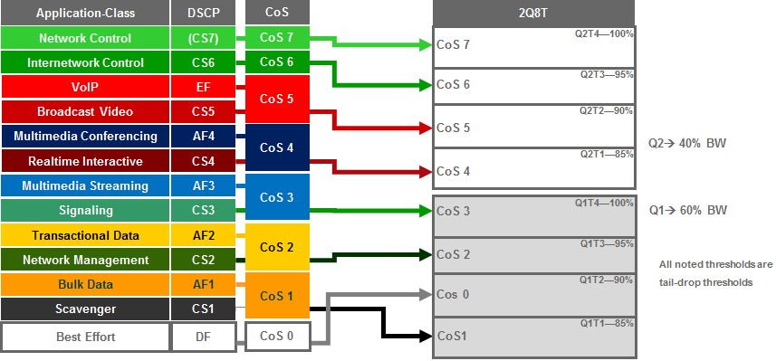

The following configuration, provisioned by APIC-EM EasyQoS, implements
the class-maps for the 2Q8T ingress queuing structure.

!

class-map type lan-queuing match-any prm-EZQOS\_2Q8T#Q2

match cos 7

match cos 6

match cos 5

match cos 4

!

The following configuration, provisioned by APIC-EM EasyQoS, implements
the policy-map for the 2Q8T ingress queuing structure.

!

policy-map type lan-queuing prm-dscp#EZQOS\_2Q8T-IN

class type lan-queuing prm-EZQOS\_2Q8T#Q2

bandwidth percent 40

queue-limit cos 4 percent 85

queue-limit cos 4 percent 90

queue-limit cos 6 percent 95

queue-limit cos 7 percent 100

class class-default

queue-limit cos 0 percent 90

queue-limit cos 1 percent 85

queue-limit cos 2 percent 95

queue-limit cos 3 percent 100

!

The 2Q8T ingress queuing policy-map is provisioned by EasyQoS to all
Gigabit Ethernet interfaces on the line cards that support this queuing
structure, with the following exceptions:

-  Interfaces which have been excluded from the QoS policy by the
   network operator, through the EasyQoS web-based GUI. This was
   discussed in the ***Policies*** section of the ***APIC-EM and the
   EasyQoS Application*** chapter.

-  Interfaces which are configured for dual-active fast-hello. This was
   discussed in the ***VSS and Dual-Active Fast Hello Configurations***
   section above.

An example of the provisioning to a single Gigabit Ethernet interface is
shown below.

!

interface GigabitEthernetx/x/x

service-policy type lan-queuing input prm-dscp#EZQOS\_2Q8T-IN

!

For all of the line cards that support the 2Q8T ingress queuing
structure listed above, the ports are meant to be connected to end-user
devices. Because line cards that support the 2Q8T queuing structure
support only CoS-to-queue mapping, if the end-device does not send
traffic with an 802.1p header, all traffic is treated with the default
CoS mapping for the port (CoS 0) and mapped to Q1T2 with a tail-drop
threshold of 90%.

Note, however, that interfaces may be configured with separate VLANs for
voice, video, etc. by the network operator. If the end-device does send
traffic with an 802.1p header—such as a Cisco IP phone that sends
traffic marked as CoS 5—then ingress traffic from the IP phone will be
mapped to Q2T2 with a tail-drop threshold of 90%, while a device
chained-off the IP phone may have its traffic remarked to CoS 0 by the
IP phone and mapped to Q1T2 with a tail-drop threshold of 90%.

8Q4T Ingress Queuing

8Q4T ingress queuing is supported by the following line cards:

-  VS-S2T-10G, VS-S2T-10G-XL with Gigabit Ethernet ports disabled

-  WS-X6908-10G-2T, WS-X6908-10G-2TXL

The Gigabit Ethernet ports on the Sup-2T are disabled with the following
global configuration command.

!

platform qos 10g-only

!

APIC-EM EasyQoS does not set this command but will look to see if this
command has been set by the network operator, in order to determine the
correct queuing structure to apply to ports on the Sup2T supervisor. The
default setting is for the Gigabit Ethernet ports on the Sup-2T to be
enabled, so this command will appear in the configuration when the
Gigabit Ethernet ports are disabled.

The status of whether the Gigabit Ethernet ports are enabled or disabled
can be displayed by the network operator via the exec-level “show
platform qos module x” command, where “x” refers to the slot with the
Sup-2T. An example of the output from the command is shown below:

o23-6500-1#show platform qos module 3

QoS is enabled globally

Port QoS is enabled globally

QoS serial policing mode enabled globally

Distributed Policing is Disabled

Secondary PUPs are enabled

QoS Trust state is DSCP on the following interface:

EO0/2 Gi1/1 Gi1/2 Gi1/3 Gi1/4 Gi1/5 Gi1/6 Gi1/7 Gi1/8 Gi1/9

Gi1/10 Gi1/11 Gi1/12 Gi1/13 Gi1/14 Gi1/15 Gi1/16 Gi1/17 Gi1/18 Gi1/19

Gi1/20 Gi1/21 Gi1/22 Gi1/23 Gi1/24 Gi1/25 Gi1/26 Gi1/27 Gi1/28 Gi1/29

Gi1/30 Gi1/31 Gi1/32 Gi1/33 Gi1/34 Gi1/35 Gi1/36 Gi1/37 Gi1/38 Gi1/39

Gi1/40 Gi1/41 Gi1/42 Gi1/43 Gi1/44 Gi1/45 Gi1/46 Gi1/47 Gi1/48 Te2/1

Te2/2 Te2/3 Te2/4 Te2/5 Te2/6 Te2/7 Te2/8 Gi3/1 Gi3/2 Gi3/3

Te3/4 Te3/5 Te5/1 Te5/2 Te5/3 Te5/4 Te5/5 Te5/6 Te5/7 Te5/8

Te5/9 Te5/10 Te5/11 Te5/12 Te5/13 Te5/14 Te5/15 Te5/16 Te6/1 Te6/2

Te6/3 Te6/4 CPP CPP.1 Vl1

QoS 10g-only mode supported: Yes [Current mode: On]

Global Policy-map: ingress[]

A setting of “Current mode: On” means that the Gigabit Ethernet ports
are disabled.

8Q4T ingress queuing for these line cards implements DSCP-to-queue
mapping, with DSCP-based WRED for congestion avoidance. APIC-EM release
1.5 and higher does not allow per traffic-class bandwidth allocations to
be modified in the ingress direction for line cards which support the
8Q4T ingress queuing structure. However, per traffic-class DSCP markings
are supported in the ingress direction for line cards which support the
8Q4T ingress queuing structure, because these line cards support
DSCP-to-queue mapping. The default DSCP markings are part of the
CVD\_QUEUING\_PROFILE that is applied by default, unless the network
operator applies a custom Queuing Profile to the policy scope containing
these line cards.

The following figure shows the default 8Q4T ingress queuing model.

1. Default 8Q4T Ingress Queuing Model—DSCP-to-Queue Mapping with
   DSCP-based WRED

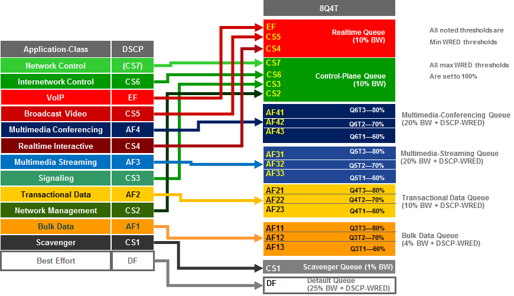

The following configuration, provisioned by APIC-EM EasyQoS, implements
the default class-maps for the 8Q4T ingress queuing structure.

!

class-map type lan-queuing match-any prm-EZQOS\_8Q4T#REALTIME

match dscp cs4

match dscp cs5

match dscp ef

class-map type lan-queuing match-any prm-EZQOS\_8Q4T#CONTROL

match dscp cs2

match dscp cs3

match dscp cs6

match dscp cs7

class-map type lan-queuing match-any prm-EZQOS\_8Q4T#MM\_CONF

match dscp af41

match dscp af42

match dscp af43

class-map type lan-queuing match-any prm-EZQOS\_8Q4T#MM\_STREAM

match dscp af31

match dscp af32

match dscp af33

class-map type lan-queuing match-any prm-EZQOS\_8Q4T#TRANS\_DATA

match dscp af21

match dscp af22

match dscp af23

class-map type lan-queuing match-any prm-EZQOS\_8Q4T#BULK\_DATA

match dscp af11

match dscp af12

match dscp af13

class-map type lan-queuing match-any prm-EZQOS\_8Q4T#SCAVENGER

match dscp cs1

!

The following configuration, provisioned by APIC-EM EasyQoS, implements
the default policy-map for the 8Q4T ingress queuing structure.

!

policy-map type lan-queuing prm-dscp#EZQOS\_8Q4T-IN

class type lan-queuing prm-EZQOS\_8Q4T#REALTIME

bandwidth percent 10

class type lan-queuing prm-EZQOS\_8Q4T#CONTROL

bandwidth percent 10

class type lan-queuing prm-EZQOS\_8Q4T#MM\_CONF

bandwidth percent 20

random-detect dscp-based

random-detect dscp 34 percent 80 100

random-detect dscp 36 percent 70 100

random-detect dscp 38 percent 60 100

class type lan-queuing prm-EZQOS\_8Q4T#MM\_STREAM

bandwidth percent 20

random-detect dscp-based

random-detect dscp 26 percent 80 100

random-detect dscp 28 percent 70 100

random-detect dscp 30 percent 60 100

class type lan-queuing prm-EZQOS\_8Q4T#TRANS\_DATA

bandwidth percent 10

random-detect dscp-based

random-detect dscp 18 percent 80 100

random-detect dscp 20 percent 70 100

random-detect dscp 22 percent 60 100

class type lan-queuing prm-EZQOS\_8Q4T#BULK\_DATA

bandwidth percent 4

random-detect dscp-based

random-detect dscp 10 percent 80 100

random-detect dscp 12 percent 70 100

random-detect dscp 14 percent 60 100

class type lan-queuing prm-EZQOS\_8Q4T#SCAVENGER

bandwidth percent 1

class class-default

random-detect dscp-based

random-detect dscp 0 percent 80 100

!

The 8Q4T ingress queuing policy-map is provisioned by EasyQoS to all
TenGigabitEthernet interfaces on the line cards that support this
queuing structure, with the following exceptions:

-  Interfaces which have been excluded from the QoS policy by the
   network operator, through the EasyQoS web-based GUI. This was
   discussed in the ***Policies*** section of the ***APIC-EM and the
   EasyQoS Application*** chapter.

-  Interfaces which are part of a VSL configuration or share an ASIC
   with other interfaces which are part of a VSL configuration, or
   interfaces which are configured for dual-active fast-hello. This was
   discussed in the ***VSS and Dual-Active Fast Hello Configurations***
   section above.

An example of the provisioning to a single TenGigabitEthernet interface
is shown below.

!

interface TenGigabitEthernetx/x

service-policy type lan-queuing input prm-dscp#EZQOS\_8Q4T-IN

!

For all of the line cards that support the 8Q4T ingress queuing
structure listed above, the ports are assumed to be uplink ports,
because they are all TenGigabitEthernet ports. If the Catalyst 6500
Series or Catalyst 6807-XL with Sup-2T is deployed as a distribution or
core switch, and the link connecting the Sup-2T port is not a trunk
port, then all ingress traffic will not have an 802.1p header. However,
because these line cards support DSCP-to-queue mapping, ingress traffic
will still be mapped into the correct queue based on the DSCP value of
the IP packets.

Custom Queuing Profiles

EasyQoS within APIC-EM release 1.5 and higher provides the network
operator the ability to change the both the DSCP marking and the
bandwidth allocation of traffic-classes through custom Queuing Profiles
in the web-based GUI. Bandwidth allocations configured within custom
Queuing Profiles are not implemented on line cards which support the
8Q4T ingress queuing structure. Instead, the default 8Q4T ingress
queuing structure discussed in the previous section is always
implemented by EasyQoS. However, for line cards which support the 8Q4T
ingress queuing structure, custom DSCP markings are implemented.

Custom Queuing Profiles were discussed in the ***Advanced Settings***
section of the ***APIC-EM and the EasyQoS Application*** chapter.
Figures 37 showed an example of setting the DSCP markings within custom
Queuing Profile named EasyQoS\_Lab\_Queuing\_Profile. Within that
example, Broadcast Video traffic was configured with a DSCP marking of
CS3, and Signaling traffic was configured with a DSCP marking of CS5.

Changing the DSCP markings of traffic-classes within the EasyQoS
web-based GUI affects the “match dscp” statements of class-map
definitions within the ingress queuing policy of line cards which
support the 8Q4T ingress queuing structure. The following output is an
example of the modification of the class-map definitions provisioned by
EasyQoS, based upon the DSCP markings from the EasyQoS\_Lab\_Queuing
Profile, shown in the table above. The affected class-map definitions
are highlighted in bold.

!

**class-map type lan-queuing match-any prm-EZQOS\_8Q4T#REALTIME**

match dscp cs4

**match dscp cs3**

match dscp ef

**class-map type lan-queuing match-any prm-EZQOS\_8Q4T#CONTROL**

match dscp cs2

**match dscp cs3 **

match dscp cs6

match dscp cs7

class-map type lan-queuing match-any prm-EZQOS\_8Q4T#MM\_CONF

match dscp af41

match dscp af42

match dscp af43

class-map type lan-queuing match-any prm-EZQOS\_8Q4T#MM\_STREAM

match dscp af31

match dscp af32

match dscp af33

class-map type lan-queuing match-any prm-EZQOS\_8Q4T#TRANS\_DATA

match dscp af21

match dscp af22

match dscp af23

class-map type lan-queuing match-any prm-EZQOS\_8Q4T#BULK\_DATA

match dscp af11

match dscp af12

match dscp af13

class-map type lan-queuing match-any prm-EZQOS\_8Q4T#SCAVENGER

match dscp cs1

!

As can be seen by comparing the the class-map definitions between the
default 8Q4T ingress queuing structure and the EasyQoS\_Lab\_Queuing
Profile; the Realtime queue which services the Broadcast Video
traffic-class matches on CS3 instead of CS5, and the Control queue which
services the Signaling traffic-class matches on CS5 instead of CS3.

8Q8T Ingress Queuing

8Q8T ingress queuing is supported by the following line cards:

-  WS-X6704-10GE supported with a DFC4/DFC4XL upgrade (WS-F6k-DFC4-A,
   WS-F6k-DFC4-AXL).

The WS-X6704-10GE line card can support either a CFC or a DFC version 4
or 4XL upgrade, in order to operate with the Sup-2T. With a CFC, the
WS-X6704-10GE line card supports 1Q8T ingress queuing. With a DFC4/4XL
upgrade, the WS-X6704-10GE line card supports 8Q8T ingress queuing.
Whether or not the WS-X6704-10GE line card has a CFC or DFC can be
displayed via the exec-level “show module” command, as discussed in the
***1Q8T Ingress Queuing*** section above.

8Q8T ingress queuing for the WS-X6704-10GE implements CoS-to-queue
mapping, with CoS-based tail-drop for congestion avoidance. The
following figure shows the 8Q8T ingress queuing model.

1. 8Q8T Ingress Queuing Models—CoS-to-Queue Mapping with CoS-based
   Tail-Drop

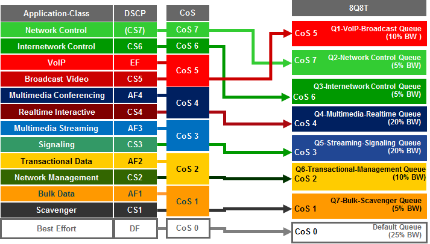

The following configuration, provisioned by APIC-EM EasyQoS, implements
the class-maps for the 8Q8T ingress queuing structure.

!

class-map type lan-queuing match-any prm-EZQOS\_8Q8T#Q1

match cos 5

class-map type lan-queuing match-any prm-EZQOS\_8Q8T#Q2

match cos 7

class-map type lan-queuing match-any prm-EZQOS\_8Q8T#Q3

match cos 6

class-map type lan-queuing match-any prm-EZQOS\_8Q8T#Q4

match cos 4

class-map type lan-queuing match-any prm-EZQOS\_8Q8T#Q5

match cos 3

class-map type lan-queuing match-any prm-EZQOS\_8Q8T#Q6

match cos 2

class-map type lan-queuing match-any prm-EZQOS\_8Q8T#Q7

match cos 1

!

The following configuration, provisioned by APIC-EM EasyQoS, implements
the policy-map for the 8Q8T ingress queuing structure.

!

policy-map type lan-queuing prm-dscp#EZQOS\_8Q8T-IN

class prm-EZQOS\_8Q8T#Q1

bandwidth percent 10

class prm-EZQOS\_8Q8T#Q2

bandwidth percent 5

class prm-EZQOS\_8Q8T#Q3

bandwidth percent 5

class prm-EZQOS\_8Q8T#Q4

bandwidth percent 20

class prm-EZQOS\_8Q8T#Q5

bandwidth percent 20

class prm-EZQOS\_8Q8T#Q6

bandwidth percent 10

class prm-EZQOS\_8Q8T#Q7

bandwidth percent 5

class class-default

!

The 8Q8T ingress queuing policy-map is provisioned by EasyQoS to all
TenGigabitEthernet interfaces on the line cards that support this
queuing structure, with the following exceptions:

-  Interfaces which have been excluded from the QoS policy by the
   network operator, through the EasyQoS web-based GUI. This was
   discussed in the ***Policies*** section of the ***APIC-EM and the
   EasyQoS Application*** chapter.

-  Interfaces which are configured for dual-active fast-hello. This was
   discussed in the ***VSS and Dual-Active Fast Hello Configurations***
   section above.

An example of the provisioning to a single TenGigabitEthernet interface
is shown below.

!

interface TenGigabitEthernetx/x/x

service-policy type lan-queuing input prm-dscp#EZQOS\_8Q8T-IN

!

Ports on the WS-X6704-10GE with DFC4/4XL are assumed to be uplink ports.
If the Catalyst 6500 Series or Catalyst 6807-XL with Sup-2T is deployed
as a distribution or core switch, and the link connecting the
WS-X6704-10GE switch port is not a trunk port, then all ingress traffic
will not have an 802.1p header. Hence all ingress traffic will be
treated with the default CoS mapping for the port (CoS 0) and mapped to
the default queue. Because no other traffic will be in other queues, the
default queue will essentially have 100% of the bandwidth available.

2P6Q4T Ingress and Egress Queuing

2P6Q4T ingress and egress queuing is supported by the following line
cards:

-  C6800-8P10G, C6800-8P10G-XL

-  C6800-16P10G, C6800-16P10G-XL

-  C6800-32P10G, C6800-32P10G-XL

APIC-EM release 1.4 changed the default bandwidth allocations for the
2P6Q4T egress queuing design. With APIC-EM release 1.5 and higher, the
default bandwidth allocations are part of the CVD\_Queuing\_PROFILE that
is applied by default, unless the network operator applies a custom
Queuing Profile to the policy scope containing these switches. However,
APIC-EM release 1.5 only allowed per traffic-class bandwidth allocations
to be modified in the egress direction for line cards which support the
2P6Q4T queuing structure. APIC-EM release 1.6 allows per traffic-class
bandwidth allocations to be modified in both the ingress and egress
directions for line cards which support the 2P6Q4T queuing structure.
Per traffic-class DSCP markings are also supported in both the ingress
and egress direction for these line cards.

2P6Q4T ingress and egress queuing for these line cards implements
DSCP-to-queue mapping, with DSCP-based WRED for congestion avoidance.
The following figure shows the default 2P6Q4T ingress and egress queuing
model.

1. Default 2P6Q4T Ingress and Egress Queuing Model—DSCP-to-Queue Mapping
   with DSCP-based WRED

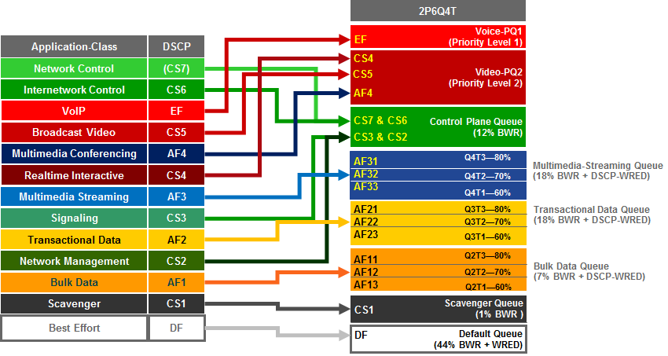

The following configuration, provisioned by APIC-EM EasyQoS, implements
the class-maps for the default 2P6Q4T queuing structure.

!

class-map type lan-queuing match-any prm-EZQOS\_2P6Q4T#VOICE-PQ1

match dscp ef

class-map type lan-queuing match-any prm-EZQOS\_2P6Q4T#VIDEO-PQ2

match dscp cs4

match dscp cs5

match dscp af41

match dscp af42

match dscp af43

class-map type lan-queuing match-any prm-EZQOS\_2P6Q4T#CONTROL

match dscp cs2

match dscp cs3

match dscp cs6

match dscp cs7

class-map type lan-queuing match-any prm-EZQOS\_2P6Q4T#MM\_STREAM

match dscp af31

match dscp af32

match dscp af33

class-map type lan-queuing match-any prm-EZQOS\_2P6Q4T#TRANS\_DATA

match dscp af21

match dscp af22

match dscp af23

class-map type lan-queuing match-any prm-EZQOS\_2P6Q4T#BULK\_DATA

match dscp af11

match dscp af12

match dscp af13

class-map type lan-queuing match-any prm-EZQOS\_2P6Q4T#SCAVENGER

match dscp cs1

!

The following configuration, provisioned by APIC-EM EasyQoS, implements
the default ingress policy-map for the 2P6Q4T ingress queuing structure.

!

policy-map type lan-queuing prm-dscp#EZQOS\_2P6Q4T-IN

class type lan-queuing prm-EZQOS\_2P6Q4T#VOICE-PQ1

priority level 1

class type lan-queuing prm-EZQOS\_2P6Q4T#VIDEO-PQ2

priority level 2

class type lan-queuing prm-EZQOS\_2P6Q4T#CONTROL

bandwidth remaining percent 12

class type lan-queuing prm-EZQOS\_2P6Q4T#MM\_STREAM

bandwidth remaining percent 18

random-detect dscp-based

random-detect dscp 26 percent 80 100

random-detect dscp 28 percent 70 100

random-detect dscp 30 percent 60 100

class type lan-queuing prm-EZQOS\_2P6Q4T#TRANS\_DATA

bandwidth remaining percent 18

random-detect dscp-based

random-detect dscp 18 percent 80 100

random-detect dscp 20 percent 70 100

random-detect dscp 22 percent 60 100

class type lan-queuing prm-EZQOS\_2P6Q4T#BULK\_DATA

bandwidth remaining percent 7

random-detect dscp-based

random-detect dscp 10 percent 80 100

random-detect dscp 12 percent 70 100

random-detect dscp 14 percent 60 100

class type lan-queuing prm-EZQOS\_2P6Q4T#SCAVENGER

bandwidth remaining percent 1

class class-default

random-detect dscp-based

random-detect dscp 0 percent 80 100

!

The following configuration, provisioned by APIC-EM EasyQoS, implements
the default egress policy-map for the 2P6Q4T egress queuing structure.

!

policy-map type lan-queuing prm-dscp#EZQOS\_2P6Q4T-OUT

class type lan-queuing prm-EZQOS\_2P6Q4T#VOICE-PQ1

priority level 1

class type lan-queuing prm-EZQOS\_2P6Q4T#VIDEO-PQ2

priority level 2

class type lan-queuing prm-EZQOS\_2P6Q4T#CONTROL

bandwidth remaining percent 12

class type lan-queuing prm-EZQOS\_2P6Q4T#MM\_STREAM

bandwidth remaining percent 18

random-detect dscp-based

random-detect dscp 26 percent 80 100

random-detect dscp 28 percent 70 100

random-detect dscp 30 percent 60 100

class type lan-queuing prm-EZQOS\_2P6Q4T#TRANS\_DATA

bandwidth remaining percent 18

random-detect dscp-based

random-detect dscp 18 percent 80 100

random-detect dscp 20 percent 70 100

random-detect dscp 22 percent 60 100

class type lan-queuing prm-EZQOS\_2P6Q4T#BULK\_DATA

bandwidth remaining percent 7

random-detect dscp-based

random-detect dscp 10 percent 80 100

random-detect dscp 12 percent 70 100

random-detect dscp 14 percent 60 100

class type lan-queuing prm-EZQOS\_2P6Q4T#SCAVENGER

bandwidth remaining percent 1

class class-default

random-detect dscp-based

random-detect dscp 0 percent 80 100

!

The bandwidth allocations within the EasyQoS GUI for Queuing Profiles
require the sum of the bandwidth percentages to total 100%. These
bandwidth allocations are absolute bandwidth percentages. Because the
2P6Q4T ingress and egress queuing policy implements an eight-queue model
in hardware on these switch platforms, multiple traffic-classes may be
mapped to a single queue. The following table shows the mapping of the
traffic-classes and bandwidth allocations from the default EasyQoS
CVD\_Queuing\_Profile to the 2P6Q4T ingress and egress queuing
structure.

1. Default Queuing Profile Mapping to 2P6Q4T Ingress and Egress Queuing
   Policy

+---------------------------+----------------+---------------------------------------+-----------------------------------------------------+-------------------------------------------+--------------------------------------------------------------------------------------------------------------------------------------------------------------------------------------------------------------------+
| Traffic Class             | DSCP Marking   | BW % in the Default Queuing Profile   | BWR % Calculated from the Default Queuing Profile   | 2P6Q4T Ingress and Egress Queue Mapping   | BWR % Allocation in 2P6Q4T Ingress and Egress Queue                                                                                                                                                                |
+===========================+================+=======================================+=====================================================+===========================================+====================================================================================================================================================================================================================+
| Voice                     | EF             | 10%                                   | N/A                                                 | Voice-PQ1                                 | Voice-PQ1 bandwidth is unconstrained and consists of traffic from the Voice traffic-class.                                                                                                                         |
+---------------------------+----------------+---------------------------------------+-----------------------------------------------------+-------------------------------------------+--------------------------------------------------------------------------------------------------------------------------------------------------------------------------------------------------------------------+
| Broadcast Video           | CS5            | 10%                                   | N/A                                                 | Video-PQ2                                 | Video-PQ2 bandwidth is unconstrained and consists of traffic from the Broadcast Video, Real-Time Interactive, and Multimedia Conferencing traffic-classes.                                                         |
+---------------------------+----------------+---------------------------------------+-----------------------------------------------------+-------------------------------------------+--------------------------------------------------------------------------------------------------------------------------------------------------------------------------------------------------------------------+
| Real-Time Interactive     | CS4            | 13%                                   | N/A                                                 | Video-PQ2                                 |                                                                                                                                                                                                                    |
+---------------------------+----------------+---------------------------------------+-----------------------------------------------------+-------------------------------------------+--------------------------------------------------------------------------------------------------------------------------------------------------------------------------------------------------------------------+
| Multimedia Conferencing   | AF41           | 10%                                   | N/A                                                 | Video-PQ2                                 |                                                                                                                                                                                                                    |
+---------------------------+----------------+---------------------------------------+-----------------------------------------------------+-------------------------------------------+--------------------------------------------------------------------------------------------------------------------------------------------------------------------------------------------------------------------+
| Multimedia Streaming      | AF31           | 10%                                   | 18%                                                 | Multimedia-Streaming Queue                | BWR for traffic-class mapped to Multimedia-Streaming Queue = 18%                                                                                                                                                   |
+---------------------------+----------------+---------------------------------------+-----------------------------------------------------+-------------------------------------------+--------------------------------------------------------------------------------------------------------------------------------------------------------------------------------------------------------------------+
| Network Control           | CS6            | 3%                                    | 5%                                                  | Control-Queue                             | BWR for traffic-classes mapped to Control-Plane Queue = 5% (Network Control) + 4% (Signaling) + 4% (OAM) = 13%. (Actual value configured within switch platforms is rounded down to 12% to reach 100% BWR.)        |
+---------------------------+----------------+---------------------------------------+-----------------------------------------------------+-------------------------------------------+--------------------------------------------------------------------------------------------------------------------------------------------------------------------------------------------------------------------+
| Signaling                 | CS3            | 2%                                    | 4%                                                  | Control-Queue                             |                                                                                                                                                                                                                    |
+---------------------------+----------------+---------------------------------------+-----------------------------------------------------+-------------------------------------------+--------------------------------------------------------------------------------------------------------------------------------------------------------------------------------------------------------------------+
| OAM                       | CS2            | 2%                                    | 4%                                                  | Control-Queue                             |                                                                                                                                                                                                                    |
+---------------------------+----------------+---------------------------------------+-----------------------------------------------------+-------------------------------------------+--------------------------------------------------------------------------------------------------------------------------------------------------------------------------------------------------------------------+
| Transactional Data        | AF21           | 10%                                   | 18%                                                 | Transactional-Data Queue                  | BWR for traffic-class mapped to Transactional-Data Queue = 18%                                                                                                                                                     |
+---------------------------+----------------+---------------------------------------+-----------------------------------------------------+-------------------------------------------+--------------------------------------------------------------------------------------------------------------------------------------------------------------------------------------------------------------------+
| Bulk Data                 | AF11           | 4%                                    | 7%                                                  | Bulk-Data Queue                           | BWR for traffic-class mapped to Bulk-Data Queue = 7%                                                                                                                                                               |
+---------------------------+----------------+---------------------------------------+-----------------------------------------------------+-------------------------------------------+--------------------------------------------------------------------------------------------------------------------------------------------------------------------------------------------------------------------+
| Scavenger                 | CS1            | 1%                                    | 2%                                                  | Scavenger Queue                           | BWR for traffic-class mapped to Scavenger Queue = 2% due to rounding to whole numbers in the formulas presented here. (Actual value configured within switch platforms is rounded down to 1% to reach 100% BWR.)   |
+---------------------------+----------------+---------------------------------------+-----------------------------------------------------+-------------------------------------------+--------------------------------------------------------------------------------------------------------------------------------------------------------------------------------------------------------------------+
| Best Effort               | Default        | 25%                                   | 44% Implicit                                        | Default Queue                             | Best Effort traffic-class mapped to Default Queue receives the remaining bandwidth, which is implicitly 44%.                                                                                                       |
+---------------------------+----------------+---------------------------------------+-----------------------------------------------------+-------------------------------------------+--------------------------------------------------------------------------------------------------------------------------------------------------------------------------------------------------------------------+

Column 3 of the table above shows the percentage bandwidth allocation
for each of the traffic-classes as it appears within the EasyQoS GUI for
the default CVD\_Queuing\_Profile. In the 2P6Q4T ingress and egress
queuing policy, the Voice traffic-class is mapped to Voice-PQ1, while
the Broadcast Video, Real-Time Interactive, and Multimedia-Conferencing
traffic-classes are mapped to the Video-PQ2, as shown in column 5. The
sum of the bandwidth allocated to these three traffic-classes can be
considered as the total priority queue bandwidth (Total\_PQ\_BW), as
shown in the following formula.

Total\_PQ\_BW = Voice BW + Broadcast Video BW + Real-Time Interactive BW
+ Multimedia Conferencing BW

Based on the bandwidth allocations in column 3 in the table above
Total\_PQ\_BW can be calculated as follows:

Total\_PQ\_BW = 10% (Voice) + 10% (Broadcast Video) + 13% (Real-Time
Interactive) + 10% (Multimedia Conferencing) = 43%

For the remaining eight traffic-classes the BWR percentages shown in
column 4 of the table above can be calculated based on the amount of
bandwidth allocated to each traffic class through the EasyQoS GUI, and
the amount of Total\_PQ\_BW calculated above. This can be done through
the following formula.

Traffic\_Class\_BWR = (Traffic\_Class\_BW / (100% – Total\_PQ\_BW)) \*
100

For example, BWR percentage for the Multimedia Streaming traffic class
can be calculated as follows:

Multimedia\_Streaming\_BWR = (10% / (100% – 43%)) \* 100 = 18% when
rounded

Finally, determining the bandwidth ratio allocated to each of the
non-priority queues within the 2P6Q4T ingress and egress queuing model
is simply a matter of summing the Traffic\_Class\_BWR numbers for the
traffic-classes that are mapped into a given queue. This is shown in
column 6 in the table above. The default queue implicitly gets the
remaining bandwidth not configured with “bandwidth remaining” statements
for the other queues. Note that the priority queues are unconstrained in
the 2P6Q4T ingress and egress queuing structure provisioned by EasyQoS.
Although there are bandwidth allocations for the traffic-classes that
map to the priority queues within default Queuing Profile within the
EasyQoS GUI, these bandwidth allocations are unenforced with the 2P6Q4T
ingress and egress queuing structure.

The 2P6Q4T queuing policy-map is provisioned by EasyQoS to all
TenGigabitEthernet and FortyGigabitEthernet interfaces, in the ingress
and egress direction, on the line cards that support this queuing
structure, with the following exceptions:

-  Interfaces which have been excluded from the QoS policy by the
   network operator, through the EasyQoS web-based GUI. This was
   discussed in the ***Policies*** section of the ***APIC-EM and the
   EasyQoS Application*** chapter.

-  Interfaces which are part of a VSL configuration or share an ASIC
   with other interfaces which are part of a VSL configuration, or
   interfaces which are configured for dual-active fast-hello. This was
   discussed in the ***VSS and Dual-Active Fast Hello Configurations***
   section above.

An example of the provisioning to a TenGigabitEthernet and
FortyGigabitEthernet interface in the ingress and egress directions is
shown below.

!

interface TenGigabitEthernetx/x

service-policy type lan-queuing input prm-dscp#EZQOS\_2P6Q4T-IN

service-policy type lan-queuing output prm-dscp#EZQOS\_2P6Q4T-OUT

!

interface FortyGigabitEthernetx/x

service-policy type lan-queuing input prm-dscp#EZQOS\_2P6Q4T-IN

service-policy type lan-queuing output prm-dscp#EZQOS\_2P6Q4T-OUT

!

For the line cards listed above that support the 2P6Q4T ingress queuing
structure, the ports are assumed to be uplink ports, because they are
either TenGigabitEthernet or FortyGigabitEthernet ports. If the Catalyst
6500 Series or Catalyst 6807-XL with Sup-2T is deployed as a
distribution or core switch, and the link connecting the Sup-2T port is
not a trunk port, then all ingress traffic will not have an 802.1p
header. However, because these line cards support DSCP-to-queue mapping,
ingress traffic will still be mapped into the correct queue based on the
DSCP value of the IP packets.

Custom Queuing Profiles with 2P6Q4T Ingress and Egress Queuing

EasyQoS within APIC-EM release 1.5 and higher provides the network
operator the ability to change the both the DSCP marking and the
bandwidth allocation of traffic-classes through custom Queuing Profiles
in the web-based GUI. As of APIC-EM release 1.6, for line cards which
support the 2P6Q4T queuing structure, custom bandwidth allocations apply
to both ingress and egress queuing policy-maps. Custom Queuing Profiles
were discussed in the ***Advanced Settings*** section of the ***APIC-EM
and the EasyQoS Application*** chapter. Figures 36 and 37 showed an
example custom Queuing Profile named EasyQoS\_Lab\_Queuing\_Profile. The
bandwidth allocations for the 12 traffic-classes for this example
Queuing Profile (for 1 Gbps interfaces) are shown in column 3 of the
following table. Likewise, the DSCP markings for the 12 traffic-classes
are shown in column 2.

1. Example Custom Queuing Profile Mapping to 2P6Q4T Ingress and Egress
   Queuing Policy

+---------------------------+----------------+---------------------------------------------------+---------------------------------------------------------+-------------------------------------------+-------------------------------------------------------------------------------------------------------------------------------------------------------------------+
| Traffic Class             | DSCP Marking   | BW % in the example EasyQoS Lab Queuing Profile   | BWR % Calculated from the EasyQoS Lab Queuing Profile   | 2P6Q4T Ingress and Egress Queue Mapping   | BWR % Allocation in 2P6Q4T Ingress and Egress Queue                                                                                                               |
+===========================+================+===================================================+=========================================================+===========================================+===================================================================================================================================================================+
| Voice                     | EF             | 5%                                                | N/A                                                     | Voice-PQ1                                 | Voice-PQ1 bandwidth is constrained to 5% and consists of traffic from the Voice traffic-class.                                                                    |
+---------------------------+----------------+---------------------------------------------------+---------------------------------------------------------+-------------------------------------------+-------------------------------------------------------------------------------------------------------------------------------------------------------------------+
| Broadcast Video           | CS3            | 5%                                                | N/A                                                     | Video-PQ2                                 | Video-PQ2 bandwidth is constrained to 20% and consists of traffic from the Broadcast Video, Real-Time Interactive, and Multimedia Conferencing traffic-classes.   |
+---------------------------+----------------+---------------------------------------------------+---------------------------------------------------------+-------------------------------------------+-------------------------------------------------------------------------------------------------------------------------------------------------------------------+
| Real-Time Interactive     | CS4            | 5%                                                | N/A                                                     | Video-PQ2                                 |                                                                                                                                                                   |
+---------------------------+----------------+---------------------------------------------------+---------------------------------------------------------+-------------------------------------------+-------------------------------------------------------------------------------------------------------------------------------------------------------------------+
| Multimedia Conferencing   | AF41           | 10%                                               | N/A                                                     | Video-PQ2                                 |                                                                                                                                                                   |
+---------------------------+----------------+---------------------------------------------------+---------------------------------------------------------+-------------------------------------------+-------------------------------------------------------------------------------------------------------------------------------------------------------------------+
| Multimedia Streaming      | AF31           | 10%                                               | 13%                                                     | Multimedia-Streaming Queue                | BWR for traffic-class mapped to Multimedia-Streaming Queue = 13%                                                                                                  |
+---------------------------+----------------+---------------------------------------------------+---------------------------------------------------------+-------------------------------------------+-------------------------------------------------------------------------------------------------------------------------------------------------------------------+
| Network Control           | CS6            | 3%                                                | 4%                                                      | Control-Plane Queue                       | BWR for traffic-classes mapped to Control-Plane Queue = 4% (Network Control) + 4% (Signaling) + 11% (OAM) = 19%                                                   |
+---------------------------+----------------+---------------------------------------------------+---------------------------------------------------------+-------------------------------------------+-------------------------------------------------------------------------------------------------------------------------------------------------------------------+
| Signaling                 | CS5            | 3%                                                | 4%                                                      | Control-Plane Queue                       |                                                                                                                                                                   |
+---------------------------+----------------+---------------------------------------------------+---------------------------------------------------------+-------------------------------------------+-------------------------------------------------------------------------------------------------------------------------------------------------------------------+
| OAM                       | CS2            | 8%                                                | 11%                                                     | Control-Plane Queue                       |                                                                                                                                                                   |
+---------------------------+----------------+---------------------------------------------------+---------------------------------------------------------+-------------------------------------------+-------------------------------------------------------------------------------------------------------------------------------------------------------------------+
| Transactional Data        | AF21           | 10%                                               | 13%                                                     | Transactional-Data Queue                  | BWR for traffic-class mapped to Transactional-Data Queue = 13%                                                                                                    |
+---------------------------+----------------+---------------------------------------------------+---------------------------------------------------------+-------------------------------------------+-------------------------------------------------------------------------------------------------------------------------------------------------------------------+
| Bulk Data                 | AF11           | 10%                                               | 13%                                                     | Bulk-Data Queue                           | BWR for traffic-class mapped to Bulk-Data Queue = 13%                                                                                                             |
+---------------------------+----------------+---------------------------------------------------+---------------------------------------------------------+-------------------------------------------+-------------------------------------------------------------------------------------------------------------------------------------------------------------------+
| Scavenger                 | CS1            | 1%                                                | 1%                                                      | Scavenger Queue                           | BWR for traffic-class mapped to Scavenger Queue = 1%                                                                                                              |
+---------------------------+----------------+---------------------------------------------------+---------------------------------------------------------+-------------------------------------------+-------------------------------------------------------------------------------------------------------------------------------------------------------------------+
| Best Effort               | Default        | 30%                                               | 41% Implicit                                            | Default Queue                             | Best Effort traffic-class mapped to Default Queue receives the remaining bandwidth, which is implicitly 41%.                                                      |
+---------------------------+----------------+---------------------------------------------------+---------------------------------------------------------+-------------------------------------------+-------------------------------------------------------------------------------------------------------------------------------------------------------------------+

Changing the DSCP markings of traffic-classes within the EasyQoS
web-based GUI affects the “match dscp” statements of class-map
definitions within the ingress and egress queuing policy of line cards
which support the 2P6Q4T queuing structure. The following output is an
example of the modification of the class-map definitions provisioned by
EasyQoS, based upon the DSCP markings from the EasyQoS\_Lab\_Queuing
Profile, shown in the table above. The affected class-map definitions
are highlighted in bold.

!

class-map type lan-queuing match-any prm-EZQOS\_2P6Q4T#VOICE-PQ1

match dscp ef

**class-map type lan-queuing match-any prm-EZQOS\_2P6Q4T#VIDEO-PQ2**

match dscp cs4

**match dscp cs3 **

match dscp af41

match dscp af42

match dscp af43

**class-map type lan-queuing match-any prm-EZQOS\_2P6Q4T#CONTROL**

match dscp cs2

**match dscp cs5 **

match dscp cs6

match dscp cs7

class-map type lan-queuing match-any prm-EZQOS\_2P6Q4T#MM\_STREAM

match dscp af31

match dscp af32

match dscp af33

class-map type lan-queuing match-any prm-EZQOS\_2P6Q4T#TRANS\_DATA

match dscp af21

match dscp af22

match dscp af23

class-map type lan-queuing match-any prm-EZQOS\_2P6Q4T#BULK\_DATA

match dscp af11

match dscp af12

match dscp af13

class-map type lan-queuing match-any prm-EZQOS\_2P6Q4T#SCAVENGER

match dscp cs1

!

As can be seen by comparing the class-map definitions between the
default Queuing Profile (CVD\_Queuing\_Profile) and the
EasyQoS\_Lab\_Queuing Profile, the Video-PQ2 queue which services the
Broadcast Video traffic-class matches on CS3 instead of CS5, and the
Control queue which services the Signaling traffic-class matches on CS5
instead of CS3.

Custom Queuing Profiles modify the amount bandwidth allocated through
the “bandwidth remaining percent” commands within the ingress and egress
queuing policy-map applied to physical interfaces of line cards that
support the 2P6Q4T egress queuing structure. The table above shows how
changing the amount of bandwidth allocated to each traffic class
modifies the bandwidth allocated to the queues within the 2P6Q4T ingress
and egress queuing model.

Based on the formula discussed previously, the new total priority queue
bandwidth (Total\_PQ\_BW) is calculated as follows:

Total\_PQ\_BW = 5% (Voice BW) + 5% (Broadcast Video BW) + 5% (Real-Time
Interactive BW) + 10% (Multimedia Conferencing BW) = 25%

For the remaining nine traffic-classes the BWR percentages shown in
column 4 of the table above can be calculated based on the amount of
bandwidth allocated to each traffic class through the EasyQoS GUI, and
the amount of Total\_PQ\_BW, through the following formula.

Traffic\_Class\_BWR = (Traffic\_Class\_BW / (100% – Total\_PQ\_BW)) \*
100

For example, the new BWR percentage for the Multimedia Streaming traffic
class can be calculated as follows:

Multimedia\_Streaming\_BWR = (10% / (100% – 25%)) \* 100 = 13% when
rounded

Finally, determining the new bandwidth ratio allocated to each of the
non-priority queues within the 2P6Q3T egress queuing model is simply a
matter of summing the Traffic\_Class\_BWR numbers for the
traffic-classes that are mapped into a given queue. This is shown in
column 6 in the table above. The default queue implicitly gets the
remaining bandwidth not configured with “bandwidth remaining” statements
for the other queues.

This results in the following policy-map definition when deployed on a
line card which supports 2P6Q4T egress queuing policy.

!

policy-map type lan-queuing prm-dscp#EZQOS\_2P6Q4T-OUT

class type lan-queuing prm-EZQOS\_2P6Q4T#VOICE-PQ1

priority level 1

class type lan-queuing prm-EZQOS\_2P6Q4T#VIDEO-PQ2

priority level 2

class type lan-queuing prm-EZQOS\_2P6Q4T#CONTROL

bandwidth remaining percent 19

class type lan-queuing prm-EZQOS\_2P6Q4T#MM\_STREAM

bandwidth remaining percent 13

random-detect dscp-based

random-detect dscp 26 percent 80 100

random-detect dscp 28 percent 70 100

random-detect dscp 30 percent 60 100

class type lan-queuing prm-EZQOS\_2P6Q4T#TRANS\_DATA

bandwidth remaining percent 13

random-detect dscp-based

random-detect dscp 18 percent 80 100

random-detect dscp 20 percent 70 100

random-detect dscp 22 percent 60 100

class type lan-queuing prm-EZQOS\_2P6Q4T#BULK\_DATA

bandwidth remaining percent 13

random-detect dscp-based

random-detect dscp 10 percent 80 100

random-detect dscp 12 percent 70 100

random-detect dscp 14 percent 60 100

class type lan-queuing prm-EZQOS\_2P6Q4T#SCAVENGER

bandwidth remaining percent 1

class class-default

random-detect dscp-based

random-detect dscp 0 percent 80 100

!

Likewise, this results in the following the policy-map definition for
the 2P6Q4T ingress queuing policy.

!

policy-map type lan-queuing prm-dscp#EZQOS\_2P6Q4T-IN

class type lan-queuing prm-EZQOS\_2P6Q4T#VOICE-PQ1

priority level 1

class type lan-queuing prm-EZQOS\_2P6Q4T#VIDEO-PQ2

priority level 2

class type lan-queuing prm-EZQOS\_2P6Q4T#CONTROL

bandwidth remaining percent 19

class type lan-queuing prm-EZQOS\_2P6Q4T#MM\_STREAM

bandwidth remaining percent 13

random-detect dscp-based

random-detect dscp 26 percent 80 100

random-detect dscp 28 percent 70 100

random-detect dscp 30 percent 60 100

class type lan-queuing prm-EZQOS\_2P6Q4T#TRANS\_DATA

bandwidth remaining percent 13

random-detect dscp-based

random-detect dscp 18 percent 80 100

random-detect dscp 20 percent 70 100

random-detect dscp 22 percent 60 100

class type lan-queuing prm-EZQOS\_2P6Q4T#BULK\_DATA

bandwidth remaining percent 13

random-detect dscp-based

random-detect dscp 10 percent 80 100

random-detect dscp 12 percent 70 100

random-detect dscp 14 percent 60 100

class type lan-queuing prm-EZQOS\_2P6Q4T#SCAVENGER

bandwidth remaining percent 1

class class-default

random-detect dscp-based

random-detect dscp 0 percent 80 100

!

In the configuration example above, the bandwidth allocations have been
modified from the CVD\_Queuing\_Profile for 10/40 Gbps interface speeds.

EasyQoS determines the interface speed based on the ifSpeed OID within
the SNMP Interfaces MIB (IF-MIB). This value can also be displayed via a
“show interface” exec-level command on the Catalyst switch. An example
is shown below.

D1-6840#show interface TenGigabitEthernet 1/1

TenGigabitEthernet1/1 is up, line protocol is up (connected)

Hardware is C6k **10000Mb** 802.3, address is bcf1.f260.8f2f (bia
bcf1.f260.8f2f)

Description: link to C1-6807-VSS ten 2/3/1

MTU 1500 bytes, BW 10000000 Kbit/sec, DLY 10 usec,

reliability 255/255, txload 1/255, rxload 1/255

Encapsulation ARPA, loopback not set

Keepalive set (10 sec)

Carrier delay is 0 msec

Full-duplex, 10Gb/s, media type is 10Gbase-CU2M

input flow-control is on, output flow-control is off

Clock mode is auto

ARP type: ARPA, ARP Timeout 04:00:00

Last input never, output never, output hang never

Last clearing of "show interface" counters never

Input queue: 0/75/0/0 (size/max/drops/flushes); Total output drops: 0

Queueing strategy: fifo

Output queue: 0/40 (size/max)

30 second input rate 31000 bits/sec, 30 packets/sec

30 second output rate 25000 bits/sec, 8 packets/sec

L2 Switched: ucast: 0 pkt, 0 bytes - mcast: 0 pkt, 0 bytes

L3 in Switched: ucast: 0 pkt, 0 bytes - mcast: 0 pkt, 0 bytes

L3 out Switched: ucast: 0 pkt, 0 bytes - mcast: 0 pkt, 0 bytes

234872286 packets input, 40486657342 bytes, 0 no buffer

Received 626410 broadcasts (626410 multicasts)

0 runts, 0 giants, 0 throttles

0 input errors, 0 CRC, 0 frame, 0 overrun, 0 ignored

0 watchdog, 0 multicast, 0 pause input

0 input packets with dribble condition detected

164172075 packets output, 78129771843 bytes, 0 underruns

0 output errors, 0 collisions, 3 interface resets

0 unknown protocol drops

0 babbles, 0 late collision, 0 deferred

0 lost carrier, 0 no carrier, 0 pause output

0 output buffer failures, 0 output buffers swapped out

1P3Q8T Egress Queuing

1P3Q8T egress queuing is supported by the following line cards:

-  WS-X6724-SFP, WS-X6748-SFP and WS-X6748-GE-TX with CFC

-  WS-X6724-SFP, WS-X6748-SFP, and WS-X6748-GE-TX with a DFC4 or DFC4XL
   upgrade (WS-F6k-DFC4-A, WS-F6k-DFC4-AXL)

-  WS-X6824-SFP-2T and WS-X6824-SFP-2TXL

-  WS-X6848-SFP-2T, WS-X6848-SFP-2TXL, WS-X6848-TX-2T and
   WS-X6848-TX-2TXL

-  C6800-48P-SFP, C6800-48P-SFP-XL, C6800-48P-TX, and C6800-48P-TX-XL

1P3Q8T egress queuing for these line cards implements CoS-to-queue
mapping, with CoS-based tail-drop for congestion avoidance.

The following figure shows the 1P3Q8T egress queuing model.

1. 1P3Q8T Egress Queuing Model—Cos-to-Queue Mapping with CoS-based
   Tail-Drop

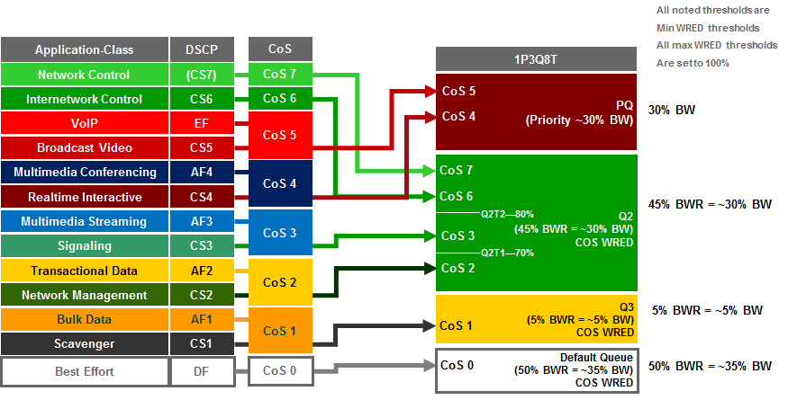

The following configuration, provisioned by APIC-EM EasyQoS, implements
the class-maps for the 1P3Q8T egress queuing structure.

!

class-map type lan-queuing match-any prm-EZQOS\_1P3Q8T#PQ

match cos 4

match cos 5

class-map type lan-queuing match-any prm-EZQOS\_1P3Q8T#Q2

match cos 2

match cos 3

match cos 6

match cos 7

class-map type lan-queuing match-any prm-EZQOS\_1P3Q8T#Q3

match cos 1

!

The following configuration, provisioned by APIC-EM EasyQoS, implements
the policy-map for the 1P3Q8T egress queuing structure.

!

policy-map type lan-queuing prm-dscp#EZQOS\_1P3Q8T-OUT

class prm-EZQOS\_1P3Q8T#PQ

priority

class prm-EZQOS\_1P3Q8T#Q2

bandwidth remaining percent 45

random-detect cos-based

random-detect cos 2 percent 70 100

random-detect cos 3 percent 80 100

random-detect cos 6 percent 100 100

random-detect cos 7 percent 100 100

class prm-EZQOS\_1P3Q8T#Q3

bandwidth remaining percent 5

random-detect cos-based

random-detect cos 1 percent 80 100

class class-default

random-detect cos-based

random-detect cos 0 percent 80 100

!

The network operator should note that depending upon the particular line
card, the policy-map configuration may look subtly different.
Specifically the class configurations under the policy-map definition
may include the words “type lan-queuing” within the definitions as shown
below.

!

policy-map type lan-queuing prm-dscp#EZQOS\_1P3Q8T-OUT

class type lan-queuing prm-EZQOS\_1P3Q8T#PQ

priority

class type lan-queuing prm-EZQOS\_1P3Q8T#Q2

bandwidth remaining percent 45

random-detect cos-based

random-detect cos 2 percent 70 100

random-detect cos 3 percent 80 100

random-detect cos 6 percent 100 100

random-detect cos 7 percent 100 100

class type lan-queuing prm-EZQOS\_1P3Q8T#Q3

bandwidth remaining percent 5

random-detect cos-based

random-detect cos 1 percent 80 100

class class-default

random-detect cos-based

random-detect cos 0 percent 80 100

!

Functionally, both variations of the policy-map definition are identical
and simply represent minor differences in how the policy-map is
displayed for various models of line cards. Other ingress and egress
queuing structures may also exhibit these minor differences as well.

The following configuration implements the 1P3Q8T egress queuing
structure. Additionally, it shows the application of the 1P3Q8T egress
queuing structure to a Gigabit Ethernet interface.

The 1P3Q8T queuing policy-map is provisioned by EasyQoS to all Gigabit
Ethernet interfaces, in the egress direction, on the line cards that
support this queuing structure, with the following exceptions:

-  Interfaces which have been excluded from the QoS policy by the
   network operator, through the EasyQoS web-based GUI. This was
   discussed in the ***Policies*** section of the ***APIC-EM and the
   EasyQoS Application*** chapter.

-  Interfaces which are configured for dual-active fast-hello. This was
   discussed in the ***VSS and Dual-Active Fast Hello Configurations***
   section above.

An example of the provisioning to a Gigabit Ethernet interface is shown
below.

!

interface GigabitEthernet x/x/x

service-policy type lan-queuing output prm-dscp#EZQOS\_1P3Q8T-OUT

!

Due to the internal ASIC structure of the ports on the WS-X6748-SFP and
WS-X6748-GE-TX line cards, the egress queuing structure of the ports
cannot be configured independently. Instead, the queuing policy is
applied to groups of ports on the line card by APIC-EM EasyQoS.

1P3Q4T Egress Queuing

1P3Q4T egress queuing is supported by the following line cards:

-  VS-S2T-10G and VS-S2T-10G-XL with Gigabit Ethernet ports enabled

Enabling of the Gigabit Ethernet ports on the Sup-2T was discussed in
the ***2Q4T Ingress Queuing*** section above.

1P3Q4T egress queuing for the Sup-2T implements CoS-to-queue mapping,
with CoS-based WRED for congestion avoidance. The following figure shows
the 1P3Q4T egress queuing model.

1. 1P3Q4T Egress Queuing Model—CoS-to-Queue Mapping with CoS-based WRED

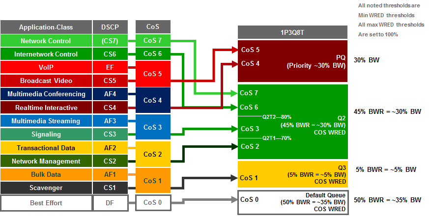

The following configuration, provisioned by APIC-EM EasyQoS, implements
the class-maps for the 1P3Q4T egress queuing structure.

!

class-map type lan-queuing match-any prm-QOS6K\_1P3Q4T#PQ

match cos 4

match cos 5

class-map type lan-queuing match-any prm-QOS6K\_1P3Q4T#Q2

match cos 2

match cos 3

match cos 6

match cos 7

class-map type lan-queuing match-any prm-QOS6K\_1P3Q4T#Q3

match cos 1

!

The following configuration, provisioned by APIC-EM EasyQoS, implements
the policy-map for the 1P3Q4T egress queuing structure.

!

policy-map type lan-queuing prm-dscp#QOS6K\_1P3Q4T-OUT

class type lan-queuing prm-QOS6K\_1P3Q4T#PQ

priority

class type lan-queuing prm-QOS6K\_1P3Q4T#Q2

bandwidth remaining percent 45

random-detect cos-based

random-detect cos 2 percent 70 100

random-detect cos 3 percent 80 100

random-detect cos 6 percent 100 100

random-detect cos 7 percent 100 100

class type lan-queuing prm-QOS6K\_1P3Q4T#Q3

bandwidth remaining percent 5

random-detect cos-based

random-detect cos 1 percent 80 100

class class-default

random-detect cos-based

random-detect cos 0 percent 80 100

!

The 1P3Q4T queuing policy-map is provisioned by EasyQoS to all Gigabit
Ethernet interfaces, in the egress direction, on the supervisor that
supports this queuing structure, with the following exceptions:

-  Interfaces which have been excluded from the QoS policy by the
   network operator, through the EasyQoS web-based GUI. This was
   discussed in the ***Policies*** section of the ***APIC-EM and the
   EasyQoS Application*** chapter.

-  Interfaces which are part of a VSL configuration or share an ASIC
   with other interfaces which are part of a VSL configuration, or
   interfaces which are configured for dual-active fast-hello. This was
   discussed in the ***VSS and Dual-Active Fast Hello Configurations***
   section above.

An example of the provisioning to a Gigabit Ethernet interface is shown
below.

!

interface GigabitEthernet x/x/x

service-policy type lan-queuing output prm-dscp#QOS6K\_1P3Q4T-OUT

!

As discussed in the ***2Q4T Ingress Queuing*** section above, QoS
service policies cannot be applied to TenGigabitEthernet ports on the
Sup-2T when the TenGigabitEthernet ports are part of a port-channel
group that is part of a virtual switch link (VSL). Also, QoS service
policies cannot be applied to Gigabit Ethernet ports on the Sup-2T when
the TenGigabitEthernet ports are part of a VSL.

Finally, due to the internal ASIC structure of the ports on the Sup-2T,
the egress queuing structure of the ports cannot be configured
independently. Instead, the queuing policy is applied to groups of ports
on the line card by APIC-EM EasyQoS.

1P7Q4T Egress Queuing

1P7Q4T egress queuing is supported by the following line cards:

-  WS-X6908-10G-2T and WS-X6908-10G-2TXL

-  VS-S2T-10G and VS-S2T-10G-XL with Gigabit Ethernet ports disabled

Disabling of the Gigabit Ethernet ports on the Sup-2T was discussed in
the ***8Q4T Ingress Queuing*** section above.

1P7Q4T egress queuing for these line cards implements DSCP-to-queue
mapping, with DSCP-based WRED for congestion avoidance. APIC-EM release
1.5 and higher does not allow per traffic-class bandwidth allocations to
be modified in the egress direction for line cards which support the
1P7Q4T egress queuing structure. However, per traffic-class DSCP
markings are supported in the egress direction for line cards which
support the 1P7Q4Tegress queuing structure, because these line cards
support DSCP-to-queue mapping. The default DSCP markings are part of the
CVD\_QUEUING\_PROFILE that is applied by default, unless the network
operator applies a custom Queuing Profile to the policy scope containing
these line cards.

The following figure shows the default 1P7Q4T egress queuing model.

1. 1P7Q4T Egress Queuing Model—DSCP-to-Queue Mapping with DSCP-based
   WRED

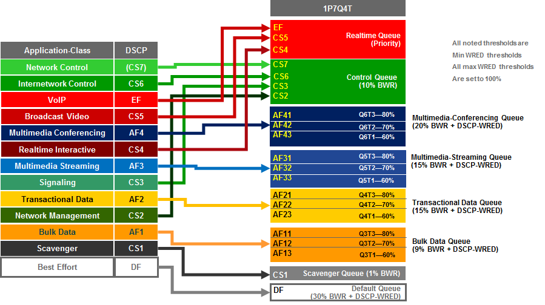

The following configuration, provisioned by APIC-EM EasyQoS, implements
the class-maps for the default 1P7Q4T egress queuing structure.

!

class-map type lan-queuing match-any prm-EZQOS\_1P7Q4T#REALTIME

match dscp cs4

match dscp cs5

match dscp ef

class-map type lan-queuing match-any prm-EZQOS\_1P7Q4T#MM\_CONF

match dscp af41

match dscp af42

match dscp af43

class-map type lan-queuing match-any prm-EZQOS\_1P7Q4T#MM\_STREAM

match dscp af31

match dscp af32

match dscp af33

class-map type lan-queuing match-any prm-EZQOS\_1P7Q4T#CONTROL

match dscp cs2

match dscp cs3

match dscp cs6

match dscp cs7

class-map type lan-queuing match-any prm-EZQOS\_1P7Q4T#TRANS\_DATA

match dscp af21

match dscp af22

match dscp af23

class-map type lan-queuing match-any prm-EZQOS\_1P7Q4T#BULK\_DATA

match dscp af11

match dscp af12

match dscp af13

class-map type lan-queuing match-any prm-EZQOS\_1P7Q4T#SCAVENGER

match dscp cs1

!

The following configuration, provisioned by APIC-EM EasyQoS, implements
the policy-map for the default 1P7Q4T egress queuing structure.

!

policy-map type lan-queuing prm-dscp#EZQOS\_1P7Q4T-OUT

class prm-EZQOS\_1P7Q4T#REALTIME

priority

class prm-EZQOS\_1P7Q4T#CONTROL

bandwidth remaining percent 10

class prm-EZQOS\_1P7Q4T#MM\_CONF

bandwidth remaining percent 20

random-detect dscp-based

random-detect dscp 34 percent 80 100

random-detect dscp 36 percent 70 100

random-detect dscp 38 percent 60 100

class prm-EZQOS\_1P7Q4T#MM\_STREAM

bandwidth remaining percent 15

random-detect dscp-based

random-detect dscp 26 percent 80 100

random-detect dscp 28 percent 70 100

random-detect dscp 30 percent 60 100

class prm-EZQOS\_1P7Q4T#TRANS\_DATA

bandwidth remaining percent 15

random-detect dscp-based

random-detect dscp 18 percent 80 100

random-detect dscp 20 percent 70 100

random-detect dscp 22 percent 60 100

class prm-EZQOS\_1P7Q4T#BULK\_DATA

bandwidth remaining percent 9

random-detect dscp-based

random-detect dscp 10 percent 80 100

random-detect dscp 12 percent 70 100

random-detect dscp 14 percent 60 100

class prm-EZQOS\_1P7Q4T#SCAVENGER

bandwidth remaining percent 1

class class-default

random-detect dscp-based

random-detect dscp 0 percent 80 100

!

The 1P7Q4T queuing policy-map is provisioned by EasyQoS to all
TenGigabitEthernet interfaces, in the egress direction, on the line
cards that support this queuing structure, with the following
exceptions:

-  Interfaces which have been excluded from the QoS policy by the
   network operator, through the EasyQoS web-based GUI. This was
   discussed in the ***Policies*** section of the ***APIC-EM and the
   EasyQoS Application*** chapter.

-  Interfaces which are part of a VSL configuration or share an ASIC
   with other interfaces which are part of a VSL configuration, or
   interfaces which are configured for dual-active fast-hello. This was
   discussed in the ***VSS and Dual-Active Fast Hello Configurations***
   section above.

An example of the provisioning to a TenGigabitEthernet interface is
shown below.

!

interface TenGigabitEthernetx/x

service-policy type lan-queuing output prm-dscp#EZQOS\_1P7Q4T-OUT

!

Custom Queuing Profiles

EasyQoS within APIC-EM release 1.5 and higher provides the network
operator the ability to change the both the DSCP marking and the
bandwidth allocation of traffic-classes through custom Queuing Profiles
in the web-based GUI. Bandwidth allocations configured within custom
Queuing Profiles are not implemented on line cards which support the
1P7Q4T egress queuing structure. Instead, the default 1P7Q4T egress
queuing structure discussed in the previous section is always
implemented by EasyQoS. However, for line cards which support the 1P7Q4T
egress queuing structure, custom DSCP markings are implemented.

Custom Queuing Profiles were discussed in the ***Advanced Settings***
section of the ***APIC-EM and the EasyQoS Application*** chapter.
Figures 37 showed an example of setting the DSCP markings within custom
Queuing Profile named EasyQoS\_Lab\_Queuing\_Profile. Within that
example, Broadcast Video traffic was configured with a DSCP marking of
CS3, and Signaling traffic was configured with a DSCP marking of CS5.

Changing the DSCP markings of traffic-classes within the EasyQoS
web-based GUI affects the “match dscp” statements of class-map
definitions within the egress queuing policy of line cards which support
the 1P7Q4T egress queuing structure. The following output is an example
of the modification of the class-map definitions provisioned by EasyQoS,
based upon the DSCP markings from the EasyQoS\_Lab\_Queuing Profile,
shown in the table above. The affected class-map definitions are
highlighted in bold.

**class-map type lan-queuing match-any prm-EZQOS\_1P7Q4T#REALTIME**

match dscp cs4

**match dscp cs3 **

match dscp ef

class-map type lan-queuing match-any prm-EZQOS\_1P7Q4T#MM\_CONF

match dscp af41

match dscp af42

match dscp af43

class-map type lan-queuing match-any prm-EZQOS\_1P7Q4T#MM\_STREAM

match dscp af31

match dscp af32

match dscp af33

**class-map type lan-queuing match-any prm-EZQOS\_1P7Q4T#CONTROL**

match dscp cs2

**match dscp cs5**

match dscp cs6

match dscp cs7

class-map type lan-queuing match-any prm-EZQOS\_1P7Q4T#TRANS\_DATA

match dscp af21

match dscp af22

match dscp af23

class-map type lan-queuing match-any prm-EZQOS\_1P7Q4T#BULK\_DATA

match dscp af11

match dscp af12

match dscp af13

class-map type lan-queuing match-any prm-EZQOS\_1P7Q4T#SCAVENGER

match dscp cs1

!

As can be seen by comparing the the class-map definitions between the
default 8Q4T ingress queuing structure and the EasyQoS\_Lab\_Queuing
Profile, the Realtime queue which services the Broadcast Video
traffic-class matches on CS3 instead of CS5, and the Control queue which
services the Signaling traffic-class matches on CS5 instead of CS3.

1P7Q8T Egress Queuing

1P7Q8T egress queuing is supported by the following line cards:

-  WS-X6704-10GE with CFC

-  WS-X6704-10GE with a DFC4 or DFC4XL upgrade (WS-F6k-DFC4-A,
   WS-F6k-DFC4-AXL)

1P7Q8T egress queuing for these line cards implements CoS-to-queue
mapping, with CoS-based tail-drop for congestion avoidance. Note that
due to the combination of 8 queues and only 8 CoS values, tail-drop
thresholds are not used in this design.

The following figure shows the 1P7Q8T egress queuing model.

1. 1P7Q8T Egress Queuing Model—CoS-to-Queue Mapping with CoS-based
   Tail-Drop

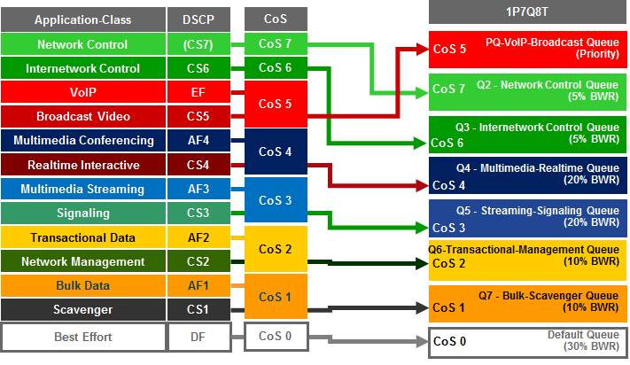

The following configuration, provisioned by APIC-EM EasyQoS, implements
the class-maps for the 1P7Q8T egress queuing structure.

!

class-map type lan-queuing match-any prm-EZQOS\_1P7Q8T#PQ

match cos 5

class-map type lan-queuing match-any prm-EZQOS\_1P7Q8T#Q2

match cos 7

class-map type lan-queuing match-any prm-EZQOS\_1P7Q8T#Q3

match cos 6

class-map type lan-queuing match-any prm-EZQOS\_1P7Q8T#Q4

match cos 4

class-map type lan-queuing match-any prm-EZQOS\_1P7Q8T#Q5

match cos 3

class-map type lan-queuing match-any prm-EZQOS\_1P7Q8T#Q6

match cos 2

class-map type lan-queuing match-any prm-EZQOS\_1P7Q8T#Q7

match cos 1

!

The following configuration, provisioned by APIC-EM EasyQoS, implements
the policy-map for the 1P7Q8T egress queuing structure.

!

policy-map type lan-queuing prm-dscp#EZQOS\_1P7Q8T-OUT

class type lan-queuing prm-EZQOS\_1P7Q8T#PQ

priority

class type lan-queuing prm-EZQOS\_1P7Q8T#Q2

bandwidth remaining percent 5

class type lan-queuing prm-EZQOS\_1P7Q8T#Q3

bandwidth remaining percent 5

class type lan-queuing prm-EZQOS\_1P7Q8T#Q4

bandwidth remaining percent 20

class type lan-queuing prm-EZQOS\_1P7Q8T#Q5

bandwidth remaining percent 20

class type lan-queuing prm-EZQOS\_1P7Q8T#Q6

bandwidth remaining percent 10

class type lan-queuing prm-EZQOS\_1P7Q8T#Q7

bandwidth remaining percent 10

class class-default

!

The 1P7Q8T queuing policy-map is provisioned by EasyQoS to all
TenGigabitEthernet interfaces, in the egress direction, on the line
cards that support this queuing structure, with the following
exceptions:

-  Interfaces which have been excluded from the QoS policy by the
   network operator, through the EasyQoS web-based GUI. This was
   discussed in the ***Policies*** section of the ***APIC-EM and the
   EasyQoS Application*** chapter.

-  Interfaces which are configured for dual-active fast-hello. This was
   discussed in the ***VSS and Dual-Active Fast Hello Configurations***
   section above.

An example of the provisioning to a TenGigabitEthernet interface is
shown below.

!

interface TenGigabitEthernet x/x/x

service-policy type lan-queuing output prm-dscp#EZQOS\_1P7Q8T-OUT

!

Cisco Catalyst 6880 and 6840 Series Queuing Design

Catalyst 6880 and 6840 Series switch platforms are only supported in the
roles of a core-layer or distribution-layer switch within the APIC-EM
EasyQoS solution. These platforms feature an embedded supervisor—similar
to the Sup2T supervisor within Catalyst 6500 Series switches and the
Catalyst 6807-XL switch. Switch ports on the Catalyst 6880 and 6840
Series platforms support a 2P6Q4T ingress and egress queuing structure.
Hence the ingress and egress queuing design is the same as discussed in
the ***2P6Q4T Ingress and Egress Queuing*** section above and will not
be duplicated here for brevity.

Catalyst 6500 Sup720-10GE Queuing Design

The following sections discuss the ingress and egress queuing structures
pushed by APIC-EM to the ports of each of the line cards and supervisors
supported by EasyQoS for the Catalyst 6500 Series switch with
Sup720-10GE supervisor.

Ingress & egress queuing structures are dependent upon the following:

-  The model of the line card

-  Whether the line card supports a CFC or DFC (applies to WS-X6704,
   WS-X6724, and WS-X6748 series line cards)

-  Whether the Sup-720 (VS-S720-10G-3C and VS-S720-10G-3CXL) Gigabit
   Ethernet ports are enabled or disabled

For the Catalyst 6500 Series switch with Supervisor 720-10GE (Sup720),
if an unsupported line card is detected within the chassis, the behavior
of APIC-EM EasyQoS is to not provision any QoS configuration for the
entire platform. For the Catalyst 6500 Series switch with Sup720-10GE,
only line cards that have a DFC3C or DFC3CXL daughter card, or a CFC,
are supported. Older line cards that support a DFC3A or DFC3B daughter
card are not supported. Inserting the line card with one of these older
DFC3A or DFC3B daughter cards into the Catalyst 6500 with Sup720-10GE
may change the behavior of the platform. Specifically, the platform may
“downgrade” its capabilities to the least common denominator for
backward compatibility—meaning the lowest line card with a DFC3A or
DFC3B installed. These capabilities may not be compatible with the QoS
configurations provisioned by APIC-EM EasyQoS. Hence this is not
supported, and APIC-EM EasyQoS will not provision any QoS configuration
to Catalyst 6500 Series switch with Supervisor 720-10GE (Sup720), if an
unsupported line card is detected within the chassis. The network
operator will also be notified via the EasyQoS web-based GUI that an
unsupported line card was detected within the chassis.

The following figure provides a flowchart that can be used to determine
when ingress queuing is applied for the Catalyst 6500 Series with a
Sup-720.

1. When is Ingress Queuing Applied?

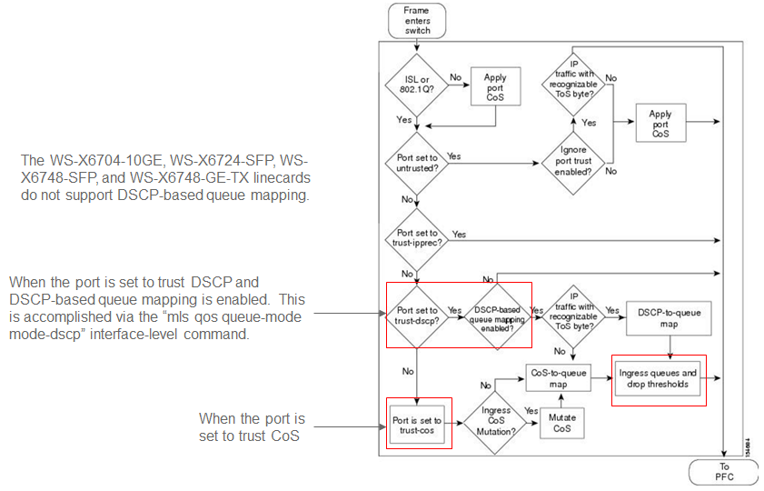

As can be seen in the figure above, ingress queuing applies under the
following conditions:

-  When a switch port is set to trust DSCP and DSCP-based queue mapping
   is enabled via the “mls qos queue-mode mode-DSCP” interface level
   command.

-  When the switch port is set to trust CoS.

Several WS-X67xx Series line cards do not support DSCP-based queue
mapping—they only support ingress CoS-to-queue mapping. With the EasyQoS
solution, trust of ingress CoS markings is never enabled on switch
ports. Trust of ingress DSCP markings is enabled on uplink ports. No
trust is enabled for switch ports directly connected to end-user
devices. Instead, an ingress classification & marking policy is used for
switch ports directly connected to end-user devices.

As a result of this, there really is no need of for APIC-EM EasyQoS to
push an ingress queuing policy from APIC-EM to the following line cards.
Only DSCP trust will be configured by EasyQoS for these line cards, on
uplink ports only.

-  WS-X6724-SFP with CFC, WS-X6748-SFP with CFC, WS-X67480GE-TX with
   CFC, WS-6704-10GE with CFC. These line cards support a 1Q8T ingress
   queuing structure with CoS-to-queue mapping and CoS-based tail-drop
   for congestion avoidance.

-  The Supervisor 720-10GE itself (VSS-720-10G-3C and VSS-S720-10G-3CXL)
   when the Gigabit Ethernet ports are active. The Sup720-10GE supports
   a 2Q4T ingress queuing structure with CoS-to-queue mapping and
   CoS-based tail-drop for congestion avoidance when the Gigabit
   Ethernet ports on the supervisor are active.

-  WS-X6724-SFP with DFC3C or DFC3CXL, WS-X6748-SFP with DFC3C or
   DFC3CXL, or WS-X6748-GE-TX with DFC3C or DFC3CXL (WS-F6700-FDC3C or
   WS-F6700-DFC3CXL). These line cards support an 8Q4T ingress queuing
   structure with CoS-to-queue mapping and CoS-based tail-drop for
   congestion avoidance.

-  WS-X6704-10GE with DFC3C or DFC3CXL (WS-F6700-FDC3C or
   WS-F6700-DFC3CXL). These line cards support an 8Q8T ingress queuing
   structure with CoS-to-queue mapping and CoS-based tail-drop for
   congestion avoidance.

The Catalyst 6500-E Series platforms with Sup-720 are MLS QoS based,
which require QoS to be enabled globally first before configuring any
other QoS commands. The following commands, provisioned by APIC-EM
EasyQoS, enable QoS globally and set the internal COS-to-DSCP mapping
table within the platform.

!

mls qos

! Globally Enables QoS

mls qos map cos-dscp 0 8 16 24 32 46 48 56

! Maps CoS 5 to 46 (rest are default)

!

-  Note: Catalyst 6K and 4K switches are supported in VSS and non-VSS
   configurations. When operating in a VSS configuration, switch ports
   that belong to a port-group, which in turn are part of the VSL
   between the individual switches in the VSS configuration, cannot be
   configured with any QoS policy. APIC-EM EasyQoS has the ability to
   identify ports that are part of a VSL and not apply QoS policy.

1Q8T Ingress Queuing

1Q8T ingress queuing is supported by the following line cards:

-  WS-X6704-10GE with CFC

-  WS-X6724-SFP with CFC

-  WS-X6748-SFP and WS-X6748-GE-TX with CFC

The WS-X6724-SFP, WS-X6748-SFP, WS-X6748-GE-TX, and WS-X6704-10GE line
cards are supported in the Catalyst 6500 Series Sup-720 with either a
CFC or a with a DFC version 3C or 3C-XL upgrade. The DFC is daughter
card that sits on the line card itself. Which slots within the Catalyst
6500 Series hold these line cards can be displayed via the “show module”
exec-level command. An example of the output of the “show module”
command is shown below, with a WS-X6748-GE-TX line card with a CFC in
slot 3 and a WS-X6748-GE-TX with a DFC3CXL in slot 4, highlighted.

6504E-Sup720-10G#show module

Mod Ports Card Type Model Serial No.

1 5 Supervisor Engine 720 10GE (Active) VS-S720-10G SAL14480SAC

2 5 Supervisor Engine 720 10GE (Cold) VS-S720-10G SAL12373BV5

**3 48 CEF720 48 port 10/100/1000mb Ethernet WS-X6748-GE-TX
SAL1418GV6P**

**4 48 CEF720 48 port 10/100/1000mb Ethernet WS-X6748-GE-TX
SAL1440VP6T**

Mod MAC addresses Hw Fw Sw Status

1 c47d.4ffe.68d8 to c47d.4ffe.68df 3.2 8.5(4) 12.2(33)SXI4 Ok

2 001e.4af8.4498 to 001e.4af8.449f 2.0 8.5(2) 12.2(33)SXI9 Ok

3 5475.d063.0340 to 5475.d063.036f 3.4 12.2(18r)S1 12.2(33)SXI4 Ok

4 1cdf.0f90.4c30 to 1cdf.0f90.4c5f 3.4 12.2(18r)S1 12.2(33)SXI4 Ok

Mod Sub-Module Model Serial Hw Status

1 Policy Feature Card 3 VS-F6K-PFC3CXL SAL14480QT0 1.2 Ok

1 MSFC3 Daughterboard VS-F6K-MSFC3 SAL14470GJ9 5.1 Ok

2 Policy Feature Card 3 VS-F6K-PFC3CXL SAL12383WAN 1.0 Ok

2 MSFC3 Daughterboard VS-F6K-MSFC3 SAL12373ADR 1.0 Ok

**3 Centralized Forwarding Card WS-F6700-CFC SAL1412DA30 4.1 Ok**

**4 Distributed Forwarding Card WS-F6700-DFC3CXL SAL1436SZX7 1.6 Ok**

1Q8T ingress queuing for these line cards implements CoS-to-queue
mapping, with CoS-based tail-drop for congestion avoidance. The
following figure shows the ingress queuing model implemented by the
EasyQoS solution for these line cards.

1. Queuing for WS-X6724-SFP with CFC, WS-X6748-SFP with CFC,
   WS-X6748-GE-TX with CFC, and WS-X6704-10GE with CFC when “trust cos”
   is Not Configured

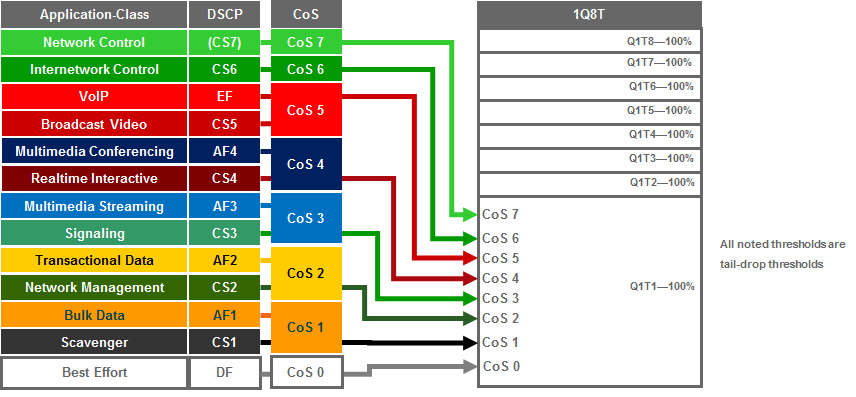

An example of the configuration pushed by APIC-EM for each of the ports
on these line cards is shown below.

!

interface GigabitEthernet x/x/x

! Switch ports connected to end-user devices

!

interface TenGigabitEthernet x/x/x

mls qos trust dscp

! Switch ports functioning as uplink ports

!

As can be seen, DSCP trust is extended to switch ports functioning as
uplink ports. These would typically correspond to TenGigabitEthernet
ports on the line card. Because no trust is extended on ingress switch
ports, all ingress traffic is treated as if it had a value of CoS 0 and
mapped to Q1T1 with a tail-drop threshold of 100%.

2Q4T Ingress Queuing

2Q4T ingress queuing is supported by the following line cards:

-  All ports on the VS-S720-10G-3C and VS-S720-10G-3CXL (Supervisor 720)
   when the Gigabit Ethernet ports are enabled.

The Gigabit Ethernet ports on the Sup-720 are enabled with the following
global configuration command.

!

no mls qos 10g-only

!

APIC-EM EasyQoS does not set this command but will look to see if this
command has been set by the network operator, in order to determine the
correct queuing structure to apply to ports on the Sup720-10GE
supervisor. The default setting is for the Gigabit Ethernet ports on the
Sup-720 to be enabled, so this command will not appear in the
configuration.

The status of whether the Gigabit Ethernet ports are enabled or disabled
can be displayed via the exec-level “show mls qos module x” command,
where “x” refers to the slot with the Sup-720. An example of the output
from the command is shown below:

6504E-Sup720-10G#show mls qos module 1

QoS is enabled globally

Policy marking depends on port\_trust

QoS ip packet DSCP rewrite enabled globally

QoS serial policing mode disabled globally

Input mode for GRE Tunnel is Pipe mode

Input mode for MPLS is Pipe mode

QoS Trust state is DSCP on the following interface:

Gi1/1 Gi1/2 Gi1/3 Gi2/1 Gi2/2 Gi2/3 Gi3/31 Po10

Vlan or Portchannel(Multi-Earl) policies supported: Yes

Egress policies supported: Yes

QoS 10g-only mode supported: Yes [Current mode: Off]

----- Module [1] -----

QoS global counters:

Total packets: 3920723

IP shortcut packets: 2196428

Packets dropped by policing: 0

IP packets with TOS changed by policing: 2

IP packets with COS changed by policing: 2

Non-IP packets with COS changed by policing: 0

MPLS packets with EXP changed by policing: 0

A setting of “Current mode: off” means that the Gigabit Ethernet ports
are enabled.

2Q4T ingress queuing for the Sup-720 implements CoS-to-queue mapping,
with CoS-based tail-drop for congestion avoidance. The Sup-720
interfaces do not support DSCP-based queue mapping when the 1 Gbps
interfaces are enabled—they only support ingress CoS-to-queue mapping.
With the EasyQoS solution, trust of ingress CoS markings is never
enabled. Trust of ingress DSCP markings is enabled on uplink ports. As a
result of this, there really is no need of provisioning the 2Q4T ingress
queuing policy from APIC-EM EasyQoS to the Sup-720 when the 1 Gbps ports
are enabled.

The following figure shows the ingress queuing model implemented by
APIC-EM EasyQoS for the Sup-720-10GE when the 1 Gbps ports are enabled.

1. Queuing for VS-S720-10G-3C and VS-S720-10G-3CXL with Gigabit Ethernet
   ports enabled and when “trust cos” is Not Configured

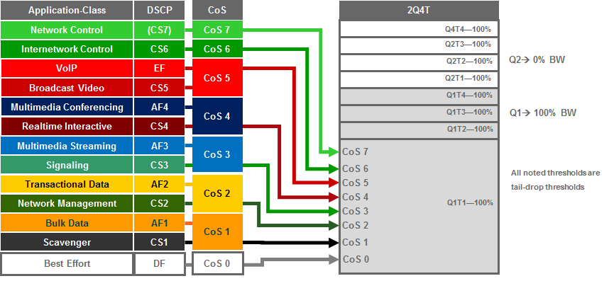

An example of the configuration provisioned by APIC-EM EasyQoS for the
Sup720-10GE ports is shown below.

!

interface GigabitEthernet x/x/x

mls qos trust dscp

! Switch ports functioning as uplink ports

!

interface TenGigabitEthernet x/x/x

mls qos trust dscp

! Switch ports functioning as uplink ports

!

Cisco does not recommend connecting end-user devices to any ports on the
Sup720-10GE. Hence, all ports on the Sup720-10GE are assumed to be
uplink ports by EasyQoS.

Because no trust is extended on ingress switch ports, all ingress
traffic is treated as if it had a value of CoS 0 and mapped to Q1T1 with
a tail-drop threshold of 100%.

It should be noted that QoS service policies cannot be applied to
TenGigabitEthernet ports on the Sup-720 when the TenGigabitEthernet
ports are part of a port-channel group that is part of a VSL. Switch
ports can be identified as part of a VSL based upon the configuration.
An example of this is shown below.

!

interface Port-channel20

no ip address

switch virtual link 1

no platform qos channel-consistency

~

interface TenGigabitEthernet1/1/4

no ip address

channel-group 20 mode on

!

interface TenGigabitEthernet1/1/5

no ip address

channel-group 20 mode on

!

Physical interfaces are assigned to a port-group via the “channel-group”
interface-level command. Port-channel interfaces are assigned to a VSL
via the “switch virtual link” interface-level command, as shown in the
configuration above.

Note also that, as with the Sup-2T, EasyQoS cannot apply any QoS policy
to either the TenGigabitEthernet or Gigabit Ethernet ports on the
Sup-720 when the TenGigabitEthernet ports are part of a VSL.

2Q8T Ingress Queuing

2Q8T ingress queuing is supported by the following line cards:

-  WS-X6724-SFP with a DFC3C or DFC3CXL (WS-F6700-DFC3C or
   WS-F6700-DFC3CXL)

-  WS-X6748-SFP with a DFC3C or DFC3CXL

-  WS-X6748-GE-TX with a DFC3C or DFC3CXL

How to determine if a line card has a CFC versus a DFC3C or DFC3CXL was
discussed in the ***1Q8T Ingress Queuing*** section above.

2Q8T ingress queuing for the Sup-720 implements CoS-to-queue mapping,
with CoS-based tail-drop for congestion avoidance. WS-X6724-SFP,
WS-X6748-SFP, and WS-X6748-GE-TX with DFC3C/DFC3CXL line cards do not
support DSCP-based queue mapping—they only support ingress CoS-to-queue
mapping. With the EasyQoS solution, trust of ingress CoS markings is
never enabled. Trust of ingress DSCP markings is enabled on uplink
ports. As a result of this, there really is no need of provisioning the
2Q8T ingress queuing policy from APIC-EM EasyQoS to the line cards with
this queuing structure.

The following figure shows the ingress queuing model implemented by
APIC-EM EasyQoS solution for the WS-X6724-SFP, WS-X6748-SFP, and
WS-X6748-GE-TX with DFC3C/DFC3CXL line cards.

1. Queuing for WS-X6724-SFP, WS-X6748-SFP, WS-X6748-GE-TX with a DFC3C
   or DFC3XL when “trust cos” is not configured

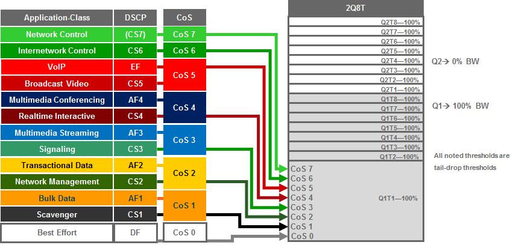

An example of the configuration pushed by APIC-EM EasyQoS for the
WS-X6724-SFP, WS-X6748-SFP, and WS-X6748-GE-TX with DFC3C/DFC3CXL line
card ports is shown below.

!

interface GigabitEthernet x/x/x

! Switch ports connected to end-user devices

!

interface GigabitEthernet x/x/x

mls qos trust dscp

! Switch ports functioning as uplink ports

!

Because the WS-X6724-SFP, WS-X6748-SFP, and WS-X6748-GE-TX with
DFC3C/DFC3CXL line card ports are all Gigabit Ethernet ports, generally
these ports are assumed to be connected to end-user devices. When these
ports are not used for uplinks, DSCP trust is not configured. If ports
are used for uplinks, then DSCP trust is configured.

Because no trust CoS is extended on ingress switch ports and
DSCP-to-queue mapping is not supported on these line cards, all ingress
traffic is treated as if it had a value of CoS 0 and mapped to Q1T1 with
a tail-drop threshold of 100%.

8Q4T Ingress Queuing

8Q4T ingress queuing is supported by the following line cards:

-  WS-X6708-10G-3C, WS-X6708-10G-3CXL

-  VS-S720-10G-3C with TenGigabitEthernet ports 4 & 5 when Gigabit
   Ethernet ports are inactive

The Gigabit Ethernet ports on the Sup-720 are enabled with the following
global configuration command.

!

mls qos 10g-only

!

APIC-EM EasyQoS does not set this command but will look to see if this
command has been set by the network operator, in order to determine the
correct queuing structure to apply to ports on the Sup720-10GE
supervisor. The default setting is for the Gigabit Ethernet ports on the
Sup-720 to be enabled, so this command will appear in the configuration
when the Gigabit Ethernet ports are disabled.

The status of whether the Gigabit Ethernet ports are enabled or disabled
can be displayed via the exec-level “show mls qos module x” command,
where “x” refers to the slot with the Sup-720. An example of the output
from the command is shown below:

6504E-Sup720-10G#show mls qos module 1

QoS is enabled globally

Policy marking depends on port\_trust

QoS ip packet DSCP rewrite enabled globally

QoS serial policing mode disabled globally

Input mode for GRE Tunnel is Pipe mode

Input mode for MPLS is Pipe mode

QoS Trust state is DSCP on the following interface:

Gi1/1 Gi1/2 Gi1/3 Gi2/1 Gi2/2 Gi2/3 Gi3/31 Po10

Vlan or Portchannel(Multi-Earl) policies supported: Yes

Egress policies supported: Yes

QoS 10g-only mode supported: Yes [Current mode: On]

----- Module [1] -----

QoS global counters:

Total packets: 3920723

IP shortcut packets: 2196428

Packets dropped by policing: 0

IP packets with TOS changed by policing: 2

IP packets with COS changed by policing: 2

Non-IP packets with COS changed by policing: 0

MPLS packets with EXP changed by policing: 0

A setting of “Current mode: On” means that the Gigabit Ethernet ports
are disabled.

8Q4T ingress queuing for these line cards implements DSCP-to-queue
mapping, with DSCP-based WRED for congestion avoidance. The following
figure shows the 8Q4T ingress queuing model.

1. 8Q4T Ingress Queuing Models—DSCP-to-Queue with DSCP-based WRED

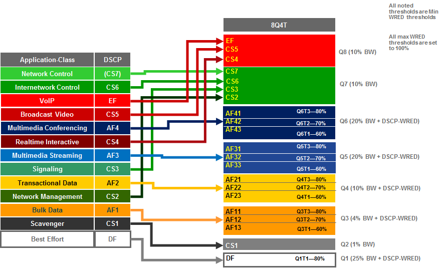

The following example configuration implements the 8Q4T ingress queuing
structure to a TenGigabitEthernet interface.

!

interface TenGigabitEthernet x/x/x

mls qos queue-mode mode-dscp

mls qos trust dscp

rcv-queue queue-limit 25 10 10 10 10 10 10 15

rcv-queue bandwidth 25 1 4 10 20 20 10 10

rcv-queue random-detect 1

no rcv-queue random-detect 2

rcv-queue random-detect 3

rcv-queue random-detect 4

rcv-queue random-detect 5

rcv-queue random-detect 6

no rcv-queue random-detect 7

no rcv-queue random-detect 8

rcv-queue random-detect max-threshold 1 100 100 100 100

rcv-queue random-detect min-threshold 1 80 100 100 100

rcv-queue random-detect max-threshold 3 100 100 100 100

rcv-queue random-detect min-threshold 3 60 70 80 100

rcv-queue random-detect max-threshold 4 100 100 100 100

rcv-queue random-detect min-threshold 4 60 70 80 100

rcv-queue random-detect max-threshold 5 100 100 100 100

rcv-queue random-detect min-threshold 5 60 70 80 100

rcv-queue random-detect max-threshold 6 100 100 100 100

rcv-queue random-detect min-threshold 6 60 70 80 100

rcv-queue dscp-map 1 1 0

rcv-queue dscp-map 2 1 8

rcv-queue dscp-map 3 1 14

rcv-queue dscp-map 3 2 12

rcv-queue dscp-map 3 3 10

rcv-queue dscp-map 4 1 22

rcv-queue dscp-map 4 2 20

rcv-queue dscp-map 4 3 18

rcv-queue dscp-map 5 1 30

rcv-queue dscp-map 5 2 28

rcv-queue dscp-map 5 3 26

rcv-queue dscp-map 6 1 38

rcv-queue dscp-map 6 2 36

rcv-queue dscp-map 6 3 34

rcv-queue dscp-map 7 1 16 24 48 56

rcv-queue dscp-map 8 1 32 40 46

!

For all of the line cards that support the 8Q4T ingress queuing
structure listed above, the ports are assumed to be uplink ports,
because they are all TenGigabitEthernet ports. If the Catalyst 6500
Series with Sup-720 is deployed as a distribution or core switch, and
the link connecting the switch port is not a trunk port, then all
ingress traffic will not have an 802.1p header. However, because these
line cards support DSCP-to-queue mapping, ingress traffic will still be
mapped into the correct queue based on the DSCP value of the IP packets.

8Q8T Ingress Queuing

8Q8T ingress queuing is supported by the following line cards:

-  WS-X6704-10GE with a DFC3C or DFC3XL (WS-F6700-DFC3C or
   WS-F6700-DFC3CXL)

How to determine if a line card has a CFC or DFC3C/3CXL was discussed in
the ***1Q8T Ingress Queuing*** section above.

8Q8T ingress queuing for these line cards implements CoS-to-queue
mapping, with CoS-based tail-drop for congestion avoidance.

WS-X67xx Series line cards do not support DSCP-based queue mapping—they
only support ingress CoS-to-queue mapping. With the EasyQoS solution,
trust of ingress CoS markings is never enabled on switch ports. Trust of
ingress DSCP markings is enabled on uplink ports. As a result of this,
there really is no need of provisioning the 8Q8T ingress queuing policy
from APIC-EM EasyQoS to the WS-X6704-10GE with DFC3C/DFC3CXL line cards.

The following figure shows the ingress queuing model implemented by
APIC-EM EasyQoS for these line cards.

1. Queuing for WS-X6704-10GE with a DFC3 or DFC3XL when “trust cos” is
   Not Configured

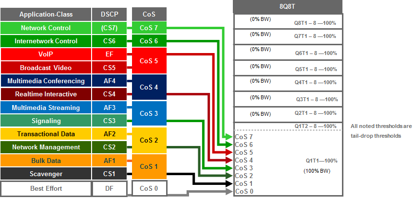

An example of the configuration provisioned by APIC-EM EasyQoS for these
line cards is shown below.

!

interface TenGigabitEthernet x/x/x

mls qos trust dscp

! Switch ports functioning as uplink ports

!

As can be seen, DSCP trust is extended to switch ports functioning as
uplink ports. Typically all ports on the WS-X6704-10GE line card would
be assumed to be uplink ports, because they are all TenGigabitEthernet
ports.

Because no trust CoS is extended on ingress switch ports and the line
card does not support DSCP-to-queue mapping, all ingress traffic is
treated as if it had a value of CoS 0, and mapped to Q1T1 with a
tail-drop threshold of 100%.

1P3Q8T Egress Queuing

1P3Q8T egress queuing is supported by the following line cards:

-  WS-X6724-SFP, WS-X6748-SFP, and WS-X6748-GE-TX with either CFC or
   DFC3/DFC3XL

1P3Q8T egress queuing for these line cards implements CoS-to-queue
mapping, with CoS-based tail-drop for congestion avoidance.

The following figure shows the 1P3Q8T egress queuing model.

1. 1P3Q8T Egress Queuing Models—CoS-to-Queue Mapping with CoS-WRED

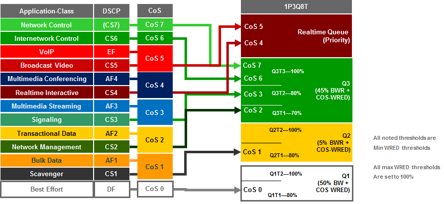

An example of the configuration provisioned by APIC-EM EasyQoS to a port
on these line cards is shown below.

!

interface GigabitEthernet x/x/x

wrr-queue queue-limit 40 15 40

priority-queue queue-limit 15

wrr-queue bandwidth 50 5 45

wrr-queue random-detect 1

wrr-queue random-detect 2

wrr-queue random-detect 3

wrr-queue random-detect max-threshold 1 100 100 100 100 100 100 100 100

wrr-queue random-detect min-threshold 1 80 100 100 100 100 100 100 100

wrr-queue random-detect max-threshold 2 100 100 100 100 100 100 100 100

wrr-queue random-detect min-threshold 2 80 100 100 100 100 100 100 100

wrr-queue random-detect max-threshold 3 100 100 100 100 100 100 100 100

wrr-queue random-detect min-threshold 3 70 80 100 100 100 100 100 100

wrr-queue cos-map 1 1 0

wrr-queue cos-map 2 1 1

wrr-queue cos-map 3 1 2

wrr-queue cos-map 3 2 3

wrr-queue cos-map 3 3 6 7

priority-queue cos-map 1 4 5

!

Due to the internal ASIC structure of the ports on the WS-X6748-SFP and
WS-X6748-GE-TX line cards, the egress queuing structure of the ports
cannot be configured independently. Instead, APIC-EM EasyQoS will apply
the queuing policy to groups of ports on the line card.

1P3Q4T Egress Queuing

1P3Q4T egress queuing is supported by the following line cards:

-  All ports on the VS-S720-10G-3C and VS-S720-10G-3CXL when the Gigabit
   Ethernet ports are enabled

Enabling of the Gigabit Ethernet ports on the Sup-2T was discussed in
the ***2Q4T Ingress Queuing*** section above.

1P3Q4T egress queuing for the Sup-720 implements CoS-to-queue mapping,
with CoS-based WRED for congestion avoidance. The following figure shows
the 1P3Q4T egress queuing model.

1. 1P3Q4T Egress Queuing Models—CoS-to-Queue Mapping with CoS-WRED

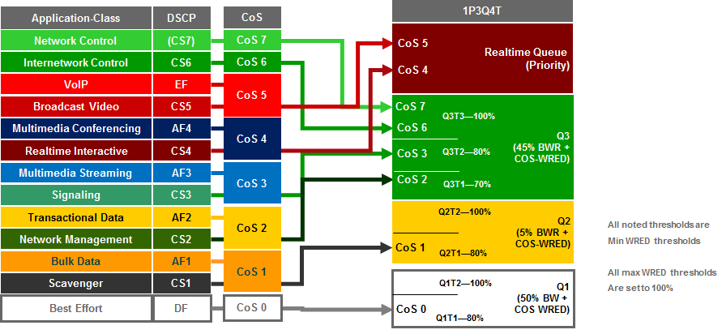

An example of the configuration provisioned by APIC-EM EasyQoS to both a
Gigabit Ethernet and a TenGigabitEthernet port on these line cards is
shown below.

!

interface GigabitEthernet x/x/x

wrr-queue queue-limit 40 15 40

priority-queue queue-limit 15

wrr-queue bandwidth 50 5 45

wrr-queue random-detect 1

wrr-queue random-detect 2

wrr-queue random-detect 3

wrr-queue random-detect max-threshold 1 100 100 100 100

wrr-queue random-detect min-threshold 1 80 100 100 100

wrr-queue random-detect max-threshold 2 100 100 100 100

wrr-queue random-detect min-threshold 2 80 100 100 100

wrr-queue random-detect max-threshold 3 100 100 100 100

wrr-queue random-detect min-threshold 3 70 80 100 100

wrr-queue cos-map 1 1 0

wrr-queue cos-map 2 1 1

wrr-queue cos-map 3 1 2

wrr-queue cos-map 3 2 3

wrr-queue cos-map 3 3 6 7

priority-queue cos-map 1 4 5

!

interface TenGigabitEthernet x/x/x

wrr-queue queue-limit 40 15 40

priority-queue queue-limit 15

wrr-queue bandwidth 50 5 45

wrr-queue random-detect 1

wrr-queue random-detect 2

wrr-queue random-detect 3

wrr-queue random-detect max-threshold 1 100 100 100 100

wrr-queue random-detect min-threshold 1 80 100 100 100

wrr-queue random-detect max-threshold 2 100 100 100 100

wrr-queue random-detect min-threshold 2 80 100 100 100

wrr-queue random-detect max-threshold 3 100 100 100 100

wrr-queue random-detect min-threshold 3 70 80 100 100

wrr-queue cos-map 1 1 0

wrr-queue cos-map 2 1 1

wrr-queue cos-map 3 1 2

wrr-queue cos-map 3 2 3

wrr-queue cos-map 3 3 6 7

priority-queue cos-map 1 4 5

!

As discussed in the ***2Q4T Ingress Queuing*** section above, QoS
service policies cannot be applied to TenGigabitEthernet ports on the
Sup-720, when the TenGigabitEthernet ports are part of a port-channel
group that is part of a VSL. Also, QoS service policies cannot be
applied to Gigabit Ethernet ports on the Sup-720 when the
TenGigabitEthernet ports are part of a VSL.

Finally, due to the internal ASIC structure of the ports on the Sup-720,
the egress queuing structure of the ports cannot be configured
independently. Instead, APIC-EM EasyQoS will apply the queuing policy to
groups of ports on the supervisor. This was discussed in the ***2Q4T
Ingress Queuing*** section above, as well.

1P7Q4T Egress Queuing

1P7Q4T egress queuing is supported by the following line cards:

-  WS-X6708-10G-3C and WS-X6708-10G-3CXL

-  VS-S720-10G-3C and VS-S720-10G-3CXL TenGigabitEthernet ports when the
   Gigabit Ethernet ports are inactive

1P7Q4T egress queuing for these line cards implements DSCP-to-queue
mapping, with DSCP-based WRED for congestion avoidance. The following
figure shows the 1P7Q4T egress queuing model.

1. 1P7Q4T Egress Queuing Models—DSCP-to-Queue Mapping with DSCP-based
   WRED

.. image:: media/image100.png

An example of the configuration provisioned by APIC-EM EasyQoS to a
TenGigabitEthernet port on these line cards is shown below.

!

interface range TenGigabitEthernet x/x-x

wrr-queue queue-limit 25 10 10 10 10 10 10

wrr-queue bandwidth 30 1 9 15 15 20 10

priority-queue queue-limit 15

wrr-queue random-detect 1

no wrr-queue random-detect 2

wrr-queue random-detect 3

wrr-queue random-detect 4

wrr-queue random-detect 5

wrr-queue random-detect 6

no wrr-queue random-detect 7

wrr-queue random-detect max-threshold 1 100 100 100 100

wrr-queue random-detect min-threshold 1 80 100 100 100

wrr-queue random-detect max-threshold 3 100 100 100 100

wrr-queue random-detect min-threshold 3 60 70 80 100

wrr-queue random-detect max-threshold 4 100 100 100 100

wrr-queue random-detect min-threshold 4 60 70 80 100

wrr-queue random-detect max-threshold 5 100 100 100 100

wrr-queue random-detect min-threshold 5 60 70 80 100

wrr-queue random-detect max-threshold 6 100 100 100 100

wrr-queue random-detect min-threshold 6 60 70 80 100

mls qos queue-mode mode-dscp

wrr-queue dscp-map 1 1 0

wrr-queue dscp-map 2 1 8

wrr-queue dscp-map 3 1 14

wrr-queue dscp-map 3 2 12

wrr-queue dscp-map 3 3 10

wrr-queue dscp-map 4 1 22

wrr-queue dscp-map 4 2 20

wrr-queue dscp-map 4 3 18

wrr-queue dscp-map 5 1 30

wrr-queue dscp-map 5 2 28

wrr-queue dscp-map 5 3 26

wrr-queue dscp-map 6 1 38

wrr-queue dscp-map 6 2 36

wrr-queue dscp-map 6 3 34

wrr-queue dscp-map 7 1 16 24 48 56

priority-queue dscp-map 1 32 40 46

!

1P7Q8T Egress Queuing

1P7Q8T egress queuing is supported by the following line cards:

-  WS-X6704-10GE with either CFC or DFC3/DFC3XL

1P7Q8T egress queuing for these line cards implements CoS-to-queue
mapping, with CoS-based tail-drop for congestion avoidance. Note that
due to the combination of 8 queues and only 8 CoS values, tail-drop
thresholds are not used in this design.

The following figure shows the 1P7Q8T egress queuing model.

1. 1P7Q8T Egress Queuing Models—CoS-to-Queue Mapping with COS-based WRED

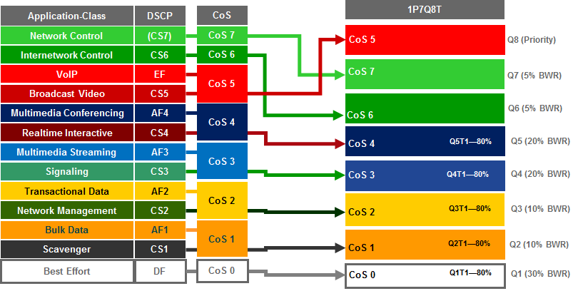

An example of the configuration provisioned by APIC-EM EasyQoS to a
TenGigabitEthernet port on these line cards is shown below.

!

interface TenGigabitEthernet x/x/x

wrr-queue queue-limit 25 10 10 15 15 5 5

wrr-queue bandwidth 30 10 10 20 20 5 5

priority-queue queue-limit 15

wrr-queue random-detect 1

wrr-queue random-detect 2

wrr-queue random-detect 3

wrr-queue random-detect 4

wrr-queue random-detect 5

no wrr-queue random-detect 6

no wrr-queue random-detect 7

wrr-queue random-detect max-threshold 1 100 100 100 100 100 100 100 100

wrr-queue random-detect min-threshold 1 80 100 100 100 100 100 100 100

wrr-queue random-detect max-threshold 2 100 100 100 100 100 100 100 100

wrr-queue random-detect min-threshold 2 80 100 100 100 100 100 100 100

wrr-queue random-detect max-threshold 3 100 100 100 100 100 100 100 100

wrr-queue random-detect min-threshold 3 80 100 100 100 100 100 100 100

wrr-queue random-detect max-threshold 4 100 100 100 100 100 100 100 100

wrr-queue random-detect min-threshold 4 80 100 100 100 100 100 100 100

wrr-queue random-detect max-threshold 5 100 100 100 100 100 100 100 100

wrr-queue random-detect min-threshold 5 80 100 100 100 100 100 100 100

wrr-queue cos-map 1 1 0

wrr-queue cos-map 2 1 1

wrr-queue cos-map 3 1 2

wrr-queue cos-map 4 1 3

wrr-queue cos-map 5 1 4

wrr-queue cos-map 6 1 6

wrr-queue cos-map 7 1 7

priority-queue cos-map 1 5

!

Cisco Nexus 7000/7700 Queuing Design

The only role Nexus 7000 and 7700 Series switches have within the
EasyQoS solution is as a campus-core switch. Only ingress and egress
queuing policies are pushed from APIC-EM to these switches. No ingress
classification & marking policies are pushed from APIC-EM to Nexus 7000
and 7700 Series switches

The following sections detail the ingress and egress queuing structures
pushed by APIC-EM to the ports of each of the Nexus 7000 and 7700 Series
modules supported by EasyQoS. Ingress & egress queuing structures are
dependent upon the type of module and the chassis in which they are
installed (Nexus 7000 versus Nexus 7700), as shown below:

-  M2 Series modules are only supported on Nexus 7000

-  8Q2T-IN/1P7Q4T-OUT queuing

-  F2 Series modules are only supported on Nexus 7000

-  4Q1T-IN/1P3Q1T-OUT queuing

-  F2E Series modules are supported on both the Nexus 7000 and the Nexus
   7700

-  F2E Series modules on the Nexus 7000 have identical queuing to F2
   Series modules (4Q1T-IN/1P3Q1T-OUT)

-  F2E Series modules on the Nexus 7700 have identical queuing to F3
   Series modules (4Q1T-IN/1P7Q1T-OUT)

-  F3 Series modules are supported on both the Nexus 7000 and the Nexus
   7700

-  F3 Series modules on the Nexus 7000 have identical queuing to F2
   Series modules (4Q1T-IN/1P3Q1T-OUT)

-  F3 Series modules on the Nexus 7700 implement 4Q1T-IN/1P7Q1T-OUT
   queuing

-  M3 Series modules are only supported on the Nexus 7700

-  4Q1T-IN/1P7Q1T-OUT queuing

-  Note: In APIC-EM release 1.3 and higher, EasyQoS only supports the
   Nexus 7000 or 7700 Series platforms configured with a single default
   VDC. Changing network QoS requires being logged into the default VDC.
   Changes to the system class-maps are made only on the default VDC but
   take effect immediately across all VDCs. Queuing policy maps are
   defined per VDC.

M2 Series Modules on the Nexus 7000

M2 Series modules consist of the following:

-  N7K-M224XP-23L

-  N7K-M206FQ-23L

-  N7K-M202CF-22L

These modules are only supported on the Nexus 7000 series chassis. M2
Series modules implement 8Q2T ingress queuing and 1P7Q4T egress queuing.

Nexus 7000 8Q2T Ingress Queuing

As of NX OS software version 6.2.2 and higher, ingress DSCP-to-Queue
mapping is supported on M2 Series modules and must be configured via the
following global configuration command.

!

hardware qos dscp-to-queue ingress module-type all

!

EasyQoS will provision this command to enable DSCP-to-Queue mapping
support on the M2 Series modules.

Trust of both CoS and DSCP values is implicit on the Nexus 7000 Series.
No explicit configuration is required to enable trust. Because both CoS
and DSCP values are trusted, queuing models for both CoS-to-queue
mapping and DSCP-to-queue mapping need to be configured by EasyQoS.

The following figure shows the CoS-to-queue mapping for the 8Q2T ingress
queuing model.

1. Ingress Queuing Model (8Q2T)—CoS-to-Queue Mapping

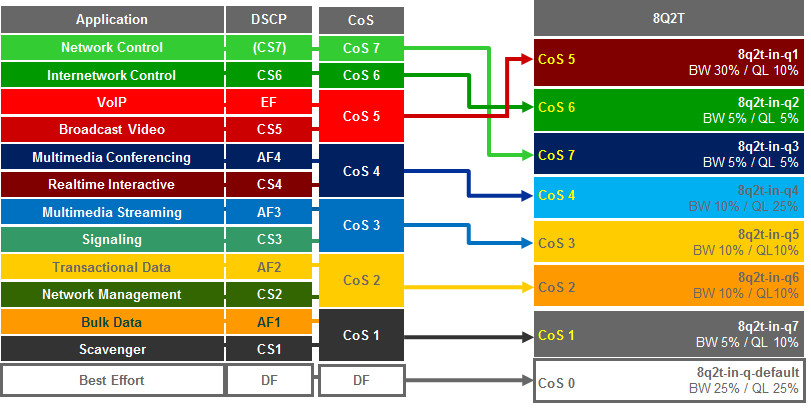

The following figure shows the DSCP-to-queue mapping for the 8Q2T
ingress queuing model.

1. Ingress Queuing Model (8Q2T)—DSCP-to-Queue Mapping

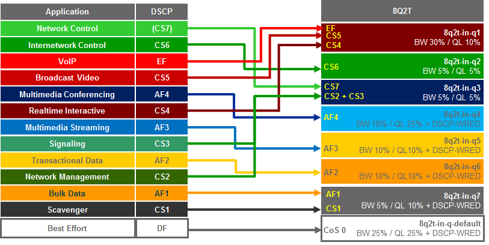

NX OS provides system-defined class-map names that cannot be renamed.
The system-defined class-map names that match the eight ingress queues
of the M2 Series modules are as follows:

-  8q2t-in-q1

-  8q2t-in-q2

-  8q2t-in-q3

-  8q2t-in-q4

-  8q2t-in-q5

-  8q2t-in-q6

-  8q2t-in-q7

-  8q2t-in-q-default

These class-maps have default and/or non-default (customer implemented)
CoS and/or DSCP values attached to them. These values can be reset with
“no match” commands.

A “no match DSCP” command causes one or more DSCP values (depending upon
whether a single DSCP value “x” was entered or a range of DSCP values
“x-y” was entered) attached to a particular class-map to be removed and
automatically attached to the 8q2t-in-q-default class-map. However, a
CoS value must first be mapped to the 8q2t-in-q-default class-map, or an
error will be generated.

A “no match cos” command causes one or more CoS values (depending upon
whether a single CoS value “x” was entered or a range of CoS values
“x-y” was entered) attached to a particular class-map to be removed and
automatically attached to the 8q2t-in-q-default class-map. However, all
CoS values cannot be removed from a particular class-map if there are
still DSCP values associated with the particular class-map. Attempting
this will generate an error. In other words, all CoS values cannot be
removed from a given class-map until all DSCP values have been removed
from the class-map. Finally, “no match” commands are not accepted on the
8q2t-in-q-default class-map and will generate an error.

Because APIC-EM EasyQoS has no knowledge of the existing mapping of the
DSCP and CoS values to the class-maps before configuring the ingress
queuing policy, it will first set all CoS and DSCP values to the
8q2t-in-q-default class-map before moving CoS and DSCP values to their
desired class-maps. EasyQoS then moves the DSCP and CoS values into the
desired class-maps. This is accomplished via the following commands.

!

class-map type queuing match-any 8q2t-in-q1

match dscp 32, 40, 46

match cos 5

class-map type queuing match-any 8q2t-in-q2

match dscp 48

match cos 6

class-map type queuing match-any 8q2t-in-q3

match dscp 16, 24, 56

match cos 7

class-map type queuing match-any 8q2t-in-q4

match dscp 34, 36, 38

match cos 4

class-map type queuing match-any 8q2t-in-q5

match dscp 26, 28, 30

match cos 3

class-map type queuing match-any 8q2t-in-q6

match dscp 18, 20, 22

match cos 2

class-map type queuing match-any 8q2t-in-q7

match dscp 8, 10, 12, 14

match cos 1

!

Any DSCP and CoS values that do not appear above are mapped to the
8q2t-in-q-default class-map. After the DSCP and CoS values have been
moved into the appropriate class-maps, the following configuration
provisioned by APIC-EM EasyQoS creates and configures the queuing
policy-map with the 8Q2T ingress queuing structure on the Nexus 7000
Series M2 modules.

!

policy-map type queuing prm-dscp#8q2t-in

class type queuing 8q2t-in-q1

bandwidth percent 30

queue-limit percent 10

class type queuing 8q2t-in-q2

bandwidth percent 5

queue-limit percent 5

class type queuing 8q2t-in-q3

bandwidth percent 5

queue-limit percent 5

class type queuing 8q2t-in-q4

bandwidth percent 10

queue-limit percent 25

random-detect dscp-based

random-detect dscp 34 minimum-threshold percent 80 maximum-threshold
percent 100

random-detect dscp 36 minimum-threshold percent 80 maximum-threshold
percent 100

random-detect dscp 38 minimum-threshold percent 80 maximum-threshold
percent 100

class type queuing 8q2t-in-q5

bandwidth percent 10

queue-limit percent 10

random-detect dscp-based

random-detect dscp 26 minimum-threshold percent 80 maximum-threshold
percent 100

random-detect dscp 28 minimum-threshold percent 80 maximum-threshold
percent 100

random-detect dscp 30 minimum-threshold percent 80 maximum-threshold
percent 100

class type queuing 8q2t-in-q6

bandwidth percent 10

queue-limit percent 10

random-detect dscp-based

random-detect dscp 18 minimum-threshold percent 80 maximum-threshold
percent 100

random-detect dscp 20 minimum-threshold percent 80 maximum-threshold
percent 100

random-detect dscp 22 minimum-threshold percent 80 maximum-threshold
percent 100

class type queuing 8q2t-in-q7

bandwidth percent 5

queue-limit percent 10

random-detect dscp-based

random-detect dscp 8 minimum-threshold percent 80 maximum-threshold
percent 100

random-detect dscp 10 minimum-threshold percent 80 maximum-threshold
percent 100

random-detect dscp 12 minimum-threshold percent 80 maximum-threshold
percent 100

random-detect dscp 14 minimum-threshold percent 80 maximum-threshold
percent 100

class type queuing 8q2t-in-q-default

bandwidth percent 25

queue-limit percent 25

random-detect dscp-based

random-detect dscp 0 minimum-threshold percent 80 maximum-threshold
percent 100

!

The policy-map with the 8Q2T ingress queuing structure is then applied
by APIC-EM EasyQoS to Ethernet interfaces that connect to either other
core-layer switches or to distribution-layer switches. Additionally, the
policy-map can be applied to the logical port-channel interface when an
EtherChannel connection is used for port-level resilience, instead of a
single physical interface. An example of the configuration of the policy
to an Ethernet and a Port-channel interface is shown below.

!

interface Ethernet x/x

service-policy type queuing input prm-dscp#8q2t-in

!

interface port-channel xxx

service-policy type queuing input prm-dscp#8q2t-in

!

Nexus 7000 1P7Q4T Egress Queuing

For egress queuing, only CoS-to-Queue mapping is supported on M2 Series
modules. The following figure shows the CoS-to-queue mapping for the
1P7Q4T egress queuing model.

1. Egress Queuing Model (1P7Q4T)—CoS-to-Queue Mapping

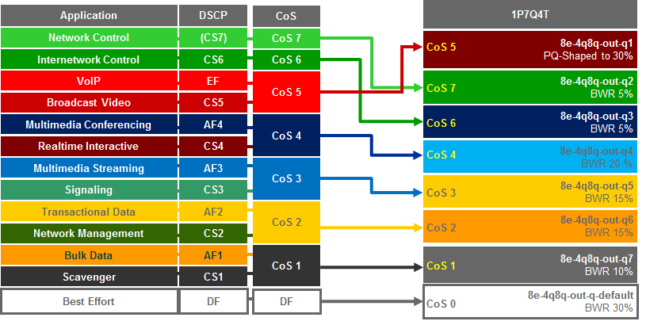

NX OS provides system-defined class-map names that cannot be renamed.
The system-defined class-map names that match the eight output queues of
the M2 Series modules are as follows:

-  1p7q4t-out-pq1

-  1p7q4t-out-q2

-  1p7q4t-out-q3

-  1p7q4t-out-q4

-  1p7q4t-out-q5

-  1p7q4t-out-q6

-  1p7q4t-out-q7

-  1p7q4t-out-q-default

These class-maps have default and/or non-default (customer implemented)
CoS values attached to them. These values can be reset with “no match
cos” commands. A “no match cos” command causes one or more CoS values
(depending upon whether a single CoS value “x” was entered or a range of
CoS values “x-y” was entered) attached to a particular class-map to be
removed and automatically attached to the 1p7q4t-out-q-default
class-map.

Because APIC-EM EasyQoS has no knowledge of the existing mapping of the
CoS values to the class-maps before configuring the ingress queuing
policy, it will first set all CoS values to the 1p7q4t-out-q-default
class-map before moving CoS values to their desired class-maps. This is
accomplished via the following commands.

!

class-map type queuing match-any 1p7q4t-out-pq1

no match cos 0-7

class-map type queuing match-any 1p7q4t-out-q2

no match cos 0-7

class-map type queuing match-any 1p7q4t-out-q3

no match cos 0-7

class-map type queuing match-any 1p7q4t-out-q4

no match cos 0-7

class-map type queuing match-any 1p7q4t-out-q5

no match cos 0-7

class-map type queuing match-any 1p7q4t-out-q6

no match cos 0-7

class-map type queuing match-any 1p7q4t-out-q7

no match cos 0-7

!

Note that because there are no DSCP values within egress class-maps,
there are no issues with moving CoS values to the default class-map, as
was discussed in the ***Nexus 7000 8Q2T Ingress Queuing*** section
above.

APIC-EM EasyQoS can then move CoS values into the desired class-maps.
This is accomplished via the following commands.

!

class-map type queuing match-any 1p7q4t-out-pq1

match cos 5

class-map type queuing match-any 1p7q4t-out-q2

match cos 7

class-map type queuing match-any 1p7q4t-out-q3

match cos 6

class-map type queuing match-any 1p7q4t-out-q4

match cos 4

class-map type queuing match-any 1p7q4t-out-q5

match cos 3

class-map type queuing match-any 1p7q4t-out-q6

match cos 2

class-map type queuing match-any 1p7q4t-out-q7

match cos 1

!

Any CoS values that do not appear above (CoS 0) are mapped to the
1p7q4t-out-q-default class-map. After the CoS values have been moved
into the appropriate class-maps, the following configuration provisioned
by APIC-EM EasyQoS creates and configures the queuing policy-map with
the 1P7Q4T egress queuing structure on the Nexus 7000 Series M2 modules.

!

policy-map type queuing prm-dscp#1p7q4t-out

class type queuing 1p7q4t-out-pq1

priority

shape average percent 30

queue-limit percent 10

class type queuing 1p7q4t-out-q2

bandwidth remaining percent 5

queue-limit percent 5

class type queuing 1p7q4t-out-q3

bandwidth remaining percent 5

queue-limit percent 5

class type queuing 1p7q4t-out-q4

bandwidth remaining percent 20

queue-limit percent 25

random-detect cos-based

random-detect cos 4 minimum-threshold percent 80 maximum-threshold
percent 100

class type queuing 1p7q4t-out-q5

bandwidth remaining percent 15

queue-limit percent 10

random-detect cos-based

random-detect cos 3 minimum-threshold percent 80 maximum-threshold
percent 100

class type queuing 1p7q4t-out-q6

bandwidth remaining percent 15

queue-limit percent 10

random-detect cos-based

random-detect cos 2 minimum-threshold percent 80 maximum-threshold
percent 100

class type queuing 1p7q4t-out-q7

bandwidth remaining percent 10

queue-limit percent 10

random-detect cos-based

random-detect cos 1 minimum-threshold percent 80 maximum-threshold
percent 100

class type queuing 1p7q4t-out-q-default

bandwidth remaining percent 30

queue-limit percent 25

random-detect cos-based

random-detect cos 0 minimum-threshold percent 80 maximum-threshold
percent 100

!

The policy-map with the 1P7Q4T egress queuing structure is then applied
to Ethernet interfaces that connect to either other core-layer switches
or to distribution-layer switches. Additionally, the policy-map can be
applied to the logical port-channel interface when an EtherChannel
connection is used for port-level resilience, instead of a single
physical interface. An example of the configuration of the policy to an
Ethernet and a Port-channel interface is shown below.

!

interface Ethernet x/x

service-policy type queuing output prm-dscp#1p7q4t-out

!

interface port-channel xxx

service-policy type queuing output prm-dscp#1p7q4t-out

!

F2/F2e/F3 Modules on the Nexus 7000

F2, F2e, and F3 Series modules for the Nexus 7000 consist of the
following:

-  N7K-F248XP-25

-  N7K-F248XP-25E

-  N7K-F248XT-25E

-  N7K-F348XP-25

-  N7K-F312FQ-25

-  N7K-F306CK-25

These modules are only supported on the Nexus 7000 series chassis.

The ingress and egress queuing structure for F2, F2e, and F3 Series
modules on the Nexus 7000 is determined by the system network QoS
policy. When an F2, F2e, or F3 Series module is inserted and becomes
operational within the Nexus 7000 chassis, five network-qos policies
(templates) are automatically added to the system. The following figure
shows the five network-QoS templates available in the Nexus 7000
chassis.

1. NX-OS Network-QoS Templates for the F2, F2e, and F3 Series Modules on
   the Nexus 7000

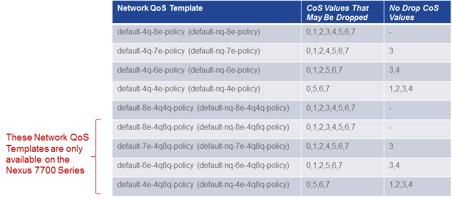

Network-qos policy template names contain the abbreviation “nq”,
referring to network-qos, and “e,” referring to Ethernet. The numbers 4,
6, 7, and 8 denote the number of drop CoS values (in other words the
number of CoS values that may be dropped during congestion) that are
defined within the policy template.

-  Note: The bottom four templates are only available in the Nexus 7700
   Series chassis and not the Nexus 7000 Series chassis.

For data center deployments, there may be requirements for a particular
CoS value not to be dropped during congestion. However, campus core
deployments typically do not have such requirements. Hence, the
default-nq-8e-policy or default-nq-8e-4q4q-policy templates are more
appropriate for campus core deployments featuring Nexus 7000 chassis
with F2, F2e, and/or F3 Series modules. By default, the
default-nq-8e-policy is applied by the system.

The “4q4q” in the default-nq-8e-4q4q-policy template refers to the fact
that both the ingress and egress queuing structures use four queues. The
default-nq-8e-policy template uses an ingress queuing structure that
uses only two queues and an egress queuing structure that uses four
queues. Because the default-nq-8e-4q4q-policy template better uses the
available ingress queuing structure, this is the network-qos policy
template that APIC-EM EasyQoS configures via the following global
configuration commands.

!

system qos

service-policy type network-qos default-nq-8e-4q4q-policy

!

This configuration change can be validated via exec-level “show
policy-map system” command. An example of the output is shown below.

show policy-map system

Type network-qos policy-maps

============================

policy-map type network-qos default-nq-8e-4q4q-policy template 8e-4q4q

class type network-qos c-nq-8e-4q4q

match cos 0-7

congestion-control tail-drop threshold burst-optimized

mtu 1500

…

Service-policy input: default-8e-4q4q-in-policy

…

Service-policy output: default-8e-4q4q-out-policy

…

The following figure shows the default ingress queuing models for each
of the network-qos policy templates.

1. Default Ingress Queuing Models for the Network-QoS Templates

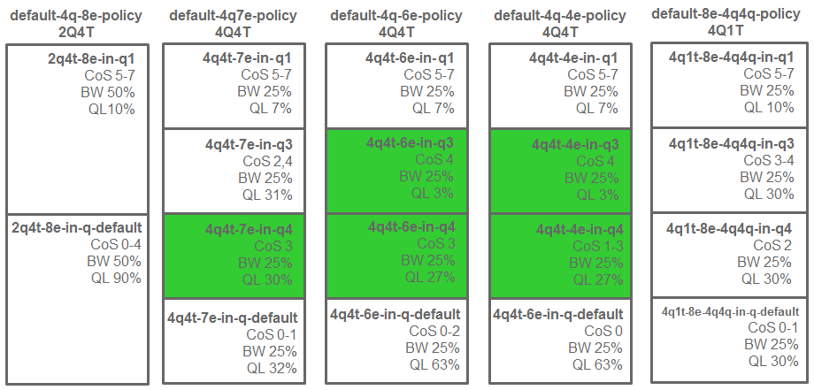

The following figure shows the default egress queuing models for each of
the network-qos policy templates.

1. Default Egress Queuing Models for the Network-QoS Templates

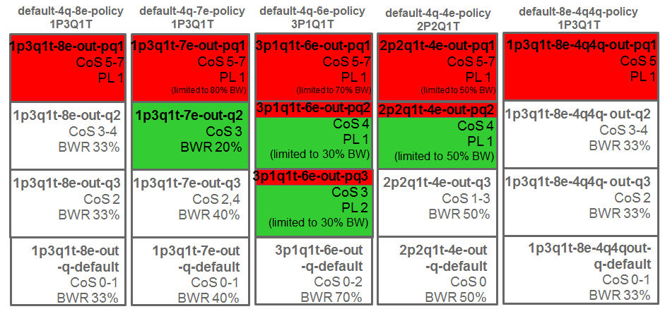

As can be seen from the figures above, the default-nq-8e-4q4q-policy
implements a 4Q1T ingress queuing structure and a1P3Q1T egress queuing
structure for F2, F2e, and F3 Series modules with the Nexus 7000.

Nexus 7000 4Q1T Ingress Queuing

As of NX OS software version 6.2.2 and higher ingress DSCP-to-Queue
mapping is supported on F2, F2e, and F3 Series modules and must be
configured via the following global configuration command.

!

hardware qos dscp-to-queue ingress module-type all

!

APIC-EM EasyQoS will provision this command to enable DSCP-to-Queue
mapping support on the F2/F2E/F3 Series modules for the Nexus 7000
Series.

Trust of both CoS and DSCP values is implicit on the Nexus 7000 Series.
No explicit configuration is required to enable trust.

The network-qos default-nq-8e-4q4q-policy template has a default ingress
queuing policy map that can be displayed via the exec-level “show
policy-map type queuing default-8e-4q4q-in-policy” command. An example
of the output is shown below.

DC-7010-2# show policy-map type queuing default-8e-4q4q-in-policy

Type queuing policy-maps

========================

policy-map type queuing default-8e-4q4q-in-policy

class type queuing 4q1t-8e-4q4q-in-q1

queue-limit percent 10

bandwidth percent 25

class type queuing 4q1t-8e-4q4q-in-q-default

queue-limit percent 30

bandwidth percent 25

class type queuing 4q1t-8e-4q4q-in-q3

queue-limit percent 30

bandwidth percent 25

class type queuing 4q1t-8e-4q4q-in-q4

queue-limit percent 30

bandwidth percent 25

For F2, F2e, and F3 series modules, the ingress queuing policy define
queue-limit percentages and bandwidth percentages for each of the
class-maps (which correspond to the queues). These percentages will be
modified by APIC-EM for the EasyQoS solution.

The network-qos default-nq-8e-4q4q-policy template also provides default
settings for the system-defined class-maps that can be displayed via the
exec-level “show class-map type queuing” command for each of the
system-defined class-map names. An example of the output for each of the
system-defined class-maps is shown below.

DC-7010-2# show class-map type queuing 4q1t-8e-4q4q-in-q1

Type queuing class-maps

========================

class-map type queuing match-any 4q1t-8e-4q4q-in-q1

Description: Classifier for Ingress queue 1 of type 4q1t-8e-4q4q

match cos 5-7

match dscp 40-63

DC-7010-2# show class-map type queuing 4q1t-8e-4q4q-in-q-default

Type queuing class-maps

========================

class-map type queuing match-any 4q1t-8e-4q4q-in-q-default

Description: Classifier for Ingress queue 2 of type 4q1t-8e-4q4q

match cos 0-1

match dscp 0-15

DC-7010-2# show class-map type queuing 4q1t-8e-4q4q-in-q3

Type queuing class-maps

========================

class-map type queuing match-any 4q1t-8e-4q4q-in-q3

Description: Classifier for Ingress queue 3 of type 4q1t-8e-4q4q

match cos 3-4

match dscp 24-39

DC-7010-2# show class-map type queuing 4q1t-8e-4q4q-in-q4

Type queuing class-maps

========================

class-map type queuing match-any 4q1t-8e-4q4q-in-q4

Description: Classifier for Ingress queue 4 of type 4q1t-8e-4q4q

match cos 2

match dscp 16-23

The system-defined class-maps have default settings for mapping CoS and
DSCP values to each of the class-maps. However, APIC-EM EasyQoS cannot
guarantee that the customer has not already previously configured the
default-nq-8e-4q4q-policy network-qos template and modified the default
mappings of CoS and DSCP values to class-maps. Because both CoS and DSCP
values are trusted, queuing models for both CoS-to-queue mapping and
DSCP-to-queue mapping need to be configured.

The following figure shows the CoS-to-queue mapping for the 4Q1T ingress
queuing model deployed by APIC-EM for the EasyQoS solution.

1. Ingress Queuing Model (4Q1T)—CoS-to-Queue Mapping

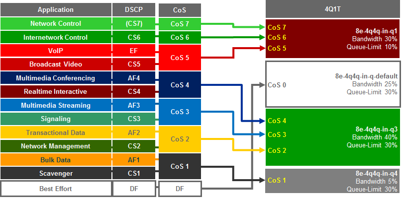

The following figure shows the DSCP-to-queue mapping for the 4Q1T
ingress queuing model deployed by APIC-EM for the EasyQoS solution.

1. Ingress Queuing Model (4Q1T)—DSCP-to-Queue Mapping

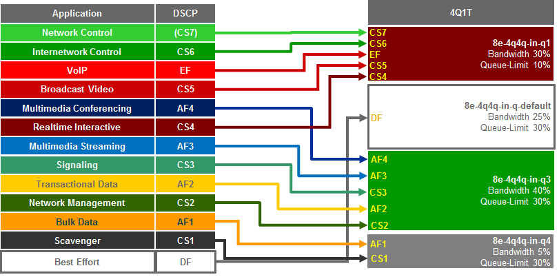

NX OS provides system-defined class-map names that cannot be renamed.
The system-defined class-map names that match the four ingress queues of
the F2, F2e and/or F3 Series modules for the Nexus 7000 are as follows:

-  4q1t-8e-4q4q-in-q1

-  4q1t-8e-4q4q-in-q3

-  4q1t-8e-4q4q-in-q4

-  4q1t-8e-4q4q-in-q-default

These class-maps have default and/or non-default (customer implemented)
CoS and/or DSCP values attached to them. These values can be reset with
“no match” commands.

A “no match DSCP” command causes one or more DSCP values (depending upon
whether a single DSCP value “x” was entered or a range of DSCP values
“x-y” was entered) attached to a particular class-map to be removed and
automatically attached to the 4q1t-8e-4q4q-in-q-default class-map.
However, a CoS value must first be mapped to the
4q1t-8e-4q4q-in-q-default class-map, or an error will be generated.

A “no match cos” command causes one or more CoS values (depending upon
whether a single CoS value “x” was entered or a range of CoS values
“x-y” was entered) attached to a particular class-map to be removed and
automatically attached to the 4q1t-8e-4q4q-in-q-default. However, all
CoS values cannot be removed from a particular class-map if there are
still DSCP values associated with the particular class-map. Attempting
this will generate an error. In other words, all CoS values cannot be
removed from a given class-map until all DSCP values have been removed
from the class-map. Finally, “no match” commands are not accepted on the
4q1t-8e-4q4q-in-q-default class-map and will generate an error.

Because APIC-EM has no knowledge of the existing mapping of the DSCP and
CoS values to the class-maps before configuring the ingress queuing
policy, it will first set all CoS and DSCP values to the
4q1t-8e-4q4q-in-q-default class-map before moving CoS and DSCP values to
their desired class-maps. APIC-EM EasyQoS then moves the DSCP and CoS
values into the desired class-maps. This is accomplished via the
following commands.

!

class-map type queuing match-any 4q1t-8e-4q4q-in-q1

match cos 5-7

match dscp 32, 40, 46, 48, 56

!

class-map type queuing match-any 4q1t-8e-4q4q-in-q3

match cos 2-4

match dscp 16, 18, 20, 22, 24, 26, 30, 34, 36, 38

!

class-map type queuing match-any 4q1t-8e-4q4q-in-q4

match cos 1

match dscp 8, 10, 12, 14

!

This will leave the default 4q1t-8e-4q4q-in-q-default queue with the
following configuration.

!

class-map type queuing match-any 4q1t-8e-4q4q-in-q-default

match cos 0

match dscp
0-7,9,11,13,15,17,19,21,23,25,27,29,31,33,35,37,39,41-45,47,49-55,57-63

!

After the DSCP and CoS values have been moved into the appropriate
class-maps, system-defined policy-map is cloned by appending “prm-DSCP#”
to the beginning of the system-defined policy map. This is done via the
following config-level command.

!

qos copy policy-map type queuing default-8e-4q4q-in-policy prefix
prm-dscp#

!

After the cloned policy-map is created, the following configuration
modifies the cloned queuing policy map with the 4Q1T ingress queuing
structure on the Nexus 7000 Series F2, F2e, and F3 modules.

!

policy-map type queuing prm-DSCP#8e-4q4q-in

class type queuing 4q1t-8e-4q4q-in-q4

queue-limit percent 30

bandwidth percent 5

class type queuing 4q1t-8e-4q4q-in-q1

queue-limit percent 10

bandwidth percent 30

class type queuing 4q1t-8e-4q4q-in-q3

queue-limit percent 30

bandwidth percent 40

class type queuing 4q1t-8e-4q4q-in-q-default

queue-limit percent 30

bandwidth percent 25

!

The policy-map with the 4Q1T ingress queuing structure is then applied
to Ethernet interfaces that connect to either other core-layer switches
or to distribution-layer switches. Additionally, the policy-map can be
applied to the logical port-channel interface when an EtherChannel
connection is used for port-level resilience, instead of a single
physical interface. An example of the configuration of the policy to an
Ethernet and a Port-channel interface is shown below.

!

interface Ethernet x/x

service-policy type queuing input prm-dscp#8e-4q4q-in

!

interface port-channel xxx

service-policy type queuing input prm-dscp#8e-4q4q-in

!

Nexus 7000 1P3Q1T Egress Queuing

The network-qos default-nq-8e-4q4q-policy template has a default egress
queuing policy map that can be displayed via the exec-level “show
policy-map type queuing default-8e-4q4q-out-policy” command. An example
of the output is shown below.

DC-7010-2# show policy-map type queuing default-8e-4q4q-out-policy

Type queuing policy-maps

========================

policy-map type queuing default-8e-4q4q-out-policy

class type queuing 1p3q1t-8e-4q4q-out-pq1

priority level 1

class type queuing 1p3q1t-8e-4q4q-out-q2

bandwidth remaining percent 33

class type queuing 1p3q1t-8e-4q4q-out-q3

bandwidth remaining percent 33

class type queuing 1p3q1t-8e-4q4q-out-q-default

bandwidth remaining percent 33

For F2, F2e, and F3 series modules, the egress queuing policy defines
the priority queue and the default bandwidth remaining bandwidth
percentages for each of the rest of the class-maps (which correspond to
the queues). These percentages will be modified by APIC-EM for the
EasyQoS solution.

The network-qos default-nq-8e-4q4q-policy template also provides default
settings for the system-defined class-maps that can be displayed via the
exec-level “show class-map type queuing” command for each of the
system-defined class-map names. An example of the output for each of the
system-defined class-maps is shown below.

DC-7010-2# show class-map type queuing 1p3q1t-8e-4q4q-out-pq1

Type queuing class-maps

========================

class-map type queuing match-any 1p3q1t-8e-4q4q-out-pq1

Description: Classifier for Egress Priority queue 1 of type
1p3q1t-8e-4q4q

match cos 5-7

DC-7010-2# show class-map type queuing 1p3q1t-8e-4q4q-out-q2

Type queuing class-maps

========================

class-map type queuing match-any 1p3q1t-8e-4q4q-out-q2

Description: Classifier for Egress queue 2 of type 1p3q1t-8e-4q4q

match cos 3-4

DC-7010-2# show class-map type queuing 1p3q1t-8e-4q4q-out-q3

Type queuing class-maps

========================

class-map type queuing match-any 1p3q1t-8e-4q4q-out-q3

Description: Classifier for Egress queue 3 of type 1p3q1t-8e-4q4q

match cos 2

DC-7010-2# show class-map type queuing 1p3q1t-8e-4q4q-out-q-default

Type queuing class-maps

========================

class-map type queuing match-any 1p3q1t-8e-4q4q-out-q-default

Description: Classifier for Egress queue 4 of type 1p3q1t-8e-4q4q

match cos 0-1

The system-defined class-maps have default settings for mapping CoS
values to each of the class-maps. However, APIC-EM EasyQoS cannot
guarantee that the customer has not already previously configured the
default-nq-8e-4q4q-policy network-qos template and modified the default
mappings of CoS and DSCP values to class-maps. Hence, the queuing models
for CoS-to-queue mapping need to be configured.

For egress queuing, only CoS-to-Queue mapping is supported on F2, F2e,
and F3 Series modules. The following figure shows the Cos-to-queue
mapping for the 1P3Q1T egress queuing model.

1. Egress Queuing Model (1P3Q1T)—CoS-to-Queue Mapping

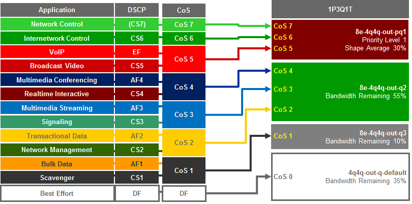

NX OS provides system-defined class-map names that cannot be renamed.
The system-defined class-map names that match the four output queues of
the F2, F2e, and F3 Series modules on the Nexus 7000 are as follows:

-  1p3q1t-out-pq1

-  1p3q1t-out-q3

-  1p3q1t-out-q4

-  1p3q1t-out-q-default

These class-maps have default and/or non-default (customer implemented)
CoS values attached to them. These values can be reset with “no match
cos” commands. A “no match cos” command causes one or more CoS values
(depending upon whether a single CoS value “x” was entered or a range of
CoS values “x-y” was entered) attached to a particular class-map to be
removed and automatically attached to the 1p3q1t-out-q-default
class-map.

Because APIC-EM has no knowledge of the existing mapping of the CoS
values to the class-maps before configuring the ingress queuing policy,
it will first set all CoS values to the 1p3q1t-out-q-default class-map
before moving CoS values to their desired class-maps. This is
accomplished via the following commands.

!

class-map type queuing match-any 1p3q1t-8e-4q4q-out-pq1

no match cos 0-7

class-map type queuing match-any 1p3q1t-8e-4q4q-out-q2

no match cos 0-7

class-map type queuing match-any 1p3q1t-8e-4q4q-out-q3

no match cos 0-7

!

-  Note: Because there are no DSCP values within egress class-maps,
   there are no issues with moving CoS values to the default class-map,
   as was discussed in the ***Nexus 7000 8Q2T Ingress Queuing***
   section.

APIC-EM can then move CoS values into the desired class-maps. This is
accomplished via the following commands.

!

class-map type queuing match-any 1p3q1t-8e-4q4q-out-pq1

match cos 5-7

class-map type queuing match-any 1p3q1t-8e-4q4q-out-q2

match cos 2-4

class-map type queuing match-any 1p3q1t-8e-4q4q-out-q3

match cos 1

!

After the CoS values have been moved into the appropriate class-maps,
the system-defined policy-map is cloned by appending “prm-dscp#” to the
beginning of the system-defined policy map. This is done via the
following config-level command.

!

qos copy policy-map type queuing default-8e-4q4q-out-policy prefix
prm-dscp#

!

After the cloned policy-map is created, the following configuration
modifies the cloned queuing policy-map with the 1P3Q1T egress queuing
structure on the Nexus 7000 Series F2, F2e, and F3 modules.

!

policy-map type queuing APIC\_EM-8e-4q4q-out

class type queuing 1p3q1t-8e-4q4q-out-pq1

priority level 1

shape average percent 30

class type queuing 1p3q1t-8e-4q4q-out-q3

bandwidth remaining percent 10

class type queuing 1p3q1t-8e-4q4q-out-q2

bandwidth remaining percent 55

class type queuing 1p3q1t-8e-4q4q-out-q-default

bandwidth remaining percent 35

!

The policy-map with the 1P3Q1T egress queuing structure is then applied
to Ethernet interfaces that connect to either other core-layer switches
or to distribution-layer switches. Additionally, the policy-map can be
applied to the logical port-channel interface when an EtherChannel
connection is used for port-level resilience, instead of a single
physical interface. An example of the configuration of the policy to an
Ethernet and a Port-channel interface is shown below.

!

interface Ethernet x/x

service-policy type queuing output prm-dscp#8e-4q4q-out

!

interface port-channel xxx

service-policy type queuing output prm-dscp#8e-4q4q-out

!

F2e and F3 Series Modules on the Nexus 7700

F2e and F3 Series modules for the Nexus 7700 consist of the following:

-  N77-F248XP-23E

-  N77-F348XP-23

-  N77-F324FQ-25

-  N77-F312CK-26

These modules are only supported on the Nexus 7700 Series chassis.

The ingress and egress queuing structure for F2e and F3 Series modules
on the Nexus 7700 is determined by the system network QoS policy. When
an F2e or F3 Series module is inserted and becomes operational within
the Nexus 7700 chassis, all nine network-qos policies (templates) shown
in Figure 103 are automatically added to the system.

Because the default-nq-8e-4q8q-policy template better uses the available
ingress and egress queuing structure (4 ingress queues and 8 egress
queues), this is the network-qos policy template that APIC-EM EasyQoS
configures via the following global configuration commands.

!

system qos

service-policy type network-qos default-nq-8e-4q8q-policy

!

The default-nq-8e-4q4q-policy implements a 4Q1T ingress queuing
structure and a1P7Q1T egress queuing structure for F2, F2e, and F3
Series modules with the Nexus 7700.

Nexus 7000 4Q1T Ingress Queuing

DSCP-to-Queue mapping is by default enabled on the Nexus 7700 Series.
However, in the event the customer has disabled this for some reason,
APIC-EM EasyQoS will enable it via the following global configuration
command.

!

hardware qos dscp-to-queue ingress

!

Trust of both CoS and DSCP values is implicit on the Nexus 7700 Series.
No explicit configuration is required to enable trust.

The network-qos default-nq-8e-4q8q-policy template has a default ingress
queuing policy map that can be displayed via the exec-level “show
policy-map type queuing default-8e-4q8q-in-policy” command. An example
of the output is shown below.

N7700# show policy-map type queuing default-8e-4q8q-in-policy

Type queuing policy-maps

========================

policy-map type queuing default-8e-4q8q-in-policy

class type queuing 8e-4q8q-in-q1

queue-limit percent 10

bandwidth percent 49

class type queuing 8e-4q8q-in-q-default

queue-limit percent 88

bandwidth percent 49

class type queuing 8e-4q8q-in-q3

queue-limit percent 1

bandwidth percent 1

class type queuing 8e-4q8q-in-q4

queue-limit percent 1

bandwidth percent 1

For F2, F2e, and F3 series modules, the ingress queuing policy define
queue-limit percentages and bandwidth percentages for each of the
class-maps (which correspond to the queues). These percentages will be
modified by APIC-EM for the EasyQoS solution.

The network-qos default-nq-8e-4q8q-policy template also provides default
settings for the system-defined class-maps that can be displayed via the
exec-level “show class-map type queuing” command for each of the
system-defined class-map names. An example of the output for each of the
system-defined class-maps is shown below.

N7700# show class-map type queuing 8e-4q8q-in-q1

Type queuing class-maps

========================

class-map type queuing match-any 8e-4q8q-in-q1

Description: Classifier for Ingress queue 1 of type 4q1t8e

match cos 5-7

match dscp 40-63

N7700# show class-map type queuing 8e-4q8q-in-q-default

Type queuing class-maps

========================

class-map type queuing match-any 8e-4q8q-in-q-default

Description: Classifier for Ingress default queue of type 4q1t8e

match cos 0-4

match dscp 0-39

The system-defined class-maps have default settings for mapping CoS and
DSCP values to each of the class-maps. Note that no CoS or DSCP values
are by default mapped to class-maps 8e-4q8q-in-q-2 and 8e-4q8q-in-q3.
However, APIC-EM cannot guarantee that the customer has not already
previously configured the default-nq-8e-4q8q-policy network-qos template
and modified the default mappings of CoS and DSCP values to class-maps.
Because both CoS and DSCP values are trusted, queuing models for both
CoS-to-queue mapping and DSCP-to-queue mapping need to be configured.

The CoS-to-queue mapping for the 4Q1T ingress queuing model deployed by
APIC-EM for the Nexus 7700 F2e and F3 modules is the same as was shown
in Figure 106 above. Likewise the DSCP-to-queue mapping for the 4Q1T
ingress queuing model deployed by APIC-EM for the Nexus 7700 F2e and F3
modules is the same as was shown in Figure 107 above.

NX OS provides system-defined class-map names that cannot be renamed.
The system-defined class-map names that match the four ingress queues of
the F2e, and F3 Series modules for the Nexus 7700 are as follows:

-  4q1t-8e-4q8q-in-q1

-  4q1t-8e-4q8q-in-q3

-  4q1t-8e-4q8q-in-q4

-  4q1t-8e-4q8q-in-q-default

These class-maps have default and/or non-default (customer implemented)
CoS and/or DSCP values attached to them. These values can be reset with
“no match” commands.

A “no match DSCP” command causes one or more DSCP values (depending upon
whether a single DSCP value “x” was entered or a range of DSCP values
“x-y” was entered) attached to a particular class-map to be removed and
automatically attached to the 4q1t-8e-4q8q-in-q-default class-map.
However, a CoS value must first be mapped to the
4q1t-8e-4q8q-in-q-default class-map, or an error will be generated.

A “no match cos” command causes one or more CoS values (depending upon
whether a single CoS value “x” was entered or a range of CoS values
“x-y” was entered) attached to a particular class-map to be removed and
automatically attached to the 4q1t-8e-4q8q-in-q-default. However, all
CoS values cannot be removed from a particular class-map if there are
still DSCP values associated with the particular class-map. Attempting
this will generate an error. In other words, all CoS values cannot be
removed from a given class-map until all DSCP values have been removed
from the class-map. Finally, “no match” commands are not accepted on the
4q1t-8e-4q8q-in-q-default class-map, and will generate an error.

Because APIC-EM EasyQoS has no knowledge of the existing mapping of the
DSCP and CoS values to the class-maps before configuring the ingress
queuing policy, it will first set all CoS and DSCP values to the
4q1t-8e-4q8q-in-q-default class-map before moving CoS and DSCP values to
their desired class-maps. EasyQoS then moves the DSCP and CoS values
into the desired class-maps. This is accomplished via the following
commands.

!

class-map type queuing match-any 8e-4q8q-in-q1

match cos 5-7

match dscp 32, 40, 46

match dscp 48, 56

class-map type queuing match-any 8e-4q8q-in-q3

match cos 2-4

match dscp 16, 18, 20, 22

match dscp 24, 26, 28, 30

match dscp 34, 36, 38

class-map type queuing match-any 8e-4q8q-in-q4

match cos 1

match dscp 8, 10, 12, 14

!

Any DSCP and CoS values not shown above are mapped to the
4q1t-8e-4q8q-in-q-default class-map. After the DSCP and CoS values have
been moved into the appropriate class-maps, the following configuration
creates and configures the queuing policy-map with the 4Q1T ingress
queuing structure on the Nexus 7700 Series F2e and F3 modules.

!

policy-map type queuing prm-dscp#4Q1T-IN

class type queuing 8e-4q8q-in-q1

bandwidth percent 30

queue-limit percent 10

class type queuing 8e-4q8q-in-q-default

bandwidth percent 25

queue-limit percent 30

class type queuing 8e-4q8q-in-q3

bandwidth percent 40

queue-limit percent 30

class type queuing 8e-4q8q-in-q4

bandwidth percent 5

queue-limit percent 30

!

The policy-map with the 4Q1T ingress queuing structure is then applied
to Ethernet interfaces that connect to either other core-layer switches
or to distribution-layer switches. Additionally, the policy-map can be
applied to the logical port-channel interface when an EtherChannel
connection is used for port-level resilience, instead of a single
physical interface. An example of the configuration of the policy to an
Ethernet and a Port-channel interface is shown below.

!

interface Ethernet x/x

service-policy type queuing input prm-dscp#4Q1T-IN

!

interface port-channel xxx

service-policy type queuing input prm-dscp#4Q1T-IN

!

Nexus 7700 1P7Q1T Egress Queuing

The network-qos default-nq-8e-4q8q-policy template has a default egress
queuing policy map that can be displayed via the exec-level “show
policy-map type queuing default-8e-4q8q-out-policy” command. An example
of the output is shown below.

N7700(config)# show policy-map type queuing default-8e-4q8q-out-policy

Type queuing policy-maps

========================

policy-map type queuing default-8e-4q8q-out-policy

class type queuing 8e-4q8q-out-q1

priority level 1

class type queuing 8e-4q8q-out-q2

bandwidth remaining percent 14

class type queuing 8e-4q8q-out-q3

bandwidth remaining percent 14

class type queuing 8e-4q8q-out-q4

bandwidth remaining percent 14

class type queuing 8e-4q8q-out-q5

bandwidth remaining percent 14

class type queuing 8e-4q8q-out-q6

bandwidth remaining percent 14

class type queuing 8e-4q8q-out-q7

bandwidth remaining percent 14

class type queuing 8e-4q8q-out-q-default

bandwidth remaining percent 14

For F2e and F3 series modules, the egress queuing policy defines the
priority queue, and the default bandwidth remaining bandwidth
percentages for each of the rest of the class-maps (which correspond to
the queues). These percentages will be modified by APIC-EM for the
EasyQoS solution.

The network-qos default-nq-8e-4q8q-policy template also provides default
settings for the system-defined class-maps that can be displayed via the
exec-level “show class-map type queuing” command for each of the
system-defined class-map names. An example of the output for each of the
system-defined class-maps is shown below.

Xbow1# show class-map type queuing 8e-4q8q-out-q1

Type queuing class-maps

========================

class-map type queuing match-any 8e-4q8q-out-q1

Description: Classifier for Egress priority queue of type 1p7q1t8e

match cos 5

Xbow1# show class-map type queuing 8e-4q8q-out-q2

Type queuing class-maps

========================

class-map type queuing match-any 8e-4q8q-out-q2

Description: Classifier for Egress queue 2 of type 1p7q1t8e

match cos 7

Xbow1# show class-map type queuing 8e-4q8q-out-q3

Type queuing class-maps

========================

class-map type queuing match-any 8e-4q8q-out-q3

Description: Classifier for Egress queue 3 of type 1p7q1t8e

match cos 6

Xbow1# show class-map type queuing 8e-4q8q-out-q4

Type queuing class-maps

========================

class-map type queuing match-any 8e-4q8q-out-q4

Description: Classifier for Egress queue 4 of type 1p7q1t8e

match cos 4

Xbow1# show class-map type queuing 8e-4q8q-out-q5

Type queuing class-maps

========================

class-map type queuing match-any 8e-4q8q-out-q5

Description: Classifier for Egress queue 5 of type 1p7q1t8e

match cos 3

Xbow1# show class-map type queuing 8e-4q8q-out-q6

Type queuing class-maps

========================

class-map type queuing match-any 8e-4q8q-out-q6

Description: Classifier for Egress queue 6 of type 1p7q1t8e

match cos 2

Xbow1# show class-map type queuing 8e-4q8q-out-q7

Type queuing class-maps

========================

class-map type queuing match-any 8e-4q8q-out-q7

Description: Classifier for Egress queue 7 of type 1p7q1t8e

match cos 1

Xbow1# show class-map type queuing 8e-4q8q-out-q-default

Type queuing class-maps

========================

class-map type queuing match-any 8e-4q8q-out-q-default

Description: Classifier for Egress default queue of type 1p7q1t8e

match cos 0

The system-defined class-maps have default settings for mapping CoS
values to each of the class-maps. However, APIC-EM EasyQoS cannot
guarantee that the customer has not already previously configured the
default-nq-8e-4q8q-policy network-qos template and modified the default
mappings of CoS and DSCP values to class-maps. Hence, the queuing models
for CoS-to-queue mapping need to be configured.

For egress queuing, only CoS-to-Queue mapping is supported on F2e and F3
Series modules. The following figure shows the Cos-to-queue mapping for
the 1P7Q1T egress queuing model.

1. Egress Queuing Model (1P7Q1T)—CoS-to-Queue Mapping

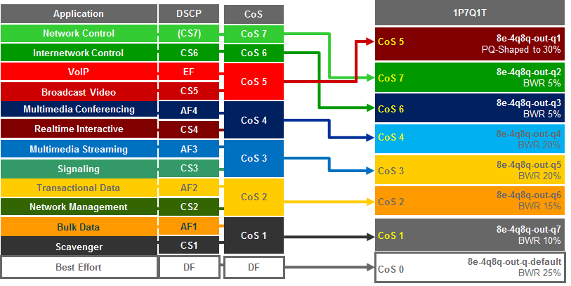

NX OS provides system-defined class-map names that cannot be renamed.
The system-defined class-map names that match the eight output queues of
the F2e and F3 Series modules on the Nexus 7700 are as follows:

-  1p7q1t-out-q1

-  1p7q1t-out-q2

-  1p7q1t-out-q3

-  1p7q1t-out-q4

-  1p7q1t-out-q5

-  1p7q1t-out-q6

-  1p7q1t-out-q7

-  1p7q1t-out-q-default

These class-maps have default and/or non-default (customer implemented)
CoS values attached to them. These values can be reset with “no match
cos” commands. A “no match cos” command causes one or more CoS values
(depending upon whether a single CoS value “x” was entered or a range of
CoS values “x-y” was entered) attached to a particular class-map to be
removed and automatically attached to the 1p7q1t-out-q-default
class-map.

Because APIC-EM EasyQoS has no knowledge of the existing mapping of the
CoS values to the class-maps before configuring the ingress queuing
policy, it will first set all CoS values to the 1p7q1t-out-q-default
class-map before moving CoS and DSCP values to their desired class-maps.
This is accomplished via the following commands.

!

class-map type queuing match-any 8e-4q8q-out-q1

no match cos 0-7

class-map type queuing match-any 8e-4q8q-out-q2

no match cos 0-7

class-map type queuing match-any 8e-4q8q-out-q3

no match cos 0-7

class-map type queuing match-any 8e-4q8q-out-q4

no match cos 0-7

class-map type queuing match-any 8e-4q8q-out-q5

no match cos 0-7

class-map type queuing match-any 8e-4q8q-out-q6

no match cos 0-7

class-map type queuing match-any 8e-4q8q-out-q7

no match cos 0-7

!

-  Note: Because there are no DSCP values within egress class-maps,
   there are no issues with moving CoS values to the default class-map,
   as was discussed in the ***Nexus 7000 8Q2T Ingress Queuing*** section
   above.

APIC-EM EasyQoS can then move CoS values into the desired class-maps.
This is accomplished via the following commands.

!

class-map type queuing match-any 8e-4q8q-out-q1

match cos 5

class-map type queuing match-any 8e-4q8q-out-q2

match cos 7

class-map type queuing match-any 8e-4q8q-out-q3

match cos 6

class-map type queuing match-any 8e-4q8q-out-q4

match cos 4

class-map type queuing match-any 8e-4q8q-out-q5

match cos 3

class-map type queuing match-any 8e-4q8q-out-q6

match cos 2

class-map type queuing match-any 8e-4q8q-out-q7

match cos 1

!

After the CoS values have been moved into the appropriate class-maps,
the following configuration creates and configures the queuing
policy-map with the 1P7Q1T egress queuing structure on the Nexus 7700
Series F2e and F3 modules.

!

policy-map type queuing prm-dscp#1P7Q1T-OUT

class type queuing 8e-4q8q-out-q1

priority level 1

shape average percent 30

class type queuing 8e-4q8q-out-q2

bandwidth remaining percent 5

class type queuing 8e-4q8q-out-q3

bandwidth remaining percent 5

class type queuing 8e-4q8q-out-q4

bandwidth remaining percent 20

class type queuing 8e-4q8q-out-q5

bandwidth remaining percent 20

class type queuing 8e-4q8q-out-q6

bandwidth remaining percent 15

class type queuing 8e-4q8q-out-q7

bandwidth remaining percent 10

class type queuing 8e-4q8q-out-q-default

bandwidth remaining percent 25

!

The policy-map with the 1P7Q1T egress queuing structure is then applied
to Ethernet interfaces that connect to either other core-layer switches
or to distribution-layer switches. Additionally, the policy-map can be
applied to the logical port-channel interface when an EtherChannel
connection is used for port-level resilience, instead of a single
physical interface. An example of the output for each of the
system-defined class-maps is shown below.

!

interface Ethernet x/x

service-policy type queuing output prm-dscp#1P7Q1T-OUT

!

interface port-channel xxx

service-policy type queuing output prm-dscp#1P7Q1T-OUT

!

M3 Series Modules on the Nexus 7700

M3 Series modules for the Nexus 7700 consist of the following:

-  N77-M348XP-23L

-  N77-M324FQ-25L

These modules are only supported on the Nexus 7700 Series chassis.

The M3 Series modules implement a 4Q1T ingress queuing structure and a
1P7Q1T egress queuing structure. This queuing structure is the same as
implemented by F2e and F3 modules on the Nexus 7700 Series, when using
the default-nq-8e-4q4q-policy network QoS policy, as discussed in the
***F2e and F3 Series Modules on the Nexus 7700*** section above. The
only difference between the QoS policy pushed by APIC-EM for the M3
modules and the F2e and F3 modules is that network-qos policy template
does not need to be configured for the M3 modules.
