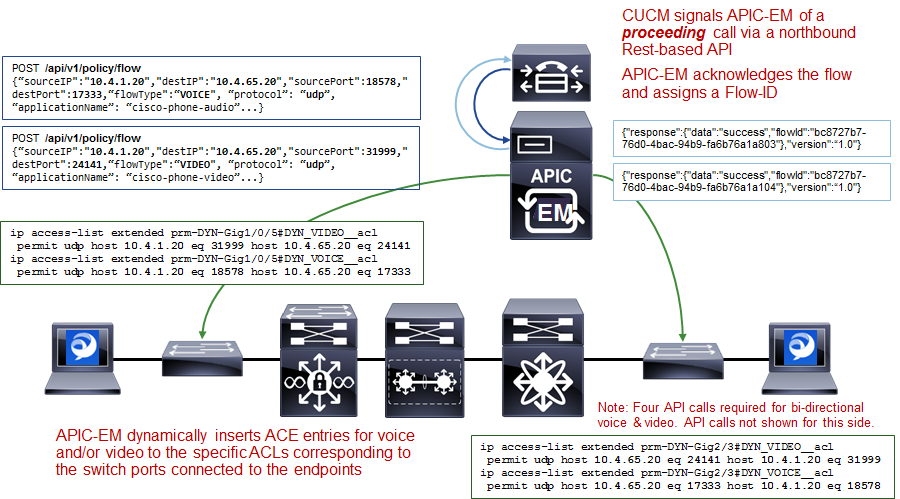
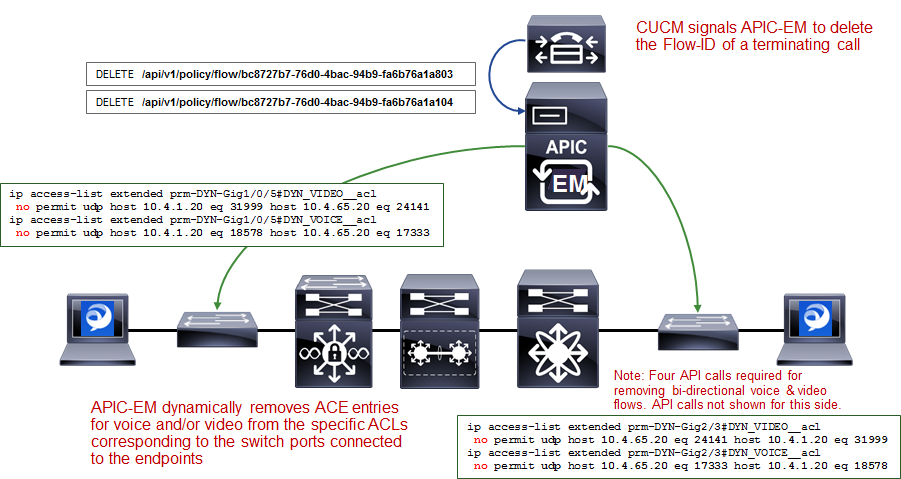

##################
Chapter 11: Dynamic Qos Design
##################

For the APIC-EM 1.6 release, Dynamic QoS is still a Beta application.

Need for Dynamic QoS

Current methods of discovering voice and video endpoints rely upon the
use of protocols such as Cisco CDP, in order for the device to identify
itself to the access-edge (that is, switch port) of the network. However
two issues exist with regard to the use of CDP:

-  CDP is not a secure protocol. CDP does not rely upon any mechanism
   for the endpoint device to authenticate with the network or for the
   network to authenticate to the endpoint device. Hence, anyone with
   some knowledge of programming could write an application allowing any
   device to “spoof” the access-edge network device (that is, switch)
   into thinking that the endpoint device is a Cisco IP phone or Cisco
   video conferencing endpoint.

-  Mobile devices (such as smart phones and tablets), laptops, and
   PCs—running voice and video applications such as Cisco
   Jabber—typically do not use CDP to identify the device as being voice
   and/or video capable.

The APIC-EM EasyQoS solution discovers wired Cisco IP phones, Cisco IP
video conferencing endpoints, Cisco TelePresence endpoints, and Cisco IP
video surveillance cameras through the use of CDP. For wired devices,
EasyQoS uses the IP addresses of the hardware endpoints collected
through CDP information, along with the knowledge of which Catalyst
switch and switch port the endpoint is connected to—in order to
pre-populate ACE entries within classification & marking ACLs for Static
QoS on switching devices. Because the wireless classification & marking
policy deployed by EasyQoS relies on an AVC/NBAR profile, no equivalent
ACE or ACL entries are generated for wireless devices. Wired devices
with voice & video applications that do not use CDP also have no ACE
entries generated within classification & marking ACLs for Static QoS on
switching devices.

Dynamic QoS is designed to address these devices, as well as to provide
a more authoritative source of information regarding whether flows
should be allowed onto the network with voice and video markings, rather
than simply trusting CDP information that can be easily spoofed.

Dynamic QoS Operation

For Dynamic QoS, a REST-based API has been implemented within APIC-EM.
This API allows a call signaling device, such as CUCM, to inform APIC-EM
EasyQoS when a voice and/or video call is established, and also when the
voice and/or video call is terminated. Dynamic QoS applies to Catalyst
switches (wired) currently.

Dynamic QoS for Wired Devices

Dynamic QoS for wired devices affects the ingress classification &
marking policy of both access-layer switches and the distribution-layer
switches to which those access-layer switches are connected.

APIC-EM EasyQoS Pre-Configuration for Access-Layer Switches

When Dynamic QoS is first enabled within EasyQoS—but before any voice
and/or video calls are placed—APIC-EM will create class-map and
policy-map shells for each switch port on every switch configured with
the role of an access-layer switch within the policy scope. An example
of the class-map shells and policy-map shells for one switch port is
shown below.

!

class-map match-any prm-DYN-Gig1/0/13#DYN\_VOICE

match access-group name prm-DYN-Gig1/0/13#DYN\_VOICE\_\_acl

class-map match-any prm-DYN-Gig1/0/13#DYN\_VIDEO

match access-group name prm-DYN-Gig1/0/13#DYN\_VIDEO\_\_acl

class-map match-any prm-DYN-Gig1/0/13#DYN\_REALTIME

!

policy-map prm-DYN-Gig1/0/13

class prm-DYN-Gig1/0/13#DYN\_VOICE

set dscp ef

class prm-DYN-Gig1/0/13#DYN\_REALTIME

set dscp cs4

class prm-DYN-Gig1/0/13#DYN\_VIDEO

set dscp af41

class class-default

set dscp default

!

ip access-list extended prm-DYN-Gig1/0/13#DYN\_VIDEO\_\_acl

ip access-list extended prm-DYN-Gig1/0/13#DYN\_VOICE\_\_acl

!

The policy-maps have entries for voice, video, and real-time (that is,
TelePresence) devices. Only voice and video class-map entries are
currently used for Dynamic QoS by EasyQoS. The policy-map actions for
each of the class-maps is to set the marking of the media to DSCP values
that are consistent with those set for voice and video media by Static
QoS.

Empty ACLs are created for dynamic voice and video calls. These are
dynamically populated by ACE entries based on information passed to
APIC-EM by call signaling platforms such as CUCM, via the northbound
REST-based API.

APIC-EM EasyQoS Pre-Configuration for Distribution-Layer Switches

With APIC-EM release 1.5 and higher, only when the network operator has
chosen to implement Dynamic QoS will the EasyQoS application
additionally create and apply an ingress classification & marking policy
to all uplink ports that connect to access-layer switches. This
classification & marking policy is similar, but not identical, to the
ingress classification & marking policy applied to switch ports
connected to devices (access-edge switch ports) on switches functioning
in the role of an access-layer switch within APIC-EM.

APIC-EM will create class-maps and policy-maps on every switch
configured in the role of a distribution-layer switch within the policy
scope. An example of the class-maps configured by EasyQoS are shown
below.

!

class-map match-any prm-APIC\_QOS\_IN#CONTROL

match access-group name prm-APIC\_QOS\_IN#CONTROL\_\_acl

match dscp cs6

class-map match-any prm-APIC\_QOS\_IN#VOICE

match access-group name prm-APIC\_QOS\_IN#VOICE\_\_acl

match dscp ef

class-map match-any prm-APIC\_QOS\_IN#BROADCAST

match access-group name prm-APIC\_QOS\_IN#BROADCAST\_\_acl

match dscp cs5

class-map match-any prm-APIC\_QOS\_IN#REALTIME

match access-group name prm-APIC\_QOS\_IN#REALTIME\_\_acl

match dscp cs4

class-map match-any prm-APIC\_QOS\_IN#MM\_CONF

match access-group name prm-APIC\_QOS\_IN#MM\_CONF\_\_acl

match dscp af41

class-map match-any prm-APIC\_QOS\_IN#MM\_STREAM

match access-group name prm-APIC\_QOS\_IN#MM\_STREAM\_\_acl

class-map match-any prm-APIC\_QOS\_IN#SIGNALING

match access-group name prm-APIC\_QOS\_IN#SIGNALING\_\_acl

class-map match-any prm-APIC\_QOS\_IN#OAM

match access-group name prm-APIC\_QOS\_IN#OAM\_\_acl

class-map match-any prm-APIC\_QOS\_IN#TRANS\_DATA

match access-group name prm-APIC\_QOS\_IN#TRANS\_DATA\_\_acl

class-map match-any prm-APIC\_QOS\_IN#BULK\_DATA

match access-group name prm-APIC\_QOS\_IN#BULK\_DATA\_\_acl

class-map match-any prm-APIC\_QOS\_IN#SCAVENGER

match access-group name prm-APIC\_QOS\_IN#SCAVENGER\_\_acl

class-map match-any prm-APIC\_QOS\_IN#TUNNELED

match access-group name prm-APIC\_QOS\_IN#TUNNELED\_\_acl

!

With Dynamic QoS, policy-maps dynamically applied to access-edge switch
ports classify and mark voice and video traffic based on signaling from
CUCM. The marking of this traffic must be preserved as it enters the
distribution-layer switch. Therefore, the distribution-layer policy
contains the following additions:

-  The class-map definition for prm-APIC\_QOS\_IN#VOICE also contains a
   “match dscp ef” entry.

-  The class-map definition for prm-APIC\_QOS\_IN#MM\_CONF also contains
   a “match dscp af41” entry.

-  The class-map definition for prm-APIC\_QOS\_IN#REALTIME also contains
   a “match dscp cs4” entry.

-  The class-map definition for prm-APIC\_QOS\_IN#BROADCAST also
   contains a “match dscp cs5” entry.

-  A class-map definition for control traffic
   (prm-APIC\_QOS\_IN#CONTROL) that matches on both an ACL and on DSCP
   markings (cs6) to preserve markings from the access-layer switches is
   also included.

All other class-maps match on just ACLs. An example of the policy-map
configured by EasyQoS for distribution-layer switches is shown below.

!

policy-map prm-APIC\_QOS\_IN

class prm-APIC\_QOS\_IN#VOICE

set dscp ef

class prm-APIC\_QOS\_IN#BROADCAST

set dscp cs5

class prm-APIC\_QOS\_IN#REALTIME

set dscp cs4

class prm-APIC\_QOS\_IN#MM\_CONF

set dscp af41

class prm-APIC\_QOS\_IN#MM\_STREAM

set dscp af31

class prm-APIC\_QOS\_IN#SIGNALING

set dscp cs3

class APIC\_EM-CONTROL

set dscp cs6

class prm-APIC\_QOS\_IN#OAM

set dscp cs2

class prm-APIC\_QOS\_IN#TRANS\_DATA

set dscp af21

class prm-APIC\_QOS\_IN#BULK\_DATA

set dscp af11

class prm-APIC\_QOS\_IN#SCAVENGER

set dscp cs1

class prm-APIC\_QOS\_IN#TUNNELED

class class-default

set dscp default

!

The policy-map at the distribution-layer switch also includes a
class-map entry for control traffic. Control traffic may be generated by
the access-layer switch and sent to the distribution-layer switch or
generated by any Access-Points connected to an access-layer switch and
sent to the distribution-layer switch.

The ACLs for the distribution-layer ingress classification & marking
policy provisioned by EasyQoS to Catalyst switching platforms are
basically the same as the ACLs provisioned by EasyQoS to Catalyst
switching platforms—when configured in the role of an access-layer
switch. These were discussed in the ***Access-Control Lists*** section
of the ***Campus LAN Static QoS Design*** chapter and will not be
repeated here.

The service-policy is applied to all distribution-layer switch ports
that connect to access-layer switches. An example of the configuration
provisioned by EasyQoS is shown below.

!

interface TenGigabitEthernet1/0/1

service-policy input prm-APIC\_QOS\_IN

!

APIC-EM EasyQoS does not apply the service-policy to distribution-layer
switch ports that connect to other distribution-layer switches or to
core-layer switches.

Wired Dynamic QoS Workflow

After all of the pre-configuration has been completed by APIC-EM
EasyQoS, Dynamic QoS is ready to accept signaling for voice/video calls
via the REST-based API from call signaling agents, such as CUCM. The
following figure provides a high-level overview of how Dynamic QoS
operates for wired devices, when setting-up a call.

1. Dynamic QoS—Wired Voice/Video Call Proceeding

As shown in the figure above, call signaling agents such as CUCM signal
to APIC-EM of a proceeding call via a northbound REST-based API. The
information within the REST-based API call includes the source and
destination IP addresses, the protocol (UDP), the media ports, and the
type of media—VOICE or VIDEO. CUCM functions as a SIP back-to-back
user-agent, meaning all SIP call signaling is between the endpoint and
CUCM. Hence, CUCM has visibility into all call setup and call teardown
signaling. Further, CUCM actually assigns the media ports that are used
for the voice and video media sent between the endpoints. For a voice
only call, one API call for audio media is needed for each side. A total
of two API calls is needed for a bi-directional audio call. For a voice
and video call, two API calls—one for audio media and one for video
media is needed for each side. A total of four API calls is needed for a
bi-directional voice and video call. APIC-EM will acknowledge each API
call and will assign a flow identifier for each flow. The flow
identifier is used to identify the flow during the teardown of the call.

APIC-EM then uses its southbound APIs (CLI) to dynamically insert ACE
entries for the voice and/or video IP addresses and media into the
specific ACLs corresponding to the switch ports connected to the
endpoints. The following provides an example of the configuration
provisioned by EasyQoS that populates the ACE entries within the dynamic
voice and video ACLs.

!

ip access-list extended prm-DYN-Gig1/0/5#DYN\_VIDEO\_\_acl

permit udp host 10.4.1.20 eq 31999 host 10.4.65.20 eq 24141

ip access-list extended prm-DYN-Gig1/0/5#DYN\_VOICE\_\_acl

permit udp host 10.4.1.20 eq 18578 host 10.4.65.20 eq 17333

!

The ACLs are port-specific. The ***Endpoints Running Cisco Jabber Soft
Clients*** section below, discusses how APIC-EM learns to which switch
and switch port endpoint devices are connected.

Finally, APIC-EM EasyQoS APIC-EM EasyQoS dynamically swaps the Static
QoS ingress classification & marking service-policy on the switch ports
connected to the endpoints, to the service-policy used for Dynamic QoS.
An example of the configuration provisioned by EasyQoS is shown below.

!

interface GigabitEthernet1/0/5

no service-policy input prm-APIC\_QOS\_IN

service-policy input prm-DYN-Gig1/0/5

!

This is the reason for the existence of the ingress classification &
marking policy applied to distribution-layer switch ports connected to
access-layer switches, when Dynamic QoS is enabled. When the Static QoS
ingress classification & marking service-policy is replaced with the
dynamic ingress classification & marking service-policy, only voice and
video media are matched for that particular switch port, at the
access-layer switch. The distribution-layer ingress classification &
marking policy, applied by APIC-EM when EasyQoS is first enabled, is
used to classify and mark all other applications that may still be sent
by the endpoint device connected to the switch port. The
distribution-layer ingress classification & marking policy is
technically applied to all traffic from the access-layer switch.
However, the policy is essentially a superset of the Static QoS policy,
hence applications from the other switch ports on the access-layer
switch will not be affected, because they are already marked correctly.

The following figure provides a high-level overview of how Dynamic QoS
operates for wired devices, when tearing-down a call.

1. Dynamic QoS—Wired Voice/Video Call Termination

As can be seen in the figure above, CUCM signals to APIC-EM via the
REST-based API that the call has terminated. For calls with voice and
video media flows, two API calls may be sent by CUCM for each side, for
a total of four API calls per bi-directional voice and video call.

APIC-EM EasyQoS will then dynamically swap the ingress classification &
marking service-policy on the switch ports connected to the endpoints,
back to the service-policy used for Static QoS. An example of this is
shown below.

!

interface GigabitEthernet1/0/5

no service-policy input prm-DYN-Gig1/0/5

service-policy input prm-APIC\_QOS\_IN

!

Finally, APIC-EM EasyQoS dynamically removes ACE entries from the
dynamic ACLs, based on CUCM signaling.

!

ip access-list extended prm-DYN-Gig1/0/5#DYN\_VIDEO\_\_acl

no permit udp host 10.4.1.20 eq 31999 host 10.4.65.20 eq 24141

ip access-list extended prm-DYN-Gig1/0/5#DYN\_VOICE\_\_acl

no permit udp host 10.4.1.20 eq 18578 host 10.4.65.20 eq 17333

!

Endpoints Running Cisco Jabber Soft Clients

Cisco Jabber soft clients are also discovered by APIC-EM and populated
within Dynamic QoS ACLs. However, Cisco Jabber soft clients do not
typically send CDP information. Instead, Cisco IP Device Tracking (IPDT)
must be enabled on Catalyst switches in order to support the ability for
APIC-EM to discover and populate devices with Cisco Jabber soft clients.

-  Note: Devices running the Cisco Medianet Services Interface (MSI) may
   generate CDP information. However, the MSI interface is only
   supported on Windows 7 & 8, and Mac OS X 10.7 and 10.8 platforms, and
   no further development is expected for the MSI.

For a Catalyst 3850/3650 Series switch, IPDT is enabled via the
following interface-level configuration command.

!

ip device tracking maximum x

!

“X” is the maximum number of devices to be tracked on the interfaces.
The values range from 0 to 63,535 devices. A value of 0 disables IP
device tracking on the switch port.

IPDT causes the switch port to send Address Resolution Protocol (ARP)
probes (ARP request packets) periodically. The interval between ARP
probes can be controlled via the following interface-level configuration
command.

!

ip device tracking probe interval x

!

“X” is the interval between which ARP probes are sent. The default value
is 30 seconds.

The number of ARP probes sent per interval can also be controlled via
the following interface-level configuration command.

!

ip device tracking probe count x

!

“X” is the number of ARP probes sent per interval. The default value is
3 probes.

At a global configuration level, the following command can be used to
delay the switch port from sending the ARP probes after a link up event
or link flap (link down/link up).

!

ip device tracking probe delay 10

!

This command can be used to prevent the switch from sending an ARP probe
while the device connected to the switch port checks for duplicate IP
addresses.

As a prerequisite for supporting the ability for APIC-EM to dynamically
discover adds/moves/changes of hardware endpoint devices and
automatically update ACL entries for these devices, the network operator
will need to enable SNMP traps (particularly the link up/link down trap)
on access-layer switches to be sent to APIC-EM.

After the switch port connected to a hardware endpoint goes up/down,
APIC-EM will receive an SNMP trap. APIC-EM will start collecting
information from the access-layer switch that generated the SNMP trap,
about the new endpoints. This will take approximately 80 seconds, plus
the time needed for the collection of the device information.
